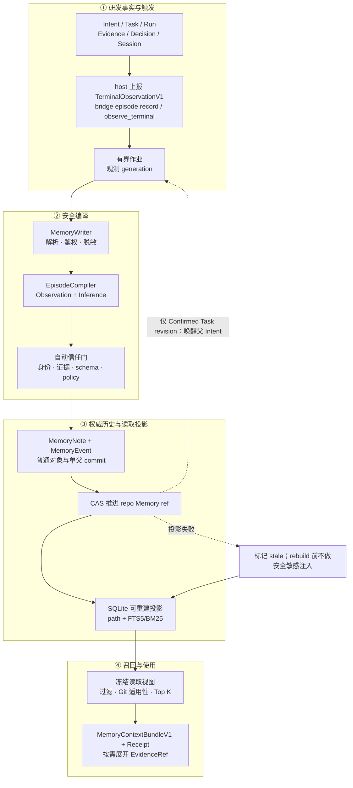
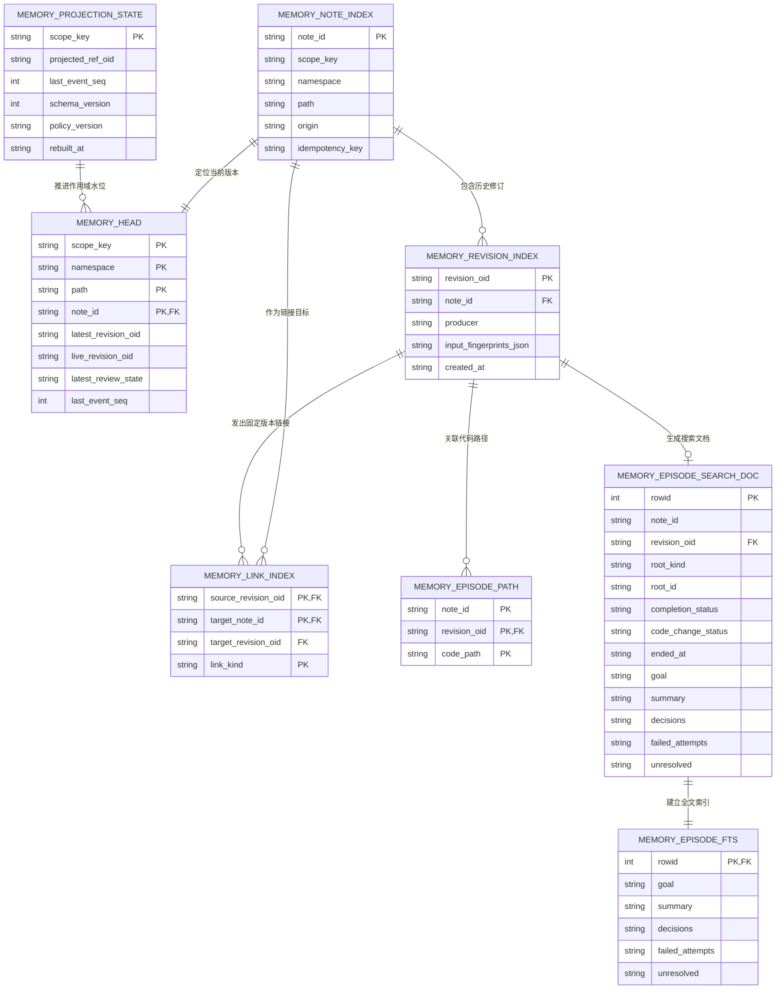
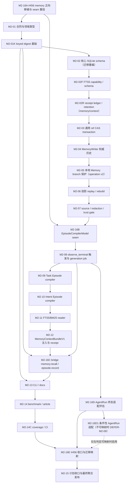

# M2 研发历程记忆首个纵向切片计划（2026-08-19）

**模板版本：** 依据 [`plan-template.md`](plan-template.md) `v2.8` 编写（R30 重设计起）。模板中的 `GC-*`、`ER-*`（含 ER-14 nextest 发布集成测试执行器）与 `G-*` 全部适用；本文只补充 M2 研发历程记忆（下文简称 M2）的领域约束、任务卡和验收口径。

> **R30 重设计（2026-09-21）：** main 在 0.23.x 拆除计划中删除了 Code 时代 AI SCC（`providers/*`、`context_budget/*`、`client.rs`、`prompt/`、`mcp/`、`orchestrator/`、`web/`、`operation_wrapper.rs`）以及 Code-era Task/Intent 终态事件生产者；#456（`feat(memory): add version-aware development history core`）直接构建在这些被删表面之上，因此**不能**用「合併 main + 解衝突」落地。本版按「拆除后架构」重新设计全计划的接口面（§0），并以 #456 为实现 Base 做接口融合（§0.4 + M2-16A..E/D1 家族）；整份迁到模板 v2.8。
> **本文件只规划任务，不宣称已实现。** 任何卡在最新一轮 Codex 与 Claude **双字面 `VERDICT: PASS`** 之前不得标 `in-progress`；R30 之前的旧评审结论（若存档）只作为历史事实，不构成本版通过证据。
> **迁移政策（v2.8）：** R30 起本计划整份迁到模板 v2.8：新增/修改卡按 ER-08 逐卡 `patch + 1` 并 `gh` 发布；未触碰且已发布的旧卡保留历史事实。全部未执行卡与收口门的全量测试一律使用 ER-14 nextest 执行器（`source .env.test && source .env.live-test && cargo nextest run --all --no-fail-fast --retries 2`）；`cargo test --all` 仅供诊断。

## 0. 拆除后架构基线与 R30 重设计依据（2026-09-21）

### 0.1 main 已拆除、且 #456/旧 M2 依赖过的表面（证据）

以下路径在 `origin/main`（R30 核对日 `45ad1f7f2`）**完全不存在**（`git -C "$SRC_CLONE" ls-tree -r 45ad1f7f2 --name-only` 匹配数为 0）：

| 已删除表面 | 旧 M2/#456 依赖点 |
|---|---|
| `src/internal/ai/providers/*`（34 档：deepseek/openai/anthropic/gemini/kimi/zhipu/ollama/fake…） | #456 compiler 的 `AnyCompletionModel`、DSH 的 `providers::deepseek`、测试 `providers::fake::Client` |
| `src/internal/ai/context_budget/*`（13 档：allocator/budget/compaction/frame/handoff/memory_anchor/projection…） | `ContextBudget`、`ContextSegmentBudget`、`TruncationPolicy`、`MemoryAnchorConfidence`、`MemoryContextAssembler`、`ContextSelectionReceiptV1` 旧落点 |
| `src/internal/ai/client.rs` | `CompletionClient`（#456 `memory/dsh.rs`） |
| `src/internal/ai/prompt/` | `SystemPromptBuilder`（#456 reader 测试） |
| `src/internal/ai/{mcp/server,orchestrator/persistence,web/headless}.rs` | MCP/触发/Web 旧面 |
| `src/internal/operation_wrapper.rs`、`tests/{operation_wrapper_test,code_ui_scenarios}.rs` | `op restore` 修改/删除冲突载体 |
| Code-era `TaskEventKind`/`IntentEventKind`（`Done/Failed/Cancelled`、`Completed/Cancelled`） | 旧 M2-08「终态事件」自动触发来源；`rg` 在 `src/` 零命中 |

因此旧 M2 的三条关键接缝全部断裂：**模型（providers）**、**上下文选择/回执（context_budget）**、**自动触发（orchestrator 终态事件）**。此外，`Task`/`IntentSpec` 物件本身也已无 in-repo producer（核對日 `rg -n 'IntentSpec::|use .*IntentSpec|: IntentSpec|IntentSpec \{' src` 零命中；`rg -n 'git_internal::internal::object::(task|intent)' src` 僅命中 `src/internal/ai/agent_run/task.rs:21` 的 doc comment；`src/command/cat_file.rs:155-184` 只保留小寫類型名字串表），Episode root 身份与 Intent 聚合必须改由 host 提供的 opaque root ID 承接（ADR-M2-05、GAP-M2-15）。

### 0.2 拆除后仍存在、M2 可以依赖的事实面

| 事实面 | 现存证据（R30 核对） | M2 用途 |
|---|---|---|
| `git-internal 0.10.2` 物件模型：`Task`/`IntentSpec`/`Plan`/`TaskEvent`/`IntentEvent`/`RunEvent`/`Decision`/`Evidence`/`PatchSet`/`ContextFrame` | `~/.cargo/registry/.../git-internal-0.10.2/src/internal/object/{task,intent,plan,task_event,intent_event,run_event,decision,evidence,patchset}.rs` | Episode root、related IDs、`EvidenceRefV1` 的物件层（类型定义存在；物件写入 producer 已无 → root 用 host opaque ID，见 ADR-M2-05/GAP-M2-15） |
| `agent_run` 模块与终态状态 | `src/internal/ai/agent_run/{run.rs,task.rs,event.rs,event_store.rs,patchset.rs,decision.rs,evidence.rs}`；`AgentRunStatus::{Completed,Failed}` 为终态；`AgentRunEventStore::{append,read}` | 可选的自动触发适配面（子代理 run 终态）；**核对日无 in-repo producer**（`AgentRunStatus::{Completed,Failed}` 仅有定义与单测，见 §0.1 与 DEFER-M2-09）；`review/store.rs` 为同构事件存储、非 `agent_run` 写入者，映射可行性由 M2-16D 审计 |
| Session/JSONL 捕获 | `src/internal/ai/session/jsonl.rs`、`src/internal/ai/history.rs`、`agent_session`/`agent_checkpoint` 表 | 来源窗口、`EvidenceRef`（session/tool_call/event_seq）、外部 agent 会话 |
| Agent Bridge（protocol 1.x） | `src/internal/ai/agent_bridge/{protocol,ingress,…}`（`memory.rs` 由 **M2-16C** 首建並收口協議行為；入口類型 `MemoryRecordEnvelopeV1`/`TerminalObservationV1`/`TerminalEvidenceRefV1`/`TerminalObservationFingerprintV1` 由 **M2-07 `evidence.rs`** 首建，M2-08 只提供 `observe_terminal` seam）、`src/command/agent/bridge.rs`、`agent_bridge_*` 表 | **Host-driven 可選 host 面**：audited `memory.recall` + opt-in `memory.episode.record`（#456 已有方向，R30 保留并规范化；必要路径为嵌入 API / `libra memory record`） |
| hooks capture / observed agents | `src/internal/ai/hooks/`、`src/internal/ai/observed_agents/`、`src/command/hooks.rs` | 会话/事件来源、脱敏规则共享点 |
| `completion` trait 层（无 provider） | `src/internal/ai/completion/{mod.rs,message.rs,request.rs,retry.rs,throttle.rs}`：`CompletionModel`/`Prompt`/`Chat` trait 与 retry/throttle 装饰器 | ADR-M2-12 model seam 的 trait 基础 |
| keyed digest 基础 | `src/internal/vault.rs`、`src/internal/config.rs`（encrypted local config） | ADR-M2-11 保持不变 |
| 对象存储 / `HistoryManager` CAS / operation v2 | `src/internal/ai/history.rs`、`src/internal/operation/`（v2）、`src/utils/client_storage.rs` | 权威历史、ref CAS、`op restore` 保护 |

### 0.3 R30 架构决策（取代旧 Code-era 绑定）

1. **Model seam（新增 ADR-M2-12）：** M2 不内建任何 HTTP provider/client。Episode compiler 只接受 host 注入的 `#[doc(hidden)] pub` `EpisodeCompilerModel`（簽名以 ADR-M2-12 的 `propose_episode(&self, request: EpisodeCompileRequestV1) -> Result<EpisodeProposalV1, EpisodeCompilerError>` 為準，object-safety 由 M2-16B 決定）。`AnyCompletionModel`/`providers::deepseek`/`CompletionClient` 全部删除；测试用 `tests` 内 in-memory fake。模型凭证由 host（CLI/bridge/embedder）拥有，不进入 M2 对象、SQLite 明文字段、日志、job row 或 manifest。
2. **Context seam（改写 ADR-M2-10）：** receipt/assembler 不再位于 `context_budget`。落点改为 `src/internal/ai/memory/context/{memory.rs,receipt.rs,receipt_store.rs}`（`#[doc(hidden)] pub`，非 crate-private）。`ContextSelectionReceiptV1` envelope 不变；「共享上下文层」= M2 的 `MemoryContextAssembler` + `MemoryContextBundleV1` 返回接口，不依赖已删除的 `ContextFrame`/`MemoryAnchor`/`SystemPromptBuilder`。M2 自带最小 segment 预算类型 `MemorySegmentBudgetV1`（只服务 M2 选择，不复活 Code-era allocator）。
3. **Trigger seam（改写 ADR-M2-05/07）：** 不再观察已删除的 Task/Intent 终态事件。自动触发改为两条 host-owned 路径：
   - **bridge 路径（可選 host 面）：** bridge 1.2+ 的 audited `memory.recall` 与 opt-in `memory.episode.record`；host 提交 `MemoryRecordEnvelopeV1`（`observation: TerminalObservationV1` 必填，含 root kind/id、`terminal_status`/`terminal_at`、`terminal_evidence: TerminalEvidenceRefV1`、`parent_intent_root_id`、`related_run_ids`、principal、code anchor；`proposal`/`model_label` 可選，proposal-only 拒絕）；M2 只验证与编译。
   - **嵌入式路径：** 进程内嵌入者（review/investigate/hooks/agent_run）调用 crate API `MemoryRuntime::observe_terminal(MemoryRecordEnvelopeV1)`（另留 observation-only 薄封裝 `observe_terminal_observation`）。
   若未来 in-repo 终态事件 producer 回归（例如新的 orchestrator/agent run 写入器），再新增独立 Adapter 卡，不得直接复活旧 `orchestrator/persistence` 依赖。
4. **注入目标（ADR-M2-13）：** `libra memory search/show`（CLI）与 bridge `memory.recall` 共用同一 reader + `MemoryContextAssembler`；输出为返回给 host 的 `MemoryContextBundleV1`，**不再写入**已删除的 Code-era context frame。默认注入只接受 `Confirmed` revision；`Quarantined` 可显式诊断读取。
5. **#456 作为实现 Base：** 见 §0.4；这是一次大重构，不是合并。

### 0.4 #456 base 的接口融合策略（实现阶段强制）

| #456 资产 | R30 融合动作 | 承接卡 |
|---|---|---|
| `src/internal/ai/memory/**`（domain/canonical/validation/writer/reader/compiler/dsh…） | 按 §0.4「移植所有权」拆分：M2-16A 只移植 I/O-free 领域层；其余文件由对应行为轴卡在自己的写集内正向移植 | M2-16A 起（见下表） |
| `src/internal/ai/context_budget/{memory,receipt,receipt_store}.rs`（#456 新增） | 搬到 `src/internal/ai/memory/context/`；删除对 `allocator/frame/budget/memory_anchor` 的依赖，改用 `MemorySegmentBudgetV1` | M2-02R（receipt/store）、M2-12（assembler/bundle） |
| `MemoryAnchorConfidence`（来自已删 `memory_anchor.rs`） | 于 `memory/domain.rs` 重建为 `MemoryConfidence`（`Low`/`Medium`/`High`，confidence 语义）；**不要**与既有 `MemoryTrust`（`Confirmed`/`Quarantined`/`Rejected`）合并；下游卡在自己的移植文件中替换 | M2-16A（領域層）；其餘各卡 |
| `providers::{AnyCompletionModel,deepseek,fake}` | 删除；改用 ADR-M2-12 `EpisodeCompilerModel`；#456 的 fake 测试改造为 in-memory model | M2-16B |
| `prompt::SystemPromptBuilder`（reader 测试） | 测试改用 memory-local prompt fixture（fixture 由 M2-09/10 提供） | M2-11 |
| `operation_wrapper` / `tests/operation_wrapper_test.rs` | 删除；`op restore` 保护改由 operation v2 boundary + `MemoryWriter` ref-policy 测试覆盖 | M2-05（改写） |
| `.github/workflows/memory-portability.yml` | 保留但重写为四平台 nextest FTS5 probe（删除 web/worker 步骤） | M2-02F |
| `docs/development/tracing/memory.md`、`docs/commands/memory.md` 等 | 同步 R30 seam 命名与落点 | M2-01/M2-13 |

**移植所有權（强制）：** M2-16A 只移植 I/O-free 領域層（`memory/{mod,domain,canonical,validation,error,limits}.rs`）並重建 `MemoryConfidence`。其餘 #456 檔案由擁有該行為軸的卡在各自 `Implementation write set` 內以**正向移植**落地，**不得**在 M2-16A 一次帶入：`memory/context/{memory,receipt,receipt_store}.rs` → M2-02R/M2-12；三張遷移 → M2-02（`2026092101`）、M2-02F（`2026092102`）、M2-02R（`2026092103`）；`linear_ref.rs` → M2-03；`writer/store/tree/admission` → M2-04；`projection/replay/diagnostics` → M2-06；`source/evidence/redaction/trust/policy` → M2-07（`evidence.rs` 首建 `TerminalObservationV1`/`TerminalEvidenceRefV1`/`MemoryRecordEnvelopeV1`/`TerminalObservationFingerprintV1`，`trust.rs` 首建 `CompilerIdentityV1`）；`job_sql` → M2-08（首建與 runner 擴展）；`observer/job/job_state/runner/runtime` → M2-08；`compiler/mod.rs` → M2-07（首建：`EpisodeCompiler` Interface + `EpisodeProposalV1` + `EpisodePayloadV1` 消費）、`compiler/{task,intent}.rs` → M2-09/10（adapter）；`policy.rs` → M2-04（首建）/M2-07（規則擴展）；`limits.rs` → M2-16A（領域首建）/M2-07（來源上限擴展）；`fts_sql` → M2-02F（首建）/M2-11（查詢擴展）；`reader/selector/applicability/query/view` → M2-11；`delivery.rs` → M2-12；`model.rs` → M2-16B（新建）；`dsh.rs` → **不移植**（R30 刪除，DSH 經 bridge `memory.episode.record`/host `EpisodeProposalV1` 接入）。每張下游卡在自己的 `Current evidence` 中記錄 #456 來源路径。
`agent_bridge/memory.rs` → **M2-16C**；`agent_bridge/{protocol,ingress,mod,transport,workspace,authorization}.rs` 之行為由 M2-16C 收口；M2-08 只序列化消費。

### 0.5 R30 的发布与评审政策

- 本计划整份迁到模板 v2.8：新增/修改卡按 ER-08 逐卡 `patch + 1` + 版本面三处（`Cargo.toml`/`install.sh`/`install.ps1`）+ 工具链刷新 `Cargo.lock` + `gh release create`；旧「REL-M2-01 批量发布、不 bump/tag」例外自 R30 起**不再适用**。
- 每张 independent 发版卡的 D 组按 `DEP-M2-CI-03` 取得 `release.yml` 五 job、artifact/CDN 与 Homebrew 证据。
- 每张会发版卡的 C/D 流程（强制）：在 feature branch 上完成實作與 bump/版本面集合同步/工具鏈刷新 `Cargo.lock`/fmt/clippy/收口測試門/release build/install → 推送 feature branch → `gh pr create` → 等 `base.yml` 與 CodeQL 在同一 PR head SHA 全綠（DEP-M2-CI-02）→ `gh pr merge --squash` → 以 merge commit SHA 發 tag 並觸發 `release.yml`。`base.yml` 只響應 `pull_request`，禁止以 main 直推替代 D-01 證據。
- 全量测试执行器为 ER-14 nextest：`T-2` 发布点/聚合卡在 bump 树上跑全量 nextest，其余独立发版卡按 ER-13 只跑本卡 A 组 focused 命令；**卡内 `Verification` 的 `cargo test …` 是快速诊断写法，C 组发布证据必须以等价的 `cargo nextest run …`（相同 lib/test filter）在执行器上重跑并归档，`cargo test --all` 不构成任何通过证据**。doctest（`cargo test --doc`）没有 nextest 等价映射，保留为 A 组门，不计入 ER-14 执行器唯一性。干净 worktree 执行前先 `cp .env.test.example .env.test`，并由 operator/L3 环境提供 `.env.live-test`（缺失时 L2/L3 按 gate helper 记 skipped，但 `source` 本身失败即门失败，不得改用 `cargo test --all`）。
- 一切 `git` 來源審計命令（`git ls-tree`/`git grep`/`git -C …`，含 #456 與 main 刪除面）只針對只讀 source clone（`DEP-M2-SRC-01`，見依賴登記表），**不在目標 Libra checkout 執行**；目標 checkout 一律使用 `libra` 命令與 `rg --files` 檔案守衛。
- 执行环境为外部前置 `DEP-M2-ENV-01`：C 组必须在已初始化的 Libra checkout 上执行（`libra status` 成功、可 `libra add/commit/push`）；仅作计划/评审的 Git worktree（如 `libra-main`）不得直接用于 C 组。
- 计划级评审：Codex 与 Claude 对同一修订版分别给出字面 `VERDICT: PASS`（P0=0 且 P1=0）才算通过；logs 归档到 `docs/development/plan/plan-20260819.review/`。


## 文档职责

本文承接 [`plan-long.md`](plan-long.md) 的 `MEM-01`、`MEM-02`，目标是交付一条可运行的纵向链路：Libra 在研发任务或需求迭代结束后，自动把已有的 Intent、Task、Run、证据、决策、会话与代码版本编译成结构化研发历程记忆，并让后续 Agent 能按任务、时间、代码路径和代码版本快速召回，再沿证据引用展开原始记录。

本文只规划任务，不宣称能力已经实现。每张任务卡开工前仍需刷新源码锚点、测试目标和外部参照 revision。

### 适用范围

- 仓库级 M2 研发历程记忆：任务研发历程摘要（Task Episode Summary）与需求迭代摘要（Intent Iteration Summary）。
- `MemoryNote` / `MemoryEvent` 自定义 JSON 对象、受保护的本地分支 `refs/heads/libra/memory/repo` 权威历史及唯一写入器（`MemoryWriter`）。
- 在现有 `.libra/libra.db` 中新增 Memory 投影表、Episode 检索表与有界自动编译作业状态；不增加第二个数据库文件或数据库服务。
- host 上报的 `TerminalObservationV1` 触发、来源解析、授权与脱敏、结构化编译、追加式写入、投影重建、FTS5/BM25 召回、证据展开与 Agent 上下文注入。
- 最小稳定命令面：`libra memory search`、`show`、`status`、`rebuild`、`record`，以及对应人读、`--json`、错误码和 EN/zh 文档。
- 离线确定性 benchmark、核心纯逻辑覆盖率门、迁移/并发/故障恢复测试与发布证据。

### 非目标

- 本计划不实现 MCP Memory tools；该表面仍受 `SB-02` 的 default-deny authorizer 与 principal threading 前置约束。
- 本计划不实现向量检索、实体图、多跳推理、远端 embedding 或外部数据库。首个召回通道固定为 SQLite FTS5 + `bm25()`。
- 本计划不实现团队同步、跨仓库共享、Memory 导入导出、远端 publication、Global / Actor / Worktree / Branch scope；首个切片只开放 Repo scope、RepoLocal、local-only。普通 push/fetch/mirror 不传播该本地分支。
- 本计划不实现人工候选箱或人工批准流程。M2 的任务结果本身没有“好经验/坏经验”之分；自动编译器保留成功、失败、取消、部分完成和未改代码的尝试。
- 本计划不把会话全文、工具全部输出或补丁正文复制进 Memory。原始数据留在现有事实源，M2 只保存有界摘要和类型化证据引用。
- 本计划不提供跨版本批量语义回退命令。通用 `op restore` 不得回退 Memory ref；未来的 `memory revert` 另行设计为追加补偿事件。
- 本计划不实现 `memory consolidate`、taxonomy 自动扩展、onboarding、branch fork/merge/cherry-pick、UI 与协同 Memory。

### 成功定义

- host 上报并经 `terminal_evidence` 佐证的 `terminal_status ∈ {completed,failed,cancelled,partial}` 观测写入后，运行时自动生成或修订对应的唯一 Episode。
- 每条 Episode 同时保留观察事实（Observation）与 Agent 推断（Inference），每项都能沿 `EvidenceRef` 回到现有 Run、Event、Decision、PatchSet、Session 片段或代码提交。
- 代码提交只是版本证据，不被当作 Task 结束信号；经佐证的 `TerminalObservationV1` 才是自动编译触发点。
- 权威历史只存在于内容寻址对象、单父 Memory commit 与受保护 ref；删除全部 SQLite Memory 投影后可得到语义相同的重建结果。
- 同一 Task / Intent 永远只有一个稳定记忆单元格和一个稳定 `note_id`；重复触发不追加重复事件，新证据产生同一 note 的新 revision。
- 无 embedding、无外部服务时，Agent 仍可使用结构化过滤 + FTS5/BM25 在有界时间内找到相关摘要，并按当前 code commit 判断适用性。
- 自动注入使用一次冻结读取视图，并留下可重放的上下文选择回执（`ContextSelectionReceiptV1`，下文简称 `ContextReceipt`）；相同 view、query、selector 版本得到相同结果顺序与 bundle hash。
- 核心领域逻辑的约定范围达到 100% line + region coverage；fmt、clippy、全量测试、迁移、并发、隐私与 benchmark 门全部通过。

## 术语与边界

| 中文主名 | 英文 / 代码名 | 本计划中的含义 |
|---|---|---|
| 研发历程记忆 | Episode | 从现有研发事实编译出的 M2 记忆对象；不是新的研发事件事实源 |
| 任务研发历程摘要 | Task Episode Summary | 汇总一个 Task 下的多次 Run、决策、证据、代码变更和结果 |
| 需求迭代摘要 | Intent Iteration Summary | 汇总一个 Intent 下已固定 revision 的多个 Task Episode |
| 观察事实 | Observation | 可由来源记录直接支持的陈述，必须带证据引用 |
| Agent 推断 | Inference | Agent 对根因、设计取舍或因果链的解释，必须带置信度和证据引用 |
| 类型化证据引用 | EvidenceRefV1 | 指向既有事实源精确片段的结构化指针，携带 source plane、kind、对象 ID、source ref OID、类型化 locator、脱敏片段 digest、可见性和可选 code commit |
| 记忆单元格 | Cell | 由 `(scope, namespace, path)` 确定的稳定逻辑位置；通用 Cell 可包含多条存活 note。M2 让每个 Task / Intent 映射到固定 Cell，并以确定性 `note_id`、root 绑定和幂等键保证该 root 只有一条 Episode note |
| 权威历史 | authoritative history | `MemoryNote`、`MemoryEvent`、Memory commit 与 Memory ref；任何读取投影都不能覆盖它 |
| 读取投影 | projection | 为快速读取而保存在 SQLite 的可重建表、路径索引与 FTS 索引 |
| 冻结读取视图 | ResolvedMemoryView | 一次检索/注入使用的 repo、principal、code commit、ref OID、policy 与 projection watermark 快照 |
| 上下文选择回执 | ContextSelectionReceiptV1 / ContextReceipt | 记录实际选中了哪些记忆、为何选中、预算如何分配以及使用哪个冻结 view 的本地审计记录；由 M2 `memory/context` 定义（ADR-M2-10/13），不依赖已删除的 `ContextFrame` |

Episode 是 Memory 平面的新派生对象；Intent、Task、Run、Evidence、Decision、PatchSet、Session 与 code commit 继续由既有 AgentRuntime / Git 平面拥有。两者只通过 `EvidenceRef` 和 code anchor 相连，不复制事实源正文。

`EvidenceRefV1.locator` 是封闭枚举：`object`、`event_seq`、`json_pointer`、`session_fragment`、`tool_call`、`code_range`。其中 Session 引用必须给出有界 fragment 序号区间，工具引用必须给出 invocation/output part，代码引用必须固定 commit/path/range。`fragment_digest` 只对解析、授权、脱敏后的规范片段计算；它用于复核定位是否漂移，不保存原文，也不能用未加盐 secret hash 替代。

## 核心链路



关键时序：

1. host 在研发事实完成后上报终态观测（bridge `memory.episode.record` 或 `observe_terminal`）；自动编译不阻塞原始研发事实，也不等待 LLM。
2. 触发器只提交受信任的 `MemoryRecordEnvelopeV1`（`observation` 含 root kind/ID、`terminal_status`/`terminal_at`、`terminal_evidence`、`parent_intent_root_id`、canonicalized `related_run_ids`、principal、code anchor；`proposal`/`model_label` 可選），不把原始会话直接交给模型。
3. `MemoryWriter` 内部先解析有界来源窗口、鉴权和脱敏，再调用 `EpisodeCompiler`；compiler 的模型实现由 host 注入（ADR-M2-12），本仓库不内建 provider。输入指纹只基于脱敏后的规范输入。
4. 编译器只能提议 Episode 内容，不能决定 scope、namespace、path、root identity、`note_id` 或 ref。
5. Writer 从 host 上报且经佐证校验的终态观测（`TerminalObservationV1` + `terminal_evidence` 的 plane/locator/digest 与 `terminal_status` 互相印证）机械填充 completion、时间、related IDs 与 code anchor；自动信任门验证来源信任级别、EvidenceRef locator/digest、脱敏报告、schema、policy 和 prompt-injection reason code。通过才 Confirmed；未通过的经历仍以 Quarantined revision 保存，但不自动注入。
6. Writer 校验后追加不可变 revision 和事件，以 CAS 推进 repo Memory ref；同一幂等键命中时返回既有 revision，不追加事件。
7. 新 Confirmed Task revision 会由 Memory ref observer 唤醒对应的已终态父 Intent；输入指纹包含固定 Task revision 集，重复通知幂等，Intent revision 不再反向触发自己。
8. SQLite 保存快速读取投影。投影水位与 ref 不一致时，自动注入暂停，重建器从权威历史恢复。
9. 检索返回紧凑 Episode；只有 Agent 需要核查时，才沿 `EvidenceRef` 展开现有原始数据。

## 记录与存储结构

### M2 负载

`MemoryNote` 增加可选 `episode: Option<EpisodePayloadV1>`。由于仓库尚无 Memory writer 或已写入的 schema v1 对象，本计划在首个 writer 落地前修订 schema v1 的字段清单，而不制造一个从未发布过的空 v1 → v2 迁移。

| 字段 | 类型 | 语义 |
|---|---|---|
| `schema_version` | `u32` | Episode 负载 schema；首版为 1 |
| `root_kind` / `root_id` | `task` / `intent` / host opaque ID | 由 trusted trigger 绑定（opaque UUID，不要求 git 物件可解析）；模型输出只允许回显且必须一致 |
| `related_intent_ids` | 有序 ID 列表 | 相关 Intent；Task Episode 含 `parent_intent_root_id`（缺失则为空，不猜测），Intent Episode 含自身 |
| `related_task_ids` | 有序 ID 列表 | Task Episode 含根 Task；Intent Episode 含全部贡献 Task |
| `related_run_ids` | 有序 ID 列表 | 参与这次编译的 Run，稳定排序、去重 |
| `started_at` / `ended_at` | 可选时间戳 | 由来源事件时间机械计算的业务时间窗口 |
| `goal` | 文本 + EvidenceRef | 从 Task / Intent 目标字段提取，不由模型改写事实含义 |
| `completion_status` | 枚举 | 由 host 上报且经 `terminal_evidence` 佐证的终态观测机械映射为 `completed` / `failed` / `cancelled` / `partial`；不允许模型输出 |
| `code_change_status` | 枚举 | 由 patch/code anchor 机械映射为 `changed` / `unchanged` / `unknown`，与任务完成状态正交 |
| `summary` | `EpisodeClaimV1` | 对本次历程的有证据综合；固定标记为 `inference` |
| `observations` | `{claim, evidence_refs}` 列表 | 可直接从来源记录支持的事实 |
| `inferences` | `{claim, confidence, evidence_refs}` 列表 | 对根因、需求、设计和代码修改原因的解释 |
| `decisions` | `EpisodeClaimV1` 列表 | 采用或放弃的方案及原因；每项都标记 observation/inference 并引用证据 |
| `failed_attempts` | `EpisodeClaimV1` 列表 | 做过什么、实际发生什么；每项都标记 observation/inference 并引用证据 |
| `unresolved` | `EpisodeClaimV1` 列表 | 尚未解决的问题；每项都标记 observation/inference 并引用证据 |
| `code` | `{base_oid, result_oid, branch_ref, paths}` | 这条 Episode 描述的代码版本区间与路径 |

`EpisodeClaimV1` 固定包含 `epistemic_status = observation | inference`、`claim`、非空 `evidence_refs`；Inference 额外要求 `confidence`，Observation 禁止伪装置信度。校验只能证明“引用存在、可见、定位和 digest 匹配”，不能宣称自然语言蕴含已被形式化证明；这项边界进入 benchmark 的 unsupported-claim / evidence-entailment 指标。

固定 Cell：

```text
Repo / default / episodic.tasks.<canonical-task-id>
Repo / default / episodic.intents.<canonical-intent-id>
```

Intent Episode 的 `MemoryNote.links` 固定每个贡献 Task Episode 的 `note_id + revision_oid`。因此之后 Task Episode 修订不会悄悄改写旧的 Intent 摘要；下一次 Intent 编译会显式产生新 revision。

`content_digest` 包含 Episode 的语义字段和 code anchor；排除 `revision_oid`、`parents`、`EvidenceRef` 中的存储 OID/hash 与 link 的 target revision OID。完整 JSON blob 的对象 OID仍覆盖全部字节。该规则同时修正文档中“明确包含 effective commit”与“排除任何 Git OID”的冲突。

### 权威对象布局

当前 `reference` 模型只支持 `ConfigKind::Branch/Tag/Head`，`HistoryManager` 的 CAS 只操作 `kind=Branch`。因此本计划采用真实可表示的本地分支全名 `refs/heads/libra/memory/repo`，SQLite 内部名称为 `libra/memory/repo`。它由 Libra-owned ref policy 隐藏和保护，普通 branch/checkout/restore/push/fetch/mirror 不能把它当用户分支；未来若引入真正的 `refs/libra/*` namespace，必须另做 reference model 与传输迁移。

```text
refs/heads/libra/memory/repo
└── single-parent commit chain
    ├── notes/<encoded-namespace>/<note-id>/<revision-oid>.json
    ├── events/<event-seq>-<event-id>.json
    └── manifest.json
```

- `MemoryNote` revision 与 `MemoryEvent` 都是普通 JSON blob，不向 `git-internal::ObjectType` 增加新枚举。
- 首次自动写入连续追加 `Created`、`Confirmed`；新来源版本连续追加 `Revised`、`Confirmed`。这里的 Confirmed 表示“来源、schema、策略和编译记录完整，可被读取”，不表示每条 Inference 都是客观真理。
- Observation 与 Inference 的边界由结构表达；推断置信度不影响是否保存该研发经历。
- 失败、取消和未改代码的结果照常写入。模型错误、schema 错误或授权失败不产生半条 note，只保留有界作业诊断。

### SQLite ER 图

下图只画首个纵向切片需要的核心读取关系和主外键；为保持可读性，实体框只列身份、水位与连接字段，完整列合同在图后的表格和 `memory.md`。`memory_compile_job` 是有界的本地运行状态，`context_selection_receipt` 是有界的本地审计账本；两者都不属于投影真源，因此在后续表格单列。



### SQLite 表职责

| 表 / 索引 | 类型 | 主要键 | 职责与恢复方式 |
|---|---|---|---|
| `memory_head` | 可重建投影 | `(scope_key, namespace, path, note_id)` | 完整沿用 `memory.md` 的 `latest_revision_oid/live_revision_oid/latest_action/latest_review_state/kind/lifecycle/confidence/trust/sensitivity/visibility/acl_policy_id/valid_from/valid_until/effective_from_commit/effective_until_commit/expires_at/rank_hint/last_event_seq/updated_at`；代码适用性由 reader 针对冻结 code commit 计算，不写入表中。M2 的每-root 单 note 约束由确定性 `note_id`/Cell 与幂等索引实现，不收窄通用 Cell 模型 |
| `memory_path_summary` | 可重建投影 | `(scope_key, namespace, path)` | 路径级数量和稳定预览；首个切片只维护 episodic 两个前缀 |
| `memory_note_index` | 可重建投影 | `note_id` 主键；Cell/Namespace 范围的 idempotency 唯一索引 | 反向定位稳定逻辑 note，并对同一 root 的确定性创建去重；不禁止通用 Cell 保存不同幂等键的多条 note |
| `memory_revision_index` | 可重建投影 | `revision_oid` | 按 producer / prompt / model / policy / input fingerprint 定位修订 |
| `memory_link_index` | 可重建投影 | source revision + target note + link kind | 固定 Intent Episode 使用的 Task Episode revision |
| `memory_projection_state` | 可重建水位 | `scope_key` | 保存 `projected_ref_oid`、`last_event_seq`、schema/policy 版本和 rebuilt time |
| `memory_episode_path` | 可重建投影 | `(note_id, revision_oid, code_path)` | 精确路径和路径前缀过滤 |
| `memory_episode_search_doc` | 可重建投影 | integer `rowid`；唯一 `(note_id, revision_oid)` | 保存 root / 时间 / completion / code-change 等结构化列及外部内容 FTS 的正文源 |
| `memory_episode_fts` | 可重建 FTS5 | 与 search doc 共用 `rowid` | 倒排索引 `goal/summary/decisions/failed_attempts/unresolved`，使用 `bm25()` 排序 |
| `memory_compiler_identity` | 有界本地运行状态（TTL 30 天、每倉 ≤1,000 行、原子 prune、被未過期 snapshot 或未處理 job 引用的 handle 不可刪、fail-closed） | `handle_hmac` | 由 M2-08 `runtime.rs` 签发/验证的 compiler identity：`principal_hmac`、`bridge_session_hmac`（由已認證 bridge session 綁定；NULL 表示 CLI/嵌入來源）、`repository_id`、`worktree`、`issued_at`、`expires_at`、`revoked_at`；只存 HMAC 化 handle/principal，不存可逆身份 |
| `memory_terminal_observation` | 有界本地运行状态 | `(scope_key, root_kind, root_id, generation)` | 保存**已脱敏**的 `MemoryRecordEnvelopeV1` 快照（principal 以 HMAC 化）、keyed digest、`proposal_canonical_json`（由 M2-07 正規化/脫敏後的 canonical proposal 正文，**不存模型原始響應**）與 processed 标记；proposal carrier 與 snapshot 在同一事務寫入、以 keyed digest 綁定，重放前重新驗證 digest 與 trust gate，失效即 fail-closed；retention 由 M2-08 拥有：每 root 最近 N=8 generation、TTL 30 天、每仓 ≤10,000 行，已处理且超限才可原子裁剪，未处理行不可删 |
| `memory_compile_job` | 有界本地运行状态 | 唯一 `(scope_key, root_kind, root_id)` | 保存 observed/processed generation、最新 terminal source object OID、规范输入指纹、lease owner/fence、retry 状态；输入指纹不变时重放不递增 generation |
| `memory_compile_observer_state` | 有界本地运行状态 | `(scope_key, source_ref_name)` | 首个切片只使用 `libra/memory/repo` 一行（依赖唤醒 cursor）；`source_ref_name` 保持通用列以容纳未来 in-repo producer，但迁移与测试只断言 Memory ref 一行；和 job upsert 在同一 SQLite transaction 推进 |
| `context_selection_receipt` | 有界本地审计账本 | UUIDv7 `receipt_id` | 共享 Memory/mainline 的选择回执；保存 source kind、view/source heads、水位、策略与 selector 版本、`digest_key_id`、选中/省略项、预算、bundle hash 和重放状态，不保存 raw query/body；`recorded_at` 有索引 |
| `context_selection_receipt_retention` | 有界本地账本元数据 | `repository_id` | 保存 `pruned_before` 与最近 prune 时间；默认保留 30 天且每仓最多 10,000 行，append 时用索引删除过期/超额最旧行 |

Migration 只写入现有 `.libra/libra.db`。普通投影表使用 SeaORM entity；FTS5 虚拟表、作业/observer 状态和选择回执账本使用受测试保护的 raw SQL。终态事件和 `CompileRecord` 是作业丢失后的恢复依据；job、observer 与 receipt 都不是新的事实源，`rebuild` 不触碰回执账本。

## 召回算法

首个读取通道固定为：

```text
query + principal + current code commit
  -> 冻结 ResolvedMemoryView
  -> scope / live head / projection watermark 过滤
  -> Task / Intent / time / completion / code-change / path 结构化过滤
  -> FTS5 MATCH 产生候选
  -> bm25() ASC 排序（unicode61；固定列权重）
  -> Git ancestry + Episode paths 的代码适用性分级
  -> 稳定 tie-break（ended_at DESC, note_id, revision_oid）
  -> Top K + token budget
  -> Episode 摘要；按需展开 EvidenceRef
```

FTS 表固定 `tokenize='unicode61 remove_diacritics 2'`；`bm25()` 的列权重按 `goal=8, summary=5, decisions=4, failed_attempts=3, unresolved=2`，SQLite 分值越小越相关，所以使用 `ASC`。权重、tokenizer、query normalization 或 tie-break 任一变化都必须提升 selector version 并更新 benchmark baseline。

采用 FTS5/BM25 的原因：Libra 已使用 SQLite，数据规模以单仓研发历史为边界；FTS5 提供本地倒排索引，`bm25()` 提供无需模型和网络的确定性词项排序。Letta Code 与 Rekal 提供了 Git-backed / 版本关联的工程结构参考；`ldbd-sqlite-fts-baseline` 验证了 SQLite WAL、结构化 scope 过滤、FTS5、`bm25()` 与稳定回退可组成轻量基线。它们只作为实现证据，不替代本计划的 Libra 对象与权限契约。

代码适用性固定为五态：`exact`（current=result）、`descendant_unchanged`（result 是 current 祖先且所有 Episode path 的 tree entry 未变）、`descendant_path_changed`（祖先关系成立但至少一个相关 path 已变）、`diverged`（不在同一祖先链）、`unknown`（anchor/path 缺失、对象损坏或超出 512 paths / 2,048 commits 的预算）。默认自动注入只接收前两态；第三态可检索但带 stale 警告，后两态只允许显式诊断查询。路径检查比较 `result_oid` 与 current tree 上受限路径的 entry OID，不全量扫描仓库。

## 事实基线

> 核对日期：R30 = 2026-09-21；checkout `45ad1f7f2`，crate `0.23.36`。行号在每卡开工时按 `ER-02` 刷新。

| 类别 | 当前事实 | 证据 |
|---|---|---|
| Memory 模块 | `src/internal/ai/` 尚无 `memory` Module | `src/internal/ai/mod.rs:53-68` |
| CLI | 顶层命令尚无 `Memory` variant | `src/cli.rs:670-743` |
| 数据模型 | SeaORM model registry 尚无 `memory_*` entity | `src/internal/model/mod.rs:1-42` |
| 迁移 | main 最新注册版本为 `2026091901_operation_boundary_claim_columns`；#456 的 `2026090701_memory_core` / `2026090702_memory_fts_search` / `2026090703_context_selection_receipt` **低于该 tip，迁移器只应用高于当前 tip 的版本，故会被跳过**；R30 必须重编为 `2026092101+`（ADR-M2-14） | `sql/migrations/README.md`；`src/internal/db/migration.rs`；#456 分支迁移文件清单 |
| 现有 AI 事实图 | `git-internal 0.10.2` 仍保留 `Task`/`IntentSpec`/`Plan`/`TaskEvent`/`IntentEvent`/`RunEvent`/`Decision`/`Evidence`/`PatchSet` 物件类型；`agent_run` 保留 `AgentTask`/`AgentRun`/`AgentRunEventStore` | `~/.cargo/registry/.../git-internal-0.10.2/src/internal/object/{task,intent,plan,task_event,intent_event,run_event,decision,evidence,patchset}.rs`；`src/internal/ai/agent_run/{task.rs,run.rs,event_store.rs}` |
| 终态触发点 | 旧 Code-era `TaskEventKind`/`IntentEventKind` 生产者已随 orchestrator 拆除（`rg` 零命中）；`AgentRunStatus::{Completed,Failed}` 只有定义与单测，**未发现生产 producer**（待 M2-16D 审计）；主自动路径为 bridge `memory.episode.record`、crate API `observe_terminal` 与显式补录 `libra memory record`（ADR-M2-05） | `src/internal/ai/agent_run/run.rs:22-43`；`src/internal/ai/agent_run/event_store.rs:82-168`；`src/internal/ai/review/store.rs` |
| 对象/ref 基础 | `HistoryManager` 已支持自定义 ref 与 SQLite CAS，但 companion-write 事务仍是私有实现 | `src/internal/ai/history.rs:967-1026,1098-1155,2227+` |
| 存储 | `ClientStorage::put` 先写对象，再登记/排队 object index；Memory 首个切片需 local-only durability policy | `src/utils/client_storage.rs:2023-2100` |
| 脱敏 | 已有不可任意构造的 `RedactedBytes` 与高置信 secret 规则；PII 和 Memory policy 仍需补齐 | `src/internal/ai/observed_agents/redaction.rs:1-220` |
| 操作恢复 | operation v2 boundary（`src/internal/operation/`）owns snapshot/restore；v1 wrapper 已删除（`2026091801_operation_v1_retirement`）；M2 的 ref policy 必须在 operation v2 boundary 与 ref classifier 上实现，不得依赖已删 `operation_wrapper.rs` | `src/internal/operation/`；`sql/migrations/2026091801_operation_v1_retirement.sql`；`src/command/op.rs` |
| MemoryAnchor / ContextFrame | Code SCC 已整体移除：`context_budget/*`、`prompt/`、`ai/client.rs` 均不存在；R30 不复活它们，注入改为 `MemoryContextAssembler` + `MemoryContextBundleV1`（ADR-M2-10/13） | `git -C "$SRC_CLONE" ls-tree -r 45ad1f7f2` 零命中；本计划 §0.2/§0.3 |
| #456 实现 Base | 分支 `Anduin9527:codex/memory-m2-core-draft-pr`（head `bc1be587e4`）提供 `src/internal/ai/memory/**`、receipt/assembler、migrations、CLI/文档；它与 main 相距 296 commits 且依赖已删 SCC，只能作为**接口融合 Base**（§0.4、M2-16 家族） | `gh pr view 456`；本地 worktree `/run/media/genedna/data/libra-pr456`；`git merge --abort` 前冲突清单（39 档） |
| FTS5 | 仓库尚无 FTS5/BM25 使用；首个切片需迁移、查询与 release-target 能力测试 | `rg -n -e "FTS5" -e "bm25\\(" src sql tests`（核对日零实现命中） |
| 设计文档 | 已定义 MemoryNote/Event/Writer/ref/projection/Channel 0，但 M2 payload、自动 lifecycle 与 Task/Intent 触发尚未进入规范 | `docs/development/tracing/memory.md:498-636,736-975,1362-1378` |

### 外部参照（pin 到核对 revision）

| 项目 | Revision（2026-08-19 核对） | 只借鉴的机制 | 关键路径 |
|---|---|---|---|
| `letta-ai/letta-code` | `ee230f304a1a9415d949420c0835ff8583df26f7` | Git-backed memory filesystem、分层展开、按需读取 | `src/agent/memory-filesystem.ts`、`src/agent/memory-git.ts`、`src/agent/prompts/letta_local_memfs.md` |
| `rekal-dev/rekal-cli` | `aace7a29af3e120af874ddf9566e4949db93cd9c` | session / code version / path 索引、checkpoint 与查询组织 | `docs/db/overview.md`、`cmd/rekal/cli/checkpoint.go`、`cmd/rekal/cli/db/indexer.go` |
| `FantaSmallhamster/ldbd-sqlite-fts-baseline` | `945b2788cbc4da6de9f374e209233ae055eb05aa` | SQLite FTS5、`bm25()`、结构化过滤和确定性 baseline | `README.md`、`app/main.py` |

### 当前缺口

| ID | 缺口 | 影响 | 计划动作 |
|---|---|---|---|
| GAP-M2-01 | `MemoryNote` / `MemoryEvent` / `EpisodePayloadV1` 无 Rust 契约与 canonical 编码 | 无法写出跨版本稳定对象 | M2-01 |
| GAP-M2-01K | 幂等、principal/query 与 source-input HMAC 无共享 key owner/lifecycle | 各模块可能生成不一致或不可恢复的 digest | M2-01K |
| GAP-M2-02 | 无 Memory 核心投影、FTS5 能力、自动作业状态与共享回执账本 | 无法落库、重建、快速检索或重放注入选择 | M2-02、M2-02F、M2-02R |
| GAP-M2-03 | CAS + companion projection transaction 只在 `HistoryManager` 私有路径中 | 复制实现会产生两个并发语义 | M2-03 |
| GAP-M2-04 | 无唯一 `MemoryWriter` 与 repo Memory ref 历史 | 任意 Adapter 都可能形成半写入 | M2-04 |
| GAP-M2-05 | 通用 `op restore` 会裸回退未来 Memory ref | 破坏只追加事件和投影水位 | M2-05 |
| GAP-M2-06 | 无事件 replay / projection rebuild / stale 处理 | SQLite 损坏后无法恢复且可能读到旧数据 | M2-06 |
| GAP-M2-07 | 无从现有 AI 图解析有界 Episode 来源的 Adapter | 模型只能读散乱或无界会话 | M2-07 |
| GAP-M2-08 | 无 Task / Intent 终态到自动编译的可恢复触发 | 自动 Memory 会漏跑或重复跑 | M2-08 |
| GAP-M2-09 | 无 Task Episode 编译器 | Agent 无法解释一次任务的过程和根因 | M2-09 |
| GAP-M2-10 | 无 Intent Episode 编译器 | Agent 无法比较同一需求的多次任务迭代 | M2-10 |
| GAP-M2-11 | 无结构化 + FTS5/BM25 + Git applicability reader | 无法在本地有界时间召回 | M2-11 |
| GAP-M2-12 | 无共享冻结 view / receipt 注入路径 | 召回结果不可重放，预算责任不清 | M2-12 |
| GAP-M2-13 | 无稳定 CLI / JSON / 错误码 / 用户文档 | 无法诊断或供 Agent 以外调用 | M2-13 |
| GAP-M2-14 | 无 Episode/召回 benchmark 与 Memory scoped coverage/CI 证据 | 无法验证编译质量、召回、重建、隐私、性能与核心覆盖率 | M2-14、M2-14C |
| GAP-M2-15 | main 已无 `Task`/`IntentSpec` 物件的 in-repo producer，Episode root 无本地事实源 | 写入路径若强制物件可达性校验会永久 fail-closed | M2-07、M2-10、M2-16C（root_id 采用 host opaque 标识，见 ADR-M2-05） |
| GAP-M2-16 | 无 in-repo 终态事件 producer，自动触发完全依赖 host 上报或嵌入 API | host 未接入时没有自动 Episode | M2-08、M2-16C、M2-16D（补录/适配决策） |

## 与其它计划和文档的关系

| 计划 / 文档 | 关系 | 本计划处理 |
|---|---|---|
| [`plan-long.md`](plan-long.md) | 承接 `MEM-01` 与 `MEM-02` 的 Repo/local-only M2 纵切 | 把“Memory 首个日期计划”索引改为本文；不宣称 MEM-03..06 完成 |
| [`memory.md`](../tracing/memory.md) | Memory 对象、writer、存储、投影与 recall 的规范事实源 | M2-01 先补 Episode payload、自动 producer policy 与 digest 规则，再实现 |
| [`object-model-reference.md`](../../ai/object-model-reference.md) | Snapshot / Event / Projection 纪律 | Episode 作为 MemoryNote 扩展；不向 AgentRuntime typed object enum 增型 |
| [`mainline.md`](../gap/mainline.md) | 共享上下文选择与 receipt 方向 | M2-01 已把两份设计统一为共享 `ContextSelectionReceiptV1`；M2-02R 建唯一账本，M2-12 复用，不创建平行 receipt |
| `SB-02` | MCP/default-deny 安全前置 | 本计划不注册 Memory MCP，因此不被阻塞 |
| 现有 `MemoryAnchor` / `ContextFrame` | Code 时代上下文选择栈已删除（`context_budget/*` 不存在） | R30 不依赖它们：M2 自带 `MemoryContextAssembler` + `MemoryContextBundleV1` 返回接口；`ADR-M2-10` 已改写 |

## 评审结论与修订记录

本表是初稿时对设计维度的自审结论；**R30 已重置计划级评审**（见 §0.5），在 Codex 与 Claude 双字面 `VERDICT: PASS` 之前，本表不构成对外交付的通过证据。

| 维度 | 初稿结论 | 计划中的处理 |
|---|---|---|
| 合理性 | M2 直接回答“代码为何形成、此前为何失败、旧结论是否仍适用” | 只保留版本关联研发历程，不扩成通用知识库 |
| 可行性 | 复用现有 AI 事实图、对象存储、SQLite、CAS 与 redaction；新增部分均为本地模块 | 按 contract→schema→writer→compiler→reader→injection 拆分 |
| 任务卡粒度 | 初稿为 18 张实现/迁移卡 + 1 个发布点；R30 后为 25 张（新增 M2-16A..E 与 M2-16D1），均为单一行为轴、S/M（M2-16A 为机械移植，见其卡） | 共享文件严格串行；无并发写集冲突 |
| 依赖与顺序 | Writer 前依赖 contract/schema/CAS；Intent 编译依赖 Task revision；注入依赖 reader | 依赖 DAG 见下节，无环 |
| 完整性 | 存储、自动触发、两级摘要、召回、注入、CLI、benchmark 均有承接卡 | MCP/vector/team/export 等明确延后 |
| 安全性 | 最高风险是原始 source 在脱敏前进入模型/hash/store | 来源解析与脱敏只存在于 Writer 内部，`RedactedEpisodeSource` 作为类型门 |
| 功能正确性 | 最高风险是并发首次创建产生两个 note、作业漏跑、投影 stale | Cell 幂等、CAS 重查、generation job 与重建测试覆盖 |
| 接口兼容 | 首次公开 `libra memory`，schema 尚无已发布对象 | 在首个 writer 前冻结 v1；CLI 从小表面开始 |
| 数据流与控制流 | 对象写在 CAS 前可留下不可达对象；ref 是权威、投影可前滚恢复 | 明确 crash window 与 stale watermark，禁止 SQLite 覆盖历史 |
| 性能与容量 | 单仓数据量适合 SQLite；原始会话无界扫描和 FTS 写放大需控制 | 有界 source window、每 root 单作业行、外部内容 FTS、benchmark 门 |
| 可靠性与容错 | LLM/进程/SQLite/CAS 均可能失败 | job lease/fence、稳定错误码、幂等 retry、rebuild/doctor 路径 |
| 可维护性 | 最大风险是 CLI/hook/compiler 直接写 ref 或复制 HistoryManager 私有 CAS | 两个小 Interface：MemoryWriter 与 EpisodeReader；其余均为 Adapter |

### 修订历史

| 日期 | 触发 | 变更内容 | 原卡 → 新卡 | 受影响引用 |
|---|---|---|---|---|
| 2026-08-19 | 初稿自审 | 把原先“一张 Episode 卡”拆成 source、job、Task compiler、Intent compiler 四个行为轴；把 op restore 保护独立成卡 | 初始草案 → M2-05, M2-07..M2-10 | DAG、测试矩阵、风险表 |
| 2026-08-19 | 开工前合同复核 | 冻结共享 `ContextSelectionReceiptV1` 的 owner、单一账本和字段 envelope；去掉 M2-12 的悬空依赖 | DEP-M2-04 → M2-01/M2-02/M2-12 | ADR-M2-10、SQLite schema、任务审计、风险表 |
| 2026-08-20 | 新 reviewer R1 | 对齐真实 branch ref；补齐可信字段、精确证据、自动信任门、observer cursor、五态适用性和 receipt retention；把 FTS 能力、回执账本、coverage/CI 拆成独立卡 | M2-02 → M2-02/M2-02F/M2-02R；M2-14 → M2-14/M2-14C | 全文合同、DAG、任务审计、测试矩阵、风险表 |
| 2026-08-20 | 新 reviewer R2 | 恢复通用 Cell 的多 note 合同；新增仓库级 keyed-digest owner；补齐三张迁移卡的旧 reader 测试、无发布副作用的四平台 FTS5 门和绝对召回门 | M2-01 → M2-01/M2-01K；新增 DEP-M2-CI-01 | ER、ADR-M2-08/10/11、DAG、任务卡、发布组、测试矩阵、完成判据 |
| 2026-08-20 | 新 reviewer R3 | 把现有 base CI 与 CodeQL 从“开工日再看”改为具名 workflow/job/ref/SHA/success predicate 的外部 D-01 合同 | 新增 DEP-M2-CI-02 | 依赖登记、M2-15、任务审计、review log |
| 2026-08-20 | 新 reviewer R4 | 闭合发布点等待远端门的 `remote-pending` 状态，并把四平台探针显式列入所有消费卡依赖 | 无拆卡 | DEP-M2-CI-02、M2-14C、M2-15、任务审计、review log |
| 2026-08-21 | 模板 v2.1 生效（ER-08/C 组与 G-07a 改为「每卡 `patch + 1` + 工具链 lockfile + `gh` 触发 release」） | 登记模板 v2.1 迁移例外：本计划在 v2.1 生效前成稿，按模板「模板版本与迁移政策」增量迁移，未触碰卡保持 v2 口径。继续按 REL-M2-01 的「批量发布组收口时一次 bump」执行（REL-M2-01 全体成员 M2-01, M2-01K, M2-02, M2-02F, M2-02R, M2-03..M2-14, M2-14C 推送不 bump、M2-15 唯一发布点）；下次触碰 REL-M2-01 发布模型时迁到本版 ER-08（每卡 `patch + 1` + 版本面集合（以 `compat_version_surface_sync` 为权威；当前三处） + 工具链刷新 `Cargo.lock` + `gh release create`）。M2-15 沿用「本计划不创建/推送 release tag，D-02 为 N/A，由 maintainer 后续 release 流程拥有」口径，作为本次例外的一部分。同批将全体成员卡 `C/D coverage from` 由 `self` 更正为 `M2-15`（D-01 不继承）：此为 v2 既有口径（成员卡 `Release write set: N/A`、REL-M2-01 登记「不 bump/tag」、版本面本由 M2-15 收口）的归属更正，不改变成员卡发布行为、不构成对成员卡的规范性修改，不触发逐卡 v2.1 迁移 | 无新卡 | 模板版本与迁移政策、REL-M2-01、全体成员卡 `C/D coverage from`、任务卡字段默认值、M2-15、发布分组与并发窗口 |
| 2026-09-22 | R30-r37（Codex r37 PASS + Claude r37 PASS） | **雙 PASS**（同一凍結版 sha256 `4fbaf4bd…`）：Codex P0/P1/P2=0；Claude P0/P1=0，4 條 P2 登記為殘餘（review log 輪次、`EX-M2-07` minor 重複計數、`tests/INDEX.md` 描述刷新、未知 minor 收斂規則），於實現期卡片修訂時一併處理 | 無新卡 | 全文、plan-status |
| 2026-09-21 | R30-r36（Codex r36 FAIL + Claude r36 PASS） | 修訂：`plan-status.md` 將合併行拆為 **17 張卡逐行**（M2-01K…M2-14C）；M2-08→M2-09 卡邊界空行修復；M2-16C AC9 改為「既有 `protocol.minor`/`BridgeCapability` 賦予協商語義 + `PROTOCOL_MINOR` 0→2」並補 `transport.rs` 寫集（`prod-files=8`、審計 `4/8`）與不變式改寫；`EX-M2-07` 分組序按 checkbox、`EX-M2-06` B9/B10 歸位；review log Scope | 無新卡 | 全文、plan-status |
| 2026-09-21 | R30-r35（Codex r35 FAIL + Claude r35 PASS） | 修訂：M2-16C 新增 **minor/capability 協商與會話隔離**（握手 `protocol.minor`/`capabilities`、session 級 method 集、dispatch 強制、1.0 peer 只得 20、未協商新方法穩定拒絕）與 2 條具名 VER、B11/B12；AC 41/VER 13 全鏈同步（EX-M2-07/EX-M2-06、算式、全域、Granularity、審計）；`EX-M2-09` AC5 明細獨立成 bullet（17 條置於 AC4/AC6 之間）；§0.2 producer 證據改可復算命令；review log Scope | 無新卡 | 全文、plan-status |
| 2026-09-21 | R30-r34（Codex r34 + Claude r34） | 修訂：審計表 M2-13/M2-16C `scope` 格還原為 `M`（`4/5`/`4/7` 歸 landing/prod 欄）；`EX-M2-09` AC5 標籤拆為 `AC5-8/9/10` 三條；卡邊界空行（M2-16C→M2-16D、M2-08→M2-09）修復並新增 `rg -U '\S\n### Task M2-'` 零命中機械檢查；`EX-M2-07` 分組按 checkbox 序重排（AC3 bridge session → AC10）；`Files likely touched:` 兩處補空格；review log Scope | 無新卡 | 全文、plan-status |
| 2026-09-21 | R30-r33（Codex r33 + Claude r33） | 修訂：DAG 邊移入「實施順序」圖（自架構圖移除）；M2-01K Granularity 改 `AC=9/8@EX-M2-10` 並補 `EX-M2-10` 判據塊（K1–K3）；審計 M2-13/M2-16C 的 `scope`/`deps` 歸位（`4/5`/`4/7`；deps 補 M2-01K）；M2-01K `Files likely touched` 7＋`principal.rs`；§0.2 producer 措辭；M2-16C→M2-16D 空行；`EX-M2-09` AC5 標籤統一到 `AC5-n` | 無新卡 | 全文、plan-status |
| 2026-09-21 | R30-r32（Codex r32 + Claude r32） | 修訂：`EX-M2-09` 補償分子與審計表 M2-08 行改 **38**；M2-01K 新增第 9 條 AC（`authenticated_repo_principal` 派生/拒絕自報）並登記 **`EX-M2-10`**（8 列，分子 `9/8@EX-M2-10`；Granularity/審計 exception 同步）；M2-16C AC3d 改直接引用該函數；M2-16C/M2-13 的 Granularity deps 與審計 deps 補 M2-01K、DAG 增 `M201K→M216C/M213`；審計 M2-16A axis 補 `rebuild`；M2-08 ⑬ 斷句、矩陣補 identity prune 三分支、標籤 `AC5-n`；表職責補引用保護；§0.2 producer 措辭改「核對日無 in-producer」；M2-01K Files 7 | 無新卡 | 全文、plan-status |
| 2026-09-21 | R30-r31（Codex r31 PASS + Claude r31 FAIL） | 修訂：`memory_compiler_identity` retention/prune 歸 M2-08 `job_sql.rs`（TTL 30 天、每倉 ≤1,000 行、原子裁剪、引用保護、fail-closed；AC 38、AC5(17)、EX-M2-09/全域/Granularity/審計同步）；principal 派生 owner 落地 M2-01K `authenticated_repo_principal`（寫集/AC 9/VER 7/prod 7；M2-16C/M2-13 依賴與引用同步）；M2-16C 寫集括注與 AC3d 對齊；`EX-M2-09` ⑦ 五方法；8 行審計 `axis` 逐字同步；事實基線 producer 措辭；review log Scope | 無新卡 | 全文、plan-status |
| 2026-09-21 | R30-r30（Codex r30 + Claude r30） | 修訂：bridge 認證簽發面落地（`register_compiler_identity(..., bridge_session)` 由已認證 ingress 以 vault/config 派生 principal 呼叫；`resolve_session_compiler_identity` 僅查驗；表職責補 `bridge_session_hmac` 八欄；ADR-M2-05/§0.3 補契約痕跡）；M2-16C AC 38/VER 11（新增 AC3d 六謂詞與 B6/B7 位序）、`EX-M2-07` 理由與算式同步；M2-08 五方法集合與 AC5-⑦；`EX-M2-09` AC1-1 改 `MemoryRecordEnvelopeV1`；review log 輪次 | 無新卡 | 全文、plan-status |
| 2026-09-21 | R30-r29（Codex r29 + Claude r29） | 修訂：bridge session 身份交接契約（`resolve_session_compiler_identity`、`memory_compiler_identity.bridge_session_hmac` 欄位、M2-02 A1 八列、M2-16C 具名 `bridge_session_bound_identity_matrix`；AC 33/VER 11 九處同步）；`EX-M2-07` 理由欄 31→33 並補 ActionClass；`EX-M2-06` 理由補 approval、`EX-M2-05` 存在性→內容性、`EX-M2-04` 四→五型；B4/B5 位序；AC6 守衛名改 22；review log 輪次與機械檢查註記 | 無新卡 | 全文、plan-status |
| 2026-09-21 | R30-r28（Codex r28 + Claude r28） | 修訂：M2-16C `EX-M2-06` 補 B6 approval 門（B7–B9 順延）與 waiver 分子 `10/8`、`EX-M2-07`/全域口徑/算式改 32、寫集補 `tests/agent_bridge_approval_test.rs`；M2-02 A9/Security 對齊 `proposal_canonical_json` 正文契約並補 `handle_hmac` 主鍵（七列）；表格內可複製命令全面去 `\|`（pathspec/多 `-e`/slash，pipe-free）；M2-03 `axis` 與審計表同步；review log 輪次 | 無新卡 | 全文、plan-status |
| 2026-09-21 | R30-r27（Codex r27 + Claude r27） | 修訂：M2-16C AC3 真正加入 `ActionClass` 契約（`recall=Normal`／`record=Dangerous`）＋`agent_bridge_approval_test::memory_recall_is_normal_and_record_requires_approval`（AC 32/VER 10，EX-M2-06/07 與審計同步）並修正 `Files likely touched`「首建」措辭；M2-03 審計列修正為 `5/8` 與 `2/3`；M2-05 V9 展開為 33 份文檔字面清單；r25 修訂行改「登記，未落地」；`$SRC_CLONE` 七處加引號；`**Verification:**` 空行統一；模板 `:251` web-check 示例改 `opencode-export-linux` | 無新卡 | 全文、plan-status、plan-template |
| 2026-09-21 | R30-r26（Codex r26 + Claude r26） | 修訂：`DEP-M2-SRC-01`（第二次）實際落地 `rev-parse --is-inside-work-tree` + `--verify '<sha>^{commit}'` + 158-path 範圍 `2ebd409… bc1be587e4`；M2-02F/M2-08 寫集補 `src/internal/model/mod.rs`（`prod-files` 9/12）並同步審計；M2-16C 寫集補 `agent_bridge/{mod.rs,authorization.rs}`（`4/7`）與 `ActionClass` 語義；M2-03 補 `rg` 後門守衛 VER（5/8）；M2-05 V9 改內容性守衛、M2-06 殘留括注、M2-02F Files 對齊；VER 清單空行統一；模板 web/worker 三處與 `sql/**` 重複修正 | 無新卡 | 全文、plan-status、plan-template |
| 2026-09-21 | R30-r25（Codex r25 + Claude r25） | 修訂：`DEP-M2-SRC-01`（第二次修訂）改用 `rev-parse --is-inside-work-tree` + pinned `rev-parse --verify`（worktree 的 `.git` 檔案不再誤判）並把 158-path 命令範圍改為 `2ebd409… bc1be587e4`；identity entity 移入 M2-08（`prod-files=11`），M2-13 回 `4/5`；`§0.2/§0.4` 的 `agent_bridge/memory.rs` 改歸 M2-16C（入口類型歸 M2-07）；M2-01K 補 `SERIAL_REGISTRY`/nextest 寫集與 `compat_serial_registry` VER（VER=6/8）＋T-4；M2-08 trigger、M2-06 Files、GC-M2-15 措辭、M2-02R 空行、模板 web/worker 歷史口徑 | 無新卡 | 全文、plan-status、plan-template |
| 2026-09-21 | R30-r24（Codex r24 + Claude r24） | 修訂：`DEP-M2-SRC-01` 行重建為 8 格並把阻塞策略放回「超時與失敗策略」列（表格內不再出現裸管道符）；entity 所有權重分配（M2-02 7 張投影 entity `prod-files=11`、M2-08 3 個 entity `10`、M2-13 identity entity `6`、M2-02F search_doc entity `8`、M2-06 只讀 `6`）；7 行表格單元格管道符轉義（`:378/:842/:843/:1271/:2100/:2234/:452`）；`EX-M2-07` 塊前空行與 `AC3a/b/c`；`EX-M2-09` ⑦ 補 `list`；M2-13 V1f 括注；M2-16C deps 傳遞 | 無新卡 | 全文、plan-status |
| 2026-09-21 | R30-r23（Codex r23 + Claude r23） | 修訂：`EX-M2-02` 定案 45 條（identity 組 4）並五處同步（waiver/判據首行/算式/V 清單 15 門/拆分 7+2+2+4）；審計表末行與標記段落間補**物理空行**並改機械檢查為『末行下一行為空』；EX-M2-01 與 DEP-M2-SRC-01 的第 9 格補償文本折回既有「證據」列（8 列）；M2-16C 空行清理；表格內管道符轉義；M2-01 AC8 多餘 `」`；`EX-M2-09` AC5-⑦ 補 `list`；`r30-port-inventory.md` 標為歷史並修正 pin/`memory::testing` 口徑；M2-02/M2-06 寫集列實際 entity 檔名 | 無新卡 | 全文、plan-status、r30-port-inventory |
| 2026-09-21 | R30-r22（Codex r22 + Claude r22） | 修訂：M2-02 `VER=9/8@EX-M2-01` 與判據塊 9 門；M2-13 identity 命令族具名 AC（已認證 principal、一次性 HMAC、`revoke`/`list` seam）、AC 45/VER 15 五處同步、EX-M2-02 拆分（command_test 7、lib 2、memory_episode_test 4、compat 4）；故障矩陣 proposal 行改 4 格並修正「禁止結果」；M2-05 寫集移除 `src/utils/error.rs`、AC1 定案複用既有碼；審計表空行第七次回歸修復（並註明機械檢查『表格末行下一行必須為空行』）；`EX-M2-09` 改 `ACn-m` 連續標籤；M2-16C 空行與 Cargo.toml 自動發現口徑；M2-03 措辭、`R30-r16` 排序、GC-M2-15 排序、M2-09 deps 傳遞、DEP-M2-SRC-01 證據要求 | 無新卡 | 全文、plan-status |
| 2026-09-21 | R30-r21（Codex r21 + Claude r21） | 修訂：proposal 指紋下沉至 M2-08 AC3/AC5/矩陣 VER（更名）/測試與故障矩陣；新增 `libra memory identity` 的 `register`/`revoke`/`list`（M2-13，一次性 handle，AC 44/VER 13）並更新 ADR-M2-05/12 六態；`EX-M2-06/07` 塊移至全部 VER 後；`EX-M2-09` 補 AC1–AC8 逐條枚舉；M2-02 A1 具名 identity 六列 + `memory_compiler_identity_schema` VER；M2-05 決策複用既有錯誤碼；M2-16B 寫集含 `testing.rs`（prod-files=3）；crate-private 四處收口；`R30-r16` 行格式修正 | 無新卡 | 全文、plan-status |
| 2026-09-21 | R30-r20（Codex r20 + Claude r20） | 修訂：`GC-M2-15` 模組可見性（`memory`/`keyed_digest` 為 `#[doc(hidden)] pub mod`、trait 為 `pub trait`、fake 移至 `memory::testing`，解除與 70 條整合測試的 Rust 語義互斥）；M2-08 登記 `EX-M2-09`（AC 謂詞 34）與判據塊；proposal canonical digest/identity 版本納入 fingerprint，明定附加/替換 proposal 產生新 generation；`EX-M2-06` 塊移至全部 VER 後；M2-02 A1–A9 重編 + identity 六列斷言；六態 observation-only regression；審計表空行（第六次回歸已修並登記） | 無新卡 | 全文、plan-status |
| 2026-09-21 | R30-r19（Codex r19 + Claude r19） | 修訂：`--compiler-identity` 僅在 envelope 帶 `proposal` 時必填（observation-only 補錄免 identity）；撤回 `EX-M2-08`（M2-08 回 `AC=8/8`，13 謂詞降為說明文本）；審計表三格同步（M2-16B `serialized-at-M2-07`、M2-16D `1/0`、M2-16E `2/0`）；`EX-M2-06` 塊移至全部 VER 之後；M2-02 判據首行回 9；EX-M2-07 分組綁定 checkbox；M2-01 `mainline.md` 全文修正；proposal carrier 合同補齊（`proposal_canonical_json` 與 snapshot 同事務、digest 綁定、重放前重驗） | 無新卡 | 全文、plan-status |
| 2026-09-21 | R30-r18（Codex r18 + Claude r18） | 修訂：M2-13 identity 全面改為 registry handle（移除 `agent_session` 殘留，五態矩陣 VER）；M2-02 審計表 VER 回 `8/8`；`EX-M2-06` 判據重建為 9 門 1:1 並置於 VER 清單後；`EX-M2-07` 補 AC 31 謂詞分組；M2-08 新增 `EX-M2-08`（AC=13 謂詞）與判據塊，`resolve` 檢查 `expires_at/revoked_at`、admission/backpressure、矩陣測試更名並覆蓋容量飽和與 identity 五態；P2（`prod-files` 0 for docs/audit、`serialized-at-M2-07`、`rg -c` 與 shell 短路 `echo 0`、DEP fallback 阻塞化） | 無新卡 | 全文、plan-status |
| 2026-09-21 | R30-r17（Codex r17 + Claude r17 追補） | 修訂：**CLI identity 改由 M2-08 `runtime.rs` 的 `register_compiler_identity` 簽發**（`memory_compiler_identity` 表 schema 由 M2-02 定義：`principal_hmac/bridge_session_hmac/repository_id/worktree/issued_at/expires_at/revoked_at`；CLI `--compiler-identity <handle>`；M2-07 `trust.rs` 定義契約）；`EX-M2-06` 判據首行 + 9 門一一對應 + 區塊移至 VER 清單後；M2-16C AC 按謂詞 `31/8@EX-M2-07`（新增 waiver）；M2-12 `Files=8`；review log 筆誤；**r18 起雙評審期間凍結計劃檔**（P2-8） | 無新卡 | 全文、plan-status |
| 2026-09-21 | R30-r16（Codex r16 + Claude r16） | 修訂：per r16 findings（dependencies/EX 判據/審計空行等），詳見 `codex-plan-r16.log`/`claude-plan-r16.log` | 無 | 全文 |
| 2026-09-21 | R30-r15（Claude r15 + Codex r15 追補） | 修訂：新增 `memory_terminal_observation`（M2-02 schema、M2-08 重放）保障 observe→compile 崩潰恢復；`MemoryRecordEnvelopeV1.compiler_identity` 綁定與生命週期（認證 ingress/registry、自填拒絕、CLI session 綁定）；bridge **minor/capability 協商**（舊 peer 20、新 peer 22）＋具名回歸；`job_sql` 交接補完（M2-02 VER 改 schema 範圍）；M2-05 納入 `src/internal/mod.rs`（prod=17）；M2-01K/M2-13 補 `tests/command/{config_test,memory_test}.rs`；新增 `EX-M2-06`（M2-16C VER=9/8 門族）與判據規範塊；M2-13 `prod-files=5` | 無新卡 | 全文、plan-status |
| 2026-09-21 | R30-r14（Claude r14 + Codex r14 追補） | 修訂：`job_sql` 首建改歸 M2-08（M2-02 `prod-files` 13→12、M2-08 11→12）；M2-05 判據規範 24→25；M2-13 record AC 分子改 `AC=41/8@EX-M2-02、VER=11/8@EX-M2-02`；**CLI record identity**：不得由 envelope/`model_label` 推導，只接受 runtime registry 或受認證本地來源，新增 `memory_record_rejects_forged_identity` 回歸；審計表末行空行（再次確認） | 無新卡 | 全文、plan-status |
| 2026-09-21 | R30-r13（Claude r13 + Codex r13 追補） | 修訂：各新模組首建卡寫集補 `mod.rs` 註冊（`memory/mod.rs`、`agent_bridge/mod.rs`、`compiler/mod.rs`、`context/mod.rs`）並同步 prod-files；五個 `EX-*` 卡的「判據規範」塊改為逐條門族枚舉（含 `CompilerIdentityV1` 偽造回歸）；ADR-M2-12/M2-07/M2-16C 明確 `model_label` 不構成 allowlist 授權、授權由認證 session/registry 的 `CompilerIdentityV1` 決定；M2-07 新增 forged identity VER（`VER=10/8@EX-M2-04`）；M2-13 `command_test` module（非新 target）；修正 EX-M2-02 門數摘要 | 無新卡 | 全文、plan-status |
| 2026-09-21 | R30-r12（Claude r12 + Codex r12 追補） | 修訂：M2-13 `AC/VER=10/8@EX-M2-02`、waiver 與判據規範塊補 10 道門枚舉；審計表末行與 `(new)` 段落空行（重複修復並確認）；M2-16C/M2-13/M2-05 寫集泛稱改具名（`tests/agent_bridge_memory_test.rs`、`tests/agent_bridge_protocol_test.rs`、`docs/development/tracing/agent.md`、`src/utils/output.rs`、`tests/command/**`）；模板移除 Code-era `test-provider`/`code_ui_scenarios` 示例並修 lockfile「其余兩處版本面」；M2-04/M2-06 Files 計數 +1；`mainline.md` owner 修正改記為待 M2-01 實施 | 無新卡 | 全文、模板 v2.8、plan-status |
| 2026-09-21 | R30-r11 双评审（Codex FAIL 0×P0/2×P1/1×P2；Claude FAIL 0×P0/4×P1/5×P2） | 修訂：`EX-M2-05` waiver 與判據規範同步為 10 道門（含 `command_test` 四門與 Display-pin）、`VER=10/8@EX-M2-05`；M2-05 `Docs and impact`/寫集補 ER-06a（33 份 EN/zh/開發文檔 + 11 頁後端 `*.en.md`）；`LBR-MEMORY-<三位數字>` 碼形（001/002）並把 `src/utils/error.rs` 納入 M2-01K/04/06/13/16C 寫集（prod-files 同步）；審計表末行確實空行；其餘 `<source-clone>` 佔位符清零並在 `DEP-M2-SRC-01` 定義 `SRC_CLONE` 初始化與 pin 校驗；M2-05 `AC=24/8@EX-M2-05`；`mainline.md` receipt owner 路徑待 M2-01 實施時修正（現仍指向舊路徑）；合併重複 r10 修訂行、修正 r11 review log 筆誤 | 無新卡 | 全文、plan-status |
| 2026-09-21 | R30-r10（含 Codex r10 追補）双评审（Claude FAIL 0×P0/3×P1/5×P2；Codex FAIL 0×P0/3×P1/2×P2） | 修訂：審計表末行確實分行；ER-06a 後端頁面綁回正確卡並補 AC/write set（`config.en.md`→M2-01K、`agent.en.md`→M2-16C、新建 `memory.en.md`→M2-13，`cf` 提交證據）；M2-05 納入 `docs/error-codes.md`/`COMPATIBILITY.md`、穩定 `LBR-*` 與 Display-pin 回歸（VER 10/8@EX-M2-05）；M2-07 `exception=EX-M2-04`、M2-16C `landing=4`；M2-01K `prod-files`/Files=5；M2-01 Files 修正；§0.4 prompt fixture 改 M2-11；`independent` 卡默認繼承 `DEP-M2-CI-03`；M2-16E 全面改用 `$SRC_CLONE` | 無新卡 | 全文、plan-status |
| 2026-09-21 | R30-r09 双评审（Codex FAIL 0×P0/5×P1；Claude FAIL 0×P0/2×P1/5×P2） | 修訂：M2-05 新增 `EX-M2-05`（G-03 門族）與判據規範塊、`exception=EX-M2-03,EX-M2-05`；審計表末行斷行（修復 r08 回歸）；M2-16E 改用真實 merge-base `2ebd409…`（158 路徑 disposition 映射 + pin 驗證）；M2-04 增 local-only 寫入路徑 AC/VER（不觸發 remote tier/object_index）；新增 `DEP-M2-CI-03`（release.yml 五 job/artifact/CDN/Homebrew D 組）並入 M2-15 依賴與 §0.5；ER-06a 後端頁面逐卡具名（config/agent/11 命令/memory.en.md）；M2-01K prod-files=5、M2-05=16、核心鏈路步驟 2 envelope、`agent_bridge/memory.rs` 歸 M2-08（r25 更正為 M2-16C） | 無新卡 | 全文、模板 v2.8、plan-status |
| 2026-09-21 | R30-r08 双评审（Codex FAIL 0×P0/5×P1/1×P2；Claude FAIL 0×P0/2×P1/5×P2） | 修訂：§0.3 bridge 入口改 `MemoryRecordEnvelopeV1`（含 `terminal_evidence`/`parent_intent_root_id`/`related_run_ids`）；M2-01 AC4 範圍限定並由 M2-07 `evidence.rs` 首建四型（新增 `EX-M2-04` + schema-version 矩陣 VER）；模板 C 組改 feature branch→PR→squash merge→以 merge SHA `gh release create --target`（移除 `--verify-tag` 前置矛盾）；M2-01K 纳入 `src/command/config.rs` Memory key 拒絕/脫敏/匯入跳過；M2-05 纳入 `update_ref`/`symbolic_ref` 與 11 份開發命令文檔；M2-16E 改為 pinned 158-path 全清單 disposition 映射 + 覆蓋完整性 VER；M2-16B/M2-12 補 `DEP-M2-SRC-01`；審計表斷行、prod-files 口徑（16C/02F/02R/05）、M2-15 VER 2/12 | 無新卡 | 全文、模板 v2.8、plan-status |
| 2026-09-21 | R30-r07 双评审（Codex FAIL 0×P0/2×P1/5×P2；Claude FAIL 0×P0/2×P1/12×P2） | 修訂：`DEP-M2-DSH-01` 降為非阻塞（fixture 完成即可；真實互操作 post-M2）；§0.2/§0.3 舊 seam 與 bridge「主路徑」措辭全部統一為 `MemoryRecordEnvelopeV1`/可選 host 面；M2-13 Description 與 ADR-M2-07 入口同步 envelope；`MemoryRecordEnvelopeV1`/`TerminalObservationFingerprintV1` 歸 M2-07 並入 M2-01 版本門；REL-M2-01 成員拆分為獨立發版成員與 no-release 參與卡；M2-05 `prod-files=14`、M2-13 `writeset=serialized-at-M2-16C`；審計表斷行、`Dependencies` 空行、`GC-M2-14` 觸發收窄、`docs/development/commands/agent.md`、M2-05 cloud 文檔、正向 `rg` VER、plan-status DSH 行 | 無新卡 | 全文、模板 v2.8、plan-status |
| 2026-09-21 | R30-r06 双评审（Codex FAIL 0×P0/4×P1/2×P2；Claude FAIL 0×P0/2×P1/11×P2） | 修訂：seam 簽名統一為 `MemoryRuntime::observe_terminal(MemoryRecordEnvelopeV1)`（另留 observation-only 薄封裝）並同步 §0.3/ADR/各卡；引入 `TerminalObservationFingerprintV1`（含 status/evidence/關係/輸入，Task/Intent/record 復用）與 status/evidence-only 回歸；bridge `payload_sha256` 降為 locator 完整性校驗，Memory 指紋改用 `RepositoryKeyedDigest` HMAC；新增 `DEP-M2-DSH-01`（22-method 客戶端交付、minor 協商、新舊 host fixture），bridge 改為可選 host 面；M2-05 登記 `EX-M2-03`（G-04 L-exception，14 檔）並同步審計；其餘裸 `git` 命令改 `git -C <source clone>`；M2-16C 補 M2-08 依賴與 20→22 守衛/文案；`MemoryRecordEnvelopeV1` 歸 M2-07 並入 M2-01 版本門；doctest/矩陣/EX-M2-02 措辭/writeset ID/空行/plan-status 收口 | 無新卡 | 全文、模板 v2.8、plan-status |
| 2026-09-21 | R30-r05 双评审（Codex FAIL 0×P0/5×P1；Claude FAIL 0×P0/3×P1/12×P2） | 修訂：`MemoryRecordEnvelopeV1`（observation 必填、proposal 可選，proposal-only 拒絕）統一 bridge/CLI/API 入口；M2-16A 移除下游 test target 與 `git diff --stat`，改用 `libra status`/`rg --files`；新增 `DEP-M2-SRC-01`（只讀 #456 source clone）並限定 `git` 審計命令；M2-16C 補 `docs/commands/agent.md` EN/zh 協議文檔；M2-16D/E staged C/D（M2-15 D 證據後回填 complete 再關 #456）；GC-M2-10 `state.rs`→`reader_state.rs`；M2-05 納入 `libra cloud sync/restore` ref/對象排除與具名回歸；模板 ER-04 第三門補 `.env.live-test`；doctest 例外；全域門不計入 VER；M2-13 AC/VER 拆 record 並登記 `EX-M2-02`；`TerminalObservationV1`/`TerminalEvidenceRefV1` 歸 M2-07；審計表 writeset 標 ID；M2-02/16D 細節修正 | 無新卡 | 全文、模板 v2.8、plan-status |
| 2026-09-21 | R30-r04 双评审（Codex FAIL 0×P0/6×P1/3×P2；Claude FAIL 0×P0/2×P1/13×P2） | 修訂：關係欄位（`parent_intent_root_id`+canonicalized `related_run_ids`）納入 Task/Intent 完整冪等指紋與具名回歸；里程碑 M0 同步（M2-16B 移入 M2 里程碑）；CLI `memory record` 支援 host `EpisodeProposalV1` 並補 mismatch/無 model 提案 E2E；ER-14 focused 證據需以 nextest filter 重跑（§0.5+測試矩陣）；M2-16C AC 拆分為 bridge 校驗 vs M2-08 語義；M2-16B 補 `tests/INDEX.md`；`EpisodeProposalV1` 歸屬 M2-07；模板 ER-13 收口門補 `.env.live-test`、縮排修正；plan-status 同步 r04/DEP-M2-ENV-01/DEFER-M2-09；`<libra-pr507>` 佔位與 D1 重複前綴修正 | 無新卡 | 全文、模板 v2.8、plan-status |
| 2026-09-21 | R30-r03 双评审（Codex FAIL 0×P0/9×P1/4×P2；Claude FAIL 1×P0/10×P1/13×P2） | 修訂：`TerminalEvidenceRefV1` 增 `bridge_event` plane（`(session_id,event_seq)`+`payload_sha256`）並修正 bridge host 僅 `deepseek-harness`；`related_run_ids` 納入冪等指紋；status/evidence mismatch 具名回歸（bridge/observe_terminal/record）；M2-08 補 model registry AC/VER；DAG 補 `M216D→M216E` 與 D1 條件邊；Phase 0 移出 M2-16B；`EX-M2-01` 以模板格式登記（waiver 表 + 三卡判據規範塊）；移除 `--test-threads=1`；VER 計數同步（02/02F/02R/05→8/8、07→7/8、08/16C→8/8）；`sqlite_fts5_release_capability` 唯一歸屬 `fts5_capability_test`；事實基線錨點修正；零命中守衛改模板 exit-code 形式；ER-14 範圍釐清（T-2 全量、其餘卡以 nextest 跑 focused）並同步模板完成判據/觸發命令/`web`/`worker` 注記 | 无新卡 | 全文、模板 v2.8、plan-status |
| 2026-09-21 | R30-r02 双评审（Codex FAIL 0×P0/7×P1；Claude FAIL 1×P0/7×P1/12×P2） | 按 `fix-checklist-r02.md` 修訂：`TerminalObservationV1` 增 `TerminalEvidenceRefV1` + `parent_intent_root_id`/`related_run_ids` 並納入冪等指紋；新增 `libra memory record` 顯式補錄；`terminal_status` 收斂四態、`completion_status` 同步；observer 表移除 `libra/intent`；M2-16B 縮為 `memory/model.rs` 並改依 M2-07（DAG `M207→M216B→M208`）；M2-16D1 改條件性並以 `DEFER-M2-09` 承接不可映射結果；M2-03/05/07 觸發改 T-1、migration 卡加 T-4 與 `tests/SERIAL_REGISTRY.tsv` 寫集；M2-16C 補 `docs/error-codes.md`；每卡 C/D 改 PR 流程（base.yml 只響應 `pull_request`）；三張 migration 卡 GC-13 AC 拆分並登記 `EX-M2-01`；12 條 P2（VER 計數、所有權首建、措辭、簽名、事實基線、`(new)` 例外等）全部收口 | 無新卡（D1 轉條件性） | §0、ADR-M2-05/07/12、payload 表、observer 表、fault matrix、DEP-M2-CI-02、M2-02/02F/02R/05/08/10/13/15/16B/16C/16D/16D1/16E、觸發欄、審計表、完成判據、非目標、本行 |
| 2026-09-21 | R30-r01 双评审（Codex FAIL 0×P0/11×P1；Claude FAIL 4×P0/13×P1/9×P2） | 按 `fix-checklist-r01.md` 全量修订：版本面改以 `compat_version_surface_sync` 为权威并升模板 v2.8；迁移所有权交回 M2-02/02F/02R；M2-08 改 `observe_terminal`；去 `test-provider`；补 model 交付闭环、root opaque、terminal_status 佐证、GC-13、ER-13/14、DEP-M2-ENV-01、Full-suite trigger、M2-13 EXAMPLES/ER-06a；M2-16A 缩为领域层；**M2-16D 拆出 M2-16D1** | M2-16D → M2-16D,M2-16D1 | DAG、粒度审计表、依赖登记表、REL-M2-01、追溯表、里程碑、风险表、完成判据、本行 |
| 2026-09-21 | R30：0.23.x 拆除计划落地（`origin/main` @ `45ad1f7f2`）；#456 合併验证失败（39 档冲突、11 UD，依赖已删 SCC） | 全计划按拆除后架构重设计：新增 §0 基线/决策/融合策略；改写 ADR-M2-05（host-owned 终态观测）、ADR-M2-07（触发指纹源）、ADR-M2-10（receipt/assembler 落点改为 `memory/context/`，删除 ContextFrame/MemoryAnchor 依赖）；新增 ADR-M2-12（`EpisodeCompilerModel` host 注入，无 provider）、ADR-M2-13（`MemoryContextBundleV1` 注入面）、ADR-M2-14（迁移重编到 `2026092101+`）、ADR-M2-15（#456 接口融合、禁止复活 Code SCC）；整份迁到模板 v2.8（ER-08 逐卡发布 + ER-14 nextest + 版本面集合权威）；新增 M2-16A..E 与 M2-16D1 移植/融合卡；重开计划级评审（r01：Codex FAIL 0×P0/11×P1；Claude FAIL 4×P0/13×P1/9×P2；已按清单修订并重跑） | 新增 M2-16A..E、M2-16D1；改写卡：M2-01、M2-01K、M2-02、M2-02F、M2-02R、M2-05、M2-07、M2-08、M2-09、M2-10、M2-12、M2-13、M2-14、M2-14C、M2-15 | 全文 |

## 已决议设计决策

### ADR-M2-01：M2 是版本关联的研发过程记忆

- **Status:** Accepted
- **Context:** 现有 Memory 草案以长期事实/技能为主，mentor 需要 Agent 回顾软件研发迭代的完整因果链。
- **Decision:** M2 保存 Task / Intent 级研发历程，成功、失败、取消、部分完成和未改代码均进入摘要。Observation 与 Inference 分栏；不按“好/坏经验”过滤。
- **Alternatives considered:** 只保存成功经验；只保存 Markdown 文档；完整复制 transcript。三者分别丢失失败证据、结构/版本关系或造成无界冗余。
- **Consequences:** M2 是可审计的过程上下文，不保证推断绝对正确；Agent 必须能展开证据复核。
- **Revisit when:** Libra 引入更细粒度、已成为事实源的研发迭代对象。

### ADR-M2-02：两级摘要直接对齐 Intent / Task

- **Status:** Accepted
- **Context:** Episode 不是现有 Libra 对象，必须与现有对象图建立唯一映射。
- **Decision:** Task Episode 汇总 Task 下 Run；Intent Episode 汇总固定 revision 的 Task Episode。每个 root 使用固定 Cell 与稳定 `note_id`。
- **Alternatives considered:** 新增通用 Episode root；按 session 生成摘要。前者重复领域模型，后者无法稳定映射需求与任务。
- **Consequences:** Intent 摘要依赖 Task 摘要；session 只作为 EvidenceRef 来源。
- **Revisit when:** 出现无法归属 Task / Intent 的一等研发流程。

### ADR-M2-03：复用现有对象库与单个 SQLite 数据库

- **Status:** Accepted
- **Context:** Libra 是本地命令，不能依赖常驻数据库服务或第二套数据提供器。
- **Decision:** 权威历史写普通 blob/tree/commit + `refs/heads/libra/memory/repo`；投影、FTS 与有界 job/observer/receipt 行全部进入现有 `.libra/libra.db`。该分支使用现有 `kind=Branch` 存储，但由 Libra-owned policy 隐藏、保护且禁止普通远端传输。
- **Alternatives considered:** KurrentDB、Postgres、独立 vector DB、Rekal 式第二个 index DB。它们增加部署、同步或恢复边界。
- **Consequences:** SQLite 投影必须可重建；FTS5 是 release target 的必备能力。
- **Revisit when:** 单仓 benchmark 证明 SQLite 无法满足已冻结容量/延迟预算。

### ADR-M2-04：MemoryWriter 是唯一写入 Seam

- **Status:** Accepted
- **Context:** 多入口直接写 ref、对象和投影会复制安全、幂等和并发语义。
- **Decision:** 所有 mutating Adapter 只提交 `MemoryWriteRequest`；MemoryWriter Implementation 独占 source resolution、authorization、redaction、compiler 调用、schema/policy/trust validation、canonicalization、object persistence、CAS 与 projection mutation。权威审计由同一 commit 内的 `MemoryEvent + CompileRecord` 提供；不把命令级 operation graph 变成第二套 Memory 审计真源。
- **Alternatives considered:** compiler 先读 raw source 并返回完整 note；CLI/hook 各自调用 HistoryManager。两者都让敏感输入或 ref 更新绕过单点约束。
- **Consequences:** MemoryWriter 是深 Module；compiler 与 storage 是内部 Adapter，不暴露给命令层。
- **Revisit when:** 无。

### ADR-M2-05：终态观测由 host 提供，代码提交只作版本证据

- **Status:** Accepted（R30 修订；旧版依赖的 Code-era `TaskEventKind`/`IntentEventKind` 生产者已随 orchestrator 拆除）
- **Context:** 一个 Task 可能有多个 commit，也可能不改代码；commit 无法表达完成、失败或取消。旧版观察的 `TaskEventKind::{Done,Failed,Cancelled}` / `IntentEventKind::{Completed,Cancelled}` 在 `origin/main`（R30 核对日）零命中，无 producer，不能作为唯一触发面。
- **Decision:** 自动触发改为两条 host-owned 路径，二者均提交同一 `TerminalObservationV1`：
  - `root_kind ∈ {Task,Intent}`、`root_id`（host 提供的 opaque UUID；M2 不要求其在 git 物件库可解析）、`parent_intent_root_id: Option<OpaqueRootId>`（受信任父 Intent；缺失时不做父唤醒、不产 Intent revision）、有界 `related_run_ids`（受信任）、`terminal_status ∈ {completed,failed,cancelled,partial}`、`terminal_at`、`principal`、`code_anchor`。
  - `terminal_evidence: TerminalEvidenceRefV1`：不可伪造的终态证据 = `source_plane ∈ {git_oid,session_jsonl,review_store,bridge_event}`、`source_kind`、`object_oid`（`bridge_event` 时可空）、`typed_locator`、`redacted_fragment_digest`。各 plane 的可解析性：`git_oid` → `object_oid` 可解析；`session_jsonl` → JSONL 行锚 + digest；`review_store` → review run/step locator + digest；`bridge_event` → locator = `(bridge_session_id, event_seq)`，`agent_bridge_event.payload_sha256` **只作 locator 完整性校驗**（普通 SHA-256，低熵輸入可被離線猜測），可解析 = 該行存在且 payload hash 匹配；Memory 對象、`TerminalObservationFingerprintV1` 與 trust gate 只使用 M2-07 對規範化 redacted fragment 重算的 `RepositoryKeyedDigest` HMAC。嵌入式/補錄路徑使用 `session_jsonl` 或 `review_store`。
  - `terminal_status` 必须与 `terminal_evidence` 指向记录的状态一致；不可解析或不一致时强制 `Quarantined` + 稳定 reason code，禁止 `Confirmed`（见 ADR-M2-06 与 M2-07）。`source_ref_oid` 仍可携带（作为 code anchor 版本证据），但佐证以 `terminal_evidence` 为准。
  - 幂等指纹统一为 `TerminalObservationFingerprintV1`（`root_kind/root_id`（opaque）/`terminal_status`/`terminal_evidence`（含 plane+locator+keyed digest）/`parent_intent_root_id`/canonicalized `related_run_ids`（排序去重後）/`proposal_canonical_digest`（無 proposal 時為穩定 marker）/已認證 `compiler_identity` 版本/各 root 的 input 材料），Task、Intent 与 record 入口全部复用同一实现；`terminal_status`、evidence、關係字段或 proposal（新增/替換/移除）任一單獨變化都必須產生新 generation，不同 run 關聯不得被靜默去重為同一終態記錄；對既有 snapshot 附加或替換 proposal 一律以新 generation 表達，禁止靜默替換，相同 proposal 重放冪等。
  - **统一入口 `MemoryRecordEnvelopeV1`（bridge、CLI `memory record`、进程内 API 共用）**：`{ schema_version, observation: TerminalObservationV1（必填）, proposal: Option<EpisodeProposalV1>, model_label: Option<String>, compiler_identity: Option<CompilerIdentityV1> }`；`compiler_identity` **只由認證 ingress 或進程內 registry 填充**，請求體自填一律拒絕；bridge 在呼叫 `observe_terminal` 前把 session 綁定的 identity 寫入 envelope（呼叫方不可覆寫）；bridge session 綁定 identity 由已認證 ingress 在 handshake 時以 M2-01K `authenticated_repo_principal` 派生的 principal 簽發（`register_compiler_identity(..., bridge_session)`），後續由 `resolve_session_compiler_identity` **僅查驗**並持久化於 `memory_compiler_identity.bridge_session_hmac`；請求體自填 principal/identity 一律拒絕，CLI 身份來源：`--compiler-identity <opaque-handle>` **僅在 envelope 攜帶 `proposal` 時必填**（observation-only 補錄無 proposal 可授權，不需 identity，job 按 M2-08 語義保持 pending）；handle 由 M2-08 `runtime.rs` 的 `register_compiler_identity`（`memory_compiler_identity` 表，M2-02 schema）簽發——handle 由操作者面 `libra memory identity register`（一次性輸出）或嵌入 API 簽發，不依賴任何不存在的 `agent session` 簽發子命令——綁定 principal/repository/worktree/有效期/撤銷；M2-07 `trust.rs` 定義 `CompilerIdentityV1`/registry 契約，M2-08 `runtime.rs` 提供簽發/驗證 API；不從 envelope/`agent_id`/`model_label` 推導；有效、失效、撤銷、跨 handle 替換、請求體偽造與 observation-only 無 identity 被接受六類 E2E 都必須有明確認知結果；`observation` 必须先通过 plane/locator/digest 与 trust gate 校验，`proposal` 只是可選派生輸入；**proposal-only / 無 observation 的 envelope 一律拒絕**（穩定錯誤，不落庫、不建 job）。
  - **bridge 路径（可選 host 面；必要路徑為嵌入 API / `libra memory record`；不得作為 M2 自动闭环的唯一依赖）：** bridge protocol 1.2+ 的 audited `memory.episode.record`；**bridge host 當前僅 `deepseek-harness`**（`source` CHECK 與 `compat_agent_bridge_schema` 雙重守衛），其餘 host（Codex/Claude 等）走嵌入 API `observe_terminal(MemoryRecordEnvelopeV1)` 或 `libra memory record`；M2 只验证 principal/scope/source/evidence 与幂等键。放寬 bridge `source` 需獨立遷移卡（M2-16C Out of scope）。
  - **嵌入式路径：** 进程内调用 crate API `MemoryRuntime::observe_terminal(MemoryRecordEnvelopeV1)`（`observation` 必填；供 review/investigate/hooks 等嵌入者与 M2-16D1）。
  可选 Adapter：仅当 `AgentRunStatus::{Completed,Failed}` 的 producer 实际存在时，新增一个只读映射适配卡（M2-16D），将 run 终态映射为 `TerminalObservationV1`；不直接依赖 `orchestrator/persistence`。
- **Alternatives considered:** 每次 commit 扫描 session（语义错误且昂贵）；定时全量扫描（延迟高、无界去重）；复活 `orchestrator/persistence`（与拆除边界冲突，禁止）。
- **Consequences:** 终态写入不等待 LLM；有界 job 状态保证最终收敛；显式补录入口为 `libra memory record --observation <file|->`（与 bridge/crate API 走同一 trust/evidence 校验、幂等）与嵌入 API `observe_terminal`；`memory rebuild` 只重建既有权威 ref 的投影，**不得**伪造从未写入的观测。若未来 in-repo 终态事件 producer 回归，另开 Adapter 卡。
- **Revisit when:** Libra 重建进程内终态事件生产者，或 bridge protocol 变更 terminal observation 语义。

### ADR-M2-06：自动确认表示可用性，不表示推断真理

- **Status:** Accepted
- **Context:** M2 前提是 Agent 全自动，人不参与审核；当前 `memory.md` 对 LLM 产物默认限制为 Draft。
- **Decision:** Writer 内置确定性的 `AutoEpisodeTrustGateV1`。输入为 authenticated principal、source trust labels、EvidenceRef locator/digest 验证、redaction/injection scan report、compiler allowlist、schema/root/code anchor、ACL/sensitivity/policy version；输出为 `confirmed | quarantined | rejected` 与稳定 reason codes。只有全部门通过才连续写 `Created|Revised + Confirmed`；不可信外部片段、疑似 prompt injection、未解析 locator 或 SecretLike 进入 Quarantined/Rejected，绝不自动注入。Inference 自带置信度与证据，Confirmed 只表示“通过自动使用门”，不表示推断是真理。
- **Alternatives considered:** 人工 Trust Gate；所有模型输出直接视为 Verified。前者不满足自动化边界，后者混淆可用性和事实真值。
- **Consequences:** M2-01 必须修订 `memory.md` 的 producer policy；M2-07 实现 trust gate。失败经历仍可保留为 Quarantined revision，读取端按 state/trust/confidence 展示，默认注入只接受 Confirmed。
- **Revisit when:** 自动 policy gate 的离线误用率超过 benchmark 门槛。

### ADR-M2-07：自动作业使用每 root 单行 generation + lease/fence

- **Status:** Accepted
- **Context:** 终态写入不能被 LLM 延迟阻塞，也不能因进程退出漏掉编译。
- **Decision:** `memory_compile_job` 每个 `(scope, root_kind, root_id)` 最多一行。外部事实触发只接受已验证的 `MemoryRecordEnvelopeV1`（`observation: TerminalObservationV1` 必填；ADR-M2-05）；另有一条内部依赖观测：从 Memory ref 看到新 Confirmed Task revision 时，只唤醒该 revision 记录的 `parent_intent_root_id` 对应的已终态父 Intent（缺失则不唤醒），Intent revision 自身不再触发编译。Task 与 Intent 的规范输入指纹统一复用 `TerminalObservationFingerprintV1`（绑定 terminal evidence、`terminal_status`、`parent_intent_root_id`、canonicalized `related_run_ids`）；Intent 另绑定 host 提供的 terminal Intent `root_id` 与有序贡献 Task revision OID（缺失项用稳定 marker）；`terminal_status`、evidence 或任一关系字段单独变化都必须产生新 generation。只有指纹变化才递增 observed generation。`memory_compile_observer_state` 分别记录每个 scope/source ref 已完整扫描的 first-parent OID；observer 在同一 SQLite transaction 内幂等 upsert job 后推进水位。lease winner 处理到目标 generation，按 fence 推进 processed generation。
- **Alternatives considered:** 内存队列；每次触发一行永久 job；同步调用模型。三者分别会丢任务、无限增长或阻塞事实写入。
- **Consequences:** job 状态有界；终态事件 + CompileRecord 可用于 repair。
- **Revisit when:** Libra 建立通用持久作业调度 Module。

### ADR-M2-08：FTS5/BM25 是首个且唯一必需召回通道

- **Status:** Accepted
- **Context:** 首版需要高效、离线、确定性的本地召回。
- **Decision:** M2-02F（下文新增卡）拥有 release-target FTS capability 与 external-content schema；缺失时统一启用 bundled SQLite FTS5，不能降级成全表扫描。召回固定为结构化过滤 → FTS5 MATCH → `bm25()` ASC → 五态 Git applicability → stable tie-break；vector/graph 不参与 canonical result。
- **Alternatives considered:** `LIKE` 全表扫描；首版引入 embedding/vector DB。前者不可扩展，后者扩大依赖、非确定性和隐私面。
- **Consequences:** benchmark 必须单独报告 Recall@K、NDCG@K、P50/P95/P99 与索引体积；冻结 corpus 上的首发绝对门为 Recall@10 ≥ 0.80、NDCG@10 ≥ 0.70，任一未达即 no-go，不能靠低 baseline 通过。
- **Revisit when:** FTS baseline 在冻结数据集上不能达到 mentor 批准的召回门槛。

### ADR-M2-09：通用 operation restore 不回退 Memory ref

- **Status:** Accepted
- **Context:** 直接把 Memory ref 移回旧 OID 会绕过 MemoryEvent，令水位和审计失真。
- **Decision:** 共享 Libra-owned ref classifier；用户 branch 命令、operation snapshot/restore/prune 与普通 push/fetch/mirror 均识别并排除 `libra/memory/*`。未来语义回退只追加事件/新 revision。
- **Alternatives considered:** 让 `op restore` 变成 Memory-aware。该方案把通用 VCS 恢复与 Memory 状态机紧耦合。
- **Consequences:** code operation restore 与 Memory 历史独立；Agent 依靠 code anchor 判断旧 Episode 是否适用。
- **Revisit when:** 独立 `memory revert` 计划获批。

### ADR-M2-10：共享冻结 view 与 ContextSelectionReceiptV1

- **Status:** Accepted
- **Context:** 检索和注入若在一次请求内重新读取 HEAD/时间，会不可重放；现有 `ContextFrame` 可含 raw content/attachment 且使用严格 wire schema，不能直接扩成选择回执；`memory.md` 与 `mainline.md` 目前还保留两个草案类型/表名。
- **Decision:** 在 `src/internal/ai/memory/context/receipt.rs` 定义 `ContextSelectionReceiptV1`，在现有 `.libra/libra.db` 用唯一 local-only append-only 账本 `context_selection_receipt` 持久化。固定 envelope 包含 `receipt_id/schema_version/source_kind/repository_id/digest_key_id/principal_hmac/query_hmac/effective_at/code_commit/full_branch_ref/source_heads/projection_watermarks/policy_hash/selector_version/selected/omissions/token_budget/bundle_hash/reproducibility_state/recorded_at`，可选关联 `frame_id`；raw query、正文与可逆 principal 不入账。receipt ID 使用现有 `uuid` crate 的可排序 UUIDv7，不新增 ULID 依赖；默认每仓保留 30 天且最多 10,000 行，append 时按 `recorded_at` 索引裁剪。缺失 UUIDv7 的内嵌时间早于 `pruned_before` 返回 `expired`，来源快照或 digest key 缺失返回 `non_reproducible`。M2 reader 只贡献候选与引用，`MemoryContextAssembler`（同目录 `memory.rs`）拥有最终 token budget、冻结 `ResolvedMemoryView`、回执写入、retention 与 bundle 交付；输出为 host-facing `MemoryContextBundleV1`（ADR-M2-13）。
- **Alternatives considered:** Memory 内自带第二套 prompt assembler；只打印日志不写 receipt；在已删除的 `context_budget` 目录建 receipt；依赖 `ContextFrame`/`MemoryAnchor` 注入。后两者在当前 main 不存在且与拆除边界冲突，不予考虑。
- **Consequences:** M2-01 先同步修正 `memory.md` 与 `mainline.md` 的草案命名；M2-02R 在 `src/internal/ai/memory/context/` 创建共享账本与 retention 元数据；M2-12 用 `MemoryContextBundleV1` 交付给 host，不持久化复制 MemoryNote，也不写入已删除的 Code-era context frame。
- **Revisit when:** 未来需要跨仓库发布 receipt；该能力需要独立 privacy/retention 设计。

### ADR-M2-11：仓库本地 keyed digest 使用单一密钥提供器

- **Status:** Accepted
- **Context:** `CompileRecord.idempotency_key`、receipt 的 principal/query digest 与 source 去重需要 keyed HMAC；如果各模块自行取密钥、换代或静默重建，会产生重复 note、不可重放回执或敏感摘要泄漏。
- **Decision:** M2-01K 在 `src/internal/ai/keyed_digest.rs` 提供唯一 `#[doc(hidden)] pub` `RepositoryKeyedDigest`。它通过现有 repository vault + encrypted local config 的固定条目 `memory.keyed_digest.v1` 保存一次生成的 32-byte seed、`generation=1` 与随机 `key_id`；只在确认仓库尚无 Memory 对象/receipt 时生成。每个用途用 ring HKDF-SHA256 和固定 info `libra/memory/idempotency/v1`、`libra/memory/principal/v1`、`libra/memory/query/v1`、`libra/memory/source-input/v1` 派生独立 HMAC-SHA256 key，输出 envelope 总带 `key_id`。首个切片不自动轮换；密钥缺失、解密失败或 generation 未知时不生成替代 key，新 Memory 写入/receipt 追加 fail-closed 为 `LBR-MEMORY-001`（碼形固定為 `LBR-MEMORY-<三位數字>`，variant 註冊於 `src/utils/error.rs`），旧 receipt replay 标为 `non_reproducible`，已有权威对象仍可按 OID 只读诊断。
- **Alternatives considered:** 用 repository ID 直接 hash；每个模块保存自己的 secret；密钥丢失后自动重建。它们分别不能隐藏低熵输入、制造多套生命周期，或破坏跨重启幂等。
- **Consequences:** seed/key 只存在于现有加密本地配置，不进入 SQLite 明文字段、Git 对象、日志、remote tier 或 CI artifact；未来轮换必须独立 migration 同时定义跨 generation 幂等和 receipt replay。
- **Revisit when:** 需要显式 rekey、跨设备 Memory publication 或 repository vault 生命周期变化。

### ADR-M2-12：Episode compiler 只接受 host 注入的 model，不内建 provider

- **Status:** Accepted（R30 新增）
- **Context:** main 已删除全部 `src/internal/ai/providers/*`（deepseek/openai/ollama/fake 等 34 档）与 `client.rs`；#456 的 compiler/DSH 直接依赖 `AnyCompletionModel`、`providers::deepseek` 与 `providers::fake::Client`，无法移植。同时 main 保留了 `completion/{mod.rs,message.rs,request.rs,retry.rs,throttle.rs}` 的 trait 层与 retry/throttle 装饰器。
- **Decision:** Memory 不引入任何 HTTP/网络 provider。**Trust gate 的 allowlist 依據是由認證 ingress/session 或進程內 registry 解析的 `CompilerIdentityV1`，不是呼叫方自填的 `model_label`（後者僅顯示）；偽造 label 必須 Quarantined/Rejected。** `EpisodeProposalV1` 由 M2-07 `memory/compiler/mod.rs` 首建（作為 `EpisodeCompiler` Interface 的輸出型別）；Episode compiler 与 DSH adapter 只调用 `#[doc(hidden)] pub trait` `EpisodeCompilerModel`：

  ```rust
  pub trait EpisodeCompilerModel: Send + Sync {
      async fn propose_episode(
          &self,
          request: EpisodeCompileRequestV1,
      ) -> Result<EpisodeProposalV1, EpisodeCompilerError>;
  }
  ```

  `EpisodeCompileRequestV1` 只携带 `RedactedEpisodeSource`、被冻结的 prompt/rules/policy 版本与 manifest 摘要；`EpisodeProposalV1` 是未验证的候选载荷。具体 Implementation 由 host 提供：CLI host 从 `completion::CompletionModel` 适配（若未来主线重新提供 provider，走独立 Adapter 卡），bridge/embedder 可用自有 SDK；测试使用 `#[doc(hidden)] pub mod memory::testing` 的 deterministic in-memory fake（非 `#[cfg(test)]`，以便整合測試 crate 使用）。JSON-RPC host 无法传递 Rust trait 对象，因此 `MemoryRecordEnvelopeV1` 允许 host 携带可選 `proposal`（Writer 走同一 redaction/schema/trust gate 校验并记录 `model_label`）；`observation` 必填且先驗證，proposal-only 一律拒絕。不提交 proposal 时 job 需要一个进程内注册的 `EpisodeCompilerModel`（`MemoryRuntime::with_compiler_model`），缺失时 job 保持 pending + 稳定 reason code，绝不静默失败。模型名/端点/凭证不进入 Memory 对象、SQLite 明文字段、job row、日志或 manifest；只允许非敏感 `model_label` 与 `prompt_version`。
- **Alternatives considered:** 在新计划中重新引入 OpenAI/DeepSeek HTTP client（扩大依赖面、凭证管理与错误语义，且违背拆除边界）；把模型推理做成可选 feature（CI 无法在无凭证下验证确定性路径）。
- **Consequences:** 无凭证环境（CI/离线）仍可完整运行 writer/reader/receipt/FTS 路径；CLI `memory record`（先以操作者面 `libra memory identity register` 取得一次性 handle）与 bridge `memory.episode.record` 均可由 host 携带 `EpisodeProposalV1`（`model_label` 记录）在无进程内 model 时完成补录；D-06「deterministic provider」口径改为「in-memory deterministic model」；live model 只用于 nightly/manual gate。
- **Revisit when:** 主线重新提供受支持的生产 model/provider seam。

### ADR-M2-13：上下文注入返回 `MemoryContextBundleV1`，不写 Code-era frame

- **Status:** Accepted（R30 新增）
- **Context:** 旧 ADR-M2-10 要求「与现有 ContextFrame/MemoryAnchor 适配」；libra 侧 `context_budget/*` 落点已删除（main 不存在），git-internal 仍定义 `ContextFrame` 物件类型但 R30 不使用；reader 测试依赖的 `prompt::SystemPromptBuilder` 也已删除。
- **Decision:** M2 定义 host-facing、版本化、可序列化的 `MemoryContextBundleV1`：`bundle_id/schema_version/receipt_id/effective_at/code_commit/full_branch_ref/view_digest/segments[{segment_id,source_kind,note_id,revision_oid,trust,confidence,token_estimate,content,EvidenceRefV1}]`。CLI `memory search --context` 与 bridge `memory.recall` 都返回该 bundle；bridge 侧把它作为协议字段返回给 host，由 host 决定如何放入自己的 prompt。bundle 不落地为权威对象，也不写整份 raw transcript。默认只含 `Confirmed` revision；`Quarantined` 需显式 `--include-quarantined` 且只用于诊断。
- **Alternatives considered:** 定义第二套 prompt template 并依赖 host 专用格式（与 host 解耦目标冲突）；在 CLI 直接打印 raw note 内容（绕过 receipt 与 trust 门）。
- **Consequences:** M2-12 卡改为产出 `MemoryContextBundleV1` + receipt；`prompt` fixture 只存在于测试；bridge protocol 文档同步该字段。
- **Revisit when:** 出现多个 host 需要不同的 bundle 投影格式。

### ADR-M2-14：Memory 迁移版本号必须重编到当前 main tip 之后

- **Status:** Accepted（R30 新增）
- **Context:** main 最新注册迁移为 `2026091901_operation_boundary_claim_columns`；#456 的 `2026090701_memory_core`、`2026090702_memory_fts_search`、`2026090703_context_selection_receipt` 低于该 tip。迁移器只应用高于当前 tip 的版本，因此在已升级仓库上 Memory 迁移会被跳过（静默缺表）。
- **Decision:** R30 把三张 Memory 迁移重编为 `2026092101_memory_core`、`2026092102_memory_fts_search`、`2026092103_context_selection_receipt`（含对应 `_down`），并在同一卡更新 `sql/migrations/README.md` 注册表与 `src/internal/db/migration.rs` 的 `Migration` 常量/版本断点；新增迁移必须 > 当时 main 最新 tip，并在卡内记录核对日 tip。不得改写已在任何已发布版本中注册过的迁移文件。
- **Alternatives considered:** 保留旧号并依赖手工 `--force`/reset（会让升级用户静默缺表）；把 Memory 表合进 `2026091901`（改写已发布迁移，禁止）。
- **Consequences:** R30 迁移只保证对「已升级到 2026091901+ 的仓库」正向生效；对尚未升级的仓库，普通升级路径同样会按序应用所有 > tip 的迁移。`memory rebuild`/doctor 必须检测缺表并给出「重新打开安装」或升级指引的可操作错误。
- **Revisit when:** 主线引入迁移号分区/分支策略。

### ADR-M2-15：#456 只作为接口融合 Base，不复活拆除的 Code SCC

- **Status:** Accepted（R30 新增）
- **Context:** #456 分支距 main 296 commits，39 档冲突（11 UD + 28 UU），其依赖的 `providers`/`context_budget`/`client`/`prompt`/`mcp`/`orchestrator`/`web`/`operation_wrapper` 均已从 main 删除；直接 merge 会复活被拆除表面并触发 guard 失败。
- **Decision:** 以 #456 的 `src/internal/ai/memory/**` 与测试为**源材料**，在 R30 新分支上做正向移植（forward-port）：M2-16A 先移植 I/O-free 领域层并重建 `MemoryConfidence`，其余文件按 §0.4「移植所有权」由对应行为轴卡在自己的写集内移植；替换所有已删模块的 import 为 R30 seam（ADR-M2-12/13、改写后的 ADR-M2-05/07/10），迁移版本号由 M2-02/02F/02R 各自重编（ADR-M2-14），并按新卡片拆解交付。禁止 `git merge` #456 后批量解冲突；禁止在 PR 分支上恢复 `providers/`、`context_budget/`、`operation_wrapper.rs`。
- **Alternatives considered:** 直接合并 #456（违反拆除边界、测试与 guard 失败）；关闭 #456 重写全部（丢弃可复用的领域实现与测试，代价更大）。
- **Consequences:** R30 实现分支从最新 main 起，按卡逐张移植；#456 关闭时在 PR 留下「由 R30 计划承接」的说明与迁移映射表。
- **Revisit when:** 无。

## 全局工程约束

模板 v2.8 的 `GC-01..GC-13` 全部适用，另增加：

- **GC-M2-01 来源边界：** raw source 只能在 MemoryWriter 内部 resolver 中短暂存在；进入 compiler、hash、日志和存储的类型必须是 `RedactedEpisodeSource` 或等价不可绕过的强类型。
- **GC-M2-02 身份绑定：** root kind/id、scope、namespace、path、principal、terminal status/time、related IDs、code anchor、`parent_intent_root_id` 与 `TerminalEvidenceRefV1` 来自 trusted trigger/source resolver；模型不能创建或覆盖这些字段，Writer 必须逐项校验。`root_id` 允许为 host 提供的 opaque 标识（无 in-repo 物件时不做可达性校验）；`terminal_status` 必须与 `terminal_evidence` 的 plane/locator/digest 一致，否则 fail-closed 为 `Quarantined`（GAP-M2-15）；canonicalized `related_run_ids` 必须进入 Task/Intent/record 的幂等材料，不得静默丢弃 provenance。
- **GC-M2-03 单一写入：** `src/command/**`、bridge ingress、hook 适配器、job runner、compiler 和 tests 的生产 helper 均不得直接更新 Memory ref 或 live projection。
- **GC-M2-04 双真相禁止：** 对象/ref 是权威历史；SQLite 只作投影或本地运行状态。投影 mismatch 不能用 SQLite 反写 ref。
- **GC-M2-05 有界输入：** 每个 Task/Intent source window 必须限制对象数、文本字节、单项大小和模型 token；超限用明确 omission 记录与 EvidenceRef 表达。
- **GC-M2-06 确定性读取：** 默认 reader 不使用访问次数、wall-clock 漂移、随机数或 provider 结果参与排序；所有 selector 版本与 tie-break 固定。
- **GC-M2-07 本地存储：** 首个切片不把 Memory branch、Confidential 正文、job、receipt 或 input HMAC 进入 remote durable tier；普通 push/fetch/mirror 明确排除 `refs/heads/libra/memory/*`。
- **GC-M2-08 错误边界：** 公开失败使用稳定 `LBR-MEMORY-<三位数字>`（variant 註冊於 `src/utils/error.rs`，並登记 `docs/error-codes.md`）；job 内只持久化稳定 code 和脱敏摘要，不存模型/provider 原始响应。
- **GC-M2-09 FTS 同步：** `memory_episode_search_doc` 与 external-content FTS5 表通过同一投影 transaction 更新；禁止单独把 FTS 当事实源修补。
- **GC-M2-10 核心覆盖：** 100% line + region 口径固定为 `domain.rs`、`canonical.rs`、`validation.rs`、`reader_state.rs`（M2-06 交付的投影状态纯逻辑）、`trust.rs`、`applicability.rs`、`selector.rs`、`job_state.rs` 的纯逻辑；I/O Adapter、SeaORM entity、CLI glue 另走集成测试，并在 coverage 配置中具名说明。
- **GC-M2-11 证据定位：** 每个可注入 claim 必须有至少一个可解析且已授权的 `EvidenceRefV1` locator，解析结果的 redacted canonical fragment digest 必须匹配；只指向整段 Session 的宽引用不合格。
- **GC-M2-12 自动信任：** compiler 输出属于不可信 proposal；只有 `AutoEpisodeTrustGateV1` 的 confirmed 结果可进入默认注入，Quarantined 仍保留历史但不得因相关度高越过门禁。
- **GC-M2-13 keyed digest：** idempotency、principal、query 与 source-input HMAC 只能调用 ADR-M2-11 的 typed purpose API；禁止自定义 label、直接读取 seed、用普通 hash 代替或在密钥不可用时静默生成新 key。
- **GC-M2-14 測試序列化與 nextest 基建：** 任何新增 `#[serial(...)]` 或改動 `.config/nextest.toml` 的卡，必須同步 `tests/SERIAL_REGISTRY.tsv`（必要時 `tests/SRC_SERIAL_REGISTRY.tsv`）、重新生成 `.config/nextest.toml`（`sh tests/NEXTEST_GROUPS.sh` 無 diff），並以 `cargo test --test compat_serial_registry` 為門；改動 env/cwd 等進程全局狀態的測試必須具名 `#[serial(env)]`/`#[serial(cwd)]`。
- **GC-M2-15 模組可見性與整合測試：** `memory` 與 `keyed_digest` 聲明為 `pub mod` 供整合測試 crate 使用（倉庫現有子模組為裸 `pub mod`；本計劃額外加註 `#[doc(hidden)]` 使其不进入 rustdoc 公開契約），`EpisodeCompilerModel` 為 `pub trait`（`#[doc(hidden)]`），deterministic fake 放在 `#[doc(hidden)] pub mod memory::testing`（非 `#[cfg(test)]`），以同時支援 `tests/memory_episode_test.rs` 等整合測試 crate；「crate-private」類 AC 一律改寫為「不进入 CLI/bridge 公開表面」並以 `rg` 退出碼守衛證明。

## 执行检查必备需求（强制）

模板 v2.8 的 `ER-01..ER-14` 全部适用。计划特有开工门：

1. 每卡开工先确认工作树未覆盖用户改动，并刷新 HEAD、crate 版本、最新 migration version、Memory 设计锚点和相关测试 target。
2. M2-02F 负责固定 FTS5 build contract：本地先探测，缺失则启用 bundled SQLite FTS5；DEP-M2-CI-01 四个平台的实际能力证据是该卡 D-01 继续门，不复用 tag-only release workflow。
3. M2-04 以后任何写路径变更都必须带 CAS race、崩溃窗口、idempotency 与 stale projection focused test；任一缺失不得进入 review。
4. M2-07 以后任何模型调用前都必须有 secret probe 断言，证明 raw secret 不进入 request capture、input fingerprint、object、log 或 job row。
5. M2-11 以后每次排序变化都必须更新 selector version 与 benchmark baseline；禁止静默调权。
6. 每张代码卡实现与 focused tests 在同一卡完成；新增 test target 同步 `tests/INDEX.md`，必要时同步 `Cargo.toml`。

## 实施顺序



### 依赖登记表

| ID | direction | 类型 | 对象 | Owner | 产物与可用性判据 | 证据 | 超时与失败策略 |
|---|---|---|---|---|---|---|---|
| DEP-M2-CI-01 | incoming | 外部 D-01 执行面 | GitHub Actions 四平台 FTS5 probe | M2-02F / repository Actions | 新增 `.github/workflows/memory-portability.yml`；`pull_request` + `workflow_dispatch` 触发；job ID `memory-fts5-probe` 在 Linux amd64/arm64、macOS arm64、Windows amd64 对同一 head SHA 运行 `cargo nextest run --locked --release --test fts5_capability_test --no-capture`（ER-14 执行器）；无 secrets、R2 upload、tag 或 release artifact | `gh run view <run-id> --json headSha,event,status,conclusion,jobs,url`；四个 matrix job 均 `success`，`headSha` 等于被审分支/PR SHA；M2-14C 落地后同一 workflow 的判据扩为三步（FTS5 probe + core migration smoke + `libra memory --help`）且绑定相同 matrix SHA | push 后 24h 内允许因平台故障重跑一次；仍无四个绿色 job 时 M2-02F 保持 `Lifecycle=blocked / Acceptance=locally-accepted`，不得启动 M2-11 reader；不改用 tag-only `release.yml` |
| DEP-M2-CI-02 | incoming | 外部 D-01 执行面 | 现有 base CI + CodeQL（PR 流程） | M2-15 / repository Actions | 每張會發版卡在 feature branch push 後開 PR；對該 PR：`.github/workflows/base.yml` 的 job ID `format/clippy/owner-liveness-macos/redundancy/test/network-remotes/opencode-export-linux` 全部运行（0.23.x 拆除后已无 `web-check`/`compat-web-e2e`/`command-tests` job；核对日视为 job 集合变化，按最新 workflow `jobs:` 节点机械比对）；`.github/workflows/codeql.yml` 的 job `analyze` 在 `actions`、`rust` matrix 全部运行。每个 run 的 `headSha` 必须等于被审 PR head SHA，所有适用 job/matrix conclusion 必须为 `success`，不得以缺失、取消或旧 SHA 代替；squash merge 後以 merge commit SHA 發 tag（`gh release create v<version> --target <merge-sha>`） | `gh pr checks <pr-number>`；分别用 `gh run view <run-id> --json workflowName,event,headBranch,headSha,status,conclusion,jobs,url` 保存 base/CodeQL run ID、URL、job 名与结论；开工/发布日再从 workflow `jobs:` 节点机械比对，发现漂移先修计划 | C 组推送后进入 `Acceptance=remote-pending`；24h 内允许对基础设施失败重跑一次。仍有缺失/失败 job 时 M2-15 保持 `Lifecycle=blocked / Acceptance=remote-pending`，按失败所属前置卡新增 FIX 卡并以前滚 commit 修复；不 force-push、不降低 required check |
| DEP-M2-DSH-01 | incoming | 跨仓库 host 交付 | DeepSeek Harness bridge 1.2+ 客户端 | M2-16C / 外部 plugin 团队 | 固定 DSH 客户端 revision、交付 22-method schema 与 minor capability 协商（現有握手只拒絕 major 不同、對所有 v1 peer 返回完整 allowlist）、发布回执，并提供旧（20-method）/新（22-method）host fixture | `gh`/plugin repo 的 pinned revision 与 release 记录；bridge 兼容性测试 target 在新旧 fixture 上均绿 | **非阻塞**：未交付时 M2-16C 仍以 in-repo 新舊 host fixture 完成本卡 AC 与 D 组；真实 DSH 互操作证据记 N/A + 残馀风险（post-M2），M2-16C 不保持 `blocked`；嵌入 `observe_terminal`/`libra memory record` 路径独立满足 M2 自动闭环 |
| DEP-M2-CI-03 | incoming | 外部 D 组执行面 | Release workflow 成功证据 | 每张 independent 发版卡 / M2-15 | 记录 `.github/workflows/release.yml` 的 `build-and-upload`/`upload-install-scripts`/`update-homebrew-tap`/`verify-homebrew-formula`/`request-stable-manifest` 五个 job；触发为 `gh release create v<version> --target <merge-sha>`（`push` `v*` tag）；证据含 run/head SHA、artifact 上传、`download.libra.tools` CDN 可获取性与 Homebrew formula 更新；失败按新 patch 前滚 | `gh run view <run-id> --json workflowName,event,headSha,status,conclusion,jobs,url`；五个 job 均 `success` 且 artifact/CDN/Homebrew 判据齐备 | 任一步失败时该卡保持 `Acceptance=remote-pending`，修复后新 patch 前滚；不得只推 branch 不发 tag |
| DEP-M2-SRC-01 | incoming | 外部只讀來源 | #456 正向移植來源 clone（`SRC_CLONE`；**預期**路徑 `/run/media/genedna/data/libra-pr456`；可用性以 `rev-parse --is-inside-work-tree` 判定，接受 `.git` 檔案或目錄兩種形式） | M2-16A / M2-16E | 初始化：`export SRC_CLONE="${SRC_CLONE:-/run/media/genedna/data/libra-pr456}"`（或由 operator 以 `git clone` 建立並提供路徑）；所有 `git ls-tree/git grep/git -C` 審計命令只在 `$SRC_CLONE` 針對 pin 住的 `bc1be587e4` 執行；目標 Libra checkout 不得執行裸 `git` | `git -C "$SRC_CLONE" rev-parse --is-inside-work-tree` 輸出 `true`；`git -C "$SRC_CLONE" rev-parse --verify 45ad1f7f2^{commit}` 與 `bc1be587e4^{commit}` 均成功；`git -C "$SRC_CLONE" merge-base 45ad1f7f2 bc1be587e4` = `2ebd409045b5114707986b66a7a6b42b5a4a4b7e`；`git -C "$SRC_CLONE" diff --name-only 2ebd409045b5114707986b66a7a6b42b5a4a4b7e bc1be587e4` 輸出以 `wc -l` 計數 = 158；審計證據：雙評審至少一輪在可訪問 clone 的環境執行並歸檔上述輸出 | 來源 clone 不可用時**直接阻塞**（`Lifecycle=blocked`）；不得以 `gh api` 或目標 checkout 的裸 `git` 替代 158-path disposition 來源核驗 |
| DEP-M2-ENV-01 | incoming | 外部执行环境 | Libra checkout 与 env 文件 | M2-16A / M2-15 / 全部 C 组卡 | 在已初始化的 Libra checkout 执行 C 组（`libra status` 成功、`libra add/commit/push` 可用）；`.env.test` 由 `cp .env.test.example .env.test` 生成，`.env.live-test` 由 operator/L3 环境提供（两者不入库）。仅作评审的 Git worktree（如 `libra-main`）不得用于 C 组 | `libra status`、`test -f .env.test && test -f .env.live-test`、C 组首个 push 的远端 ref | 任一条件缺失时相关卡保持 `Lifecycle=blocked`；不得用 `cargo test --all` 或跳过 `source` 门替代 |
| DEP-M2-OUT-01 | outgoing | 跨计划 handoff | mainline ML-05/ML-08 | 下一份 mainline 日期计划 / mentor | 复用 `ContextSelectionReceiptV1`（`src/internal/ai/memory/context/receipt.rs`）、`context_selection_receipt`、`RepositoryKeyedDigest` 与 `MemoryContextAssembler`；不得重建平行类型/表 | 本计划 ADR-M2-10/11、M2-01、M2-01K、M2-02R、M2-12；核对 2026-08-20 | 不阻塞 M2；接收方未启动时保留 Memory owner，并在 `mainline.md` 标记 pending handoff |

### 发布分组与并发窗口

| ID | 形态 | 成员 | 唯一发布点 | 窗口与失败恢复 | 理由 |
|---|---|---|---|---|---|
| REL-M2-01 | serialized-window（独立发版成员卡逐卡发布；C/D 全流程见 §0.5 与「发布分组与并发窗口」的 feature branch → PR → base.yml+CodeQL 同 SHA 全绿 → squash merge → 以 merge SHA 发 tag） | **独立发版成员**：M2-16A,M2-16B,M2-16C,M2-16D1（条件性）,M2-01,M2-01K,M2-02,M2-02F,M2-02R,M2-03..M2-14,M2-14C,M2-15；**no-release 参与卡（C/D 继承 M2-15）**：M2-16D,M2-16E | 无（每卡自为发布点；M2-15 为最终聚合收口） | 正向严格按 DAG 串行：每张成员卡在 feature branch 上自行完成完整 C 组（`patch + 1`、版本面集合（以 `compat_version_surface_sync` 为权威；当前三处）、工具链刷新 `Cargo.lock`、fmt/clippy/收口测试门、release build/install、签名提交）后推送并 `gh pr create`；待 base.yml+CodeQL 同 SHA 全绿再 `gh pr merge --squash`，以 merge SHA `gh release create --target` 触发 `release.yml` 并取得 D 组证据后才轮到下一张；同一时刻只允许一张卡处于发布窗口。失败恢复按逆 DAG 前滚/revert；不改写远端提交、不倒移已写对象/ref | 所有卡共享 `src/internal/ai/memory/**`、migration registry、`tests/INDEX.md` 与 `memory.md`，必须串行；但按 ER-08/G-07a 每卡必须独立 bump 与发布，不得再把版本推迟到收口点 |

**并发声明：** 全串行。任务共享 `memory.md`、`src/internal/ai/memory/`、migration registry 或测试 target，不开启实现并发。

**发布者：** 当前计划的主执行代理是唯一发布者；每次提交/push 前必须等待用户 review 和明确批准。reviewer/subagent 不执行发布。

**发布窗口顺序：** 严格按 DAG；同一时刻仅一张卡进入发布窗口。每张会发版卡按 ER-08 在 feature branch 上完成 `patch + 1`、版本面集合同步、工具链刷新 `Cargo.lock`、收口测试门与 release 构建安装，`libra commit -s` 后推送 feature branch 并 `gh pr create`；待 `base.yml` + CodeQL 在同一 PR head SHA 全绿（DEP-M2-CI-02）后 `gh pr merge --squash`，再以 merge commit SHA `gh release create v<version> --target <merge-sha>` 触发 `release.yml`。M2-15 只做最终聚合证据、剩余版本面核对与收口发布，不得替成员补 bump。`base.yml` 只响应 `pull_request`，禁止以 main 直推替代 D-01 证据。

**每卡独立发布状态：** 每张独立发版成员卡在自己的 C 组（bump/构建/安装/提交/推送/`gh release create`）与 D 组远端证据都满足后即可独立转 `Acceptance=complete / Lifecycle=done`（`no-release` 参与卡 M2-16D/E 按各自 `C/D coverage from: M2-15` 继承规则收口）；不得以「等 M2-15 统一收口」为由把已完成的卡留在 `locally-accepted`。M2-15 只聚合校验这些独立发布证据并做计划级收口。

## Phase 划分

### Phase 0：合同冻结

- M2-16A：把 #456 memory 模块正向移植到 R30 seam（执行起点；禁止 merge #456）。
- M2-01：将 M2 领域、schema v1 amendment、自动 producer policy 与 canonical digest 写进规范和 Rust 纯类型。
- M2-01K：以现有 repository vault/config 冻结单一 keyed-digest key owner、域分离和丢失语义。
- 退出门：无 release-blocking 开放问题；golden vectors 与 keyed-digest 跨重启 fixture 固定；新 reviewer 对计划与合同给出 PASS。

### Phase 1：权威历史与恢复

- M2-02、M2-02F、M2-02R、M2-03..M2-06：核心 schema、无副作用四平台 FTS capability、receipt retention、CAS primitive、MemoryWriter、本地 branch 保护与 projection replay/rebuild。
- 退出门：显式 deterministic proposal 可完成 write→read→delete projection→rebuild round-trip；CAS race、crash window 和 op restore 测试全绿。

### Phase 2：自动两级 Episode

- M2-07..M2-10：有界来源解析、`observe_terminal` 自动 generation job、Task Episode、Intent Episode；M2-16B 在 M2-07 之后交付 host 注入的 `EpisodeCompilerModel` seam（DAG：`M207→M216B→M208`）；M2-16D 评估 AgentRun/session 终态适配（可映射时由 M2-16D1 实现）。
- 退出门：Task/Intent 终态最终各产生一个稳定 note；重复/并发/失败重试不产生重复权威摘要；secret probe 为零。

### Phase 3：召回、注入与公共诊断

- M2-11..M2-13：FTS5/BM25 reader、`MemoryContextBundleV1`/receipt、bridge 交付面（M2-16C）、最小 CLI 与文档。
- 退出门：无 embedding 情况下可检索、展开证据并注入；projection stale fail-closed；`--json` schema 和错误码固定。

### Phase 4：评测与发布

- M2-14、M2-14C、M2-16E、M2-15：benchmark/文章、coverage/CI、#456 收口映射、聚合 release note 与远端证据。
- 退出门：确定性指标、延迟/容量、隐私、全量质量门与 reviewer PASS。

## 任务卡字段默认值与例外

- **Release boundary 默认：** 每张会发版卡为 `independent`（完整 C 组：本卡 `patch + 1` + 版本面集合（以 `compat_version_surface_sync` 为权威；当前三处） + 工具链刷新 `Cargo.lock` + `gh release create`）；`docs`/`audit`/`spike`/`handoff` 卡为 `no-release`。
- **Task type 默认：** `implementation`。
- **Rollback mode 默认：** 未公开的代码卡为 `revert`；持久 schema/对象历史卡为 `forward-only` 或 `compensating`。
- **Migration and rollback 默认：** `N/A`。
- **Security and privacy 默认：** 继承 `GC-07`、`GC-11` 与 `GC-M2-*`。
- **Performance budget 默认：** 继承 `GC-10` 与本文「性能与容量摘要」。
- **D 组依赖默认：** 所有 `Release boundary = independent` 卡默认继承 `DEP-M2-CI-03`（`release.yml` 五 job/artifact/CDN/Homebrew 证据），无需逐卡重列。
- **Docs and compatibility impact 默认：** 同卡同步相关开发文档、EN/zh 用户文档、错误码、兼容矩阵和测试索引；后端网站文档（`../libra-backend/apps/tanstack-app/content/docs/`）按 ER-06a 逐卡判定，无对应页面时记录 N/A 证据。
- **Version increment 默认：** 会发版卡为 `patch`（本卡完成后 PATCH + 1，无上限）；`no-release` 卡为 `N/A`。
- **Release write set 默认：** `Inherited`（= ER-08 版本面集合（以 `compat_version_surface_sync` 为权威；当前三处） + `Cargo.lock` + release artifact）；`no-release` 卡为 `N/A`。

默认覆盖：

| 任务 | 字段 | 取值与理由 |
|---|---|---|
| M2-01K | Rollback mode | `forward-only`：seed 一旦被后续数据引用只能保留并前滚修复，避免幂等/receipt 断链 |
| M2-02 | Rollback mode | `forward-only`：迁移可 down 于空数据；已有 Memory 数据时仅前滚，避免丢失权威引用 |
| M2-04 | Rollback mode | `compensating`：对象可不可达，已推进 ref 只通过后续事件/修订补偿 |
| M2-06 | Rollback mode | `forward-only`：投影错误删除并重建，不回滚权威 ref |
| M2-08 | Rollback mode | `forward-only`：job 状态从终态事实重新观测；不删除已产出的 Memory revision |
| M2-15 | Rollback mode | `immutable-release`：远端发布失败以前滚版本修复 |

除下表登记的 `EX-*` 外无其它 waiver；任何任务扩到 L/XL 或 AC/VER 超限时先修订计划并拆卡，或按下表登记新 waiver。

**规则 waiver（`EX-*`，需具名审批）：**

| 例外 ID | 任务（或 `ALL/<作用域>`） | 豁免项 | 理由与补偿措施 | Approver | Review round | 证据 | 有效期 |
|---|---|---|---|---|---|---|---|
| EX-M2-09 | M2-08 | G-03 条目上限（门族型验收） | M2-08 的 AC1–AC8 按獨立謂詞還原共 38 條（觸發/observer/指紋/lease/runner-model-identity-retention/錯誤/crash/job 行），屬同一 durable trigger 行為軸；拆卡違反 G-01/G-02。補償：判據規範逐條枚舉，AC 分子如實寫 `38/8@EX-M2-09` | plan owner（执行代理） | R30-r20（Codex P1-1 要求） | `codex-plan-r20.log` P1-1；M2-08 判據規範塊 | 本计划内（M2-15 收口前） |
| EX-M2-10 | M2-01K | G-03 条目上限（门族型验收） | `authenticated_repo_principal` 與 keyed-digest lifecycle 同屬一個本地身份軸；拆卡會讓 principal 派生與 seed 派生分裂成兩套。補償：判據塊逐條枚舉具名命令，AC 分子如實寫 `9/8@EX-M2-10` | plan owner（执行代理） | R30-r32（Codex P1-2 要求） | `codex-plan-r32.log` P1-2；M2-01K 判據規範塊 | 本计划内（M2-15 收口前） |
| EX-M2-07 | M2-16C | G-03 条目上限（门族型验收） | bridge 卡的 AC 判據（協議/recall/ActionClass/record/identity/**bridge session 簽發與解析**/minor/文檔）按獨立謂詞共 41 條，屬同一 bridge 行為軸；拆卡違反 G-01/G-02。補償：判據規範逐條枚舉，AC 分子如實寫 `41/8@EX-M2-07` | plan owner（执行代理） | R30-r17（Claude P2-7 要求） | `claude-plan-r17.log` P2-7；M2-16C 判據規範塊 | 本计划内（M2-15 收口前） |
| EX-M2-06 | M2-16C | G-03 条目上限（门族型验收） | bridge 協議門族（recall、record、mismatch/proposal/forged identity、minor 協商、20→22 守衛、錯誤碼/文檔）同屬一個 bridge 行為軸（含 approval/`ActionClass` 分類與 20→22 守衛）；拆卡會割裂協議與入參校驗（違反 G-01/G-02）。補償：判據規範逐條枚舉具名命令，VER 分子如實寫 `13/8@EX-M2-06` | plan owner（执行代理） | R30-r15（Codex P1 建議） | `codex-plan-r15.log` P1-3；M2-16C 判據規範塊 | 本计划内（M2-15 收口前） |
| EX-M2-01 | M2-02,M2-02F,M2-02R | G-03 条目上限（门族型验收） | 三张 migration 卡的迁移 up/down/fresh-vs-upgrade 与 GC-13 判据（`Repository`-only role、隔离 `LIBRA_CONFIG_GLOBAL_DB`/`LIBRA_CONFIG_SYSTEM_DB` fixture）属同一恢复轴上的机械门族；按门拆卡违反 G-01/G-02。补偿：各卡「判据规范（非计数正文）」逐条枚举具名命令，分子如实写 `9/8@EX-M2-01`；M2-02 的 VER 同受本 waiver 覆蓋，分子寫 `9/8@EX-M2-01` | plan owner（执行代理，依 Codex R30-r03 P1-3 建议登记） | R30-r03（Codex P1-3；Claude r04 核对通过） | `codex-plan-r03.log` P1-3；`codex-plan-r04.log`；三卡「判据规范」块 | 本计划内（M2-15 收口前） |
| EX-M2-05 | M2-05 | G-03 条目上限（门族型验收） | M2-05 的 10 道門（classifier 單元；2×operation restore；4×command_test：hidden/locked、VCS+cloud 傳輸、update-ref/symbolic-ref、Display-pin；1×memory_episode_test GC root；compat_serial_registry；33 份 EN/zh/開發文檔內容性（每份須含 `libra/memory` 段））屬同一 ref-policy 恢復軸上的機械門族；拆卡會割裂同一 classifier 的調用面（違反 G-01/G-02）。補償：M2-05「判據規範（非計數正文）」逐條枚舉具名命令，VER 分子如實寫 `10/8@EX-M2-05`；AC 分子 `25/8@EX-M2-05` 同受本 waiver 覆蓋（判據規範塊按謂詞分組列出） | plan owner（执行代理） | R30-r09（Claude P1-1 要求） | `claude-plan-r09.log` P1-1；M2-05 判據規範塊 | 本计划内（M2-15 收口前） |
| EX-M2-04 | M2-07 | G-03 条目上限（门族型验收） | `evidence.rs` 首建五型（四 wire 型 + `trust.rs` 的 `CompilerIdentityV1`）並實作 version gate/拒絕矩陣，屬同一安全邊界上的機械門族（型別+schema 版本+golden fixture）；拆卡會割裂 trust gate 與 schema 驗證（違反 G-01/G-02）。補償：M2-07「判據規範（非計數正文）」逐條枚舉具名命令；AC 分子 `9/8@EX-M2-04`、VER 分子 `10/8@EX-M2-04` | plan owner（执行代理） | R30-r08（Claude P1-2 要求） | `claude-plan-r08.log` P1-2；M2-07 判據規範塊 | 本计划内（M2-15 收口前） |
| EX-M2-03 | M2-05 | G-04 规模上限（`L-exception`） | 本卡是跨文件同型 API 机械接线（同一 `libra_owned_ref` policy 接入 branch/op/push/fetch/clone/cloud/update-ref/symbolic-ref 等 17 个生产文件，含 `src/internal/mod.rs` 註冊），拆卡会割裂同一 classifier 的调用面与回归（违反 G-01/G-02）。补偿：逐文件列于写集；review = 逐 callsite diff 抽检 + `memory_branch_excluded_from_vcs_and_cloud_transport` 回归；恢复 = revert 单提交 | plan owner（执行代理） | R30-r06（Claude P1-2 要求登记） | `claude-plan-r06.log` P1-2；M2-05 写集与审计行 | 本计划内（M2-15 收口前） |
| EX-M2-02 | M2-13 | G-03 条目上限（门族型验收） | `libra memory` CLI 的 rebuild 與 record 屬同一公開命令面、同一恢復動作（revert command adapter while retaining internal data）上的兩條判據鏈（重建 / 補錄），判據各自可獨立失敗；拆卡會把同一個 CLI/文檔面拆散（違反 G-01/G-02）。補償：M2-13「判據規範（非計數正文）」逐條枚舉 rebuild、record 與 `identity register/revoke/list` 的具名命令；AC 分子 `45/8@EX-M2-02`（按獨立謂詞）、VER 分子 `15/8@EX-M2-02`（command_test 7、lib 2、memory_episode_test 2、compat 4） | plan owner（执行代理） | R30-r05（Claude P2-9 建议） | `claude-plan-r05.log` P2-9；M2-13 判據規範塊 | 本计划内（M2-15 收口前） |

**Card-boundary 機械檢查：** `rg -U '\S\n### Task M2-'` 必須零命中（Granularity 行與下一卡標題之間有空行）。

**Review log 機械檢查：** Round 欄輪次號必須等於 Scope 欄所寫修訂版之輪次 + 1（例：r30 行的 Scope 必須寫 R30-r29）。

**AC 計數口徑：** `AC` 分子 = checkbox 數；僅 waiver 卡按獨立謂詞還原並在判據規範塊逐條注明還原依據（M2-05=25、M2-07=9、M2-13=45、M2-16C=41、M2-08=38）。

### 任务卡粒度审计表

| 任务 | type | axis | recovery | complete | self-contained | AC | VER | landing / prod-files | scope | deps | writeset | release | split-from | exception |
|---|---|---|---|---|---|---|---|---|---|---|---|---|---|---|
| M2-01 | implementation | contract/domain | revert | yes | yes | 8/8 | 4/8 | 2/5 | M | M2-16A | serialized-at-M2-16A | independent | N/A | N/A |
| M2-01K | implementation | repository keyed-digest lifecycle | forward-only | yes | yes | 9/8@EX-M2-10 | 7/8 | 3/7 | M | M2-01 | serialized-at-M2-01 | independent | N/A | EX-M2-10 |
| M2-02 | migration | core projection+job schema | forward-only | yes | yes | 9/8@EX-M2-01 | 9/8@EX-M2-01 | 4/11 | M | M2-01K | serialized-at-M2-01K | independent | N/A | EX-M2-01 |
| M2-02F | migration | FTS5 build+schema capability | forward-only | yes | yes | 9/8@EX-M2-01 | 8/8 | 4/9 | M | M2-02,DEP-M2-CI-01 | serialized-at-M2-02 | independent | M2-02 | EX-M2-01 |
| M2-02R | migration | receipt ledger+retention | forward-only | yes | yes | 9/8@EX-M2-01 | 8/8 | 3/7 | M | M2-02F | serialized-at-M2-02F | independent | M2-02 | EX-M2-01 |
| M2-03 | implementation | typed ref CAS primitive | revert | yes | yes | 7/8 | 5/8 | 2/3 | M | M2-02R | serialized-at-M2-02R | independent | N/A | N/A |
| M2-04 | implementation | authority writer | compensating | yes | yes | 8/8 | 7/8 | 2/9 | M | M2-03 | serialized-at-M2-03 | independent | N/A | N/A |
| M2-05 | implementation | local-only owned-ref policy | revert | yes | yes | 25/8@EX-M2-05 | 10/8@EX-M2-05 | 4/17 | L-exception:EX-M2-03 | M2-04 | serialized-at-M2-04 | independent | N/A | EX-M2-03,EX-M2-05 |
| M2-06 | implementation | projection replay | forward-only | yes | yes | 8/8 | 5/8 | 3/6 | M | M2-05 | serialized-at-M2-05 | independent | N/A | N/A |
| M2-07 | implementation | compiler safety boundary | revert | yes | yes | 9/8@EX-M2-04 | 10/8@EX-M2-04 | 3/10 | M | M2-06 | serialized-at-M2-06 | independent | N/A | EX-M2-04 |
| M2-08 | implementation | durable trigger/job | forward-only | yes | yes | 38/8@EX-M2-09 | 8/8 | 3/12 | M | M2-07,M2-16B | serialized-at-M2-07 | independent | N/A | EX-M2-09 |
| M2-09 | implementation | Task compiler | revert | yes | yes | 8/8 | 5/8 | 2/5 | M | M2-08,M2-16B | serialized-at-M2-08 | independent | N/A | N/A |
| M2-10 | implementation | Intent compiler | revert | yes | yes | 7/8 | 4/8 | 2/5 | M | M2-09 | serialized-at-M2-09 | independent | N/A | N/A |
| M2-11 | implementation | deterministic recall | revert | yes | yes | 8/8 | 5/8 | 3/7 | M | M2-10 | serialized-at-M2-10 | independent | N/A | N/A |
| M2-12 | implementation | context injection+receipt | revert | yes | yes | 8/8 | 5/8 | 3/8 | M | M2-11,DEP-M2-SRC-01 | serialized-at-M2-11 | independent | N/A | N/A |
| M2-13 | implementation | CLI/JSON surface | revert | yes | yes | 45/8@EX-M2-02 | 15/8@EX-M2-02 | 4/5 | M | M2-01K(+principal),M2-16C,M2-12 | serialized-at-M2-16C | independent | N/A | EX-M2-02 |
| M2-14 | implementation | benchmark+article | revert | yes | yes | 8/8 | 5/8 | 3/4 | M | M2-13 | serialized-at-M2-13 | independent | N/A | N/A |
| M2-14C | implementation | scoped coverage+CI gate | revert | yes | yes | 8/8 | 6/8 | 4/8 | M | M2-14,DEP-M2-CI-01 | serialized-at-M2-14 | independent | M2-14 | N/A |
| M2-16A | implementation | domain-layer port + MemoryConfidence rebuild | revert | yes | yes | 8/8 | 4/8 | 2/7 | M | DEP-M2-ENV-01,DEP-M2-SRC-01 | no-overlap | independent | N/A | N/A |
| M2-16B | implementation | model seam (host-injected) | revert | yes | yes | 7/8 | 5/8 | 1/3 | S | M2-16A,M2-07,DEP-M2-SRC-01 | serialized-at-M2-07 | independent | N/A | N/A |
| M2-16C | implementation | bridge memory surface | revert | yes | yes | 41/8@EX-M2-07 | 13/8@EX-M2-06 | 4/8 | M | M2-01K(+principal),M2-12,M2-16B,M2-08,DEP-M2-SRC-01,DEP-M2-DSH-01（非阻塞） | serialized-at-M2-12 | independent | N/A | EX-M2-06,EX-M2-07 |
| M2-16D | audit | terminal adapter decision | revert | yes | yes | 6/20 | 4/20 | 1/0 | S | M2-08 | serialized-at-M2-08 | no-release | N/A | N/A |
| M2-16D1 | implementation | AgentRun terminal adapter | revert | yes | yes | 8/8 | 6/8 | 1/3 | S | M2-16D,M2-08 | serialized-at-M2-08 | independent | M2-16D | N/A |
| M2-16E | docs | #456 closure / migration map | revert | yes | yes | 8/20 | 4/20 | 2/0 | S | M2-14C,M2-16D（+M2-16D1 条件性）,DEP-M2-SRC-01 | serialized-at-M2-14C | no-release | N/A | N/A |
| M2-15 | release | release closure | immutable-release | yes | yes | 9/12 | 2/12 | 0/0 | S | M2-16E,M2-14C,DEP-M2-CI-01,DEP-M2-CI-02,DEP-M2-CI-03,DEP-M2-ENV-01 | serialized-at-M2-16E | independent | N/A | N/A |

**Verification 新增标记：** M2-16A、M2-16B、M2-16C、M2-16D1、M2-01、M2-01K、M2-02、M2-02F、M2-02R、M2-04..M2-14 的 Verification 中所有具名测试函数/target 都标记为 `(new)`（由同卡创建或注册、同步 `tests/INDEX.md`）；M2-03 只有 `linear_ref_transaction` 为 `(new)`，其余三个 filter 已存在；M2-16D 的 `cargo test --lib internal::ai::agent_run` 是既有测试（audit 卡只读）；M2-13 的三道 EXAMPLES 守衛（`root_after_help_lists_every_visible_command`、`compat_help_examples_banner::every_visible_command_help_renders_examples_section`、`compat_command_docs_examples_section::every_command_doc_has_examples_or_common_commands_section`）與多張卡新引用的 `compat_serial_registry` 均為既有測試；M2-14C/M2-15 复用前置测试，M2-14C 新增的两个 scripts 标记为 `(new)`。这一集中标记适用于下列每张卡，不把零命中视为通过。

## 任务卡

### Task M2-16A：把 #456 memory 模块正向移植到 R30 seam（执行起点）

**Task type:** `implementation`

**Lifecycle / Acceptance:** `pending` / 空

**Description:** 以 #456 分支 `Anduin9527:codex/memory-m2-core-draft-pr`（head `bc1be587e4`）的 I/O-free 領域層為源材料，在最新 main 上正向移植 R30 起點：`memory/{mod,domain,canonical,validation,error,limits}.rs`；把 `MemoryAnchorConfidence` 重建為 `memory/domain.rs` 的 `MemoryConfidence`（`Low/Medium/High`，confidence 語義；不與既有 `MemoryTrust` 合併）；刪除這些檔案對已刪模組（`context_budget/*`、`providers/*`、`client.rs`、`prompt/`、`mcp/`、`orchestrator/`、`web/`、`operation_wrapper.rs`）的全部 import；`src/internal/ai/mod.rs` 只暴露 `pub mod memory`（`#[doc(hidden)]`，對整合測試可見）；移植後的領域測試按 R30 路徑通過（只跑 `--lib`；`tests/INDEX.md` 不在本卡寫集）。**其餘 #456 檔案由擁有該行為軸的下游卡在自己的寫集內正向移植（見 §0.4「移植所有權」）；禁止 `git merge` #456 後批量解衝突（ADR-M2-15）。**

**Out of scope:** 模型 seam（M2-16B）、bridge（M2-16C）、終態適配（M2-16D/D1）、遷移（M2-02/02F/02R）、writer/reader/FTS/receipt/context（M2-04/11/12/02R）、CLI（M2-13）、benchmark（M2-14）；本卡不接入自动触发，不实现 `observe_terminal`。

**Current evidence:**

| 事实 | 证据 |
|---|---|
| #456 有可移植的 I/O-free 領域層與測試 | `git -C "$SRC_CLONE" ls-tree -r bc1be587e4 --name-only -- src/internal/ai/memory/{mod,domain,canonical,validation,error,limits}.rs`；`gh pr view 456` |
| #456 領域層依賴已被 main 刪除的模組 | 本计划 §0.1 表；`git -C "$SRC_CLONE" grep -nE -e context_budget -e 'providers::' bc1be587e4 -- 'src/internal/ai/memory/*'`（共享 clone 的固定絕對路徑 + 固定 commit，可重跑） |
| `MemoryAnchorConfidence` 是 confidence（Low/Medium/High），非 trust | #456 `src/internal/ai/context_budget/memory_anchor.rs:68-78`；`memory/mod.rs` 既有 `MemoryTrust` |
| main 無 `src/internal/ai/memory/`，需新建 `#[doc(hidden)] pub mod memory` | R30 核对日 `ls src/internal/ai/memory` 零命中；`src/internal/ai/mod.rs` |

**Acceptance criteria:**

- [ ] `src/internal/ai/memory/{mod,domain,canonical,validation,error,limits}.rs` 在最新 main 上 `cargo check --all-features` 通过，且 `rg -n "context_budget|providers::|ai::client::|ai::prompt|operation_wrapper" src/internal/ai/memory` 零命中。
- [ ] `memory/domain.rs` 定义 `MemoryConfidence`（`Low`/`Medium`/`High`）並替換本卡檔案內所有 `MemoryAnchorConfidence`；不與 `MemoryTrust`（`Confirmed`/`Quarantined`/`Rejected`）合併。
- [ ] `src/internal/ai/memory/mod.rs` 的匯出清單只含本卡移植的領域層型別，且不引用任何已刪模組；下游卡各自在自己的寫集內擴充。
- [ ] `src/internal/ai/mod.rs` 仍只暴露 `#[doc(hidden)] pub mod memory` 小表面（對整合測試可見，不进入 CLI/bridge 公開契約）；`rg -n "providers|context_budget|operation_wrapper" src/internal/ai/mod.rs` 零命中。
- [ ] 移植後的 `domain`/`canonical`/`validation` unit 測試全部通過（`cargo test --lib internal::ai::memory`）；本卡只跑 `--lib` 領域測試，不建立也不依賴 `tests/memory_episode_test.rs`（該 target 由 M2-01K 首建），因此不更新 `tests/INDEX.md`。
- [ ] `docs/development/tracing/memory.md` 的模組路径與 seam 命名同步到 R30（`MemoryConfidence`、無 provider；receipt/context 落点由 M2-02R/M2-12 卡記錄）。
- [ ] 無憑據環境下全部移植測試可跑：`rg -n "DEEPSEEK|OPENAI|ANTHROPIC|api_key" src/internal/ai/memory` 僅允許註釋或 host 注入說明。
- [ ] 本卡變更的檔案清單（`libra status --short` 搭配 `rg --files src/internal/ai/memory`）只含本卡寫集；不得出現已刪 SCC 路径（`providers/`、`context_budget/`、`ai/client.rs`、`prompt/`、`operation_wrapper.rs`）或下游卡專屬的 writer/reader/FTS/receipt/遷移文件。

**Verification:**

- [ ] `source .env.test && cargo test --lib internal::ai::memory::domain`
- [ ] `source .env.test && cargo test --lib internal::ai::memory::canonical`
- [ ] `source .env.test && cargo test --lib internal::ai::memory::validation`
- [ ] `if rg -n "context_budget|providers::|ai::client::|ai::prompt|operation_wrapper|MemoryAnchorConfidence" src/internal/ai/memory src/internal/ai/mod.rs; then echo "FAIL: forbidden pattern found"; exit 1; else rc=$?; if [ "$rc" -ne 1 ]; then echo "ERROR: rg failed with exit $rc"; exit "$rc"; fi; echo OK; fi`

**Dependencies:** DEP-M2-ENV-01（执行环境）、DEP-M2-SRC-01（#456 只讀來源 clone）。

**Deliverables:** N/A。

**Implementation write set:** `src/internal/ai/memory/{mod.rs,domain.rs,canonical.rs,validation.rs,error.rs,limits.rs}`、`src/internal/ai/mod.rs`、`docs/development/tracing/memory.md`、本计划。

**Release write set:** `Inherited`（= ER-08 版本面集合（以 `compat_version_surface_sync` 为权威；当前三处） + `Cargo.lock` + release artifact）。

**Files likely touched:** 上述路径。

**Docs and compatibility impact:** 更新 `docs/development/tracing/memory.md` 的模組/seam 落點（`MemoryConfidence`、無 provider）；`src/internal/ai/memory` 為 `#[doc(hidden)] pub`（對整合測試可見、不进入公開契約），無公開 CLI/兼容矩陣變化（`COMPATIBILITY.md` N/A）。

**Rollback mode:** `revert`

**Migration and rollback:** N/A（本卡不建 schema/對象；`MemoryConfidence` 型別改名可與檔案一起 revert）。

**Security and privacy:** 继承 `GC-07`、`GC-11` 与 `GC-M2-*`；移植过程不得把 #456 的 provider 凭据示例或 `.env` 值带入仓库。

**Performance budget:** 继承 `GC-10`；本卡只引入既有实现，不新增运行时热路径。

**Estimated scope:** `M`

**Full-suite trigger:** `none`（領域層移植；不改 `sql/**`、`src/cli.rs`、穩定錯誤碼、共享測試基建或 CI）。

**Version increment:** `patch`

**Release boundary:** `independent`

**C/D coverage from:** `self`

**Granularity:** `type=implementation; axis=domain-layer port + MemoryConfidence rebuild; recovery=revert the ported domain files together; complete=yes; self-contained=yes; AC=8/8; VER=4/8; landing=2; prod-files=7; scope=M; deps=DEP-M2-ENV-01,DEP-M2-SRC-01; writeset=no-overlap; release=independent; split-from=N/A; exception=N/A`

### Task M2-16B：实现 host 注入的 EpisodeCompilerModel seam（去掉 provider）

**Task type:** `implementation`

**Lifecycle / Acceptance:** `pending` / 空

**Description:** 按 ADR-M2-12 定义并实现 `#[doc(hidden)] pub` `EpisodeCompilerModel`、`EpisodeCompileRequestV1`、`EpisodeCompilerError` 与 `#[doc(hidden)] pub mod memory::testing` in-memory deterministic fake（`EpisodeProposalV1` 與 `EpisodeCompiler` Interface 由 M2-07 的 `compiler/mod.rs` 首建，本卡 import 消費、不重複定義）（object-safe 形態由本卡在 ADR 註記決定，如 `#[async_trait]`）。**本卡不移植 `compiler/**`**（Task/Intent adapter 由 M2-09/10 在自己的寫集內移植並只經本 trait 調用模型），**不移植 `dsh.rs`**（R30 刪除；DSH 經 bridge `memory.episode.record`/host `EpisodeProposalV1` 接入）。

**Out of scope:** Task/Intent compiler adapter（M2-09/10）、`dsh.rs`（不移植）、bridge 協議（M2-16C）、live model gate（nightly/manual）。

**Current evidence:**

| 事实 | 证据 |
|---|---|
| main 已删除全部 `providers/*` 与 `client.rs` | 本计划 §0.1；`git -C "$SRC_CLONE" ls-tree -r 45ad1f7f2 --name-only -- src/internal/ai/providers src/internal/ai/client.rs` 零命中 |
| main 保留 `completion` trait 层与 retry/throttle | `src/internal/ai/completion/{mod.rs,request.rs,retry.rs,throttle.rs}` |
| #456 compiler/DSH 曾直接依赖 provider，R30 改由本 trait 承接 | #456 `compiler/{task,intent}.rs:17,35-37`、`dsh.rs:30-31`；本计划 ADR-M2-12；`dsh.rs` R30 不移植 |

**Acceptance criteria:**

- [ ] `EpisodeCompilerModel` 是 `#[doc(hidden)] pub trait`（對整合測試 crate 可見，不进入公開 API 契約），签名与 ADR-M2-12 一致；请求只含 `RedactedEpisodeSource`、冻结 prompt/rules/policy 版本与 manifest 摘要，不含凭证/端点。
- [ ] 本卡交付的 `memory/model.rs` 與 `memory/mod.rs` 不引用 `AnyCompletionModel`/`providers::`/`CompletionClient`；Task/Intent compiler 只經該 trait 調用的判據寫在 M2-09/10 的 AC。
- [ ] `#[doc(hidden)] pub mod memory::testing` 的 in-memory fake 提供确定性 proposal、可注入 failure/超时/超长响应；无任何网络调用（對整合測試 crate 可見）。
- [ ] 无凭据环境（不设 provider API key）下编译与全部 memory 测试可跑，测试不读取真实端点。
- [ ] 模型名只以非敏感 `model_label` 进入 `CompileRecord`；`rg` 证明 api key/env 值不进入对象、SQLite 明文、日志与 job row。
- [ ] `memory.md` 與 rustdoc 記錄 seam、宿主責任、「本倉庫不內建 provider」與 object-safety 選擇（`#[async_trait]` 或等價）。
- [ ] 错误映射稳定：模型不可用/拒绝/超长/schema 失败各有稳定 `EpisodeCompilerError` 分支与 reason code。

**Verification:**

- [ ] `source .env.test && cargo test --lib internal::ai::memory::model`
- [ ] `source .env.test && cargo test --test memory_episode_test episode_compiler_model_seam`
- [ ] `source .env.test && cargo test --test memory_episode_test deterministic_fake_failure_matrix`
- [ ] `if rg -n "AnyCompletionModel|providers::|CompletionClient" src/internal/ai/memory/model.rs src/internal/ai/memory/mod.rs; then echo "FAIL: forbidden pattern found"; exit 1; else rc=$?; if [ "$rc" -ne 1 ]; then echo "ERROR: rg failed with exit $rc"; exit "$rc"; fi; echo OK; fi`
- [ ] `if rg -n "DEEPSEEK_API_KEY|OPENAI_API_KEY|ANTHROPIC_API_KEY|LIBRA_TEST_PROVIDER" src/internal/ai/memory/model.rs src/internal/ai/memory/mod.rs; then echo "FAIL: forbidden pattern found"; exit 1; else rc=$?; if [ "$rc" -ne 1 ]; then echo "ERROR: rg failed with exit $rc"; exit "$rc"; fi; echo OK; fi`

**Dependencies:** M2-16A（領域層型別）、M2-07（`RedactedEpisodeSource` 移植）、DEP-M2-SRC-01（#456 只讀來源）。

**Deliverables:** N/A。

**Implementation write set:** `src/internal/ai/memory/model.rs`、`src/internal/ai/memory/testing.rs`（`#[doc(hidden)] pub mod testing` deterministic fake）、`src/internal/ai/memory/mod.rs`、`tests/memory_episode_test.rs`、`tests/INDEX.md`（僅更新既有 `memory_episode_test` 行的用例說明，不新建 target）、`docs/development/tracing/memory.md`。

**Release write set:** `Inherited`（= ER-08 版本面集合（以 `compat_version_surface_sync` 为权威；当前三处） + `Cargo.lock` + release artifact）。

**Files likely touched:** 上述路径。

**Docs and compatibility impact:** `memory.md` 更新 seam 与宿主责任；无公开 CLI 变化。ER-06a：N/A（不改任何用户可见命令/协议表面）。

**Rollback mode:** `revert`

**Migration and rollback:** N/A。

**Security and privacy:** 继承；模型凭证由 host 拥有，测试与 CI 不注入真实 key；错误与日志不回显 prompt 正文。

**Performance budget:** 继承 `GC-10`；fake 为 O(payload) 内存操作。

**Estimated scope:** `S`

**Full-suite trigger:** `none`（模型 seam 與測試 fake；無 T-1..T-4 命中）。

**Version increment:** `patch`

**Release boundary:** `independent`

**C/D coverage from:** `self`

**Granularity:** `type=implementation; axis=model seam (host-injected); recovery=revert trait + fake; complete=yes; self-contained=yes; AC=7/8; VER=5/8; landing=1; prod-files=3; scope=S; deps=M2-16A,M2-07,DEP-M2-SRC-01; writeset=serialized-at-M2-07; release=independent; split-from=N/A; exception=N/A`

### Task M2-16C：Bridge `memory.recall` / `memory.episode.record` 与 host 交付面

**Task type:** `implementation`

**Lifecycle / Acceptance:** `pending` / 空

**Description:** 在 agent bridge 协议（bridge 1.2+）中实现 audited `memory.recall`（返回 ADR-M2-13 `MemoryContextBundleV1` + receipt）与 opt-in `memory.episode.record`（接收 `MemoryRecordEnvelopeV1`：`observation` 必填并经 plane/locator/digest 校验，幂等入队 generation job；可選 `proposal`/`model_label` 进入 Writer 校验；proposal-only 拒絕）；实现 principal/scope/repo 校验、请求/响应脱敏、协议版本兼容与错误码；同步 bridge 协议文档与 compat 测试。

**Out of scope:** 新的 bridge 传输实现、远端 Memory 同步、MCP 工具；放寬 bridge `source` CHECK（現固定 `deepseek-harness`）需獨立遷移卡與守衛更新，不在本卡。

**Current evidence:**

| 事实 | 证据 |
|---|---|
| bridge 协议与 ingress 现存 | `src/internal/ai/agent_bridge/{protocol.rs,ingress.rs}`、`src/command/agent/bridge.rs`、`agent_bridge_*` 表 |
| #456 已有 bridge memory 方向的初稿 | `git -C "$SRC_CLONE" ls-tree -r bc1be587e4 --name-only -- src/internal/ai/agent_bridge`；`gh pr view 456` 描述 |
| 现有 bridge 兼容性测试载体 | `tests/agent_bridge_*_test.rs`、`tests/compat/agent_bridge_schema_test.rs`；本卡新建 `tests/agent_bridge_memory_test.rs` 并按 `tests/INDEX.md` 登记 |

**Acceptance criteria:**

- [ ] 协议新增两个 operation 且版本门明确：旧 host 不发送/不接收时行为不变；未知 method 返回稳定错误。
- [ ] `memory.recall` 只返回 `Confirmed` revision（`--include-quarantined` 等价字段仅诊断），返回 `MemoryContextBundleV1` 与 `receipt_id`；不返回 raw query/正文以外的敏感元数据。
- [ ] bridge session 身份交接（**簽發 + 解析**）：已認證 ingress 在 handshake 時以 M2-01K `authenticated_repo_principal(repo, worktree)` 派生的 principal 呼叫 `register_compiler_identity(principal, bridge_session=Some(...))` 寫入 `bridge_session_hmac`（**請求體提供的 principal/identity 一律拒絕**）；後續以 `resolve_session_compiler_identity(session_id, repo, worktree)` 解析（僅查驗、不創建）；跨 session/worktree、過期/撤銷、payload 自填 identity、未註冊/偽造 session 一律穩定拒絕；禁止 bridge 層直接構造 `CompilerIdentityV1`；重啟後同一 session 解析一致（`bridge_session_bound_identity_matrix` 覆蓋簽發→重啟解析→自報/偽造拒絕三分支）。
- [ ] `ActionClass` 契約：`memory.recall` 為 `ActionClass::Normal`（host 常規只讀召回，無需 approval），`memory.episode.record` 為 `ActionClass::Dangerous`（須 host 明確 approval，`enforce()` 無 approval 即穩定 `denied`）；兩者加入 `authorization.rs::classify` 分支並以 `agent_bridge_approval_test::memory_recall_is_normal_and_record_requires_approval` 斷言。
- [ ] **minor/capability 協商與會話隔離**：握手 wire 的 `protocol.minor`（現有 `ProtocolVersion`；核對日 `protocol.rs:25 PROTOCOL_MINOR = 0`）與 `BridgeCapability` 由本卡**賦予協商語義**並 bump `PROTOCOL_MINOR 0 → 2`；協商結果（method 集）按 **session** 保存於 dispatcher/session 狀態；`dispatch` 以該 session 集拒絕未協商 method；1.0 peer 只獲且只能調用 20 個方法，1.2 peer 獲 22 個；舊 peer 調用 `memory.recall`/`memory.episode.record` 一律穩定 `UNKNOWN_METHOD`/`denied`（不得落入全局 allowlist 放行）。
- [ ] `memory.episode.record` 只做 bridge 側傳輸與入參校驗：principal/scope/root/code anchor 与 `TerminalEvidenceRefV1` (plane/kind/oid/locator/digest) schema 校驗、`bridge_event` 的 `(session_id,event_seq)`+`payload_sha256` 格式校驗、冪等鍵；本卡定義 bridge minor/capability 協商（舊 1.0 peer 只獲 20-method allowlist、新 peer 才獲 22），並由已認證 bridge session 解析並填充 envelope 的 `compiler_identity`（請求體自填一律拒絕）；`model_label` 只作顯示、不構成 allowlist 授權。語義級規則（status/evidence 一致、Quarantined、不可召回、model pending）由 M2-08 的 `observe_terminal` 與 M2-07 trust gate 擁有與回歸，本卡不重複實現。record 只接受 `MemoryRecordEnvelopeV1`（`observation` 必填 + 可選 `proposal`/`model_label`/`compiler_identity`）；proposal-only / 缺 observation / 偽造 identity 一律拒絕或 Quarantined 並返回穩定錯誤。
- [ ] 两条路径都经 MemoryWriter/reader 单一 seam；`rg` 证明 bridge 层无直接 ref/OID 写入与 SQLite 投影写入。
- [ ] 脱敏与审计：日志只含 receipt_id/root_kind/root_id/结果码；secret probe 零命中。
- [ ] bridge 协议文档、`docs/commands/agent.md` EN + zh-CN（更新 **20→22 method** allowlist 契約與版本說明；含重命名後的 `allowlist_has_exactly_22_methods` 與 `tests/agent_bridge_protocol_test.rs::protocol_v1_allowlist_is_exactly_22_methods` 兩處守衛（原名 `..._20_methods`））、`COMPATIBILITY.md` 同步；新增 compat 测试登记 `tests/INDEX.md`（`tests/*.rs` 依 edition 2024 自動發現，**不新增 `[[test]]`**，与 M2-14 同口徑）。ER-06a：不新增頂層 `libra <cmd>`，但既有 `libra agent bridge` 的協議行為已變更，必須同卡更新上述 EN/zh 文檔與 `../libra-backend/apps/tanstack-app/content/docs/commands/agent.en.md`（`cf` 分支）；並同步更新 `METHOD_ALLOWLIST`、`allowlist_has_exactly_20_methods` 守衛（重命名為 22）與 `UNKNOWN_METHOD` 文案。
- [ ] 端到端测试：无凭据环境下 fake model + fake host 走通 recall/record 往返。
- [ ] 错误码稳定并有 Display-pin 测试。

**Verification:**

- [ ] `source .env.test && cargo test --lib internal::ai::agent_bridge`
- [ ] `source .env.test && cargo test --test agent_bridge_memory_test memory_recall`（`(new)`，登记 `tests/INDEX.md`）
- [ ] `source .env.test && cargo test --test agent_bridge_memory_test memory_episode_record`（`(new)`，登记 `tests/INDEX.md`）
- [ ] `source .env.test && cargo test --test agent_bridge_memory_test bridge_record_rejects_mismatch_proposal_only_and_forged_identity`
- [ ] `source .env.test && cargo test --test agent_bridge_protocol_test`（含 `protocol_v1_allowlist_is_exactly_22_methods` 的 20→22 更新與 minor 協商）
- [ ] `source .env.test && cargo test --test agent_bridge_memory_test bridge_record_host_proposal_path`
- [ ] `source .env.test && cargo test --test agent_bridge_approval_test memory_recall_is_normal_and_record_requires_approval`
- [ ] `source .env.test && cargo test --test agent_bridge_memory_test bridge_session_bound_identity_matrix`
- [ ] `source .env.test && cargo test --test memory_episode_test bridge_observation_idempotency`
- [ ] `source .env.test && cargo test --test agent_bridge_protocol_test protocol_v1_0_peer_gets_only_20_methods`
- [ ] `source .env.test && cargo test --test agent_bridge_protocol_test unnegotiated_memory_method_rejected`
- [ ] `if rg -q "memory.recall|memory.episode.record" docs/; then echo OK; else exit 1; fi`
- [ ] `if rg -n "refs/heads/libra/memory" src/internal/ai/agent_bridge; then echo "FAIL"; exit 1; else rc=$?; [ "$rc" -eq 1 ] || exit "$rc"; fi`

**判据规范（非计数正文，EX-M2-06）：** 本卡獨立門族 = 13 條 VER 門（與本卡 Verification 的 **13** 個 checkbox 一一對應）。

- B0 `cargo test --lib internal::ai::agent_bridge`（含 `allowlist_has_exactly_22_methods`）。
- B1 `agent_bridge_memory_test::memory_recall`。
- B2 `agent_bridge_memory_test::memory_episode_record`。
- B3 `agent_bridge_memory_test::bridge_record_rejects_mismatch_proposal_only_and_forged_identity`。
- B4 `cargo test --test agent_bridge_protocol_test`（整 target：minor 協商 + `protocol_v1_allowlist_is_exactly_22_methods`）。
- B5 `agent_bridge_memory_test::bridge_record_host_proposal_path`。
- B6 `agent_bridge_approval_test::memory_recall_is_normal_and_record_requires_approval`（`memory.recall=Normal`／`memory.episode.record=Dangerous`）。
- B7 `agent_bridge_memory_test::bridge_session_bound_identity_matrix`（簽發→重啟解析→自報/偽造拒絕）。
- B8 `memory_episode_test::bridge_observation_idempotency`。
- B9 `agent_bridge_protocol_test::protocol_v1_0_peer_gets_only_20_methods`。
- B10 `agent_bridge_protocol_test::unnegotiated_memory_method_rejected`。
- B11 `if rg -q "memory.recall|memory.episode.record" docs/; then echo OK; else exit 1; fi`。
- B12 agent_bridge 目錄 `refs/heads/libra/memory` 零直寫 exit-code 守衛。

**判据规范（非计数正文，EX-M2-07）：** AC 按獨立謂詞分組 = AC1 協議版本(2)+AC2 recall(4)+AC3 bridge session 簽發/解析(6)+AC4 ActionClass 契約(1)+AC11 minor/capability 會話隔離(3)+AC5a record 入參校驗(9)+AC5b identity(3)+AC5c minor 協商(2)+AC6 單一 seam/rg(2)+AC7 脫敏審計(2)+AC8 文檔/守衛(5)+AC9 E2E(1)+AC10 錯誤碼 Display-pin(1) = 41。

**Dependencies:** M2-01K（principal 派生）、M2-12（reader/assembler/receipt 交付面）、M2-16B（**經 M2-08 傳遞**）（record 路径的 compiler seam）、M2-08（`observe_terminal(MemoryRecordEnvelopeV1)` seam）、DEP-M2-SRC-01（#456 只讀來源）；DEP-M2-DSH-01 为**非阻塞** post-M2 互操作验证。

**Deliverables:** N/A。

**Implementation write set:** `src/internal/ai/agent_bridge/{protocol.rs,ingress.rs,transport.rs,memory.rs,mod.rs,authorization.rs}`（含 `METHOD_ALLOWLIST`、`allowlist_has_exactly_20_methods` 與 `tests/agent_bridge_protocol_test.rs::protocol_v1_allowlist_is_exactly_20_methods` 兩處守衛的 20→22 更新、`UNKNOWN_METHOD` 錯誤文案）、`src/utils/error.rs`（`LBR-MEMORY-*` variant）、`src/command/agent/bridge.rs`、`docs/commands/agent.md`、`docs/commands/zh-CN/agent.md`、`docs/development/commands/agent.md`、`../libra-backend/apps/tanstack-app/content/docs/commands/agent.en.md`、`docs/development/tracing/deepseek-harness.md`、`docs/development/tracing/agent.md`（bridge protocol 規範）、`tests/agent_bridge_memory_test.rs`（新 target）、`tests/agent_bridge_protocol_test.rs`、`tests/agent_bridge_approval_test.rs`、`docs/error-codes.md`、`COMPATIBILITY.md`、`tests/INDEX.md`。（只呼叫 M2-08 的 `MemoryRuntime::{observe_terminal, register_compiler_identity, resolve_session_compiler_identity}` API；不修改或重实现 `memory/{runtime,job}` 語義。）

**Release write set:** `Inherited`（= ER-08 版本面集合（以 `compat_version_surface_sync` 为权威；当前三处） + `Cargo.lock` + release artifact）。

**Files likely touched:** 上述路径（`transport.rs` 的 session 級 method 強制、`agent_bridge/mod.rs` 加 `pub mod memory;`、`authorization.rs` 加 `classify` 分支、`PROTOCOL_MINOR` 0→2 與 `BridgeCapability.methods`/`MethodAllowlist::contains` 不變式改寫；`agent_bridge_approval_test.rs` 為既有檔案，本卡新增 `memory_recall_is_normal_and_record_requires_approval`）。

**Docs and compatibility impact:** bridge 协议文档与 `COMPATIBILITY.md` 同步；外部 host 可见新 operation 属新增能力，默认关闭 record 需 opt-in。ER-06a：不新增頂層命令，但 `libra agent bridge` 協議已變更，需同卡更新 `docs/commands/agent.md`/`docs/commands/zh-CN/agent.md`/`docs/development/commands/agent.md` 與 `../libra-backend/apps/tanstack-app/content/docs/commands/agent.en.md`（20→22 method allowlist/協議版本），並在驗證過的 `cf` 分支提交。

**Rollback mode:** `revert`

**Migration and rollback:** N/A（协议新增字段向后兼容；不改既有 operation 语义）。

**Security and privacy:** 继承；principal/scope 校验与脱敏必须覆盖请求与回执；不得在 protocol 响应回显原始 principal。

**Performance budget:** 继承；recall 路径受 reader benchmark 门约束，record 只做校验与幂等入队（O(1) 写 + 队列行）。

**Estimated scope:** `M`

**Full-suite trigger:** `T-1: 新增 bridge 穩定錯誤碼 + docs/error-codes.md`。

**Version increment:** `patch`

**Release boundary:** `independent`

**C/D coverage from:** `self`

**Granularity:** `type=implementation; axis=bridge memory surface; recovery=revert protocol additions; complete=yes; self-contained=yes; AC=41/8@EX-M2-07; VER=13/8@EX-M2-06; landing=4; prod-files=8; scope=M; deps=M2-01K(+principal),M2-12,M2-16B,M2-08,DEP-M2-SRC-01,DEP-M2-DSH-01（非阻塞）; writeset=serialized-at-M2-12; release=independent; split-from=N/A; exception=EX-M2-06,EX-M2-07`

### Task M2-16D：评估并接入进程内终态观测适配（AgentRun / session）

**Task type:** `audit`

**Lifecycle / Acceptance:** `pending` / 空

**Description:** 在 M2-08 的 `observe_terminal` seam 落地后，纯审计 main 现存终态生产者（`AgentRunStatus::{Completed,Failed}`、review store、session JSONL、hooks capture），决定 `AgentRun`/session 终态是否可只读映射为 `TerminalObservationV1`，并把结论写入 `docs/development/tracing/memory.md` 的「终态观测适配」小节。**本卡只产决策文档，不写生产代码**：若判定可映射，启动 `M2-16D1`（implementation）承接适配器；若判定不可映射，登记零代码证据并把「等待 in-repo producer」写入 M2-08 限制、`plan-status.md` 与风险/追溯表。**本卡不复活 `orchestrator/persistence`。**（**拆出 `M2-16D1`**：适配器实现为条件性 implementation 卡。）

**Out of scope:** 修改 `agent_run`/session 的写入语义；新增 orchestrator；bridge 路径（M2-16C）。

**Current evidence:**

| 事实 | 证据 |
|---|---|
| `AgentRunStatus` 终态定义存在，但生产写入点有限 | `src/internal/ai/agent_run/run.rs:22-43`；`rg -n -e 'AgentRunStatus::Completed' -e 'AgentRunStatus::Failed' src/` 当前只命中定义与测试 |
| review store 与会话 JSONL 使用 agent run 事件存储 | `src/internal/ai/review/store.rs`、`src/internal/ai/session/jsonl.rs` |
| 旧 Code-era 终态事件无 producer | 本计划 §0.1、ADR-M2-05 |

**Acceptance criteria:**

- [ ] 产出 `docs/development/tracing/memory.md` 的「终态观测适配」小节或等价决策记录：列出每个候选 producer、精确 `file:line` 证据、是否可直接映射、风险与结论。
- [ ] 若判定可映射：决策记录必须给出 `M2-16D1` 的启动指令、精确写集（`src/internal/ai/memory/adapters/agent_run.rs`）与验收来源；本卡自身不得新增任何 `src/**` 生产代码。
- [ ] 若判定不可映射：登记零代码证据（`rg` 输出与调用链分析）、新增/引用 `DEFER-M2-09`（重启条件：in-repo producer 出現或介面變更）、把「等待 in-repo producer」写入 M2-08 当前限制与风险表，并说明 bridge 路径（M2-16C）覆盖该能力。
- [ ] 任何情况下不新增对 `orchestrator` 的依赖：`if rg -n "orchestrator" src/internal/ai/memory src/internal/ai/agent_run; then echo "FAIL: forbidden pattern found"; exit 1; else rc=$?; if [ "$rc" -ne 1 ]; then echo "ERROR: rg failed with exit $rc"; exit "$rc"; fi; echo OK; fi`。
- [ ] 结论同步到 plan-status（`docs/development/plan/plan-status.md` §3.3）与追溯表。
- [ ] 不修改 `agent_run`/session 的公开 wire schema；如需扩展，另开卡。

**Verification:**

- [ ] `source .env.test && cargo test --lib internal::ai::agent_run`
- [ ] `source .env.test && cargo test --test memory_episode_test terminal_observation`
- [ ] `rg -n "AgentRunStatus::(Completed|Failed)" src/`（證據快照，不作判定門；輸出寫入決策記錄）
- [ ] `if rg -n "orchestrator" src/internal/ai/memory src/internal/ai/agent_run; then echo "FAIL: forbidden pattern found"; exit 1; else rc=$?; if [ "$rc" -ne 1 ]; then echo "ERROR: rg failed with exit $rc"; exit "$rc"; fi; echo OK; fi`

**Dependencies:** M2-08（`observe_terminal` seam）。

**Deliverables:** `docs/development/tracing/memory.md`（终态观测适配小节与决策记录）。

**Implementation write set:** `docs/development/tracing/memory.md`、`docs/development/plan/plan-20260819.md` 追溯/风险/里程碑行、`docs/development/plan/plan-status.md` §3.3。

**Release write set:** `N/A`（本卡不 bump、不发布）。

**Files likely touched:** 上述路径。

**Docs and compatibility impact:** `memory.md` 新增适配决策；无公开 CLI/协议变化。

**Rollback mode:** `revert`

**Migration and rollback:** N/A。

**Security and privacy:** 继承；只读映射不得复制 session 原文。

**Performance budget:** N/A（审计卡）；若落适配器，只随 `observe_terminal` 调用路径。

**Estimated scope:** `S`

**Full-suite trigger:** `N/A`（no-release audit 卡，不执行 C 组全量门）。

**Version increment:** `N/A`

**Release boundary:** `no-release`

**C/D coverage from:** `M2-15`（M2-15 的 C/D 覆盖本卡变更；本卡在 M2-15 D 证据产出前保持 `locally-accepted`，随后回填 `complete`）

**Granularity:** `type=audit; axis=terminal adapter decision; recovery=revert decision doc; complete=yes; self-contained=yes; AC=6/20; VER=4/20; landing=1; prod-files=0; scope=S; deps=M2-08; writeset=serialized-at-M2-08; release=no-release; split-from=N/A; exception=N/A`

### Task M2-16D1：实现 AgentRun 终态适配器（条件性，自 M2-16D 拆出）

**Task type:** `implementation`

**Lifecycle / Acceptance:** `pending` / 空（**条件性启动**：仅当 M2-16D 记录「可映射」结论时执行并纳入收口；M2-16D 结论为不可映射时登记 `DEFER-M2-09`（G-09 墓碑），本卡不阻塞 M2-16E/M2-15）

**Description:** 按 M2-16D 的决策记录实现只读 `AgentRunStatus::{Completed,Failed}` → `TerminalObservationV1` 适配器（入口统一为 `observe_terminal_observation` 薄封裝）：从 pinned run snapshot / `AgentRunEventStore` / session JSONL 读取终态事实，映射 `root_id`、`terminal_status`、`terminal_at`、`source_ref_oid`、`code_anchor` 与 `principal`，并调用 `MemoryRuntime::observe_terminal`。适配器只读，不写 Memory ref 或 SQLite 投影，不修改 `agent_run`/session 的 wire schema。

**Out of scope:** 修改 `agent_run`/session 写入语义；新增 orchestrator；bridge 路径（M2-16C）；任何 Memory 写入状态机（M2-04）。

**Current evidence:**

| 事实 | 证据 |
|---|---|
| `AgentRunStatus` 终态与 event store 已存在 | `src/internal/ai/agent_run/{run.rs,event_store.rs}`；`AgentRunStatus::{Completed,Failed}` |
| review store 与会话 JSONL 使用 run/事件存储 | `src/internal/ai/review/store.rs`、`src/internal/ai/session/jsonl.rs` |
| M2-16D 决策记录指明可映射范围 | `docs/development/tracing/memory.md`「终态观测适配」小节（M2-16D 产物） |

**Acceptance criteria:**

- [ ] 适配器是 `#[doc(hidden)] pub` 只读实现（不进入 CLI/bridge 公開表面），输入为仅可在 pinned source 范围内读取的 run/thread 终态，输出带 `TerminalEvidenceRefV1`（plane/locator/digest）、canonicalized `related_run_ids` 与 `parent_intent_root_id` 的 `TerminalObservationV1`，并经 `observe_terminal_observation` 薄封裝入隊；重放同一 run 集合得到相同指纹与同一 job/Episode。
- [ ] `Completed`/`Failed` 与其它非终态状态的映射完整；`root_id`、`terminal_evidence`、`code_anchor`、`parent_intent_root_id` 与 principal 的来源逐字段在 rustdoc 与测试中固定。
- [ ] 终态缺失、run 与 task/thread 关联不唯一、source ref 不可解析或记录损坏时 fail-closed（返回 typed error 或 Quarantined 路径），不猜测完成。
- [ ] 适配器不写 Memory ref / SQLite 投影，也不推进 job generation；`rg` 证明其只调用 `observe_terminal`。
- [ ] 重复观测经 `observe_terminal` 幂等键收敛，不产生重复 job/Episode。
- [ ] 与 M2-08 的 crash-recovery 组合测试：观测后、入队后、runner 崩溃后均能由下一次启动补齐。
- [ ] `docs/development/tracing/memory.md` 同步适配器行为与限制；`tests/INDEX.md` 登记。
- [ ] `if rg -n "orchestrator" src/internal/ai/memory; then echo "FAIL: forbidden pattern found"; exit 1; else rc=$?; if [ "$rc" -ne 1 ]; then echo "ERROR: rg failed with exit $rc"; exit "$rc"; fi; echo OK; fi`（不复活 Code-era 终态事件）

**Verification:**

- [ ] `source .env.test && cargo test --lib internal::ai::memory::adapters`
- [ ] `source .env.test && cargo test --test memory_episode_test agent_run_terminal_adapter`
- [ ] `source .env.test && cargo test --test memory_episode_test agent_run_adapter_idempotent`
- [ ] `source .env.test && cargo test --test memory_episode_test agent_run_adapter_crash_recovery`
- [ ] `if rg -n "orchestrator|TaskEventKind|IntentEventKind" src/internal/ai/memory; then echo "FAIL: forbidden pattern found"; exit 1; else rc=$?; if [ "$rc" -ne 1 ]; then echo "ERROR: rg failed with exit $rc"; exit "$rc"; fi; echo OK; fi`
- [ ] `if rg -n "HistoryManager|update_ref\(|begin_write_transaction" src/internal/ai/memory/adapters; then echo "FAIL: forbidden pattern found"; exit 1; else rc=$?; if [ "$rc" -ne 1 ]; then echo "ERROR: rg failed with exit $rc"; exit "$rc"; fi; echo OK; fi`

**Dependencies:** M2-16D（决策记录）、M2-08（`observe_terminal` seam）。

**Deliverables:** N/A。

**Implementation write set:** `src/internal/ai/memory/adapters/{agent_run.rs,mod.rs}`（`adapters/mod.rs` 首建與 `memory/mod.rs` 的 `mod adapters;` 註冊）、`src/internal/ai/memory/mod.rs`、`tests/memory_episode_test.rs`、`docs/development/tracing/memory.md`、`tests/INDEX.md`。

**Release write set:** `Inherited`（= ER-08 版本面集合（以 `compat_version_surface_sync` 为权威；当前三处）+ `Cargo.lock` + release artifact）。

**Files likely touched:** 适配器、module 导出、集成测试与文档。

**Docs and compatibility impact:** `memory.md` 新增适配器行为；不改 `agent_run` 公开 wire schema，无 CLI/兼容矩阵变化。

**Rollback mode:** `revert`

**Migration and rollback:** N/A。

**Security and privacy:** 只读映射不得复制 session/transcript 原文；principal 与 source ref 校验复用 M2-07/M2-08 规则。

**Performance budget:** 单次映射 O(run records)，只随 `observe_terminal` 调用路径；不新增后台轮询。

**Estimated scope:** `S`

**Full-suite trigger:** `none`（无 T-1..T-4 命中：不改 `sql/**`、`src/cli.rs`、稳定错误码、共享测试基建或 CI）。

**Version increment:** `patch`

**Release boundary:** `independent`

**C/D coverage from:** `self`

**Granularity:** `type=implementation; axis=AgentRun terminal adapter; recovery=revert adapter and keep bridge path; complete=yes; self-contained=yes; AC=8/8; VER=6/8; landing=1; prod-files=3; scope=S; deps=M2-16D,M2-08; writeset=serialized-at-M2-08; release=independent; split-from=M2-16D; exception=N/A`

### Task M2-16E：#456 收口与迁移映射

**Task type:** `docs`

**Lifecycle / Acceptance:** `pending` / 空

**Description:** 在 R30 实现卡全部完成后，撰写并提交 #456 → R30 的迁移映射文档（逐文件/逐依赖/逐测试的去向与替代 seam），按映射表核对 R30 分支已覆盖 #456 的全部有效能力与测试；在 PR #456 留下「由 M2 R30 计划承接」的关闭说明与文档链接后关闭 PR（或转为 superseded）；同步 `plan-status.md` 的 M2 状态与阻塞登记。

**Out of scope:** 在 R30 分支恢复任何 #456 的已删依赖；重开 #456；删除 #456 分支或 force-push。

**Current evidence:**

| 事实 | 证据 |
|---|---|
| #456 现状 | `gh pr view 456`（OPEN/CONFLICTING；head `bc1be587e4`；296 commits behind；39 档冲突） |
| 映射所需文件清单 | `git -C "$SRC_CLONE" ls-tree -r bc1be587e4 --name-only -- src/internal/ai/memory 'sql/migrations/20260907*' 'tests/memory*' 'docs/commands/memory*' 'docs/development/tracing/memory*'` |
| R30 计划与 ADR | 本计划 §0.4、ADR-M2-12..15 |

**Acceptance criteria:**

- [ ] 新增 `docs/development/plan/plan-20260819-456-migration-map.md`：以 pinned merge-base `2ebd409045b5114707986b66a7a6b42b5a4a4b7e`（先以 `git -C "$SRC_CLONE" merge-base 45ad1f7f2 bc1be587e4` 驗證該 pin）對 `bc1be587e4` 的**完整 diff 清單**（核對日 158 條路徑，含 `src/command/{config,update_ref,symbolic_ref,maintenance}.rs`、bridge、測試基建與命令文檔）逐路徑標記 `port`/`replace`/`already-main`/`intentionally-drop` → 承接卡/測試/風險證據；**不得只枚舉前綴子集**。
- [ ] 映射文档包含 #456 的 `providers`/`context_budget`/`prompt`/`client`/`operation_wrapper` 依赖的删除理由与 R30 替代物，逐条可核对。
- [ ] #456 的每条迁移（`2026090701`..`03`）在映射表中对应 R30 `2026092101`..`03`，说明为何重编（ADR-M2-14）。PR #456 的关闭/supersede 动作在 M2-15 D 证据产出后执行（分阶段收口）。
- [ ] 映射文档覆盖 #456 测试清单：列出每条测试在 R30 的对应测试名或替代覆盖；未覆盖项显式登记为残留风险。
- [ ] PR #456 已按映射文档留下关闭说明（评论或 PR body 更新）并关闭/supersede；不复用/不改写其分支。
- [ ] `docs/development/plan/plan-status.md` §3.3 与 §阻塞项同步 R30 状态，注明 PR #456 由本计划承接。
- [ ] 映射文档通过锚点/链接校验（`rg` 每个 `file:line` 可解析），并用可複製命令驗證覆蓋完整：`git -C "$SRC_CLONE" diff --name-only 2ebd409045b5114707986b66a7a6b42b5a4a4b7e bc1be587e4 | wc -l` 等於映射表資料行數，且每行有 disposition（VER 以 disposition 欄位計數，避免命中表頭）。
- [ ] 本计划「修订历史」新增 R30 收口行，引用映射文档。

**Verification:**

- [ ] `libra status --short --branch` 无越界改动；映射文档与计划文件已 `libra add`
- [ ] `rg -n "2026090701|2026090702|2026090703" docs/development/plan/plan-20260819-456-migration-map.md` 命中映射行
- [ ] `test "$(git -C "$SRC_CLONE" merge-base 45ad1f7f2 bc1be587e4)" = "2ebd409045b5114707986b66a7a6b42b5a4a4b7e"`（先驗證 pin）；`test "$(git -C "$SRC_CLONE" diff --name-only 2ebd409045b5114707986b66a7a6b42b5a4a4b7e bc1be587e4 | wc -l)" -eq "$(rg -c '^[|].*[|].*(port|replace|already-main|intentionally-drop)' docs/development/plan/plan-20260819-456-migration-map.md || echo 0)"`（清單與 disposition 資料行數一致）
- [ ] `gh pr view 456 --json state,comments` 含承接说明且 state 为 CLOSED（或文档化 superseded）

**Dependencies:** M2-14C、M2-16D（条件性附加：M2-16D1 仅在判定可映射并实际启动时纳入；未启用时以 `DEFER-M2-09` 证据解除该边）、DEP-M2-SRC-01（逐文件/逐测试映射需讀 #456 source clone）。

**Deliverables:** `docs/development/plan/plan-20260819-456-migration-map.md`；`docs/development/plan/plan-status.md` 行更新；PR #456 关闭说明。

**Implementation write set:** `docs/development/plan/plan-20260819-456-migration-map.md`、`docs/development/plan/plan-status.md`、`docs/development/plan/plan-20260819.md`。

**Release write set:** `N/A`（本卡不 bump、不发布）。

**Files likely touched:** 上述路径。

**Docs and compatibility impact:** 计划级文档；无用户可见行为变化。

**Rollback mode:** `revert`

**Migration and rollback:** N/A。

**Security and privacy:** 映射文档不得包含 #456 分支中的任何凭据/示例 secret。

**Performance budget:** N/A。

**Estimated scope:** `S`

**Full-suite trigger:** `N/A`（no-release docs 卡，不執行 C 組全量門）。

**Version increment:** `N/A`

**Release boundary:** `no-release`

**C/D coverage from:** `M2-15`（M2-15 的 C/D 覆盖本卡变更；映射文档先交付并以 `locally-accepted` 参与 M2-15 收口，M2-15 D 证据产出后再执行 PR #456 关闭并回填 `complete`）

**Granularity:** `type=docs; axis=#456 closure / migration map; recovery=revert docs; complete=yes; self-contained=yes; AC=8/20; VER=4/20; landing=2; prod-files=0; scope=S; deps=M2-14C,M2-16D（+M2-16D1 条件性）,DEP-M2-SRC-01; writeset=serialized-at-M2-14C; release=no-release; split-from=N/A; exception=N/A`

### Task M2-01：冻结 M2 合同与领域类型

**Task type:** `implementation`

**Lifecycle / Acceptance:** `pending` / 空（R30 重设计后按「计划级 review 协议」重新确认；#456 时期的既有实现需经 M2-16A 移植后复核）

**Description:** 在首个持久化实现之前，把 `EpisodePayloadV1`、自动 producer policy、canonical digest 和稳定 Cell 规则写入单一规范，并实现不依赖 I/O 的 Rust 领域类型与校验器。

**Out of scope:** SQLite、对象写入、模型调用和 CLI；分别由 M2-02/M2-02F/M2-02R、M2-04、M2-09/10、M2-13 承接。

**Current evidence:**

| 事实 | 证据 |
|---|---|
| #456 分支曾把 Episode payload、自动信任门、稳定 Cell 与共享 selection receipt 合同写入 `memory.md` 草案；main 的 `memory.md` 尚未包含这些章节，R30 M2-01 必须补写 | #456 `bc1be587e4`: `docs/development/tracing/memory.md`；main 对照 `rg -n -e EpisodePayloadV1 -e AutoEpisodeTrustGateV1 -e ContextSelectionReceiptV1 docs/development/tracing/memory.md`（R30 核对日零命中）；`docs/development/gap/mainline.md` ML-05 |
| #456 分支已有 `#[doc(hidden)] pub mod memory` Module 的 I/O-free 领域类型、校验器与 canonical digest；main 无该目录，需经 M2-16A 移植 | #456 `bc1be587e4`: `src/internal/ai/memory/{mod.rs,domain.rs,validation.rs,canonical.rs}`；main `ls src/internal/ai/memory`（R30 核对日零命中） |
| #456 记录纯逻辑 focused 门 28 用例通过（历史事实，不是 main 证据） | #456 PR 描述与 `bc1be587e4` 测试；R30 必须在 M2-16A 移植后重跑全部 focused 门 |

**Acceptance criteria:**

- [ ] `memory.md` 定义 `EpisodePayloadV1`、Task/Intent 两级语义，并逐字段标明“trusted source 机械填充”（R30：host 上报 + 可解析佐证）或“compiler proposal”；同步处理 `memory.md` **全文**的 `memory_entity_index`/`memory_taxonomy_node` 引用（含 §4.2.1、DDL、可重建投影清單等所有段落）——首个纵切不建这两张表，文档必须删除该引用或明确标注为后续切片；同批把 `refs/libra/memory/*` 统一为 `refs/heads/libra/memory/repo`，并处理 `action` 枚举中的 `TaxonomyExpanded`/`Consolidated`（删除或标注后续切片）。
- [ ] 文档冻结 `AutoEpisodeTrustGateV1` 的三态输出、稳定 reason codes、默认注入条件及其与 Inference 真值的区别。
- [ ] `memory.md` 与 `mainline.md` 将选择回执统一为 ADR-M2-10 的 `ContextSelectionReceiptV1`；删除平行 Rust 类型/SQLite 表的设计入口，明确 R30 不依赖已删除的 `ContextFrame`，注入面为 `MemoryContextBundleV1`（ADR-M2-13）；`mainline.md` 全文的 receipt owner 路径改为 `src/internal/ai/memory/context/receipt.rs`（含其可執行斷言行）。
- [ ] `MemoryNoteV1` / `MemoryEventV1` / `EpisodePayloadV1` / `EvidenceRefV1` / `CompileRecordV1` / `TerminalObservationV1` / `TerminalEvidenceRefV1` / `MemoryRecordEnvelopeV1` / `TerminalObservationFingerprintV1` / `CompilerIdentityV1` 有显式 version gate：已知版本忽略 additive unknown fields，未知不兼容版本拒绝，未知 enum/state 始终拒绝；其中 `TerminalObservationV1`/`TerminalEvidenceRefV1`/`MemoryRecordEnvelopeV1`/`TerminalObservationFingerprintV1` 在本卡只冻结 `memory.md` 的 version-gate 規則與字段清單，Rust 類型、拒絕矩陣與 golden fixture 由 M2-07 首建（`evidence.rs` 建四型、`trust.rs` 建 `CompilerIdentityV1`；見 §0.4 與 M2-07 AC）。
- [ ] canonical JSON 与 `content_digest` 字段清单有跨 SHA-1/SHA-256 仓库算法无关的 golden vectors。
- [ ] `EvidenceRefV1` 的六种 locator、fragment digest 与 `EpisodeClaimV1` 的 observation/inference 约束有纯逻辑解析和拒绝矩阵。
- [ ] Task/Intent root ID 能确定性生成唯一 namespace/path/稳定 note ID（root_id 为 host opaque 标识时仍稳定），completion/time/related IDs/code anchor 不接受模型覆盖。
- [ ] `src/internal/ai/mod.rs` 只暴露小的 `memory` Module，不把 storage/compiler Implementation 纳入公开 API 契約（`#[doc(hidden)]`）。

**Verification:**

- [ ] `source .env.test && cargo test --lib internal::ai::memory::domain`
- [ ] `source .env.test && cargo test --lib internal::ai::memory::canonical`
- [ ] `source .env.test && cargo test --lib internal::ai::memory::validation`
- [ ] `source .env.test && cargo test --doc internal::ai::memory`

**Dependencies:** M2-16A（R30 起点卡提供移植后的 `memory` 模块；本卡在其上复核并冻结合同）。

**Deliverables:** N/A。

**Implementation write set:** `src/internal/ai/memory/{mod.rs,domain.rs,canonical.rs,validation.rs}`、`src/internal/ai/mod.rs`、`docs/development/tracing/memory.md`、`docs/development/gap/mainline.md`、本计划（單元測試位於已具名的 `domain.rs`/`canonical.rs`/`validation.rs` 的 `#[cfg(test)]`）。

**Release write set:** `Inherited`（= ER-08 版本面集合（以 `compat_version_surface_sync` 为权威；当前三处） + `Cargo.lock` + release artifact）。

**Files likely touched:** `src/internal/ai/memory/{mod.rs,domain.rs,canonical.rs,validation.rs}`、`src/internal/ai/mod.rs`、兩份設計文檔與相關單元測試。

**Docs and compatibility impact:** 更新 `memory.md` 与 `mainline.md` 的共享 receipt 合同；尚无公开 CLI，`COMPATIBILITY.md` N/A。ER-06a：N/A（本卡不改用户可见命令表面）。

**Rollback mode:** `revert`

**Migration and rollback:** N/A。

**Security and privacy:** canonical test vector 只用合成数据；错误不回显原始正文。

**Performance budget:** 单条 note canonicalize 为 O(payload bytes)，正文硬上限 16 KiB；列表项总量有固定上限。

**Full-suite trigger:** `none`（合同/領域類型與文檔；無 T-1..T-4 命中）。

**Estimated scope:** `M`

**Version increment:** `patch`

**Release boundary:** `independent`

**C/D coverage from:** `self`

**Granularity:** `type=implementation; axis=contract/domain; recovery=revert contract+types together; complete=yes; self-contained=yes; AC=8/8; VER=4/8; landing=2; prod-files=5; scope=M; deps=M2-16A; writeset=serialized-at-M2-16A; release=independent; split-from=N/A; exception=N/A`

### Task M2-01K：实现仓库本地 keyed digest 基础

**Task type:** `implementation`

**Lifecycle / Acceptance:** `pending` / 空

**Description:** 实现 ADR-M2-11 的单一 repository keyed-digest provider，为后续幂等键、身份/query 摘要和 source-input 指纹提供稳定、域分离且 fail-closed 的 HMAC 基础。

**Out of scope:** 显式密钥轮换、跨设备 key publication、Memory 写入和 receipt schema；轮换/publication 延后，消费者由 M2-04、M2-07、M2-02R/M2-12 承接。

**Current evidence:** 仓库已有 repository vault、encrypted local config 与 ring HKDF；当前 AI/Memory 还没有共享 keyed-digest helper。证据：`src/internal/vault.rs:59-62,698+`、`src/internal/config.rs:44-74,218-290`，以及核对日 `rg -n "principal_hmac|query_hmac|RepositoryKeyedDigest" src` 零实现命中。

**Acceptance criteria:**

- [ ] `RepositoryKeyedDigest` 是 `#[doc(hidden)] pub` 深接口（對整合測試 crate 可見），只接受闭集 `DigestPurpose` 与 bytes，调用方不能读取 seed 或传自定义 HKDF label。
- [ ] 新仓库在确认 Memory ref/receipt 均不存在后生成一次 32-byte seed、`generation=1` 与随机 `key_id`，经现有 vault 加密写入 repository-local config 的 `memory.keyed_digest.v1`；并发初始化只保留一个 winner。
- [ ] 四个 purpose 使用 ADR-M2-11 固定 HKDF info 派生不同 HMAC-SHA256 key；同 key/purpose/input 跨重启稳定，不同 purpose 输出不同。
- [ ] 输出 envelope 携带 version/key_id/purpose/digest；日志、错误、Debug 与序列化永不暴露 seed/derived key。
- [ ] 已存在 Memory/receipt 时 key 缺失、解密失败或 generation 未知统一 fail-closed，不自动换 key；新写入返回稳定错误，旧 receipt replay 标记不可重放。
- [ ] seed、derived key 和可逆 principal/query 不进入 Git 对象、SQLite 明文、remote tier、operation log 或测试 artifact；secret probe 零命中。
- [ ] `memory.md`、`docs/error-codes.md` 与 keyed-digest rustdoc 同步 key owner、无自动轮换和丢失恢复语义。
- [ ] `libra config set/unset/remove-section/rename-section/import` 对 Memory-owned `memory.keyed_digest.v1` 明确拒绝或安全跳过；读/list 永久脱敏，不输出 seed/derived key；有 mutation/redaction/import 回归；`../libra-backend/apps/tanstack-app/content/docs/commands/config.en.md` 於 `cf` 分支同卡更新並有提交證據（ER-06a）。
- [ ] `authenticated_repo_principal(repo, worktree)` 由 vault/config 具名條目派生（唯一 principal 來源）；缺失/錯誤條目穩定拒絕；禁止由請求體自報；同一 repo/worktree 派生一致。

**Verification:**

- [ ] `source .env.test && cargo test --lib internal::ai::keyed_digest`
- [ ] `source .env.test && cargo test --test memory_episode_test keyed_digest_domains_are_distinct`
- [ ] `source .env.test && cargo test --test memory_episode_test keyed_digest_missing_existing_repo_fails_closed`
- [ ] `source .env.test && cargo test --test memory_episode_test keyed_digest_secret_probe_zero_leak`
- [ ] `source .env.test && cargo test --test command_test memory_digest_config_key_protected`
- [ ] `source .env.test && cargo test --test compat_serial_registry`
- [ ] `source .env.test && cargo test --test command_test authenticated_repo_principal_requires_vault_identity`（缺失/錯誤 vault 條目穩定拒絕；同一 repo/worktree 派生一致）

**判据规范（非计数正文，EX-M2-10）：** 本卡獨立門族 = 1 條附加 AC 判據 + 既有 8 條：

- K1 `cargo test --test command_test authenticated_repo_principal_requires_vault_identity`（派生自 vault/config 具名條目）。
- K2 `if rg -n "principal.*=.*payload|self_reported_principal" src/internal/ai/principal.rs; then echo FAIL; exit 1; else rc=$?; [ "$rc" -eq 1 ] || exit "$rc"; fi`（禁止請求體自報）。
- K3 缺失/錯誤條目：`cargo test --test command_test authenticated_repo_principal_requires_vault_identity` 的拒絕分支。

**Dependencies:** M2-01（消费 versioned digest envelope 与错误合同）。

**Deliverables:** N/A。

**Implementation write set:** `src/internal/ai/keyed_digest.rs`、`src/internal/ai/principal.rs`（`authenticated_repo_principal(repo, worktree) -> Result<Principal>`：由 vault/config 具名條目派生，缺失時穩定拒絕，唯一 principal 來源）、`src/internal/ai/mod.rs`、`src/internal/{vault.rs,config.rs}` 的最小加密配置 helper、`src/utils/error.rs`（`LBR-MEMORY-*` variant）、`src/command/config.rs`（Memory-owned key 的拒絕/脫敏/匯入跳過）、`tests/command/config_test.rs`（`memory_digest_config_key_protected`）、`tests/SERIAL_REGISTRY.tsv`、`.config/nextest.toml`、`docs/commands/config.md`、`docs/commands/zh-CN/config.md`、`docs/development/commands/config.md`、`../libra-backend/apps/tanstack-app/content/docs/commands/config.en.md`、`tests/memory_episode_test.rs`、`docs/development/tracing/memory.md`、`docs/error-codes.md`、`tests/INDEX.md`。

**Release write set:** `Inherited`（= ER-08 版本面集合（以 `compat_version_surface_sync` 为权威；当前三处） + `Cargo.lock` + release artifact）。

**Files likely touched:** 7 个生产文件（`keyed_digest.rs`、`principal.rs`、`ai/mod.rs`、`vault.rs`、`config.rs`、`command/config.rs`、`utils/error.rs`）、一个集成 target 与随附文档/索引。

**Docs and compatibility impact:** `memory.md` 和 error codes 同步；`libra config set/unset/remove-section/rename-section/import` 的保留键拒絕/脫敏屬用户可见行为变更，需同卡更新 EN/zh `docs/commands/config.md` 與 `docs/development/commands/config.md`。ER-06a：`../libra-backend/apps/tanstack-app/content/docs/commands/config.en.md` 需同卡更新（Memory 保留键語義），並在驗證過的 `cf` 分支提交。

**Rollback mode:** `forward-only`

**Migration and rollback:** 尚无 digest-bearing 数据时可回退 helper 并保留无害的加密 seed；一旦后续数据引用 `key_id`，只能前滚修复，不能删除或自动替换 key。

**Security and privacy:** 本卡是 key 生命周期边界；测试使用临时 vault/合成输入，任何 plaintext seed 命中都阻断。

**Performance budget:** key material 每进程至多解密一次并放入不可序列化、无 `Debug` 的私有有界缓存；单次 HKDF/HMAC 为 O(input bytes)，不访问网络。

**Full-suite trigger:** `T-1/T-4: 更新 docs/error-codes.md 的穩定錯誤碼 + 新增 command_test 序列化用例`。

**Estimated scope:** `M`

**Version increment:** `patch`

**Release boundary:** `independent`

**C/D coverage from:** `self`

**Granularity:** `type=implementation; axis=repository keyed-digest lifecycle; recovery=retain encrypted seed and repair forward once referenced; complete=yes; self-contained=yes; AC=9/8@EX-M2-10; VER=7/8; landing=3; prod-files=7; scope=M; deps=M2-01; writeset=serialized-at-M2-01; release=independent; split-from=N/A; exception=EX-M2-10`

### Task M2-02：增加 Memory / Episode SQLite schema

**Task type:** `migration`

**Lifecycle / Acceptance:** `pending` / 空

**Description:** 用一个版本化迁移在现有 `.libra/libra.db` 中增加 Memory 核心可重建投影、每 root 单行的编译作业状态和 source observer 水位。

**Out of scope:** FTS schema/build capability、receipt ledger、projection replay 和 job runner；分别由 M2-02F、M2-02R、M2-06、M2-08 承接。

**Current evidence:**

| 事实 | 证据 |
|---|---|
| 最新注册 migration tip 为 `2026091901_operation_boundary_claim_columns`（R30 核对日） | `sql/migrations/README.md`、`src/internal/db/migration.rs` |
| migration 需 include_str 集中注册并测试重复运行 | `sql/migrations/README.md:90-114` |
| model registry 无 memory entity | `src/internal/model/mod.rs:1-42` |

**Acceptance criteria:**

- [ ] forward migration 创建 `memory_head/path_summary/note_index/revision_index/link_index/projection_state/episode_path`，字段与本文 ER/表职责一致。
- [ ] Cell、note/revision/link、scope watermark 与 Episode path 的主键、唯一键、CHECK 和热查询索引由 SQLite 约束。
- [ ] `memory_compile_job` 每个 `(scope_key, root_kind, root_id)` 最多一行，并保存 source object OID（**可 NULL**：`bridge_event` plane 无 git OID，唯一性由 `terminal_evidence` locator+digest 承担）、规范输入指纹、generation、lease/fence、retry 与稳定错误码；同迁移以 `memory_terminal_observation` 表按 generation 保存**已脱敏、可重放**的 `MemoryRecordEnvelopeV1` 快照（字段合同）：principal 一律 HMAC 化；`proposal` 以 M2-07 正規化/脫敏後的 canonical JSON 與 keyed digest 同事務存入（**不存模型原始響應或可逆 principal**，与 GC-M2-08/M2-01K AC6 一致）；重放時重新驗證 digest 與 trust gate，失效 fail-closed；本卡只驗證遷移可獨立檢查的 schema/redaction 合同（含 `memory_compiler_identity` 表結構），retention/prune（含 identity TTL/行數上限/原子裁剪）與 identity 簽發/驗證行為由 M2-08 承接。
- [ ] `memory_compile_observer_state` 每个 `(scope_key, source_ref_name)` 一行；首个切片只写入 `libra/memory/repo` 一行并与 job upsert 在同一事务推进 pinned first-parent 水位；测试断言不产生 `libra/intent` 行（`source_ref_name` 通用列只作前向兼容）。
- [ ] 本卡交付 7 張投影表 entity；`memory_compile_job`/`memory_compile_observer_state`/`memory_terminal_observation` entity 由 M2-08、`memory_compiler_identity` 由 M2-08（唯一數據訪問層）、`memory_episode_search_doc` 由 M2-02F 各自交付並更新 registry；job/observer/receipt 的 raw-SQL owner 由 M2-08（`memory/job_sql.rs`）與 M2-02R（`context/receipt_store.rs`）在各自卡內交付。
- [ ] `builtin_migrations()`、migration registry 文档、model registry 和 schema version 测试同步。
- [ ] migration 重复 up 无变化，fresh database 与从上一版升级后的 schema 相同；前一 registry tip 的 reader 打开已迁移 DB 时在 schema preflight 明确拒绝，不能误读新表。
- [ ] `EX-M2-01`（9/8）：GC-13 数据库角色为 `Repository`-only（唯一 schema writer = 本迁移 allowlist），临时 `LIBRA_CONFIG_GLOBAL_DB`/`LIBRA_CONFIG_SYSTEM_DB` fixture 断言 repo-only migration 不推进配置库 receipt、不创建 Repository 表。
- [ ] down 只允许所有新表为空；存在 projection/job/observer 数据时稳定拒绝，修复只以前滚 migration 完成。

**判据规范（非计数正文，EX-M2-01）：** 本卡獨立門族共 9 條 AC 判據（A1 覆蓋 forward schema allowlist 兩項）+ 9 條 VER 門：
- A1 forward schema allowlist：`rg -n "CREATE TABLE|ALTER TABLE|DROP TABLE" sql/migrations/2026092101_memory_core.sql` 逐表核對，**含 `memory_compiler_identity` 的 `handle_hmac`（主鍵/唯一）＋`principal_hmac/bridge_session_hmac/repository_id/worktree/issued_at/expires_at/revoked_at` 八列**（具名斷言 `cargo test --test db_migration_test memory_compiler_identity_schema`）；`cargo test --test db_migration_test memory_episode_schema`。
- A2 job 行唯一性：`cargo test --test db_migration_test memory_episode_schema_idempotent`。
- A3 observer 只寫 `libra/memory/repo` 一行：`cargo test --test db_migration_test memory_episode_schema`（斷言不含 `libra/intent`）。
- A4 SeaORM entity/registry：`cargo test --lib internal::model::memory`。
- A5 up/idempotent/down/fresh-vs-upgrade：`cargo test --test db_migration_test memory_episode_down_guard`。
- A6 old-reader preflight：`cargo test --test db_migration_test memory_core_old_reader_rejects_migrated_schema`。
- A7 GC-13 role：本卡 SQL 只作用於 `Repository`（`.libra/libra.db`）allowlist；`rg` 逐表核對不得出現配置庫對象。
- A8 GC-13 isolation：`source .env.test && cargo test --test db_migration_test memory_migration_global_config_isolation`（隔離 `LIBRA_CONFIG_GLOBAL_DB`/`LIBRA_CONFIG_SYSTEM_DB`，斷言 receipt/語義不變）。
- A9：`memory_episode_test observer_job_schema_migration_transaction` 斷言 `memory_terminal_observation` 只含脫敏 envelope、HMAC 化 principal、M2-07 正規化/脫敏後的 `proposal_canonical_json` 與其 keyed digest 綁定（不含模型原始響應、transcript 或可逆 principal）。
- VER 門（9）：`db_migration_test::{memory_episode_schema,memory_episode_schema_idempotent,memory_episode_down_guard,memory_migration_global_config_isolation,memory_core_old_reader_rejects_migrated_schema,memory_compiler_identity_schema}`（6）、`memory_episode_test observer_job_schema_migration_transaction`、`lib internal::model::memory`、`compat_serial_registry`。

**Verification:**

- [ ] `source .env.test && cargo test --test db_migration_test memory_episode_schema`
- [ ] `source .env.test && cargo test --test db_migration_test memory_compiler_identity_schema`（逐列斷言 `handle_hmac`（主鍵/唯一）＋`principal_hmac/bridge_session_hmac/repository_id/worktree/issued_at/expires_at/revoked_at` 八列與約束）
- [ ] `source .env.test && cargo test --test db_migration_test memory_episode_schema_idempotent`
- [ ] `source .env.test && cargo test --test db_migration_test memory_episode_down_guard`
- [ ] `source .env.test && cargo test --test db_migration_test memory_migration_global_config_isolation`
- [ ] `source .env.test && cargo test --test compat_serial_registry`
- [ ] `source .env.test && cargo test --test db_migration_test memory_core_old_reader_rejects_migrated_schema`
- [ ] `source .env.test && cargo test --lib internal::model::memory`
- [ ] `source .env.test && cargo test --test memory_episode_test observer_job_schema_migration_transaction`

**Dependencies:** M2-01K（全串行前置已冻结类型/schema 与 repository keyed-digest 基础）。

**Deliverables:** N/A。

**Implementation write set:** `sql/migrations/2026092101_memory_core.sql`、`sql/migrations/2026092101_memory_core_down.sql`、`src/internal/db/migration.rs`、`tests/SERIAL_REGISTRY.tsv`、`.config/nextest.toml`、`src/internal/model/{memory_head.rs,memory_path_summary.rs,memory_note_index.rs,memory_revision_index.rs,memory_link_index.rs,memory_projection_state.rs,memory_episode_path.rs}`、`src/internal/model/mod.rs`、`tests/db_migration_test.rs`、`tests/memory_episode_test.rs`、`tests/INDEX.md`、`sql/migrations/README.md`。

**Release write set:** `Inherited`（= ER-08 版本面集合（以 `compat_version_surface_sync` 为权威；当前三处） + `Cargo.lock` + release artifact）。

**Files likely touched:** migration up/down（2）、`src/internal/db/migration.rs`、7 張投影表 entity（`memory_head/path_summary/note_index/revision_index/link_index/projection_state/episode_path`）、`src/internal/model/mod.rs`、tests/index。

**Docs and compatibility impact:** migration README、测试索引；公开命令文档 N/A。

**Rollback mode:** `forward-only`

**Migration and rollback:** 空表可执行 down；出现 projection、job 或 observer 数据后 down fail-closed。修复使用更高版本 migration 前滚。

**Security and privacy:** `memory_terminal_observation` 只存脱敏 envelope + HMAC principal + `proposal_canonical_json` + keyed digest（`proposal` 以 canonical 正文與 digest 綁定，不存模型原始響應），禁止 transcript/模型原始正文/可逆 principal（retention/prune 由 M2-08 承接）； job/observer 禁止 transcript/body/provider response；只保存 opaque/HMAC identity、对象/source OID、水位、稳定 reason/error code 与 lease 元数据。

**Performance budget:** 所有热查询键有覆盖索引；job 行数 ≤ Task+Intent root 数，observer 行数 ≤ source scope 数。

**Full-suite trigger:** `T-1/T-3/T-4: 新增 sql/migrations/** 與 migration registry；migration 類型；env 隔離 fixture 需 registry 行`。

**Estimated scope:** `M`

**Version increment:** `patch`

**Release boundary:** `independent`

**C/D coverage from:** `self`

**Granularity:** `type=migration; axis=core projection+job schema; recovery=forward-only migration or empty-state down; complete=yes; self-contained=yes; AC=9/8@EX-M2-01; VER=9/8@EX-M2-01; landing=4; prod-files=11; scope=M; deps=M2-01K; writeset=serialized-at-M2-01K; release=independent; split-from=N/A; exception=EX-M2-01`

### Task M2-02F：固定 SQLite FTS5 构建与搜索 schema

**Task type:** `migration`

**Lifecycle / Acceptance:** `pending` / 空

**Description:** 让 Libra 的实际 release 二进制在四个目标平台都具备同一 FTS5 能力，并用独立迁移增加 Episode external-content 搜索表。

**Out of scope:** 排序/适用性 reader 和 benchmark 调权；由 M2-11、M2-14 承接。

**Current evidence:** 当前 crate 通过 SeaORM/sqlx-sqlite 使用 SQLite，但仓库没有 FTS5 probe 或 feature contract；现有 `.github/workflows/release.yml` 只由 `v*` tag 触发且包含 R2 上传，不能作为无副作用 PR 门。证据：`Cargo.toml:66-70`、`.github/workflows/release.yml:1-8,100+`，以及核对日 `rg -n "FTS5|bm25\\(" src sql tests` 零实现命中。

**Acceptance criteria:**

- [ ] build contract 固定为 release binary 自带可验证的 FTS5；任一目标缺失时启用 `libsqlite3-sys` bundled SQLite，而非降级成 `LIKE` 全表扫描。
- [ ] migration 创建 `memory_episode_search_doc`、external-content `memory_episode_fts` 与一一对应 integer rowid。
- [ ] FTS schema 固定 `unicode61 remove_diacritics 2` 和五列顺序，列权重由 ADR-M2-08/本文召回合同拥有。
- [ ] 具名 `fts_sql` Module 在单一事务维护 search doc 与 FTS，不允许投影调用方散落 trigger/SQL 字符串。
- [ ] 参数绑定和受限 query normalization 拒绝畸形 MATCH 表达式，不把用户输入拼接进 SQL。
- [ ] migration up/idempotent/down/fresh-vs-upgrade 通过，已有核心 projection 数据不丢失；前一 registry tip 的 reader 对已迁移 DB 在 schema preflight 明确拒绝。
- [ ] `EX-M2-01`（9/8）：GC-13 角色为 `Repository`-only，隔离 global/system config fixture 断言配置库 receipt 与语义不变。
- [ ] 本机以 release profile 链接与 Libra 相同 SQLite feature 的 capability target 能 create/insert/MATCH/`bm25()` 并断言分数升序语义。
- [ ] `memory-portability.yml` 按 DEP-M2-CI-01 在同一 branch/PR SHA 跑四平台 probe 且无发布副作用（每平台按 pinned `cargo-nextest 0.9.143` 安装判据准备执行器）；缺一绿色平台时本卡保持模板规定的 `locally-accepted` 并阻止后续 reader 开工。

**判据规范（非计数正文，EX-M2-01）：** 本卡獨立門族共 9 條 AC + 8 條 VER：
- A1 FTS5 build contract：`cargo test --release --test fts5_capability_test sqlite_fts5_release_capability`。
- A2 search doc/rowid：`cargo test --test memory_episode_test fts_external_content_atomic`。
- A3 tokenizer/五列/weights：`cargo test --test memory_episode_test fts_query_parser_rejects_malformed` 與上述 atomic 門。
- A4 `fts_sql` 單一事務：同上 atomic 門。
- A5 參數綁定/畸形 MATCH：`cargo test --test memory_episode_test fts_query_parser_rejects_malformed`。
- A6 up/idempotent/down：`cargo test --test db_migration_test memory_episode_fts_schema`。
- A7 old-reader preflight：`cargo test --test db_migration_test memory_fts_old_reader_rejects_migrated_schema`。
- A8 GC-13 role：`rg -n "CREATE TABLE|ALTER TABLE|DROP TABLE" sql/migrations/2026092102_memory_fts_search.sql` 逐表核對。
- A9 GC-13 isolation：`cargo test --test db_migration_test memory_fts_migration_global_config_isolation`。
- VER 門：`fts5_capability_test::sqlite_fts5_release_capability`、`memory_episode_test::{fts_external_content_atomic,fts_query_parser_rejects_malformed}`（2 條）、`db_migration_test::{memory_episode_fts_schema,memory_fts_old_reader_rejects_migrated_schema,memory_fts_migration_global_config_isolation}`（3 條）、`release --test fts5_capability_test -- --nocapture`、`compat_serial_registry`。

**Verification:**

- [ ] `source .env.test && cargo test --test db_migration_test memory_episode_fts_schema`
- [ ] `source .env.test && cargo test --release --test fts5_capability_test sqlite_fts5_release_capability`
- [ ] `source .env.test && cargo test --test memory_episode_test fts_external_content_atomic`
- [ ] `source .env.test && cargo test --test memory_episode_test fts_query_parser_rejects_malformed`
- [ ] `source .env.test && cargo test --test db_migration_test memory_fts_old_reader_rejects_migrated_schema`
- [ ] `source .env.test && cargo test --test db_migration_test memory_fts_migration_global_config_isolation`
- [ ] `source .env.test && cargo test --test compat_serial_registry`
- [ ] `source .env.test && cargo test --release --test fts5_capability_test -- --nocapture`（pinned `cargo-nextest 0.9.143` 已本地安装；四平台 probe 由 DEP-M2-CI-01 的 nextest 执行）

**Dependencies:** M2-02（核心 schema 与 migration registry）；DEP-M2-CI-01（本卡交付并消费的远端 D-01 执行面）。

**Deliverables:** N/A。

**Implementation write set:** `Cargo.toml`、`sql/migrations/2026092102_memory_fts_search.sql`、`sql/migrations/2026092102_memory_fts_search_down.sql`、`src/internal/db/migration.rs`、`src/internal/ai/memory/mod.rs`（`fts_sql` 模組註冊）、`src/internal/model/memory_episode_search_doc.rs`（search_doc entity）、`src/internal/model/mod.rs`（`pub mod` 註冊）、`tests/SERIAL_REGISTRY.tsv`、`.config/nextest.toml`、`src/internal/ai/memory/fts_sql.rs`、新增无发布副作用的 `.github/workflows/memory-portability.yml`、`tests/{db_migration_test.rs,memory_episode_test.rs,fts5_capability_test.rs,INDEX.md}`、migration README。

**Release write set:** `Inherited`（= ER-08 版本面集合（以 `compat_version_surface_sync` 为权威；当前三处） + `Cargo.lock` + release artifact）。

**Files likely touched:** build feature、一个 migration、FTS SQL owner、`memory_episode_search_doc` entity、model registry、一个 workflow，9 个生产/配置文件。

**Docs and compatibility impact:** `memory.md` 与 migration README 固定 tokenizer/weights/build capability；无公开命令。

**Rollback mode:** `forward-only`

**Migration and rollback:** 空搜索表可 down；写入后只以前滚 migration 修复。bundled SQLite 回退仅在确认所有受支持目标仍通过 FTS probe 后允许。

**Security and privacy:** query 只使用参数绑定；FTS 文本已在 Writer 内完成授权与脱敏。

**Performance budget:** search doc 正文只存一份；索引体积门由 M2-14 量化。

**Full-suite trigger:** `T-1/T-3/T-4: 新增 sql/migrations/**、.github/workflows/**、Cargo.toml 非版本行與 env 隔離 fixture registry`。

**Estimated scope:** `M`

**Version increment:** `patch`

**Release boundary:** `independent`

**C/D coverage from:** `self`

**Granularity:** `type=migration; axis=FTS5 build+schema capability; recovery=forward-only migration and block reader when probe fails; complete=yes; self-contained=yes; AC=9/8@EX-M2-01; VER=8/8; landing=4; prod-files=9; scope=M; deps=M2-02,DEP-M2-CI-01; writeset=serialized-at-M2-02; release=independent; split-from=M2-02; exception=EX-M2-01`

### Task M2-02R：建立共享 receipt 账本与保留策略

**Task type:** `migration`

**Lifecycle / Acceptance:** `pending` / 空

**Description:** 在现有 SQLite 中建立共享 `ContextSelectionReceiptV1` append-only ledger、retention 元数据和单一 `ReceiptStore`，供 Memory 与后续 mainline 共用。

**Out of scope:** Memory 候选选择和 prompt 注入；由 M2-12 承接。

**Current evidence:** `context_budget/*`（含旧 frame/receipt 落点）已从 main 删除（本计划 §0.1）；R30 按 ADR-M2-10 把账本落在 `src/internal/ai/memory/context/receipt_store.rs`，迁移为 `2026092103_context_selection_receipt`（ADR-M2-14）。`docs/development/gap/mainline.md` ML-05「编辑前先读相关 sealed intent/decision」段仍是跨计划合同（原稿 `IntentContextSelectionReceiptV1` 已标注「已替代」）。`memory.md:981-1005,1334-1356` 已有 local-only receipt 方向。

**Acceptance criteria:**

- [ ] migration 创建 `context_selection_receipt` 与 `context_selection_receipt_retention`，字段严格匹配 ADR-M2-10。
- [ ] receipt ID 使用现有 `Uuid::now_v7()`；`(repository_id, recorded_at)` 和 `recorded_at` 索引支持时间判断与有界裁剪，不新增 ULID 依赖。
- [ ] schema/validator 拒绝 raw query/body、可逆 principal、SecretLike、未知 source kind 与未知 `digest_key_id`；principal/query digest 只调用 M2-01K typed purpose API。
- [ ] `ReceiptStore::append` 在一个短事务写回执并更新 retention 元数据，不修改 Memory ref/投影。
- [ ] 默认每仓保留 30 天且最多 10,000 行；append 时按索引删除过期和超额最旧行。
- [ ] 缺失 UUIDv7 的内嵌时间早于 `pruned_before` 时返回 `expired`，source/policy/index snapshot 或 digest key 缺失返回 `non_reproducible`，其它缺失返回 `not_found`。
- [ ] migration up/idempotent/down/fresh-vs-upgrade 与 append/prune crash recovery 全绿；前一 registry tip 的 reader 对已迁移 DB 在 schema preflight 明确拒绝。
- [ ] `EX-M2-01`（9/8）：GC-13 角色为 `Repository`-only，隔离 global/system config fixture 断言配置库 receipt 与语义不变。
- [ ] 20,000 行容量 fixture 收敛到硬上限，裁剪不改变任何权威 Memory 状态。

**判据规范（非计数正文，EX-M2-01）：** 本卡獨立門族共 9 條 AC + 8 條 VER：
- A1 receipt schema：`cargo test --test db_migration_test context_selection_receipt_schema`。
- A2 UUIDv7/索引：同上 schema 門與 `cargo test --lib internal::ai::memory::context::receipt`。
- A3 validator 拒絕矩陣：`cargo test --lib internal::ai::memory::context::receipt`。
- A4 append 短事務：`cargo test --test memory_episode_test receipt_append_and_prune_atomic`。
- A5 retention 上限：`cargo test --test memory_episode_test receipt_retention_20000_rows`。
- A6 expired/non-reproducible：`cargo test --test memory_episode_test receipt_expired_vs_non_reproducible`。
- A7 up/idempotent/down/old-reader：`cargo test --test db_migration_test context_receipt_old_reader_rejects_migrated_schema`。
- A8 GC-13 role：`rg -n "CREATE TABLE|ALTER TABLE|DROP TABLE" sql/migrations/2026092103_context_selection_receipt.sql` 逐表核對。
- A9 GC-13 isolation：`cargo test --test db_migration_test context_receipt_migration_global_config_isolation`。
- VER 門：`memory_episode_test::{receipt_append_and_prune_atomic,receipt_expired_vs_non_reproducible,receipt_retention_20000_rows}`（3 條）、`db_migration_test::{context_selection_receipt_schema,context_receipt_old_reader_rejects_migrated_schema,context_receipt_migration_global_config_isolation}`（3 條）、`lib internal::ai::memory::context::receipt`、`compat_serial_registry`。

**Verification:**

- [ ] `source .env.test && cargo test --test db_migration_test context_selection_receipt_schema`
- [ ] `source .env.test && cargo test --lib internal::ai::memory::context::receipt`
- [ ] `source .env.test && cargo test --test memory_episode_test receipt_append_and_prune_atomic`
- [ ] `source .env.test && cargo test --test memory_episode_test receipt_expired_vs_non_reproducible`
- [ ] `source .env.test && cargo test --test memory_episode_test receipt_retention_20000_rows`
- [ ] `source .env.test && cargo test --test db_migration_test context_receipt_old_reader_rejects_migrated_schema`
- [ ] `source .env.test && cargo test --test db_migration_test context_receipt_migration_global_config_isolation`
- [ ] `source .env.test && cargo test --test compat_serial_registry`

**Dependencies:** M2-02F（串行 migration registry/build window）。

**Deliverables:** N/A。

**Implementation write set:** `sql/migrations/2026092103_context_selection_receipt{,_down}.sql`、`src/internal/db/migration.rs`、`tests/SERIAL_REGISTRY.tsv`、`.config/nextest.toml`、`src/internal/ai/memory/context/{receipt.rs,receipt_store.rs,mod.rs}`（`mod.rs` 首建）、`src/internal/ai/memory/mod.rs`（`pub mod context;` 註冊，`#[doc(hidden)]`）、现有 `uuid` v7 API、`tests/{db_migration_test.rs,memory_episode_test.rs,INDEX.md}`、`sql/migrations/README.md`、`memory.md`、`mainline.md`。

**Release write set:** `Inherited`（= ER-08 版本面集合（以 `compat_version_surface_sync` 为权威；当前三处） + `Cargo.lock` + release artifact）。

**Files likely touched:** 一个 migration、三个 receipt Module 文件、registry 与文档/测试。

**Docs and compatibility impact:** 两份设计文档统一 owner/type/table/retention；无公开 CLI。

**Rollback mode:** `forward-only`

**Migration and rollback:** 空账本可 down；已有 receipt 时前滚修复。删除过期 receipt 只降低本地审计可见性，不改变选择算法或权威 Memory。

**Security and privacy:** local-only；不进入 Git ref、remote tier、team publication 或 CI artifact。

**Performance budget:** append + retention P95≤20 ms；单仓行数硬上限 10,000；裁剪使用时间索引，无全库扫描。

**Full-suite trigger:** `T-1/T-3/T-4: 新增 sql/migrations/** 與 registry；env 隔離 fixture registry`。

**Estimated scope:** `M`

**Version increment:** `patch`

**Release boundary:** `independent`

**C/D coverage from:** `self`

**Granularity:** `type=migration; axis=receipt ledger+retention; recovery=forward-only migration with bounded local audit loss only; complete=yes; self-contained=yes; AC=9/8@EX-M2-01; VER=8/8; landing=3; prod-files=7; scope=M; deps=M2-02F; writeset=serialized-at-M2-02F; release=independent; split-from=M2-02; exception=EX-M2-01`

### Task M2-03：提炼通用线性 ref CAS transaction primitive

**Task type:** `implementation`

**Lifecycle / Acceptance:** `pending` / 空

**Description:** 从 `HistoryManager` 已验证的私有 CAS + companion writes 路径中提炼一个不进入 CLI/bridge 公開表面的 `#[doc(hidden)] pub` 深接口（本卡 VER 全為 `--lib`，以 `rg` 退出碼守衛證明無命令層後門），使用具名 `OwnedRefSpec` 约束存储名/逻辑名/传输策略，供 AI history 与 MemoryWriter 共用同一条件更新和事务语义。

**Out of scope:** Memory 对象 schema、redaction、projection replay 与公开 API；由 M2-01、M2-04、M2-06 承接。

**Current evidence:**

| 事实 | 证据 |
|---|---|
| `HistoryManager::new_with_ref` 可绑定自定义 ref | `src/internal/ai/history.rs:1026` |
| companion CAS/transaction 是 history 私有路径 | `src/internal/ai/history.rs:2227+` |

**Acceptance criteria:**

- [ ] 新 primitive 接收预期 ref OID、待提交 ref OID 与同一 SQLite transaction 内的 companion mutation closure。
- [ ] `OwnedRefSpec::MemoryRepo` 固定 `kind=Branch`、storage name `libra/memory/repo`、full ref `refs/heads/libra/memory/repo` 和 local-only policy；调用方不能传任意字符串伪造 owned ref。
- [ ] conditional ref update 与 companion mutation 同成败，不在调用方 transaction 内嵌第二个 transaction。
- [ ] CAS loser 返回可判别结果，调用方决定重建 proposal；primitive 不语义重试。
- [ ] object 写入可先于 CAS，失败只留下不可达对象，不产生 live projection 或 operation success。
- [ ] `HistoryManager` 改为复用新 primitive，现有 ref race/checkpoint 测试语义不变。
- [ ] primitive 不进入 CLI/bridge 公開表面（`#[doc(hidden)] pub`），以 `rg` 守衛證明不能成为命令层直接推进任意 Libra ref 的公共后门。

**Verification:**

- [ ] `source .env.test && cargo test --lib linear_ref_transaction`
- [ ] `source .env.test && cargo test --lib ref_cas_head_changed_rebuilds_commit_before_retry`
- [ ] `source .env.test && cargo test --lib crash_between_objects_ref_and_catalog_is_atomic`
- [ ] `source .env.test && cargo test --lib test_update_ref_if_matches_rejects_stale_history_head`
- [ ] `if rg -n "linear_ref" src/command src/cli.rs; then echo FAIL; exit 1; else rc=$?; [ "$rc" -eq 1 ] || exit "$rc"; fi`（命令層後門零命中守衛）

**Dependencies:** M2-02R（按全串行窗口进入 ref primitive）。

**Deliverables:** N/A。

**Implementation write set:** `src/internal/ai/linear_ref.rs`、`src/internal/ai/history.rs`（`#[cfg(test)] mod tests`）、`src/internal/ai/mod.rs`。

**Release write set:** `Inherited`（= ER-08 版本面集合（以 `compat_version_surface_sync` 为权威；当前三处） + `Cargo.lock` + release artifact）。

**Files likely touched:** 上述 3 个生产文件和既有测试。

**Docs and compatibility impact:** `memory.md` 只在 M2-01 描述接口；无公开兼容变化。

**Rollback mode:** `revert`

**Migration and rollback:** N/A。

**Security and privacy:** primitive 不处理正文，只接受已构造对象 OID；调用方不能借此绕过 ref allowlist。

**Performance budget:** 单次写 transaction O(1) ref row update + companion writes；无额外全表扫描。

**Full-suite trigger:** `T-1: 提炼 HistoryManager 共享 CAS primitive（GC-02 單一事實源）`。

**Estimated scope:** `M`

**Version increment:** `patch`

**Release boundary:** `independent`

**C/D coverage from:** `self`

**Granularity:** `type=implementation; axis=typed ref CAS primitive; recovery=revert extraction to existing private path; complete=yes; self-contained=yes; AC=7/8; VER=5/8; landing=2; prod-files=3; scope=M; deps=M2-02R; writeset=serialized-at-M2-02R; release=independent; split-from=N/A; exception=N/A`

### Task M2-04：实现 MemoryWriter 与 repo 权威历史

**Task type:** `implementation`

**Lifecycle / Acceptance:** `pending` / 空

**Description:** 实现唯一 MemoryWriter，把经过验证的确定性 proposal 写成 canonical note/event、单父 commit、CAS ref 与同事务 projection/audit mutation。

**Out of scope:** LLM Episode 编译、自动 job、完整 projection rebuild 和 CLI；由 M2-07..10、M2-06、M2-13 承接。

**Current evidence:**

| 事实 | 证据 |
|---|---|
| `memory.md` 要求所有 mutation 经过单一 Writer | `docs/development/tracing/memory.md:621-636` |
| 现有 Storage/HistoryManager 可写普通 object/tree/commit | `src/internal/ai/history.rs:1034-1155` |

**Acceptance criteria:**

- [ ] `MemoryWriter::commit` 的输入只包含 authenticated context、trusted target、M2-01 冻结的已校验 `EpisodePayloadV1`（非 M2-07 的 `EpisodeProposalV1`）与 expected ref OID，输出 committed envelope 或稳定 rejection。
- [ ] 首次使用可幂等初始化 storage branch `libra/memory/repo`（`refs/heads/libra/memory/repo`）单父根 commit 与合法 manifest。
- [ ] Writer 校验 producer/root/Cell/CompileRecord/policy 后写 canonical MemoryNote、连续 MemoryEvent 和单父 commit；所有 keyed digest 均携带 M2-01K 产生的 `key_id`，未知 key ID 被稳定拒绝。
- [ ] CAS 成功与 `memory_head/note/revision/link/projection_state` mutation 在同一 SQLite transaction 提交；失败不留下 live projection。
- [ ] 同 Cell + 同 idempotency key 返回 winner 的 `note_id/revision_oid` 且不追加事件。
- [ ] 并发首次创建同 Cell 只有一个稳定 note；不同新 source input 在重读 winner 后生成同 note 的 revision。
- [ ] object/CAS/projection 任一故障都不会产生可注入半状态；CAS 前不可达对象可由既有对象维护路径回收；Memory 专用写入路径不触发 tiered remote `put`、repair marker 或 `object_index` 行（fake tiered-storage/object-index 回归；既有远端对象/索引行的拒绝与修复策略由 M2-05 覆盖）。
- [ ] Memory ref 保持单父、event seq 连续、event ID 幂等；`MemoryEvent + CompileRecord` 足以审计 mutation，损坏或未知 schema fail loud。

**Verification:**

- [ ] `source .env.test && cargo test --lib internal::ai::memory::writer`
- [ ] `source .env.test && cargo test --test memory_episode_test writer_round_trip`
- [ ] `source .env.test && cargo test --test memory_episode_test writer_same_key_idempotent`
- [ ] `source .env.test && cargo test --test memory_episode_test writer_concurrent_first_create`
- [ ] `source .env.test && cargo test --test memory_episode_test writer_cas_rebuilds_revision`
- [ ] `source .env.test && cargo test --test memory_episode_test writer_fault_windows`
- [ ] `source .env.test && cargo test --test memory_episode_test writer_local_only_no_remote_put`

**Dependencies:** M2-03（typed CAS primitive；核心 schema 已在串行前置完成）。

**Deliverables:** N/A。

**Implementation write set:** `src/internal/ai/memory/{writer.rs,store.rs,tree.rs,admission.rs,policy.rs,error.rs,mod.rs}`（新增模組註冊）、`src/utils/error.rs`（`LBR-MEMORY-*` variant）、`src/utils/client_storage.rs`（Memory local-only persistence policy）、`tests/memory_episode_test.rs`、`docs/error-codes.md`（内部错误族预登记）。

**Release write set:** `Inherited`（= ER-08 版本面集合（以 `compat_version_surface_sync` 为权威；当前三处） + `Cargo.lock` + release artifact）。

**Files likely touched:** 9 个生产文件以内、集成测试和错误码文档。

**Docs and compatibility impact:** `docs/error-codes.md` 预登记 writer corruption/conflict/policy 错误；CLI 文档后置 M2-13。

**Rollback mode:** `compensating`

**Migration and rollback:** 已推进的 Memory ref 不倒移；实现回退只能停止新写入，既有对象由兼容 reader 读取或以前滚修复。

**Security and privacy:** 本卡只允许 deterministic/redacted test proposal；所有真实 source 仍由 M2-07 接入。local-only policy 阻止 Memory 对象进入远端 tier。

**Performance budget:** 单 revision 新增对象数和 SQLite mutation 数有硬上限；Writer CAS 重试默认 ≤3，不进行无界 backoff。

**Full-suite trigger:** `T-1: 更新 docs/error-codes.md`。

**Estimated scope:** `M`

**Version increment:** `patch`

**Release boundary:** `independent`

**C/D coverage from:** `self`

**Granularity:** `type=implementation; axis=authority writer; recovery=append compensating event/revision or stop writes; complete=yes; self-contained=yes; AC=8/8; VER=7/8; landing=2; prod-files=9; scope=M; deps=M2-03; writeset=serialized-at-M2-03; release=independent; split-from=N/A; exception=N/A`

### Task M2-05：保护并隐藏本地 Memory branch

**Task type:** `implementation`

**Lifecycle / Acceptance:** `pending` / 空

**Description:** 建立共享 Libra-owned ref classifier，使用户 branch 命令、operation 恢复、GC/prune 和普通远端传输都把 `refs/heads/libra/memory/*` 视为本地内部 ref。

**Out of scope:** `memory revert`、Memory merge/cherry-pick 和专用 Memory publication；列入 DEFER-M2-04/07。

**Current evidence:**

| 事实 | 证据 |
|---|---|
| prune 已保护 `libra/` 前缀 | `src/command/op.rs:1144`（prune 的 `libra/` 前缀保护判定） |
| operation v2 snapshot 以 refs facet 记录分支，restore 逐条回写 | `src/internal/operation/{snapshot.rs,restore.rs,store.rs}`；`src/command/op.rs` |
| `ConfigKind::Branch` 通常映射 `refs/heads/*`，普通 push 可枚举 local heads | `src/internal/model/reference.rs:26-39`；`src/command/push.rs` |

**Acceptance criteria:**

- [ ] 单一 classifier 对 storage name `libra/memory/repo` 与 full ref `refs/heads/libra/memory/repo` 得到同一 `MemoryRepo/local-only` policy，拒绝相似用户前缀；`src/internal/mod.rs` 注册 `ref_policy` 模块并可被 callsite 引用；拒绝错误复用既有稳定 `LBR-*` 码（**不新增 variant**；`docs/error-codes.md`/`COMPATIBILITY.md` 仅登记复用映射），并有 Display-pin 回归。
- [ ] branch list 默认隐藏 Memory branch；delete/rename/reset/checkout/switch/**update-ref/symbolic-ref** 明确拒绝把它当普通工作分支（或把 HEAD 指向它），返回稳定错误。
- [ ] operation snapshot 不记录 Memory branch，restore 对旧 view 中的 Memory branch 跳过并给稳定诊断。
- [ ] prune/GC 把该 Branch row 当 reachability root，不能删除其可达 note/event/commit。
- [ ] 普通 `push`、`--all`、`--mirror` 不发送 Memory branch；显式普通 refspec 指向它时返回稳定拒绝并提示未来专用 publication 面；`libra cloud sync/restore` 的 `sync_metadata` reference 查询与 `object_index` 对象选择同样套用该 classifier，不上传/不恢复 `refs/heads/libra/memory/*` 与其独占对象。
- [ ] 普通 fetch/clone 不把远端同名前缀晋升为本地 Memory branch，未知内部 ref fail closed。
- [ ] code branch 恢复/传输后 Memory branch OID 与 projection watermark 不变。
- [ ] main/feature/tag 的现有 list、checkout、restore、push/fetch 行为和性能不回归；`docs/commands/{branch,checkout,switch,reset,op,push,fetch,clone,cloud,update-ref,symbolic-ref}.md` EN + zh-CN 与 `docs/development/commands/{branch,checkout,switch,reset,op,push,fetch,clone,cloud,update-ref,symbolic-ref}.md` 已同步；ER-06a：`../libra-backend/apps/tanstack-app/content/docs/commands/{branch,checkout,switch,reset,op,push,fetch,clone,cloud,update-ref,symbolic-ref}.en.md` 11 頁在驗證過的 `cf` 分支同卡更新。

**判据规范（非计数正文，EX-M2-05）：** 本卡獨立門族 = 10 條 VER + 25 條 AC 謂詞（AC 分組）：
- V1 `cargo test --lib libra_owned_ref`；V2/V3 `operation_restore_faults::{op_restore_preserves_memory_ref,op_restore_user_branch_semantics_unchanged}`；V4–V7 `command_test::{memory_branch_is_hidden_and_locked, memory_branch_excluded_from_vcs_and_cloud_transport, update_ref_and_symbolic_ref_reject_memory_branch, memory_branch_ref_policy_errors_display_pin}`；V8 `memory_episode_test::memory_branch_remains_gc_root`；V9 33 份文檔內容性守衛（每份須含 `libra/memory` 段）；V10 `compat_serial_registry`。
- AC 謂詞：A1 classifier 同一 policy/拒絕相似前綴/穩定碼/Display-pin（4）；A2 branch list 隱藏 + delete/rename/reset/checkout/switch/update-ref/symbolic-ref 拒絕（8）；A3 snapshot 不記錄 + restore 跳過 + 診斷（3）；A4 prune/GC reachability root（1）；A5 push/--all/--mirror + 顯式 refspec + cloud（3）；A6 fetch/clone 不晉升 + unknown ref fail-closed（2）；A7 OID/watermark 不變（1）；A8 無回歸 + 33 文檔 + 11 後端頁（3）＝25。

**Verification:**

- [ ] `source .env.test && cargo test --lib libra_owned_ref`
- [ ] `source .env.test && cargo test --test operation_restore_faults op_restore_preserves_memory_ref`
- [ ] `source .env.test && cargo test --test operation_restore_faults op_restore_user_branch_semantics_unchanged`
- [ ] `source .env.test && cargo test --test command_test memory_branch_is_hidden_and_locked`
- [ ] `source .env.test && cargo test --test command_test memory_branch_excluded_from_vcs_and_cloud_transport`
- [ ] `source .env.test && cargo test --test command_test update_ref_and_symbolic_ref_reject_memory_branch`
- [ ] `source .env.test && cargo test --test command_test memory_branch_ref_policy_errors_display_pin`
- [ ] `source .env.test && cargo test --test memory_episode_test memory_branch_remains_gc_root`
- [ ] `for f in docs/commands/{branch,checkout,switch,reset,op,push,fetch,clone,cloud,update-ref,symbolic-ref}.md docs/commands/zh-CN/{branch,checkout,switch,reset,op,push,fetch,clone,cloud,update-ref,symbolic-ref}.md docs/development/commands/{branch,checkout,switch,reset,op,push,fetch,clone,cloud,update-ref,symbolic-ref}.md; do rg -q 'libra/memory' "$f" || { echo "FAIL: $f"; exit 1; }; done; echo OK`（33 份文檔內容性守衛）
- [ ] `source .env.test && cargo test --test compat_serial_registry`

**Dependencies:** M2-04（需要实际 Memory ref fixture）。

**Deliverables:** N/A。

**Implementation write set:** 新增共享 `libra_owned_ref` policy（`src/internal/{branch.rs,ref_policy.rs,mod.rs}`，`mod.rs` 註冊 `pub mod ref_policy;`）、`docs/error-codes.md`、`COMPATIBILITY.md`、`src/internal/operation/{snapshot.rs,restore.rs,store.rs}` 的 refs facet 分类、`src/command/{branch.rs,checkout.rs,switch.rs,reset.rs,op.rs,push.rs,fetch.rs,clone.rs,cloud.rs,update_ref.rs,symbolic_ref.rs}` 的 shared-policy callsites、`tests/operation_restore_faults.rs`、`tests/command/`（branch/checkout/switch/reset/op/push/fetch/clone/cloud/update-ref/symbolic-ref 子命令測試）、`tests/SERIAL_REGISTRY.tsv`、`.config/nextest.toml`、`docs/development/tracing/memory.md`、`docs/commands/{branch,checkout,switch,reset,op,push,fetch,clone,cloud,update-ref,symbolic-ref}.md` EN/zh、`docs/development/commands/{branch,checkout,switch,reset,op,push,fetch,clone,cloud,update-ref,symbolic-ref}.md`、`../libra-backend/apps/tanstack-app/content/docs/commands/{branch,checkout,switch,reset,op,push,fetch,clone,cloud,update-ref,symbolic-ref}.en.md`。

**Release write set:** `Inherited`（= ER-08 版本面集合（以 `compat_version_surface_sync` 为权威；当前三处） + `Cargo.lock` + release artifact）。

**Files likely touched:** 17 个生产文件（`src/internal/{branch.rs,ref_policy.rs,mod.rs}`、`src/internal/operation/{snapshot,restore,store}.rs`、`src/command/{branch,checkout,switch,reset,op,push,fetch,clone,cloud,update_ref,symbolic_ref}.rs`）与实际 callsite tests；L-exception 见 EX-M2-03。

**Docs and compatibility impact:** `memory.md` 的 ref/revert/transport 边界。ER-06a：`libra branch/checkout/switch/reset/op/push/fetch/clone/cloud/update-ref/symbolic-ref` 行為變更，需同卡更新 EN/zh `docs/commands/*.md` 與 `docs/development/commands/*.md` 共 33 頁，以及 `../libra-backend/apps/tanstack-app/content/docs/commands/*.en.md` 11 頁（驗證過的 `cf` 分支提交）。

**Rollback mode:** `revert`

**Migration and rollback:** N/A。

**Security and privacy:** ref classifier 只用规范内部名；不得把用户可控前缀误判为 Libra-owned 以绕过 restore。

**Performance budget:** classifier O(name length)，list/snapshot/restore/push/fetch 不新增 DB 查询或第二次 ref 全扫。

**Full-suite trigger:** `T-1/T-4: 新增共享 ref_policy 分類器（GC-02）並新增 cwd 序列化測試`。

**Estimated scope:** `L-exception:EX-M2-03`

**Version increment:** `patch`

**Release boundary:** `independent`

**C/D coverage from:** `self`

**Granularity:** `type=implementation; axis=local-only owned-ref policy; recovery=revert classifier and all policy callsites together; complete=yes; self-contained=yes; AC=25/8@EX-M2-05; VER=10/8@EX-M2-05; landing=4; prod-files=17; scope=L-exception:EX-M2-03; deps=M2-04; writeset=serialized-at-M2-04; release=independent; split-from=N/A; exception=EX-M2-03,EX-M2-05`

### Task M2-06：实现事件重放、增量投影与 rebuild

**Task type:** `implementation`

**Lifecycle / Acceptance:** `pending` / 空

**Description:** 从 repo Memory ref 的 manifest、note 和 event 历史生成或增量推进 SQLite 投影，并在损坏/水位不一致时提供确定性重建。

**Out of scope:** FTS query ranking、自动 compiler 与 prompt injection；由 M2-11、M2-09/10、M2-12 承接。

**Current evidence:**

| 事实 | 证据 |
|---|---|
| `memory.md` 规定 projection 可从 note/event 完全重建 | `docs/development/tracing/memory.md:638-681` |
| 现存事实读取面 | `src/internal/ai/agent_run/{task.rs,run.rs,event_store.rs}`（run/task/event 只读）、`src/internal/ai/session/jsonl.rs`（session 事件）、`git-internal 0.10.2` 的 `object/{task,intent,evidence,decision,patchset}.rs` |

**Acceptance criteria:**

- [ ] replay 按 first-parent commit 与 `event_seq` 顺序读取，校验 manifest、schema、blob OID、content digest、event ID/seq 和对象闭包。
- [ ] `Created/Revised/Confirmed/Quarantined/Superseded/Revoked/Forgotten` 状态转换与 `latest/live_revision_oid` 语义符合规范。
- [ ] incremental projection 从 `memory_projection_state` 水位推进，重复事件/commit 不产生重复行。
- [ ] note/revision/link/path/search doc/FTS 行在同一投影 transaction 更新，成功后才推进 watermark。
- [ ] 删除全部 Memory 投影表内容后 rebuild 得到相同语义行、排序键、FTS 文档和 watermark。
- [ ] 未知 schema、断裂父链、重复/倒退 seq、缺 blob 或 digest mismatch 在损坏点 fail loud，不越过损坏点推进水位。
- [ ] projection mismatch 对安全读取返回 `LBR-MEMORY-002`；诊断 API 可报告 current ref 与 projected ref。
- [ ] rebuild 全程不调用 LLM、不修改 Memory ref、不读取 wall clock 参与投影值。

**Verification:**

- [ ] `source .env.test && cargo test --lib internal::ai::memory::projection`
- [ ] `source .env.test && cargo test --test memory_episode_test projection_rebuild_equivalence`
- [ ] `source .env.test && cargo test --test memory_episode_test projection_incremental_idempotent`
- [ ] `source .env.test && cargo test --test memory_episode_test projection_corruption_stops_watermark`
- [ ] `source .env.test && cargo test --test memory_episode_test projection_stale_fails_closed`

**Dependencies:** M2-05（权威 writer/object layout 与本地 owned-ref policy 已冻结）。

**Deliverables:** N/A。

**Implementation write set:** `src/internal/ai/memory/{projection.rs,replay.rs,reader_state.rs,diagnostics.rs,mod.rs}`（新增模組註冊）、`src/utils/error.rs`（`LBR-MEMORY-*` variant）、`tests/memory_episode_test.rs`、`docs/error-codes.md`。

**Release write set:** `Inherited`（= ER-08 版本面集合（以 `compat_version_surface_sync` 为权威；当前三处） + `Cargo.lock` + release artifact）。

**Files likely touched:** （entity 由 M2-02/M2-08/M2-13/M2-02F 各自交付，本卡只讀） 6 个生产文件以内、一个集成 target、错误码文档。

**Docs and compatibility impact:** `memory.md` projection/rebuild 语义与错误码同步；公开命令说明后置 M2-13。

**Rollback mode:** `forward-only`

**Migration and rollback:** 投影错误时删除受影响 scope 的 projection rows 并 rebuild；绝不回退权威 ref。

**Security and privacy:** 损坏诊断只显示对象 ID、seq 和稳定原因，不打印 note body 或 evidence payload。

**Performance budget:** incremental replay O(new commits + new events)；rebuild O(total Memory objects)，按 batch transaction 写入并设置最大单批行数。

**Full-suite trigger:** `T-1: 更新 docs/error-codes.md`。

**Estimated scope:** `M`

**Version increment:** `patch`

**Release boundary:** `independent`

**C/D coverage from:** `self`

**Granularity:** `type=implementation; axis=projection replay; recovery=drop affected projection scope and rebuild forward; complete=yes; self-contained=yes; AC=8/8; VER=5/8; landing=3; prod-files=6; scope=M; deps=M2-05; writeset=serialized-at-M2-05; release=independent; split-from=N/A; exception=N/A`

### Task M2-07：实现来源、证据与自动信任边界

**Task type:** `implementation`

**Lifecycle / Acceptance:** `pending` / 空

**Description:** 实现 Writer 内部的安全编译边界：把 trusted root + pinned source ref 解析为有界、鉴权、脱敏且带精确 EvidenceRef 的 source，并用 `AutoEpisodeTrustGateV1` 对 compiler proposal 给出确定性状态。

**Out of scope:** LLM prompt、job lease、Memory 写入状态机；由 M2-09/10、M2-08、M2-04 承接。

**Current evidence:**

| 事实 | 证据 |
|---|---|
| run/task/event 事实可从 agent_run 与 session 只读面取得 | `src/internal/ai/agent_run/{task.rs,run.rs,event_store.rs}`、`src/internal/ai/session/jsonl.rs` |
| `RedactedBytes` 已强制持久化前脱敏，但默认规则不覆盖全部 PII/Memory policy | `src/internal/ai/observed_agents/redaction.rs:1-220` |

**Acceptance criteria:**

- [ ] resolver 输入只有 authenticated context、root kind/id、pinned source ref OID 与固定 limits；拒绝请求体自报的 actor/scope/path。
- [ ] Task/Intent source window 只包含本文声明的根、关系、Run/Event/Evidence/Decision/PatchSet、选定 Session 片段（libra 侧 `context_budget/*` 落点已删；git-internal 的 `ContextFrame` 物件类型仍在，但 R30 不使用）、pinned Task Episode revisions 与 code anchor，不无界拼接 session。
- [ ] 候选 ID 即使来自 SQLite reverse index，也必须验证对象属于 pinned source ref、repo/workspace/principal 可见范围；`root_id` 为 host opaque 标识时豁免物件可达性校验，但 `code_anchor` 仍必须可解析且 `terminal_evidence` 必须可验证（GAP-M2-15）。
- [ ] 对象数、总字节、单项字节、session 片段数和 token estimate 均有硬上限；遗漏项进入稳定 omission 清单。
- [ ] raw bytes 经过 secret + Memory PII/private-marker policy 后才能构造 `RedactedEpisodeSource`；外部代码无法任意构造该类型。`#[doc(hidden)] pub` `EpisodeCompiler` Interface 只接收该类型与冻结配置，返回不可信 proposal 或 typed failure，不持有 storage/ref handle。
- [ ] resolver 为实际使用的 fragment 生成 `source_ref_oid + typed locator + redacted fragment_digest`（digest 必须为 `RepositoryKeyedDigest` HMAC；bridge `payload_sha256` 只作 locator 完整性校驗），并在写前重新解析/比对；低熵已脱敏片段不可离线关联；整段 Session 宽引用拒绝。
- [ ] `AutoEpisodeTrustGateV1` 只接受 allowlisted compiler、合法 locator/digest、通过 redaction/injection scan、ACL/sensitivity/schema/root/code policy 的 proposal，并返回 confirmed/quarantined/rejected + reason codes；untrusted instruction、secret echo 与 unsupported observation 只能 Quarantined/Rejected，不能 Confirmed。M2-07 定義可重放 proposal carrier 的 canonical/redacted 契約（欄位、大小上限、digest 綁定與失效 fail-closed）；`terminal_status` 必须与 `terminal_evidence`（plane/kind/oid/locator/digest）指向记录的状态一致，不可解析或不一致为 `Quarantined` + 稳定 reason code，禁止 `Confirmed`；allowlist 只接受由認證 ingress/session 或進程內 registry 解析的 `CompilerIdentityV1`，呼叫方自填 `model_label` 不構成授權；必须有具名 mismatch 回归（host 报告 completed、evidence 指向 failed）与 forged identity 回归，断言 quarantine、无可召回 Episode、重放幂等。
- [ ] `EX-M2-04`（9/8）：`evidence.rs` 首建 `TerminalObservationV1`/`TerminalEvidenceRefV1`/`MemoryRecordEnvelopeV1`/`TerminalObservationFingerprintV1`、`trust.rs` 首建 `CompilerIdentityV1`，并实现 M2-01 冻结的 version gate 与拒绝矩阵（golden fixture）。
- [ ] source manifest 只记录规范 ID/OID、locators、anchors、limits、omissions、trust/redaction/policy versions；ordinary hash/job/log/error/object 的 secret probe 为零，需要去重时使用 repo-local HMAC。

**判据规范（非计数正文，EX-M2-04）：** 本卡獨立門族 = 9 條 AC + 10 條 VER：
- T1 五型（四 wire 型 + `CompilerIdentityV1`）version gate/拒絕矩陣：`cargo test --test memory_episode_test terminal_observation_schema_version_matrix`。
- T2 四型首建與匯出：`cargo test --lib internal::ai::memory::source`。
- T3 bounded source window：`cargo test --test memory_episode_test source_task_graph_bounded`。
- T4 pinned ref reachability：`source_pinned_ref_reachability`。
- T5 principal/scope deny：`source_principal_scope_denied`。
- T6 fragment locator + keyed digest：`source_low_entropy_fragment_unlinkable`。
- T7 trust gate confirmed/quarantined/rejected：`trust_gate_untrusted_injection_quarantined`。
- T8 status/evidence mismatch：`trust_gate_terminal_status_evidence_mismatch`。
- T9 forged compiler identity：`trust_gate_rejects_forged_compiler_identity`。
- T10 secret probe：`source_secret_probe_zero_leak`。

**Verification:**

- [ ] `source .env.test && cargo test --lib internal::ai::memory::source`
- [ ] `source .env.test && cargo test --test memory_episode_test source_task_graph_bounded`
- [ ] `source .env.test && cargo test --test memory_episode_test source_pinned_ref_reachability`
- [ ] `source .env.test && cargo test --test memory_episode_test source_principal_scope_denied`
- [ ] `source .env.test && cargo test --test memory_episode_test source_secret_probe_zero_leak`
- [ ] `source .env.test && cargo test --test memory_episode_test trust_gate_untrusted_injection_quarantined`
- [ ] `source .env.test && cargo test --test memory_episode_test trust_gate_terminal_status_evidence_mismatch`
- [ ] `source .env.test && cargo test --test memory_episode_test source_low_entropy_fragment_unlinkable`
- [ ] `source .env.test && cargo test --test memory_episode_test trust_gate_rejects_forged_compiler_identity`
- [ ] `source .env.test && cargo test --test memory_episode_test terminal_observation_schema_version_matrix`

**Dependencies:** M2-06（投影状态与 ref-direct diagnostic reader）。

**Deliverables:** N/A。

**Implementation write set:** `src/internal/ai/memory/{source.rs,evidence.rs,redaction.rs,trust.rs,policy.rs,limits.rs,mod.rs,compiler/mod.rs}`（新增模組註冊）、`src/internal/ai/memory/source/**`（受限只读 helper；不复活 `projection/index.rs`）、`src/internal/ai/observed_agents/redaction.rs`（共享规则扩展）、`tests/memory_episode_test.rs`、`tests/fixtures/memory/`。

**Release write set:** `Inherited`（= ER-08 版本面集合（以 `compat_version_surface_sync` 为权威；当前三处） + `Cargo.lock` + release artifact）。

**Files likely touched:** 10 个生产文件以内、fixture 与集成测试。

**Docs and compatibility impact:** `memory.md` source boundary/redaction/limit 表；无公开命令。

**Rollback mode:** `revert`

**Migration and rollback:** N/A。

**Security and privacy:** 本卡本身就是 raw→redacted 安全边界；任何 fail-open 或 provider 远程补证都禁止。

**Performance budget:** Task source 默认 ≤256 objects、≤2 MiB redacted text、≤64 selected session fragments；Intent source 通过 Task summaries 控制在同量级。最终值由 benchmark 后经 mentor review 冻结。

**Full-suite trigger:** `T-1: observed_agents/redaction.rs 共享脫敏規則擴展（GC-02）`。

**Estimated scope:** `M`

**Version increment:** `patch`

**Release boundary:** `independent`

**C/D coverage from:** `self`

**Granularity:** `type=implementation; axis=compiler safety boundary; recovery=revert resolver+redactor+trust gate and keep writer deterministic-only; complete=yes; self-contained=yes; AC=9/8@EX-M2-04; VER=10/8@EX-M2-04; landing=3; prod-files=10; scope=M; deps=M2-06; writeset=serialized-at-M2-06; release=independent; split-from=N/A; exception=EX-M2-04`

### Task M2-08：接入终态触发与可恢复 generation job

**Task type:** `implementation`

**Lifecycle / Acceptance:** `pending` / 空

**Description:** 实现 R30 终态观测 seam：`MemoryRuntime::observe_terminal(MemoryRecordEnvelopeV1)`（`observation` 必填、可選 `proposal`/`model_label`；另提供僅收 `TerminalObservationV1` 的薄封裝 `observe_terminal_observation` 供 M2-16D1）校验 host 上报并幂等入队，按规范输入指纹推进 generation，再用 lease/fence runner 驱动来源解析、host-injected compiler 与 MemoryWriter；同时从 Memory ref 观测 Confirmed Task revision 唤醒其已终态父 Intent。本卡不依赖已删除的 orchestrator，也不观察 Code-era `TaskEventKind`/`IntentEventKind`。

**Out of scope:** Task/Intent prompt 语义与召回；由 M2-09、M2-10、M2-11 承接。

**Current evidence:**

| 事实 | 证据 |
|---|---|
| 无 in-repo 终态事件 producer；host 上报是唯一外部事实源 | 本计划 §0.1/ADR-M2-05；`src/internal/ai/agent_bridge/{ingress.rs,protocol.rs}`（现无 memory 面） |
| `agent_export_job` 已有 generation + lease/fence 的本地收敛模式 | `src/internal/ai/export_job.rs:1-18,111+` |

**Acceptance criteria:**

- [ ] 外部事实触发集合精确为经校验的 `MemoryRecordEnvelopeV1`（bridge `memory.episode.record`、`libra memory record` 或 crate API `observe_terminal`；`observation` 必填、`proposal` 可選）；代码 commit、session 事件和其它研发事件本身不触发编译。
- [ ] observer 只从已存 cursor 到 pinned `libra/memory/repo` head 做有界 first-parent 增量扫描：Memory ref 只接受 Confirmed Task revision，并仅在该 revision 记录 `parent_intent_root_id` 时唤醒对应已终态父 Intent（缺失则不唤醒），忽略 Intent revision，因而不形成自循环；不扫描已删除的 `libra/intent` 终态事件；head 非后代、对象损坏或超预算时 fail loud。
- [ ] 同一短 SQLite transaction 内按 `TerminalObservationFingerprintV1` 幂等 upsert root job，再推进对应 observer cursor；Task 与 Intent 复用同一指纹实现（Intent 另绑定 terminal Intent `root_id` + 有序 Task revision OID/缺失 marker）；`terminal_status`、evidence、關係字段或 proposal（新增/替換/移除，以 canonical digest + 已認證 identity 版本表達）任一單獨變化都必須產生新 generation；相同指紋重掃不遞增 generation，任一 observer 崩溃可在下次启动补齐。
- [ ] 同一 root 只有一个有效 lease holder；fenced-out runner 不能推进 processed generation、覆盖结果或释放新 owner 的 lease。
- [ ] runner 对 pinned target generation 解析来源并调用注入的 compiler Adapter；`MemoryRuntime::{register_compiler_identity,resolve_compiler_identity,resolve_session_compiler_identity,revoke_compiler_identity,list_compiler_identities}`（五方法）提供进程内签发（可選 `bridge_session` 綁定）/依 handle 驗證/由已認證 bridge session 解析/撤销/列出（`memory_compiler_identity` 以 `bridge_session_hmac` 綁定 session；bridge 層禁止直接構造 `CompilerIdentityV1`）（登记 `CompilerIdentityV1`，供 trust gate allowlist 使用；`with_compiler_model` 亦可註冊 model 與 identity），未注册且 `MemoryRecordEnvelopeV1` 未携带 `proposal` 时 job 保持 pending 并写稳定 reason code（不静默失败、不递减 generation）；本卡用 deterministic fake 验证调度，M2-09/10 再接真实 Task/Intent Adapter；新 generation 到来时在 deadline 内继续或留下 dirty 状态；重启时从 `memory_terminal_observation` 按 generation 重放已校驗 envelope（含 status/evidence/關係/proposal 變化後的新 generation；observation-only→附加 proposal、替換 proposal、相同 proposal 重放三態具名回歸），不得要求 host 重送或回退到 `model_label`；本卡 `runtime.rs` 提供 `register_compiler_identity`/`resolve_compiler_identity`（簽發/驗證/**撤銷** `memory_compiler_identity` handle；`resolve` 檢查 `expires_at`/`revoked_at`，過期/撤銷/跨 repo-worktree/未知 handle 一律拒絕）；`memory_terminal_observation` 與 `memory_compiler_identity` 的 retention/prune 由本卡 `job_sql.rs` 拥有（identity：`expires_at`/`revoked_at` 過期後保留 TTL 30 天、每倉 ≤1,000 行、原子事務裁剪、被未過期 snapshot 或未處理 job 引用的 handle 不可刪、prune fail-closed）：每 root 最近 N=8 generation、TTL 30 天、每仓 ≤10,000 行，已处理且超限才可原子裁剪，未处理不可删，prune fail-closed 且删除前验证 keyed digest；**admission**：新 observation 先在原子事务内 prune 合格 processed rows，若仍達上限則在建立 snapshot/job 前返回稳定 capacity/backpressure 错误，绝不删除未处理记录，也不突破上限；`job_crash_recovery_retention_and_identity_matrix` 覆盖边界重启、prune 后重放（保留 generation 仍在）、未处理行不可删、删除前 digest 校验失败 fail-closed、容量饱和 admission 拒绝与释放后重试、CLI stdin 补录與 host-proposal 的 observe→crash→restart→Write Episode、bridge 同路徑 host-proposal、status-only/evidence-only/关系-only 变化後重啟重放、`CompilerIdentityV1` 六態（含 observation-only 無 identity 被接受並落 job）、identity 超 TTL/超每倉上限的原子裁剪、被未過期 snapshot 或未處理 job 引用的 handle 拒絕裁剪、identity prune 失敗 fail-closed。
- [ ] transient provider/lock 错误按有界指数退避重试；schema/auth/policy 错误稳定失败并等待新 source/policy generation。
- [ ] 进程在 observe 后、lease 后、Writer CAS 前后崩溃均可由下一次 runtime start/status repair 收敛，不重复权威事件。
- [ ] job 只保存稳定错误码和脱敏摘要；每个 root 始终只有一行，成功后清空 lease、重试详情和瞬时错误并保留 processed generation，不按尝试次数增行。

**判据规范（非计数正文，EX-M2-09）：** AC 謂詞 38 條 = AC1(2)+AC2(4)+AC3(4)+AC4(3)+AC5(17)+AC6(2)+AC7(3)+AC8(3)。

- AC1 觸發集合精確性（2）：AC1-1 僅經校驗的 `MemoryRecordEnvelopeV1`（`observation` 必填、proposal-only 拒絕）觸發；AC1-2 commit/session 事件不觸發。
- AC2 observer 掃描（4）：AC2-1 只掃 `libra/memory/repo`；AC2-2 有界 first-parent；AC2-3 不可讀即 fail-loud；AC2-4 不掃 `libra/intent`。
- AC3 同事務冪等 upsert（4）：AC3-1 upsert+指紋同事務；AC3-2 指紋組合（含 proposal digest/identity 版本）；AC3-3 關係或 proposal 單獨變化→新 generation；AC3-4 崩潰窗口對賬。
- AC4 lease/fence（3）：AC4-1 單一 runner 持有；AC4-2 換 runner fence 舊 lease；AC4-3 lease 過期可取回。
- AC5 runner/model/identity/retention（17）：AC5-1 runner 解析來源並調用注入 compiler；AC5-2 `with_compiler_model` 註冊並登記 identity；AC5-3 未註冊/無 proposal → pending + 穩定 reason code；AC5-4 deterministic fake 調度；AC5-5 deadline/dirty 語義；AC5-6 observation 重放；AC5-7 `register/resolve(handle)/resolve_session/revoke/list` **五方法** identity seam；AC5-8 retention N=8；AC5-9 TTL 30 天；AC5-10 每倉 ≤10,000 行；AC5-11 原子 prune 且未處理不可刪；AC5-12 prune fail-closed + digest 驗證；AC5-13 admission/backpressure 與具名矩陣覆蓋；AC5-14 identity TTL 30 天；AC5-15 identity 每倉 ≤1,000 行；AC5-16 identity 原子 prune 且引用保護；AC5-17 identity prune fail-closed
- AC6 有界退避 vs 穩定失敗（2）：AC6-1 可重試錯誤有界退避；AC6-2 穩定失敗立即終態。
- AC7 三處崩潰窗口（3）：AC7-1 observation 後；AC7-2 commit 後；AC7-3 Episode 寫入後。
- AC8 每 root 單行（3）：AC8-1 每 root 單行；AC8-2 成功後清理；AC8-3 generation 單調。

**Verification:**

- [ ] `source .env.test && cargo test --lib internal::ai::memory::job`
- [ ] `source .env.test && cargo test --test memory_episode_test terminal_observation_only`
- [ ] `source .env.test && cargo test --test memory_episode_test observation_cursor_repairs_missed_terminal`
- [ ] `source .env.test && cargo test --test memory_episode_test observer_task_revision_requeues_parent_intent`
- [ ] `source .env.test && cargo test --test memory_episode_test job_single_runner_fence`
- [ ] `source .env.test && cargo test --test memory_episode_test job_crash_recovery_retention_and_identity_matrix`
- [ ] `source .env.test && cargo test --test memory_episode_test job_pending_without_compiler_model`
- [ ] `source .env.test && cargo test --test memory_episode_test observe_terminal_status_evidence_relation_proposal_fingerprint_matrix`

**Dependencies:** M2-07（全串行前置已包含 Writer，并消费 `RedactedEpisodeSource`/manifest）、M2-16B（`EpisodeCompilerModel`）。

**Deliverables:** N/A。

**Implementation write set:** `src/internal/ai/memory/{observer.rs,job.rs,job_state.rs,runner.rs,job_sql.rs,runtime.rs,mod.rs}`（`job_sql` 首建與模組註冊）、`src/internal/model/{memory_compile_job.rs,memory_compile_observer_state.rs,memory_terminal_observation.rs,memory_compiler_identity.rs}`（entity 交付，含 identity 表的唯一數據訪問層）、`src/internal/model/mod.rs`（`pub mod` 註冊）；bridge 落點由 M2-16C 交付，本卡序列化消費；`tests/memory_episode_test.rs`、`docs/development/tracing/memory.md`。

**Release write set:** `Inherited`（= ER-08 版本面集合（以 `compat_version_surface_sync` 为权威；当前三处） + `Cargo.lock` + release artifact）。

**Files likely touched:** 12 个生产文件以内（7 个 memory 模組 + 4 个 entity + model registry）、一个集成 target。

**Docs and compatibility impact:** `memory.md` 自动触发/恢复时序；公开诊断后置 M2-13。

**Rollback mode:** `forward-only`

**Migration and rollback:** 禁用 runner 可停止新编译；已有 generation 保留，恢复实现后继续。不得删除已生成 revision 来“回滚”。

**Security and privacy:** principal/source ref/root 来自 `TerminalObservationV1` 校验上下文；job runner 不能用 stale/foreign workspace lease。

**Performance budget:** observe transaction P95 <10 ms；每 root 一行；每次增量扫描 ≤2,048 commits，超过预算由后续 invocation 继续且 cursor 只推进到已完整处理位置；单 runner deadline、并发数和 retry 次数固定有界。

**Full-suite trigger:** `T-1: 首建 memory runtime/observe_terminal 跨切面 seam 與 memory_terminal_observation 讀寫路徑`。

**Estimated scope:** `M`

**Version increment:** `patch`

**Release boundary:** `independent`

**C/D coverage from:** `self`

**Granularity:** `type=implementation; axis=durable trigger/job; recovery=reobserve generation and fence stale runner; complete=yes; self-contained=yes; AC=38/8@EX-M2-09; VER=8/8; landing=3; prod-files=12; scope=M; deps=M2-07,M2-16B; writeset=serialized-at-M2-07; release=independent; split-from=N/A; exception=EX-M2-09`

### Task M2-09：实现 Task Episode 编译

**Task type:** `implementation`

**Lifecycle / Acceptance:** `pending` / 空

**Description:** 为 M2-07 已冻结的 `EpisodeCompiler` Interface 实现 Task prompt/schema Adapter，把一个 `RedactedEpisodeSource::Task` 编译成可验证的 Task Episode proposal，并经 Writer 自动创建/修订。

**Out of scope:** Intent 聚合、召回排序、人工 review；由 M2-10、M2-11 承接，人工 review 为非目标。

**Current evidence:**

| 事实 | 证据 |
|---|---|
| main 保留 completion trait 层（无具体 provider）；测试用 M2-16B 的 in-memory fake | `src/internal/ai/completion/{mod.rs,request.rs,retry.rs}`；ADR-M2-12 |
| 当前没有 Episode compiler/prompt/schema | `rg -n -e EpisodeCompiler -e EpisodePayload src`（核对日零命中） |

**Acceptance criteria:**

- [ ] Task Adapter 实现既有 `EpisodeCompiler` Interface，只消费 `RedactedEpisodeSource::Task` 与 frozen compile config，且只經 `EpisodeCompilerModel`（M2-16B）調用模型，返回结构化 proposal 或 typed failure。
- [ ] Task prompt 只输出 summary、observations、inferences、decisions、failed attempts、unresolved；不得输出或覆盖 root、goal、completion/time、related IDs、code anchor/paths。
- [ ] 每条 Observation 有至少一个可见证据引用；每条 Inference 有 confidence 与至少一个支持引用，无法解释时允许空 Inference 列表。
- [ ] decisions、failed attempts、unresolved 每项使用 `EpisodeClaimV1`，无 EvidenceRef 或 observation/inference 标记不合法。
- [ ] completion status/time、goal、related IDs、code-change status/anchors 与 Cell 由 trusted source 机械注入（related IDs 只来自 `TerminalObservationV1` 的 `parent_intent_root_id`/`related_run_ids`，缺失则为空，不猜测）；模型字段包含这些键时拒绝 proposal。
- [ ] compiler/model/prompt/rules/policy/input manifest 进入完整 CompileRecord；模型原始响应不持久化。
- [ ] completed/failed/cancelled/partial 与 changed/unchanged/unknown 的正交组合都能产生 proposal；首次/修订 generation 经 trust gate 进入 Confirmed 或 Quarantined，重复 generation 零新事件。
- [ ] malformed JSON、超限数组、未知 enum、无证据 claim、trusted-field injection、secret echo 与 provider timeout 有 deterministic fixture 和稳定错误路径。

**Verification:**

- [ ] `source .env.test && cargo test --lib internal::ai::memory::compiler::task`
- [ ] `source .env.test && cargo test --test memory_episode_test task_episode_completion_code_change_matrix`
- [ ] `source .env.test && cargo test --test memory_episode_test task_episode_root_binding`
- [ ] `source .env.test && cargo test --test memory_episode_test task_episode_revise_idempotent`
- [ ] `source .env.test && cargo test --test memory_episode_test task_episode_malformed_matrix`

**Dependencies:** M2-08（全串行前置已包含 payload/schema，并提供 runner Adapter 与 generation）、M2-16B（經 M2-08 傳遞；`EpisodeCompilerModel` in-memory fake）。

**Deliverables:** N/A。

**Implementation write set:** `src/internal/ai/memory/compiler/{task.rs,schema.rs,mod.rs}`（新增 adapter 模組註冊）、`src/internal/ai/memory/compiler/prompt.rs`（memory-local prompt 资产）、`src/internal/ai/memory/runner.rs`、`tests/memory_episode_test.rs`、`tests/fixtures/memory/task/`。

**Release write set:** `Inherited`（= ER-08 版本面集合（以 `compat_version_surface_sync` 为权威；当前三处） + `Cargo.lock` + release artifact）。

**Files likely touched:** 5 个生产文件以内、fixture 与集成测试。

**Docs and compatibility impact:** `memory.md` CompileRecord origin/prompt contract；无公开 CLI。

**Rollback mode:** `revert`

**Migration and rollback:** N/A；坏 producer 版本可按 CompileRecord 定位并以前滚 quarantine/recompile，属于 M2-14 故障演练。

**Security and privacy:** provider 只见 `RedactedEpisodeSource`；测试 capture 对 secret marker 全局零命中。

**Performance budget:** 单 Task provider 输入不超过 M2-07 frozen token limit；输出正文 ≤16 KiB，列表项/claim 长度固定。

**Full-suite trigger:** `none`（Task compiler；無 T-1..T-4 命中）。

**Estimated scope:** `M`

**Version increment:** `patch`

**Release boundary:** `independent`

**C/D coverage from:** `self`

**Granularity:** `type=implementation; axis=Task compiler; recovery=disable producer version and recompile forward; complete=yes; self-contained=yes; AC=8/8; VER=5/8; landing=2; prod-files=5; scope=M; deps=M2-08,M2-16B; writeset=serialized-at-M2-08; release=independent; split-from=N/A; exception=N/A`

### Task M2-10：实现 Intent Iteration 编译

**Task type:** `implementation`

**Lifecycle / Acceptance:** `pending` / 空

**Description:** 把一个 Intent 下已确认的 Task Episode revision 与 Intent 事实编译成需求迭代摘要，并固定其贡献 Task 版本。

**Out of scope:** 跨 Intent consolidation、向量/图检索与团队发布；均列入延后项。

**Current evidence:**

| 事实 | 证据 |
|---|---|
| intent→task 关系由 host 观测提供（`parent_intent_root_id`）；in-repo 无 producer | 本计划 ADR-M2-05；R30 核对日 `rg IntentSpec src/` 无写入器、git-internal 仅有类型定义 |
| 现有模型无 Task Episode revision link | M2-09 是前置产物 |

**Acceptance criteria:**

- [ ] Intent compiler 读取根 Intent、由 `parent_intent_root_id` 关联的 Task/Run IDs 与每个贡献 Task Episode 的 `note_id + revision_oid`，并固定稳定顺序；只經 `EpisodeCompilerModel`（M2-16B）調用模型；无 `parent_intent_root_id` 的 Task 不产生 Intent 聚合（fail-closed）。
- [ ] 缺少应参与的 Task Episode 时不生成不完整 Confirmed note；job 保留当前 generation 为未处理，Task revision 依赖唤醒后以新输入指纹继续。
- [ ] `MemoryNote.links` 明确记录贡献 Task revision；Intent payload 的 related Task/Run 集合与 links 一致。
- [ ] prompt 聚合需求演化、跨任务决策、重复失败、根因解释和未解决项，不复制 Task Episode 全文或原始 session。
- [ ] 同一 Intent 使用固定 Cell/note ID；贡献 Task revision 或 Intent source 变化时生成同 note 新 revision。
- [ ] 已终态 Intent 的 child Task Episode 更新会由 Memory observer 重新推进 Intent generation；相同 Task revision 通知幂等，Intent revision 不回触自身，最终收敛到最新 pinned set。
- [ ] 并发 Task 完成、重复通知、乱序 generation 与 malformed compiler output 有 deterministic 测试，不产生两个 live Intent note。

**Verification:**

- [ ] `source .env.test && cargo test --lib internal::ai::memory::compiler::intent`
- [ ] `source .env.test && cargo test --test memory_episode_test intent_episode_pins_task_revisions`
- [ ] `source .env.test && cargo test --test memory_episode_test intent_episode_recompiles_after_task_revision`
- [ ] `source .env.test && cargo test --test memory_episode_test intent_episode_concurrent_converges`

**Dependencies:** M2-09（已确认 Task Episode revision 与 compiler Interface）。

**Deliverables:** N/A。

**Implementation write set:** `src/internal/ai/memory/compiler/{intent.rs,mod.rs}`（新增 adapter 模組註冊）、`src/internal/ai/memory/{runner.rs,source.rs}`、`src/internal/ai/memory/compiler/prompt.rs`（memory-local prompt 资产）、`tests/memory_episode_test.rs`、`tests/fixtures/memory/intent/`。

**Release write set:** `Inherited`（= ER-08 版本面集合（以 `compat_version_surface_sync` 为权威；当前三处） + `Cargo.lock` + release artifact）。

**Files likely touched:** 5 个生产文件以内、fixture 与集成测试。

**Docs and compatibility impact:** `memory.md` 两级 Episode/link 语义；无公开 CLI。

**Rollback mode:** `revert`

**Migration and rollback:** N/A；回退 compiler 时已存在 revision 保持可读，新 generation 暂停直到前滚修复。

**Security and privacy:** Intent compiler 只接收已授权 Task summary 和 redacted Intent source，逐个 Task link 重新检查 scope/policy。

**Performance budget:** 聚合 Task 数有硬上限；超出时分层摘要并记录 omissions，不拼接无界 Task bodies。

**Full-suite trigger:** `none`（Intent compiler；無 T-1..T-4 命中）。

**Estimated scope:** `M`

**Version increment:** `patch`

**Release boundary:** `independent`

**C/D coverage from:** `self`

**Granularity:** `type=implementation; axis=Intent compiler; recovery=disable intent producer and retain prior live revision; complete=yes; self-contained=yes; AC=7/8; VER=4/8; landing=2; prod-files=5; scope=M; deps=M2-09; writeset=serialized-at-M2-09; release=independent; split-from=N/A; exception=N/A`

### Task M2-11：实现 FTS5/BM25 召回与证据展开

**Task type:** `implementation`

**Lifecycle / Acceptance:** `pending` / 空

**Description:** 实现只读 `EpisodeReader` 深接口，在冻结 view 上执行结构化过滤、FTS5/BM25 排序、Git code applicability 与授权后的 EvidenceRef 展开。

**Out of scope:** vector、graph、adaptive usage ranking、prompt budget 和 CLI 呈现；分别延后或由 M2-12、M2-13 承接。

**Current evidence:**

| 事实 | 证据 |
|---|---|
| `memory.md` 把 path+FTS5/BM25 定为常开 Channel 0 | `docs/development/tracing/memory.md:1362-1378` |
| 仓库当前没有 FTS5/BM25 query implementation | `rg -n -e "bm25\\(" -e "CREATE VIRTUAL TABLE.*fts5" src sql tests`（核对日零实现命中） |

**Acceptance criteria:**

- [ ] reader 在 query 前冻结 repository ID、authenticated principal、current code commit/full ref、Memory ref OID、policy hash 与 projection watermark，生成稳定 `view_hash`。
- [ ] query 支持 root kind/ID、Intent/Task ID、time range、completion/code-change、exact/path prefix 与文本条件，所有参数有大小/数量上限。
- [ ] FTS query 使用参数绑定、`unicode61`、固定权重的 `bm25()` ASC 与结构化 WHERE；不拼接用户 SQL/FTS operators，selector version 固定全部排序输入。
- [ ] 默认只返回 `memory_head.live_revision_oid` 对应 confirmed Episode；latest draft/quarantined 不进入普通结果。
- [ ] code applicability 严格产出 `exact/descendant_unchanged/descendant_path_changed/diverged/unknown`，以 ancestry + 受限 Episode path tree-entry 比较判定；预算超限为 unknown。
- [ ] 排序固定为 applicability tier、BM25 ASC、ended_at DESC、note_id、revision_oid；Top K、候选数、paths/commit traversal 上限固定，path-changed 只诊断不自动注入。
- [ ] EvidenceRef 展开逐项重新做 source visibility/principal/reachability 检查，失败只返回稳定 omission，不扩大权限。
- [ ] projection stale/unknown policy 时不使用旧行；无 embedding/provider 配置仍完整工作，且读取不推进 Memory ref。

**Verification:**

- [ ] `source .env.test && cargo test --lib internal::ai::memory::selector`
- [ ] `source .env.test && cargo test --test memory_episode_test reader_bm25_weights_asc`
- [ ] `source .env.test && cargo test --test memory_episode_test reader_git_applicability_path_matrix`
- [ ] `source .env.test && cargo test --test memory_episode_test reader_deterministic_ties`
- [ ] `source .env.test && cargo test --test memory_episode_test reader_evidence_authz`

**Dependencies:** M2-10（全串行前置已包含投影、FTS capability 与 Task fixtures）。

**Deliverables:** N/A。

**Implementation write set:** `src/internal/ai/memory/{reader.rs,selector.rs,applicability.rs,query.rs,view.rs,fts_sql.rs,mod.rs}`（新增模組註冊；`applicability.rs` 內建自己的 bounded ancestry walker；`CodeHistory` 僅為 #456 內部 trait 名，R30 以實作檔案內類型取代，不新增 `libra_vcs.rs`）、`tests/memory_episode_test.rs`、`tests/data/memory/`。

**Release write set:** `Inherited`（= ER-08 版本面集合（以 `compat_version_surface_sync` 为权威；当前三处） + `Cargo.lock` + release artifact）。

**Files likely touched:** 7 个生产文件以内、fixtures 与集成测试。

**Docs and compatibility impact:** `memory.md` Channel 0 exact ranking、view snapshot 与 evidence expansion；CLI 文档由 M2-13 承接。

**Rollback mode:** `revert`

**Migration and rollback:** N/A；selector 版本变化只能以前滚新版本 + baseline，旧 receipt 保留旧 version。

**Security and privacy:** query 参数绑定；authorization 先于结果/计数/graph expansion；错误不泄漏不可见 note 是否存在。

**Performance budget:** 10k live Episodes、每条 1 KiB search doc 时，稳定 runner 上 Top-10 P95 ≤50 ms、P99 ≤100 ms；单 query candidate cap ≤200。

**Full-suite trigger:** `none`（reader/selector/applicability；無 T-1..T-4 命中）。

**Estimated scope:** `M`

**Version increment:** `patch`

**Release boundary:** `independent`

**C/D coverage from:** `self`

**Granularity:** `type=implementation; axis=deterministic recall; recovery=revert selector version and rebuild FTS; complete=yes; self-contained=yes; AC=8/8; VER=5/8; landing=3; prod-files=7; scope=M; deps=M2-10; writeset=serialized-at-M2-10; release=independent; split-from=N/A; exception=N/A`

### Task M2-12：接入 Agent 冻结上下文与 ContextSelectionReceiptV1

**Task type:** `implementation`

**Lifecycle / Acceptance:** `pending` / 空

**Description:** 在 `src/internal/ai/memory/context/` 实现 M2 自有 `MemoryContextAssembler`：把 M2 reader 候选冻结为 `ResolvedMemoryView`，执行 `MemorySegmentBudgetV1` 预算与 trust/ACL 过滤，返回 host-facing `MemoryContextBundleV1`，并把 `ContextSelectionReceiptV1` 追加到 M2-02R 建立的唯一回执账本（ADR-M2-10/13）。

**Out of scope:** MCP、Web UI、平行 receipt、任何 Code-era 上下文栈（`ContextFrame`/`MemoryAnchor`/`context_budget`）；均为非目标或已删除表面。

**Current evidence:**

| 事实 | 证据 |
|---|---|
| `context_budget/*`（ContextFrame/MemoryAnchor/budget 旧落点）与 `prompt/` 已从 main 删除 | 本计划 §0.1；`git -C "$SRC_CLONE" ls-tree -r 45ad1f7f2 --name-only` 零命中 |
| main 保留 `completion` trait 层但无具体 provider；模型由 host 注入 | ADR-M2-12；`src/internal/ai/completion/mod.rs` |
| mainline ML-05 仍要求 versioned sibling receipt | `docs/development/gap/mainline.md` ML-05「编辑前先读相关 sealed intent/decision」段（原稿 `IntentContextSelectionReceiptV1` 已按 ADR-M2-10 标注「已替代」） |

**Acceptance criteria:**

- [ ] M2 reader 只提供候选、score/reason/provenance/read cost；共享 context assembler 拥有最终 token budget 与选中集合。
- [ ] MemoryNote → `ResolvedMemoryView` → `MemoryContextAssembler` → `MemoryContextBundleV1` 只发生于本次请求：bundle 不落权威对象、不复制 MemoryNote 为其它类型。
- [ ] `ContextSelectionReceiptV1` 按 ADR-M2-10 记录 source kind、effective time、view/source heads、水位、query HMAC、filters/policy、selector version、selected/omissions、reason codes、token budget、bundle hash 与重放状态；不记录 raw query/body。
- [ ] receipt 写入成功后才能把 bundle 交给 Agent；写入失败时本次 Memory 注入 fail loud，不静默无审计继续。
- [ ] 相同 frozen view/query/budget/selector 得到相同 selected IDs、顺序与 bundle hash；replay 不读当前 HEAD 或 wall clock 偷换 view。
- [ ] principal、branch/full ref、worktree、code commit 或 policy 变化会生成新 view hash并重新解析，不复用旧授权结果。
- [ ] 只有 Confirmed、`exact|descendant_unchanged`、通过 current trust/ACL/sensitivity policy 且在预算内的 Episode 才能注入；Quarantined、path-changed、diverged、unknown、引用失败项进入 omission。
- [ ] 注入只读，不推进 Memory ref、job generation 或 access-dependent canonical ranking；raw evidence 默认不整体进入 prompt。

**Verification:**

- [ ] `source .env.test && cargo test --lib internal::ai::memory::context::memory`
- [ ] `source .env.test && cargo test --test memory_episode_test injection_budget_and_receipt`
- [ ] `source .env.test && cargo test --test memory_episode_test injection_replay_deterministic`
- [ ] `source .env.test && cargo test --test memory_episode_test injection_view_identity_changes`
- [ ] `source .env.test && cargo test --test memory_episode_test injection_secret_and_stale_excluded`

**Dependencies:** M2-11（reader/view；共享 receipt 账本已由串行前置 M2-02R 完成）、DEP-M2-SRC-01（#456 只讀來源）。

**Deliverables:** N/A。

**Implementation write set:** `src/internal/ai/memory/context/{memory.rs,receipt.rs,mod.rs}`（`mod.rs` 註冊）、`src/internal/ai/memory/{reader.rs,view.rs,delivery.rs,mod.rs}`（模組註冊）、`src/internal/ai/agent_bridge/protocol.rs`（bundle 序列化字段，只加类型不改 ingress 行为）、`tests/memory_episode_test.rs`、`docs/development/tracing/memory.md`、`docs/development/gap/mainline.md`。

**Release write set:** `Inherited`（= ER-08 版本面集合（以 `compat_version_surface_sync` 为权威；当前三处） + `Cargo.lock` + release artifact）。

**Files likely touched:** 8 个生产文件以内和既有/新集成测试。

**Docs and compatibility impact:** `memory.md`、`mainline.md` 与 bridge 协议文档同步 `MemoryContextBundleV1`（ADR-M2-13）；CLI 输出由 M2-13 承接。

**Rollback mode:** `revert`

**Migration and rollback:** N/A；本卡只消费 M2-02R 已冻结的账本 schema/store。若实现证明 schema 不足，先修订 M2-02R 的前滚 migration，不在本卡静默扩表。

**Security and privacy:** prompt 前再次应用 current policy；receipt 不保存不可见正文、secret、原始 query 敏感片段或可逆 principal PII。

**Performance budget:** selector + receipt 本地开销 P95 ≤20 ms（不含 FTS query 与模型调用）；Memory token 总预算由 `MemorySegmentBudgetV1` 单点配置。

**Full-suite trigger:** `T-1: agent_bridge/protocol.rs wire schema（新增 bundle 欄位與類型）`。

**Estimated scope:** `M`

**Version increment:** `patch`

**Release boundary:** `independent`

**C/D coverage from:** `self`

**Granularity:** `type=implementation; axis=context injection+receipt; recovery=revert provider adapter and leave reader CLI-only; complete=yes; self-contained=yes; AC=8/8; VER=5/8; landing=3; prod-files=8; scope=M; deps=M2-11,DEP-M2-SRC-01; writeset=serialized-at-M2-11; release=independent; split-from=N/A; exception=N/A`

### Task M2-13：提供最小 `libra memory` 读取与诊断命令

**Task type:** `implementation`

**Lifecycle / Acceptance:** `pending` / 空

**Description:** 公开稳定只读/恢复/补录/身份命令族 `search/show/status/rebuild/record/identity`（`identity register|revoke|list`），提供人读与 `--json` 形状、稳定错误码和 EN/zh 文档；`record` 接受 `MemoryRecordEnvelopeV1` JSON（`observation` 必填、可選 `proposal`/`model_label`）并经同一 trust/evidence 校验幂等补录（不伪造观测；proposal-only 拒絕）。

**Out of scope:** `remember/delete/update/revert/consolidate/fork/merge/MCP`；均不在本次 CLI 合同。

**Current evidence:**

| 事实 | 证据 |
|---|---|
| 顶层 CLI 还没有 Memory variant | `src/cli.rs:670-743` |
| 命令/错误码/测试索引有固定同步规则 | `AGENTS.md` 的 Testing / Documentation 章节 |

**Acceptance criteria:**

- [ ] `libra memory search <query>` 支持本文冻结的结构化 filters、`--limit`、human/JSON 输出并展示 applicability、note/revision ID 与 evidence count。
- [ ] `libra memory show <note-id> [--revision <oid>] [--evidence]` 默认显示紧凑 Episode；证据展开逐项鉴权并显示 omission。
- [ ] `libra memory status` 显示 repo Memory ref、projection watermark/stale、job generation/lease/error 统计、FTS capability 与当前 view hash，不泄漏正文。
- [ ] `libra memory rebuild [--dry-run]` 只重建指定 Repo scope projection；dry-run 零写入并报告预计行数/损坏点。
- [ ] `EX-M2-02`（AC=45/8、VER=15/8）：`libra memory record --observation <file|-> [--compiler-identity <opaque-handle>]`（handle 由 `libra memory identity register` 一次性輸出——綁定**已認證的本地 repo principal**，不得自報；或由 bridge session 經 M2-08 `resolve_session_compiler_identity` 解析）只接受 `MemoryRecordEnvelopeV1`（`observation: TerminalObservationV1` **必填**，可選 `proposal`/`model_label`），幂等、非法输入 fail-closed、不伪造观测且复用同一 trust gate；proposal-only / 缺 observation 一律穩定拒絕；CLI 不得由 envelope/`model_label`/`agent_id` 推導 identity，只接受 M2-08 `runtime.rs::register_compiler_identity` 簽發、存於 `memory_compiler_identity` 的 `--compiler-identity` opaque handle（跨 handle 替換、過期或已撤銷 handle 一律拒絕；envelope 內自填 identity 在寫 snapshot/job 前穩定拒絕），其餘穩定拒絕/Quarantined；无 proposal 且无进程内 model 时 job 按 M2-08 语义保持 pending。
- [ ] `identity register|revoke|list` 授權契約：`register` 綁定**已認證的本地 repo principal**（由 M2-01K `authenticated_repo_principal(repo, worktree)` 派生；缺省即該 principal，顯式 `--principal` 與之不符時穩定拒絕），handle **一次性輸出**且僅以 HMAC 入庫；`revoke` 冪等；`list` 只輸出 `handle_hmac` 前綴/有效期/撤銷態、不回顯可逆身份；`register` 使用 M2-08 runtime seam `register_compiler_identity`，`revoke`/`list` 分別用 `revoke_compiler_identity`/`list_compiler_identities`；偽造 principal 的簽發被穩定拒絕（`memory_identity_register_rejects_forged_principal`）。
- [ ] `--json` envelope/schema、exit code、空结果、stale projection、未知 schema、损坏对象、非法 query/filter 与无 FTS5 错误均由稳定 `LBR-MEMORY-<三位数字>`（`src/utils/error.rs` variant + `docs/error-codes.md`）表达。
- [ ] CLI Adapter 只调用 EpisodeReader/Rebuilder/Job status Interface 与 `MemoryRuntime::{observe_terminal(MemoryRecordEnvelopeV1),register_compiler_identity,revoke_compiler_identity,list_compiler_identities}`，无法直接操作 ref、tree 或 live projection。
- [ ] help/examples、EN/zh 命令文档、`docs/error-codes.md`、`COMPATIBILITY.md`、开发文档与 `tests/INDEX.md` 同步；`src/command/memory.rs` 提供 `pub const MEMORY_EXAMPLES` 并经 `#[command(after_help = …)]` 接入，`src/cli.rs` 的 Command Groups 行包含 `memory`，`docs/commands/memory.md` 带 `## Examples` 小节；`tests/compat/help_examples_banner.rs::VISIBLE_COMMANDS` 明确含 `"memory"`（该守卫为硬编码清單，不加則對新命令空跑）、`compat_command_docs_examples_section` 動態覆蓋；新建 `../libra-backend/apps/tanstack-app/content/docs/commands/memory.en.md`（按 backend 語言結構補本地化頁）並於 `cf` 分支提交。
- [ ] 端到端测试覆盖 init→seed/compile fixture→search/show/status→删除投影→dry-run/rebuild→再次 search，以及「host 漏报→`memory record` 补录→job→Episode」的完整链路。

**判据规范（非计数正文，EX-M2-02）：** 本卡獨立門族 = 15 條 VER + 45 條 AC 謂詞（括號為分組大小）：
- V1 `command_test::memory_record_status_evidence_mismatch_quarantined`；V1b `command_test::memory_record_identity_lifecycle_matrix`；V1c `command_test::memory_identity_register_then_proposal_record_e2e`；V1d `command_test::memory_identity_revoked_handle_rejected`；V1e `command_test::memory_identity_register_rejects_forged_principal`；V1f `command_test::memory_identity_list_shows_hmac_prefix_only`；V2 `lib command::memory`；V3 `command_test::memory_search_show_status_rebuild_record_with_mismatch_and_proposal`；V4 `memory_episode_test::cli_json_schema_and_errors`；V5 `memory_episode_test::rebuild_dry_run_zero_writes`；V6 `lib root_after_help_lists_every_visible_command`；V7 `compat_help_examples_banner::every_visible_command_help_renders_examples_section`；V8 `compat_command_docs_examples_section::every_command_doc_has_examples_or_common_commands_section`；V9 `VISIBLE_COMMANDS` 含 `"memory"` 非空斷言；V10 `compat_serial_registry`。
- AC 謂詞：search(4)+show(3)+status(2)+rebuild(2)+record(7)+**identity register 綁定已認證 principal + 一次性 HMAC 輸出(1)+revoke 冪等(1)+list 只回 HMAC 前綴/有效期/撤銷態(1)+偽造 principal 簽發被穩定拒絕(1)**+json/errors(8)+adapter(1)+docs/examples(12)+E2E(2) = 45。

**Verification:**

- [ ] `source .env.test && cargo test --test command_test memory_record_status_evidence_mismatch_quarantined`
- [ ] `source .env.test && cargo test --lib command::memory`
- [ ] `source .env.test && cargo test --test command_test memory_search_show_status_rebuild_record_with_mismatch_and_proposal`
- [ ] `source .env.test && cargo test --test memory_episode_test cli_json_schema_and_errors`
- [ ] `source .env.test && cargo test --test memory_episode_test rebuild_dry_run_zero_writes`
- [ ] `source .env.test && cargo test --lib root_after_help_lists_every_visible_command`
- [ ] `source .env.test && cargo test --test compat_help_examples_banner every_visible_command_help_renders_examples_section`
- [ ] `source .env.test && cargo test --test compat_command_docs_examples_section every_command_doc_has_examples_or_common_commands_section`
- [ ] `source .env.test && cargo test --test command_test memory_record_identity_lifecycle_matrix`
- [ ] `source .env.test && cargo test --test command_test memory_identity_register_then_proposal_record_e2e`（register → 一次性 handle → 帶 proposal record 落 Confirmed）
- [ ] `source .env.test && cargo test --test command_test memory_identity_revoked_handle_rejected`
- [ ] `source .env.test && cargo test --test command_test memory_identity_register_rejects_forged_principal`
- [ ] `source .env.test && cargo test --test command_test memory_identity_list_shows_hmac_prefix_only`（`list` 只回 `handle_hmac` 前綴/有效期/撤銷態，不回顯可逆身份）
- [ ] `if rg -q '"memory"' tests/compat/help_examples_banner.rs; then echo OK; else echo "FAIL: memory missing from VISIBLE_COMMANDS"; exit 1; fi`
- [ ] `source .env.test && cargo test --test compat_serial_registry`

**Dependencies:** M2-01K（principal 派生）、M2-12（全串行前置已包含 reader/rebuilder/job status）、M2-16C（bridge `memory.recall` 交付面与 bundle 字段）。

**Deliverables:** N/A。

**Implementation write set:** `src/cli.rs`、`src/command/memory.rs`、`src/command/mod.rs`、`src/utils/error.rs`（`LBR-MEMORY-*` variant）、`src/utils/output.rs`（JSON/error 映射）、`tests/command/{memory_test.rs,mod.rs}`（新增 `command_test` module `memory_test`）、`tests/memory_episode_test.rs`、`tests/SERIAL_REGISTRY.tsv`、`.config/nextest.toml`、`tests/compat/help_examples_banner.rs`（`VISIBLE_COMMANDS` 加 `"memory"`）、`docs/commands/memory.md`、`docs/commands/zh-CN/memory.md`、`docs/development/commands/memory.md`、`../libra-backend/apps/tanstack-app/content/docs/commands/memory.en.md`、`docs/error-codes.md`、`COMPATIBILITY.md`、`tests/INDEX.md`。

**Release write set:** `Inherited`（= ER-08 版本面集合（以 `compat_version_surface_sync` 为权威；当前三处） + `Cargo.lock` + release artifact）。

**Files likely touched:** 5 个生产文件以内（CLI/輸出/error）和随附文档/测试集。

**Docs and compatibility impact:** 新增 Libra-only 命令，`COMPATIBILITY.md` 明确无 Git 对应命令；EN/zh help/示例一致。ER-06a：新建 `../libra-backend/apps/tanstack-app/content/docs/commands/memory.en.md`（並按 backend 實際語言結構補本地化頁面），在驗證過的 `cf` 分支提交。

**Rollback mode:** `revert`

**Migration and rollback:** N/A；移除 CLI 不删除已存历史，兼容 reader 仍可在内部使用。

**Security and privacy:** `show --evidence` 仍需 authenticated principal；JSON 不能输出 provider prompt、job owner token、secret 或不可见 note 元数据。

**Performance budget:** `status` O(1) watermarks + bounded job aggregates；search 继承 M2-11；rebuild 明确为维护操作并报告进度。

**Full-suite trigger:** `T-1/T-4: src/cli.rs 命令註冊 + docs/error-codes.md + cwd 序列化測試`。

**Estimated scope:** `M`

**Version increment:** `patch`

**Release boundary:** `independent`

**C/D coverage from:** `self`

**Granularity:** `type=implementation; axis=CLI/JSON surface; recovery=revert command adapter while retaining internal data; complete=yes; self-contained=yes; AC=45/8@EX-M2-02; VER=15/8@EX-M2-02; landing=4; prod-files=5; scope=M; deps=M2-01K(+principal),M2-16C,M2-12; writeset=serialized-at-M2-16C; release=independent; split-from=N/A; exception=EX-M2-02`

### Task M2-14：建立 Episode / 召回 benchmark 并发布文章

**Task type:** `implementation`

**Lifecycle / Acceptance:** `pending` / 空

**Description:** 建立可复现的 M2 离线评测、稳定 JSON 产物和 Memory Benchmark 文章，同时分别衡量 Episode 编译质量与召回质量。

**Out of scope:** 用 live model 结果宣称任务准确率提升；live model 只可作为 nightly 附加报告，不作 PR required gate。

**Current evidence:**

| 事实 | 证据 |
|---|---|
| `memory.md` 要求离线确定性探针与可选 live 场景分层 | `docs/development/tracing/memory.md:1959-2008` |
| 当前没有 M2 corpus/runner/article；`docs/benchmarks/` 目录尚不存在 | `tests/data/` 無 M2 產物；`ls docs/benchmarks`（核對日不存在） |

**Acceptance criteria:**

- [ ] `tests/data/memory/` 固定 corpus revision、license/来源、seed、split、gold Episode、queries、code DAG 与 policy，覆盖 Done/Failed/Cancelled、changed/unchanged、重复失败、根因、stale/diverged、corruption 和 secret。
- [ ] Episode runner 输出机械字段 exact match、gold claim precision/recall、unsupported-observation rate、inference citation coverage、EvidenceRef validity 与 evidence-entailment rubric。
- [ ] retrieval runner 输出 Recall@5/10、NDCG@5/10、abstention、applicability accuracy、citation validity、replay/budget/privacy、latency、index bytes 与 write amplification。
- [ ] 机械字段、exact root/path/version、EvidenceRef validity、citation、replay、budget 均为 100%，privacy leak 与 unsupported observation 均为 0。
- [ ] 10k Episode 稳定 runner 上 search P95≤50 ms/P99≤100 ms、rebuild P95≤30 s、索引体积≤search-doc bytes 2.5 倍；产物记录硬件/toolchain。
- [ ] free-text 检索在冻结 corpus 上达到 Recall@10 ≥ 0.80、NDCG@10 ≥ 0.70；同时保存 checked baseline，同 runner/seed 绝对回归超过 2 个百分点、低于绝对门或延迟超预算均失败，更新 baseline 需 mentor review 且不能降低绝对门。
- [ ] in-memory deterministic `EpisodeCompilerModel`（测试 fake）与可选 live model 分开报告；live 仅 nightly/manual 且由 host 注入，固定 model/prompt/rules，不能把 recall 推导为任务成功率。
- [ ] `docs/benchmarks/memory-m2.md` 发布复现命令、revision、数据集、统计方法、原始 JSON artifact、结果、失败案例与 privacy caveat。

**Verification:**

- [ ] `source .env.test && cargo test --test memory_benchmark_test -- --nocapture`
- [ ] `source .env.test && cargo test --test memory_benchmark_test episode_gold_fields_and_claims`
- [ ] `source .env.test && cargo test --test memory_episode_test benchmark_replay_budget_privacy`
- [ ] `source .env.test && LIBRA_MEMORY_BENCH_SCALE=10000 cargo test --test memory_benchmark_test latency_and_size_budget -- --ignored --nocapture`
- [ ] `python3 scripts/validate-memory-benchmark.py tests/data/memory/baseline.json target/memory-benchmark/report.json`

**Dependencies:** M2-13（完整 CLI/rebuild/injection 纵切）。

**Deliverables:** N/A。

**Implementation write set:** `tests/memory_benchmark_test.rs`、`tests/data/memory/`、`scripts/validate-memory-benchmark.py`、`docs/benchmarks/memory-m2.md`、`tests/INDEX.md`（新 target 走 `tests/*.rs` 自动发现；本卡不新增 Cargo 依赖或 `[[test]]`）。

**Release write set:** `Inherited`（= ER-08 版本面集合（以 `compat_version_surface_sync` 为权威；当前三处） + `Cargo.lock` + release artifact）。

**Files likely touched:** 4 个 tooling/test 落点和 benchmark corpus/docs。

**Docs and compatibility impact:** 新增 benchmark 文章与复现命令；测试索引同步。

**Rollback mode:** `revert`

**Migration and rollback:** N/A；baseline 只随 selector/schema version 前滚，旧 artifact 保留。

**Security and privacy:** corpus 全合成或已清理；原始真实 transcript、凭据、私有路径、principal PII 不得进入仓库/CI artifact。

**Performance budget:** 本卡冻结并执行上述预算；默认命令跑小 corpus，10k latency 在稳定 runner/ignored test 执行。

**Full-suite trigger:** `none`（benchmark corpus/文章；無 T-1..T-4 命中）。

**Estimated scope:** `M`

**Version increment:** `patch`

**Release boundary:** `independent`

**C/D coverage from:** `self`

**Granularity:** `type=implementation; axis=benchmark+article; recovery=revert runner/baseline/article together while retaining prior artifact; complete=yes; self-contained=yes; AC=8/8; VER=5/8; landing=3; prod-files=4; scope=M; deps=M2-13; writeset=serialized-at-M2-13; release=independent; split-from=N/A; exception=N/A`

### Task M2-14C：建立核心覆盖率与 CI 门

**Task type:** `implementation`

**Lifecycle / Acceptance:** `pending` / 空

**Description:** 为已经冻结的 M2 纯逻辑边界建立逐文件 100% line + region coverage 守卫，并把确定性 migration/security/rebuild/benchmark 门接入 CI。

**Out of scope:** live model 成效结论和新的 benchmark 指标；由 M2-14 拥有。

**Current evidence:** 当前 CI 有 fmt/clippy/test，但没有 Memory scoped llvm-cov gate；`.github/workflows/base.yml` 与核对日 `rg -n "llvm-cov|tarpaulin" .github Cargo.toml`。

**Acceptance criteria:**

- [ ] `scripts/check-memory-coverage.sh` 生成 llvm-cov JSON，并逐文件断言 GC-M2-10 八个纯逻辑文件 line + region 均为 100%。
- [ ] generated entity、I/O Adapter、host model seam、CLI glue 排除清单具名且版本化，脚本遇到目标文件缺失或零 instrumentation 必须失败。
- [ ] CI 以 ER-14 执行器运行 deterministic Episode/retrieval corpus、projection rebuild、CAS/job/trust/security 和 receipt replay/retention focused tests；`memory-portability.yml` 在四平台 FTS5 probe 后运行 core migration smoke 与 `libra memory --help`，三步绑定相同 matrix SHA 且不读取 secrets 或生成发布 artifact。
- [ ] `scripts/run-test-filter-nonempty.sh` 接受 Cargo target 参数与一个 `--filter <exact-name>`，先用 `--list` 断言恰有命中再执行；测试矩阵只引用真实 target 或同卡新增 target。
- [ ] DEP-M2-CI-01 的 `memory-fts5-probe` 四个平台结果绑定同一 branch/PR SHA，并汇总 run ID、URL、head SHA 与 matrix conclusions 给发布卡。
- [ ] live model workflow 仅 nightly/manual；缺 secret 明确 skipped，不能成为 required PR gate。
- [ ] coverage/benchmark/CI artifact 做 secret、私有绝对路径和原始 transcript 零命中检查。
- [ ] `tests/INDEX.md`、developer test docs 与 workflow 触发/paths 规则同步。

**Verification:**

- [ ] `source .env.test && scripts/check-memory-coverage.sh`
- [ ] `source .env.test && cargo test --test db_migration_test memory_episode_schema`
- [ ] `source .env.test && cargo test --test memory_episode_test benchmark_replay_budget_privacy`
- [ ] `source .env.test && cargo test --test memory_benchmark_test -- --nocapture`
- [ ] `source .env.test && scripts/run-test-filter-nonempty.sh --test memory_episode_test --filter writer_round_trip`
- [ ] 本地解析 workflow 并记录四平台 FTS probe job/step 名；远端结果由本卡 D 组绑定 SHA。

**Dependencies:** M2-14（benchmark target/baseline 已冻结）；DEP-M2-CI-01（本卡消费四平台 portability workflow 的同 SHA 结果并补齐最终 smoke steps）。

**Deliverables:** N/A。

**Implementation write set:** `scripts/{check-memory-coverage.sh,run-test-filter-nonempty.sh}`、`.github/workflows/base.yml` 与 M2-02F 已建的 `.github/workflows/memory-portability.yml`（只补 CI 聚合/路径门，不增加发布步骤）、`Cargo.toml`（dev-dependencies / `[profile]` 等非版本行）、`tests/INDEX.md`、`docs/development/integration/integration-test-plan.md`、`AGENTS.md`（新增 `scripts/`/`docs/benchmarks/` 布局段落）。

**Release write set:** `Inherited`（= ER-08 版本面集合（以 `compat_version_surface_sync` 为权威；当前三处） + `Cargo.lock` + release artifact）。

**Files likely touched:** 4 个 tooling/CI 落点，≤8 个配置文件。

**Docs and compatibility impact:** 测试索引与 CI/coverage 复现说明同步；无用户命令变化。

**Rollback mode:** `revert`

**Migration and rollback:** N/A；回退 CI 配置不能删除已有 benchmark baseline/artifact，修复以新提交前滚。

**Security and privacy:** CI 只使用合成/清理 corpus；artifact 通过零泄漏探针后才上传。

**Performance budget:** PR 跑小 corpus；10k 性能只在稳定 runner/nightly，coverage job wall-clock 预算在首次 baseline 后冻结。

**Full-suite trigger:** `T-1: .github/workflows/** 與 Cargo.toml 非版本行`。

**Estimated scope:** `M`

**Version increment:** `patch`

**Release boundary:** `independent`

**C/D coverage from:** `self`

**Granularity:** `type=implementation; axis=scoped coverage+CI gate; recovery=revert scripts/workflow together and retain prior baseline; complete=yes; self-contained=yes; AC=8/8; VER=6/8; landing=4; prod-files=8; scope=M; deps=M2-14,DEP-M2-CI-01; writeset=serialized-at-M2-14; release=independent; split-from=M2-14; exception=N/A`

### Task M2-15：计划收口与最终聚合发布

**Task type:** `release`

**Lifecycle / Acceptance:** `pending` / 空

**Description:** 在全部行为卡 review PASS 后执行统一版本、质量、安装、远端 CI 和计划/路线图收口，不引入新行为。

**Out of scope:** 在发布点修功能；发现缺陷按 `ER-10` 增补 FIX 卡并返回对应 Phase。

**Current evidence:**

| 事实 | 证据 |
|---|---|
| REL-M2-01 为串行化窗口；各成员卡已各自完成 ER-08 发布，本卡只做最终聚合收口 | 本计划「发布分组与并发窗口」 |
| 当前 release/CI 触发与版本面需开工日现场刷新 | `.github/workflows/base.yml`、`release.yml`、`codeql.yml` |
| base/CodeQL 远端门已有精确 owner、job 与 SHA 判据 | DEP-M2-CI-02；当前 job 锚点见 `.github/workflows/base.yml:11-422`、`.github/workflows/codeql.yml:21`（`analyze`）与 `:44-46`（language matrix） |

**Acceptance criteria:**

- [ ] 分阶段收口：M2-16A..C、M2-01、M2-01K、M2-02、M2-02F、M2-02R、M2-03..M2-14、M2-14C 的 Lifecycle/Acceptance、focused evidence 与 reviewer 结论全部满足模板门；M2-16D/E（no-release）先交付并以 `locally-accepted` 参与本卡 C/D，本卡 D 证据产出后回填二者 `complete`，随后执行 PR #456 close/supersede（M2-16E AC）。
- [ ] `memory.md`、本计划、`plan-long.md`、命令文档、error codes、compat、test index 与 benchmark 文章互相一致。
- [ ] 各成员卡的独立 ER-08 发布证据（版本面集合（以 `compat_version_surface_sync` 为权威；当前三处）、`Cargo.lock` 工具链刷新、`gh release`）已核对齐全；本卡只做最终聚合发布，未混入无关文件。
- [ ] fmt、clippy、ER-14 nextest 全量门（L1/L2/L3）、migration/FTS、benchmark/coverage 与 release build/install 全绿。
- [ ] DEP-M2-CI-01 portability matrix 的 Linux amd64/arm64、macOS arm64、Windows amd64 均在同一 head SHA 证明 FTS5、迁移和 `libra memory --help` 可用，且 workflow 无上传/发布副作用。
- [ ] 冻结 corpus 的 Recall@10 ≥ 0.80、NDCG@10 ≥ 0.70，且同 runner/seed 相对 checked baseline 的绝对回归不超过 2 个百分点；三项任一失败均停止发布。
- [ ] 每张卡的 feature branch PR 上 DEP-M2-CI-02 的 base CI 当前 job 集合与 CodeQL `actions/rust` 两个 matrix job 均绑定该 PR head SHA 且为 `success`，squash merge 后以 merge SHA 发 tag；本卡的 release artifact 与其余卡的 `gh release` 证据均归档。
- [ ] `plan-long.md` 把首个 Memory 日期计划从“待建”改为本文，并只更新已实际完成的 MEM-01/02 子范围。
- [ ] 本计划完成判据全部勾选，Codex 与 Claude 最近一轮均为字面 `VERDICT: PASS`，无未处理 P0/P1。

**Verification:**

- [ ] `source .env.test && cargo test --test memory_benchmark_test -- --nocapture`
- [ ] 按 DEP-M2-CI-01/02 保存 `gh pr checks <pr-number>` 及三个 workflow 的 `gh run view ... --json workflowName,event,headBranch,headSha,status,conclusion,jobs,url`；开工/发布日从 `base.yml`、`codeql.yml`、`memory-portability.yml` 的 `jobs:` 节点重提并与合同比对，不运行 tag-only `release.yml`。

**Dependencies:** M2-16E（#456 收口映射；M2-16D1 如启动则并入其证据）、M2-14C（全串行前置已汇总 ref、FTS、benchmark 与 CI 闭环）、DEP-M2-CI-01（四平台 portability D-01）、DEP-M2-CI-02（base CI / CodeQL D-01）、DEP-M2-CI-03（release D 组）、DEP-M2-ENV-01（执行环境）。

**Deliverables:** release note、review/test evidence、更新后的计划状态和路线图索引。

**Implementation write set:** `Cargo.toml`/`install.sh`/`install.ps1`（版本面集合）、`Cargo.lock`（工具鏈刷新）、`CHANGELOG.md`、本计划、`plan-long.md`；不得修改 feature behavior。

**Release write set:** `Inherited`（= ER-08 版本面集合（以 `compat_version_surface_sync` 为权威；当前三处）+ `Cargo.lock` + release artifact（本卡 `gh release create` 产物））。

**Files likely touched:** 版本面、lockfile、changelog、两份 plan。

**Docs and compatibility impact:** 汇总前置任务已同步的全部表面；只做一致性核对与完成状态。

**Rollback mode:** `immutable-release`

**Migration and rollback:** 已推送 patch/tag 失败只能新 patch 前滚；不得 force-push 或倒移 Memory ref；本卡按 ER-08 创建与 `Cargo.toml` 一致的 tag 并触发 `release.yml`。

**Security and privacy:** release artifact/CI log 对 secret probe、私有路径、provider capture 做零命中检查。

**Performance budget:** benchmark 必须在版本最终状态重跑，结果绑定 release commit。

**Full-suite trigger:** `T-2: release 卡（發布點/聚合卡恆定跑全量）`。

**Estimated scope:** `S`

**Version increment:** `patch`

**Release boundary:** `independent`

**C/D coverage from:** `self`（D-01 精确执行面为 DEP-M2-CI-01/02；本卡做最终聚合发布，各成员卡已各自完成 ER-08 发布）

**Granularity:** `type=release; axis=release closure; recovery=immutable release followed by forward patch; complete=yes; self-contained=yes; AC=9/12; VER=2/12; landing=0; prod-files=0; scope=S; deps=M2-16E,M2-14C,DEP-M2-CI-01,DEP-M2-CI-02,DEP-M2-CI-03,DEP-M2-ENV-01; writeset=serialized-at-M2-16E; release=independent; split-from=N/A; exception=N/A`

## 测试矩阵

所有带 filter 的命令都执行同一零命中守卫：M2-14C 脚本落地前，先用相同 Cargo target 的 `-- --list` 断言具名测试恰有命中，再运行该测试；脚本落地后统一使用下表命令。任务卡 Verification 中的过滤命令是这一合同的简写（以 `cargo test` 作快速诊断），C 组发布证据必须按 §0.5 以等价的 `cargo nextest run` filter 重跑并归档；不允许把“0 tests”计为通过。

| 类别 | 必须覆盖 | Target / command |
|---|---|---|
| 领域单元 | canonical JSON、digest、Cell/root、state transition、query/selector | `source .env.test && scripts/run-test-filter-nonempty.sh --lib --filter internal::ai::memory::canonical::tests::canonical_episode_payload_golden` |
| Keyed digest | 加密 seed 初始化、domain separation、跨重启稳定、key 丢失 fail-closed、零泄漏 | `source .env.test && scripts/run-test-filter-nonempty.sh --test memory_episode_test --filter keyed_digest_missing_existing_repo_fails_closed` |
| Writer 集成 | init、create/revise/confirm、幂等、CAS race、fault windows、single parent | `source .env.test && scripts/run-test-filter-nonempty.sh --test memory_episode_test --filter writer_round_trip` |
| Migration | 三张迁移的 up/idempotent/down guard/fresh-vs-upgrade/old-reader preflight | `source .env.test && scripts/run-test-filter-nonempty.sh --test db_migration_test --filter memory_core_old_reader_rejects_migrated_schema`；同样执行 `memory_fts_old_reader_rejects_migrated_schema` 与 `context_receipt_old_reader_rejects_migrated_schema` |
| FTS capability | bundled/release linkage、external-content、MATCH、BM25 ASC、四平台 | `source .env.test && scripts/run-test-filter-nonempty.sh --release --test fts5_capability_test --filter sqlite_fts5_release_capability` |
| Projection | incremental/rebuild equivalence/corruption/stale | `source .env.test && scripts/run-test-filter-nonempty.sh --test memory_episode_test --filter projection_rebuild_equivalence` |
| Source/security | pinned ref、authz、bounds、precise locator、secret/PII、HMAC、trust gate | `source .env.test && scripts/run-test-filter-nonempty.sh --test memory_episode_test --filter source_secret_probe_zero_leak` |
| Job/recovery | `MemoryRecordEnvelopeV1` 触发集合、status/evidence 一致性、指纹矩阵（status/evidence/关系/**proposal 新增/替换/移除**单独变化均新增 generation；相同 proposal 重放幂等不增 generation）、observer cursor、Task→Intent 依赖唤醒、generation、lease/fence、crash/repair | `source .env.test && scripts/run-test-filter-nonempty.sh --test memory_episode_test --filter observe_terminal_status_evidence_relation_proposal_fingerprint_matrix`；`source .env.test && scripts/run-test-filter-nonempty.sh --test memory_episode_test --filter observer_task_revision_requeues_parent_intent` |
| Compiler | completion/code-change matrix、root binding、unsupported claim、Task→Intent revision pins | `source .env.test && scripts/run-test-filter-nonempty.sh --test memory_episode_test --filter task_episode_completion_code_change_matrix`；`source .env.test && scripts/run-test-filter-nonempty.sh --test memory_episode_test --filter intent_episode_pins_task_revisions` |
| Retrieval | filters、BM25 ASC/weights、五态 applicability、ties、evidence authz | `source .env.test && scripts/run-test-filter-nonempty.sh --test memory_episode_test --filter reader_git_applicability_path_matrix` |
| Receipt retention | append/prune、expired/not-found/non-reproducible | `source .env.test && scripts/run-test-filter-nonempty.sh --test memory_episode_test --filter receipt_expired_vs_non_reproducible` |
| Injection | view/receipt/budget/replay/secret/stale exclusion | `source .env.test && scripts/run-test-filter-nonempty.sh --test memory_episode_test --filter injection_replay_deterministic` |
| CLI | help/human/JSON/error/rebuild dry-run/record mismatch+proposal/E2E | `source .env.test && scripts/run-test-filter-nonempty.sh --test command_test --filter memory_search_show_status_rebuild_record_with_mismatch_and_proposal` |
| Terminal adapter（條件性：僅當 M2-16D 判定可映射；否則以 `DEFER-M2-09` 墓碑記 N/A） | AgentRun→`TerminalObservationV1`（經 `observe_terminal_observation` 薄封裝）只读映射、status 佐证、idempotency、crash-recovery | `source .env.test && scripts/run-test-filter-nonempty.sh --test memory_episode_test --filter agent_run_terminal_adapter`（未啟動 D1 時本行不執行） |
| Coverage | GC-M2-10 八个具名纯逻辑文件 100% line+region | `source .env.test && scripts/check-memory-coverage.sh` |
| Benchmark | recall/NDCG/citation/applicability/replay/privacy/latency/size | `source .env.test && cargo test --test memory_benchmark_test -- --nocapture` |
| 全量 | fmt、clippy、L1/L2/L3、release build | ER-14 nextest（每卡发布与 M2-15 收口；`source .env.test && source .env.live-test && cargo nextest run --all --no-fail-fast --retries 2`） |

## 追溯表

| 任务 | 来源 / 证据 | Libra 落点 | 文档 / 兼容动作 | 指定测试 |
|---|---|---|---|---|
| M2-01 | `memory.md` object contract；Issue M2 schema | `internal/ai/memory/domain*` | `memory.md` | domain/canonical/validation |
| M2-01K | vault/config + keyed digest contract | `internal/ai/keyed_digest.rs` | key owner/error/recovery | domain separation + key-loss/security |
| M2-02 | existing migration framework | core projection/job/observer migration + model | migration README/index | core schema migration |
| M2-02F | SQLite FTS5/BM25 baseline | bundled capability + FTS migration/SQL owner | tokenizer/weights/build contract | FTS migration + release capability |
| M2-02R | `memory.md` / `mainline.md` receipt 草案 | `memory/context` receipt migration/store/retention | 统一 owner/type/table | receipt migration + retention |
| M2-03 | HistoryManager CAS | `internal/ai/linear_ref.rs` | internal only | history CAS tests |
| M2-04 | MemoryWriter §4.2.1 | memory writer/store/tree | error codes | writer integration |
| M2-05 | local-only owned ref + op/push/fetch risk | shared owned-ref classifier + branch/op/transport callsites | local branch/ref boundary | branch/op/transport integration |
| M2-06 | projection/rebuild contract | replay/projection | memory.md | projection matrix |
| M2-07 | existing AI graph + RedactedBytes | source/evidence/redaction/trust gate | privacy/limits/trust | source/security/trust matrix |
| M2-08 | `MemoryRecordEnvelopeV1` + export job pattern | observer cursor/dependency wake/job/runner adapter | auto trigger/recovery | observer/job matrix |
| M2-09 | Task Episode design | compiler/task + host model seam | CompileRecord | task compiler fixtures |
| M2-10 | Intent→Task graph | compiler/intent | pinned link semantics | intent compiler fixtures |
| M2-11 | Channel 0；FTS baseline | reader/query/selector/view | ranking contract | reader matrix |
| M2-12 | shared context/receipt | `memory/context` assembler + `MemoryContextBundleV1` | injection/receipt | injection matrix |
| M2-13 | CLI standards | cli/command/output | EN/zh/compat/errors/index | command E2E |
| M2-14 | project delivery requirements | Episode/retrieval corpus + runner | benchmark article | gold Episode + retrieval benchmark |
| M2-14C | core coverage/CI requirement | llvm-cov scripts + workflows | coverage scope/test index | scoped coverage + CI matrix |
| M2-16A | #456 分支 + 本计划 §0 | `internal/ai/memory/**` 移植 + `memory/context` | `memory.md` seam 命名 | port compile + module tests |
| M2-16B | ADR-M2-12 | `EpisodeCompilerModel` + host-injected impl | seam/宿主责任 | compiler model seam tests |
| M2-16C | ADR-M2-05/13 + bridge 1.x | bridge `memory.recall` / `memory.episode.record` | bridge protocol/compat | bridge E2E |
| M2-16D | `agent_run`/session 事实 | 终态适配决策（只读文档） | `memory.md` 适配小节 | adapter decision evidence |
| M2-16D1 | M2-16D 决策 + M2-08 seam | `memory/adapters/agent_run.rs` | `memory.md` 行为/限制 | adapter + idempotency/crash tests |
| M2-16E | PR #456 + ADR-M2-15 | 迁移映射文档 + PR 收口 | plan/plan-status | 映射核对命令 |
| M2-15 | REL-M2-01（串行窗口） | version/release/plan | changelog/plan-long | ER-14 nextest full gates |

## 里程碑验收与回滚

| 里程碑 | 完成条件 | 发布 / 证据 | 回滚或前滚 |
|---|---|---|---|
| M0 合同冻结 | M2-16A 正向移植 + M2-01 / M2-01K reviewer PASS；schema golden 与 keyed-digest 跨重启 fixture 固定（M2-16B 依 DAG 在 M2-07 之后交付，属 M2 里程碑） | port compile + contract diff + unit tests | 未持久化前可 revert（迁移 down 仅空数据） |
| M1 权威历史 | M2-02/M2-02F/M2-02R/M2-03..06 完成 schema、write、owned-ref protection 与 rebuild | deterministic writer/FTS/receipt fixture | schema/object 已写后 forward/compensating |
| M2 自动 Episode | M2-07..10 + M2-16B 完成 host 上报的 Task/Intent 自动收敛；M2-16D 决策（可映射时 M2-16D1）补齐 AgentRun 适配 | in-memory model E2E + zero-secret | disable producer、保留历史、前滚重编译 |
| M3 可用召回 | M2-11..13、M2-16C 完成 search/injection/bridge/CLI | JSON schema + bridge recall/record + receipt replay | revert adapter，历史保持可读 |
| M4 评测发布 | M2-14/M2-14C/16E/M2-15 全部门与远端 checks 通过 | benchmark JSON/article + coverage/CI + 各卡 `gh release` + release SHA | immutable release 后新 patch 前滚 |

### 故障恢复矩阵

| 故障点 | 可接受残留 | 恢复动作 | 禁止结果 |
|---|---|---|---|
| source 解析 / 脱敏失败 | job stable error + retry metadata | 新 policy/source generation 后重试 | raw source 进入模型/hash/store |
| repository keyed-digest key 缺失、解密失败或代次未知 | 旧权威对象与不可重放 receipt 状态 | 停止新写入；恢复原加密条目或以前滚迁移显式引入新代次 | 静默生成替代 key、跨代次误判幂等 |
| host model adapter timeout / malformed output | 有界 job retry；无 Memory object | retry 或等待新 generation | 半条 note、无限 retry、保存模型原始响应 |
| object 写后 CAS 前崩溃 | 不可达普通对象 | 对象维护回收；job 重试 | live projection 指向不可达 revision |
| CAS loser | 不可达 candidate commit | 重读 winner；同 key 返回 winner，不同新输入重编译 | 第二个稳定 note、无界内部语义重试 |
| ref CAS 成功、projection 失败 | 权威 ref 已推进、watermark stale | 标记 stale，rebuild 前滚 | 用旧 SQLite 行注入、倒移 ref |
| projection/FTS corruption | 权威对象完整 | 删除受影响 scope 投影并 replay | SQLite 覆盖对象历史 |
| runner 崩溃 / stale lease | job inflight row | lease expiry + higher fence takeover | 双 runner 推进 processed generation |
| generic op restore | code view 改变 | Memory ref 保持，reader 重算 applicability | Memory ref 被旧 operation OID 回退 |
| `terminal_evidence` 指向記錄與 `terminal_status` 不一致 | Quarantined revision + 穩定 reason code；無可召回 Episode | 修復 host 上報（或改走 `libra memory record` 重送）後重編；冪等重放一致 | 以 host 申報為真、把 Quarantined 內容注入 |
| host 未上报终态观测 | 无 job、无 Episode | bridge 重报、`observe_terminal`，或 `libra memory record --observation <file-or-stdin>`（同一 trust/evidence 校验、幂等）；M2-16D 证据登记 | 无证据地假定完成、无审计补写；`rebuild` 不得伪造观测 |
| 坏 compiler 版本 | CompileRecord 可定位 revision | quarantine/新 producer 重新编译并追加 revision | 改写或删除旧对象 |
| release/CI 失败 | 已推送 commit/tag（如适用） | 新 commit/patch 前滚 | force push、删除公开历史 |
| proposal 附加/替換窗口（M2-08） | observation-only job pending 後補錄有效 proposal | fingerprint 變化 → 新 generation，舊 job 由 fence 作廢；相同 proposal 重放命中既有 revision、不增 generation | 靜默替換既有 snapshot 的 proposal 而不換 generation；相同 proposal 重放卻遞增 generation/job |

## 风险登记

| 风险 | 影响 | 缓解 | 任务 |
|---|---|---|---|
| M2 自动确认与现行 Draft policy 冲突 | 高：实现与文档分叉 | M2-01/ADR-M2-06 先修规范并 review | M2-01 |
| repository digest key 丢失或被多模块复制 | 高：重复 note、回执不可重放或低熵摘要泄漏 | 单一加密 key provider、固定 HKDF 域、无自动重建、稳定 key ID/error | M2-01K,M2-02R,M2-04,M2-12 |
| raw source 在 redaction 前离开 Writer | P0：secret/PII 泄漏 | 强类型 `RedactedEpisodeSource` + capture zero-leak | M2-07,M2-09 |
| 并发首次创建双 note | 高：一个 root 两个权威摘要 | Cell idempotency + CAS winner recheck | M2-04 |
| ref CAS 与 projection 原子边界不清 | 高：半提交或水位失真 | 通用 transaction primitive + fault injection；权威审计只用同一历史内的 MemoryEvent/CompileRecord | M2-03,M2-04,M2-06 |
| host 未上报终态或 job observe 丢失 | 高：自动 Memory 漏记 | 上报幂等键 + 持久 cursor 增量重扫 + `observe_terminal`/rebuild 补录 | M2-02,M2-08,M2-16C,M2-16D |
| Task Episode 晚到或修订后父 Intent 不再编译 | 高：需求迭代摘要永久陈旧 | Memory ref observer 只传播 Confirmed Task→已终态 Intent，输入指纹去重并忽略 Intent revision | M2-08,M2-10 |
| Intent 聚合读取漂移 Task head | 中：历史不可重放 | link 固定 note_id+revision_oid | M2-10 |
| op restore 回退 Memory ref | 高：破坏 event sourcing | shared owned-ref classifier | M2-05 |
| `libra cloud sync/restore` 上传/恢复 Memory ref 与对象 | 高：违反 local-only/GC-M2-07，Memory 分支名与 OID 进入 D1/R2 | M2-05 把 `src/command/cloud.rs` 的 reference/object 选择纳入同一 classifier，并以具名回归覆盖 | M2-05,M2-16C |
| FTS5 在某 release target 未启用 | 高：公开命令不可用 | bundled build contract + 四平台 capability required gate | M2-02F,M2-14C,M2-15 |
| FTS query 注入或无界候选 | 高：错误/延迟 | 参数绑定、query parser、candidate cap | M2-11 |
| Git anchor 仍在祖先链但相关路径已变化 | 高：旧结论被错误注入 | tree-entry path matrix + 五态 applicability；path-changed 仅诊断 | M2-11,M2-14 |
| SQLite FTS/index 写放大 | 中：本地 DB 膨胀 | external-content、size benchmark、rebuild | M2-02F,M2-14 |
| session/raw evidence 复制导致冗余 | 中：容量/隐私 | summary + EvidenceRef，source limits | M2-07,M2-09 |
| receipt 与 mainline 重复建设或无限增长 | 中：两套真相或本地账本膨胀 | ADR-M2-10 固定 shared type/owner/ledger、30 天/10k 上限与 expired 语义 | M2-01,M2-02R,M2-12 |
| “100% coverage”口径漂移 | 中：虚假完成 | 八个具名纯逻辑文件 + line/region 双门 + 零 instrumentation 失败 | M2-14C |
| #456 移植与 R30 seam 偏离 | 高：行为/测试覆盖回归 | ADR-M2-15 正向移植 + 逐文件映射 + M2-16E 核对清单；禁止 merge 后批量解冲突 | M2-16A,M2-16E |
| host 未接入 `memory.episode.record` | 中：自动 Episode 缺触发 | M2-16C 显式 opt-in + 协议文档 + M2-16D 决策记录（可映射时 M2-16D1）+ 补录路径 | M2-16C,M2-16D,M2-16D1 |
| Memory 迁移号低于 main tip 被静默跳过 | 高：缺表/运行期失败 | ADR-M2-14 重编 `2026092101+`，空库与 `2026091901` 基线双测 | M2-02,M2-02F,M2-02R（M2-16A 仅提供领域层移植输入） |

## 性能与容量摘要

| 操作 | 单次成本 | 累积成本 | 首个预算 | 验证 |
|---|---|---|---|---|
| terminal observe | O(1) indexed upsert | 每 Task/Intent 一行 job | P95 <10 ms | job benchmark |
| Task source resolve | O(相关对象数) | 不持久化 raw window | ≤256 objects、≤2 MiB redacted bytes | source bounded test |
| Intent compile input | O(贡献 Task summaries) | 一条 Intent revision | Task 数有硬上限，超出分层/omission | intent scale fixture |
| Writer | O(new objects + projection rows) | 每 source generation 一 revision | CAS retry ≤3；对象/row 增量有固定上限 | writer probe |
| Incremental projection | O(new events) | 投影与权威历史线性增长 | batch size 有界 | projection benchmark |
| Full rebuild | O(all Memory objects) | 无额外权威数据 | 10k Episodes P95 ≤30 s | ignored stable-runner test |
| Search | FTS O(match postings) + candidate ancestry | FTS external-content index | 10k Episodes P95≤50 ms/P99≤100 ms | memory benchmark |
| Retrieval quality | 固定 query/gold 集上的 Top K 排序 | 随 corpus version/selector version 显式更新 | Recall@10≥0.80；NDCG@10≥0.70 | deterministic benchmark + baseline validator |
| Injection + receipt | O(Top K + token accounting + indexed prune) | receipt 每次请求一行，30 天且每仓最多 10,000 行 | 本地 P95≤20 ms，不含 search/provider | injection/retention benchmark |
| SQLite size | search doc + FTS + indexes | 与 redacted summary 线性 | index bytes≤2.5× search-doc bytes | size report |

## 兼容与文档收口

- [ ] `docs/development/tracing/memory.md` 已包含 Episode payload、自动 producer policy、digest、writer/source/job/recall/injection 精确合同。
- [ ] `docs/development/plan/plan-long.md` 日期计划索引与 MEM-01/02 实际子状态已同步。
- [ ] `docs/commands/memory.md` 与 `docs/commands/zh-CN/memory.md` 已同步。
- [ ] `docs/development/commands/memory.md` 已同步。
- [ ] `docs/error-codes.md` 已同步完整 `LBR-MEMORY-<三位数字>` 族（`compat_error_codes_doc_sync` 採集）。
- [ ] `COMPATIBILITY.md` 已标明 `libra memory` 是 Libra-only 表面。
- [ ] `tests/INDEX.md` 及任何新增 `[[test]]` 注册已同步。
- [ ] migration README/registry 已同步。
- [ ] Rustdoc/API 注释明确 MemoryWriter/EpisodeReader 两个内部 Interface、host-injected model seam 与 Adapter 边界。
- [ ] bridge 协议文档已同步 `memory.recall`/`memory.episode.record` 与 `MemoryContextBundleV1`（M2-16C）。
- [ ] `docs/development/plan/plan-20260819-456-migration-map.md` 已发布并通过锚点核对（M2-16E）。
- [ ] `docs/benchmarks/memory-m2.md` 与 raw JSON artifact schema 已发布。

## 计划级 review 协议与日志（R30 起）

R30 起计划级评审采用**双外部 review**：Codex 与 Claude 各独立完成一轮只读评审，**两者都必须给出最后一行恰为 `VERDICT: PASS`**（且 P0=0、P1=0）才算通过；任一方未 PASS 时，按问题清单修订计划并重跑双方。日志归档目录 `docs/development/plan/plan-20260819.review/`，命名 `codex-plan-rNN.log` 与 `claude-plan-rNN.log`（NN 为两位轮次号）。

每轮 log 必须包含：

- 被审文件的 SHA-256 与 git commit（若已提交）；
- 审查范围与明确排除项；
- 按 `P0/P1/P2` 分组的问题，每条含 location、what、why、minimal fix；
- 最后一行恰为 `VERDICT: PASS` 或 `VERDICT: FAIL`。

| Round | Reviewer | Scope | Result | Evidence |
|---|---|---|---|---|
| R30-r01 | Codex | R30 重设计后的完整计划（sha256 `9662190e…`） | **FAIL**（P0=0，P1=11） | `codex-plan-r01.log`（11 条 P1：版本面合同、迁移所有权、GC-13、M2-08、test-provider、model 交付闭环、M2-16A 规模、bridge target 占位、audit 卡代码、ER-13/14、execution env） |
| R30-r01 | Claude | 同一版本（sha256 `9662190e…`） | **FAIL**（P0=4，P1=13，P2=9） | `claude-plan-r01.log`（P0：M2-08 失效、test-provider、root 无 producer、terminal_status 无佐证；P1/P2 见 `fix-checklist-r01.md`） |
| R30-r02 | Codex | R30 修订后的完整计划 | **FAIL**（P0=0，P1=7） | `codex-plan-r02.log`（terminal evidence/locator、補錄路徑、M2-16B 範圍與 M2-08 依賴、D1 條件阻塞、T-1 觸發、PR 流程、plan-status 版本） |
| R30-r02 | Claude | 同一版本 | **FAIL**（P0=1，P1=7，P2=12） | `claude-plan-r02.log`（父關係無來源、libra/intent 殘留、terminal_status 五態、nextest 基建零登記、M2-16C 錯誤碼、T-1 觸發、ER-06a、12 條 P2） |
| R30-r03 | Codex | R30-r02 修订后的完整计划 | **FAIL**（P0=0，P1=9，P2=4） | `codex-plan-r03.log`（ER-13/14 全量門、模板完成判據缺 `.env.live-test`、EX 登記、`related_run_ids` 指紋、mismatch 回歸、D1 條件邊、Phase 0 順序、裸 `rg` 守衛、`--test-threads`） |
| R30-r03 | Claude | 同一版本 | **FAIL**（P0=1，P1=10，P2=13） | `claude-plan-r03.log`（bridge 無可用 source plane、EX 表、model registry 承接、DAG/審計依賴、deepseek-harness host、VER 計數、fts target 重複、事實基線錨點、13 條 P2） |
| R30-r04 | Codex | R30-r03 修订后的完整计划 | **FAIL**（P0=0，P1=6，P2=3） | `codex-plan-r04.log`（關係欄位完整指紋、record mismatch/提案路徑、nextest filter 映射、M2-16C 粒度、M2-16B INDEX、plan-status 門控） |
| R30-r04 | Claude | 同一版本 | **FAIL**（P0=0，P1=2，P2=13） | `claude-plan-r04.log`（related_run_ids AC/VER、里程碑 M0、13 條 P2） |
| R30-r05 | Codex | R30-r04 修订后的完整计划 | **FAIL**（P0=0，P1=5，P2=0） | `codex-plan-r05.log`（M2-16A 下游 target、裸 `git` 命令、proposal-only envelope、bridge 公開協議文檔、M2-16D/E staged C/D） |
| R30-r05 | Claude | 同一版本（sha256 `764747f5…`，先於 G1/G2 修訂） | **FAIL**（P0=0，P1=3，P2=12） | `claude-plan-r05.log`（GC-M2-10 `state.rs` 無交付者、`libra cloud sync` 洩漏 Memory ref、M2-16A AC 越權（已修）；12 條 P2） |
| R30-r06 | Codex | R30-r05 修订后的完整计划 | **FAIL**（P0=0，P1=4，P2=2） | `codex-plan-r06.log`（裸 `git ls-tree`、`TerminalObservationFingerprintV1`、bridge `payload_sha256` 非 keyed、DSH 20/22-method 跨倉交付） |
| R30-r06 | Claude | 同一版本 | **FAIL**（P0=0，P1=2，P2=11） | `claude-plan-r06.log`（`MemoryRecordEnvelopeV1` 未接入 seam 簽名、M2-05 14 檔超 M 上限；11 條 P2） |
| R30-r07 | Codex | R30-r06 修订后的完整计划 | **FAIL**（P0=0，P1=2，P2=5） | `codex-plan-r07.log`（舊 seam 入口殘留、REL no-release 成員、fingerprint 歸屬、DSH 表述） |
| R30-r07 | Claude | 同一版本 | **FAIL**（P0=0，P1=2，P2=12） | `claude-plan-r07.log`（DSH 阻塞閉環、M2-05/M2-13 機械欄位；12 條 P2） |
| R30-r08 | Codex | R30-r07 修订后的完整计划 | **FAIL**（P0=0，P1=5，P2=1） | `codex-plan-r08.log`（模板 PR/tag 流程、M2-01K config key 保護、update-ref/symbolic-ref 繞過、#456 158 檔映射、開發文檔同步） |
| R30-r08 | Claude | 同一版本 | **FAIL**（P0=0，P1=2，P2=5） | `claude-plan-r08.log`（§0.3 bridge 入口 pre-envelope、M2-01 AC4/M2-07 首建倒置；5 條 P2） |
| R30-r09 | Codex | R30-r08 修订后的完整计划 | **FAIL**（P0=0，P1=5，P2=0） | `codex-plan-r09.log`（M2-16E merge-base 錯、M2-04 remote tier 隔離、ER-06a 後端頁面、release D 組合同、M2-05 exception 欄） |
| R30-r09 | Claude | 同一版本 | **FAIL**（P0=0，P1=2，P2=5） | `claude-plan-r09.log`（M2-05 G-03 waiver 誤用、審計表末行合併回歸；5 條 P2） |
| R30-r10 | Codex | R30-r09 修訂後、r10 Claude 修訂後的當前計劃（sha256 `111486…`） | **FAIL**（P0=0，P1=3，P2=2） | `codex-plan-r10.log`（M2-16C/01K/13 的 ER-06a AC/write set、M2-05 錯誤碼；2 條 P2） |
| R30-r10 | Claude | R30-r09 修订后的完整计划 | **FAIL**（P0=0，P1=3，P2=5） | `claude-plan-r10.log`（審計表末行回歸、ER-06a 綁錯卡、M2-07/16C 機械欄位；5 條 P2） |
| R30-r11 | Codex | R30-r10 修訂後的完整計劃 | **FAIL**（P0=0，P1=2，P2=1） | `codex-plan-r11.log`（EX-M2-05 waiver 與 10/8 同步（已修）、`$SRC_CLONE` 未定義；1 條 P2） |
| R30-r11 | Claude | 同一版本 | **FAIL**（P0=0，P1=4，P2=5） | `claude-plan-r11.log`（waiver 9/10 不同步、M2-05 ER-06a、`LBR-MEMORY-*` 碼形/owner、審計表空行；5 條 P2） |
| R30-r12 | Codex | R30-r11 修訂後的計劃（sha256 `2b105de6…`，含 r12 Codex 追補） | **FAIL**（P0=0，P1=4，P2=3） | `codex-plan-r12.log`（審計表末行、EX-M2-02 9/8↔10/8、寫集佔位詞、模板 Code-era 示例；3 條 P2） |
| R30-r12 | Claude | 同一版本 | **FAIL**（P0=0，P1=1，P2=10） | `claude-plan-r12.log`（M2-13 `VISIBLE_COMMANDS` 空跑門；10 條 P2） |
| R30-r13 | Codex | R30-r12 修訂後的計劃 | **FAIL**（P0=0，P1=3，P2=1） | `codex-plan-r13.log`（`mod.rs` 註冊所有權、waiver 門族枚舉、compiler identity 授權；1 條 P2） |
| R30-r13 | Claude | 同一版本 | **FAIL**（P0=0，P1=1，P2=8） | `claude-plan-r13.log`（四卡寫集泛稱、M2-14C `Cargo.toml` 漏列；8 條 P2） |
| R30-r14 | Codex | R30-r13 修訂後的計劃（sha256 `7bf9762a…`） | **FAIL**（P0=0，P1=4，P2=1） | `codex-plan-r14.log`（M2-02 prod-files 13 超 M、M2-05 spec 24/25、M2-13 AC 分子、CLI identity；1 條 P2） |
| R30-r14 | Claude | 同一版本 | **FAIL**（P0=0，P1=4，P2=7） | `claude-plan-r14.log`（`mod.rs` 4 缺口、審計表空行回歸、waiver 分子、`CompilerIdentityV1` 無歸屬；7 條 P2） |
| R30-r15 | Codex | R30-r14 修訂後的計劃（sha256 `8f4df593…`） | **FAIL**（P0=0，P1=6，P2=3） | `codex-plan-r15.log`（observation 持久化、identity 通道、minor 協商、`job_sql` 交接、M2-05 `mod.rs`、`command_test` 源檔；3 條 P2） |
| R30-r15 | Claude | 同一版本 | **FAIL**（P0=0，P1=4，P2=5） | `claude-plan-r15.log`（identity 歸屬與 seam 通道、`job_sql` 交接殘留、M2-13 判據首行；5 條 P2） |
| R30-r16 | Codex | R30-r15 修訂後的計劃（sha256 `7867532a…`） | **FAIL**（P0=0，P1=6，P2=1） | `codex-plan-r16.log`（M2-16C Dependencies 欄、spec 標題計數、observation retention、CLI identity 來源、protocol target 門；1 條 P2） |
| R30-r16 | Claude | R30-r15 修訂後的計劃（sha256 `7867532a…`） | **FAIL**（P0=0，P1=4，P2=5） | `claude-plan-r16.log`（observation 持久化合同、判據首行錯位、EX-M2-06 枚舉、`Dependencies` 標籤/區塊位置；5 條 P2） |
| R30-r17 | Codex | R30-r16 修訂後的計劃（sha256 `ae5bc162…`） | **FAIL**（P0=0，P1=2，P2=2） | `codex-plan-r17.log`（CLI identity ingress／`--agent-session`、retention 歸 M2-08；floating `origin/main` 與狀態同步） |
| R30-r17 | Claude | R30-r16 修訂後的計劃（sha256 `ae5bc162…`） | **FAIL**（P0=0，P1=3，P2=8） | `claude-plan-r17.log`（CLI identity 來源不存在、retention 判據歸屬、EX-M2-06 枚舉；8 條 P2） |
| R30-r18 | Codex | R30-r17 修訂後的凍結版（sha256 `50bb0b0d…`） | **FAIL**（P0=0，P1=4，P2=2） | `codex-plan-r18.log`（M2-13 `agent_session` 殘留、`EX-M2-06` 9 門對應、`EX-M2-07` AC 枚舉、observation admission/backpressure） |
| R30-r18 | Claude | 同一凍結版（sha256 `50bb0b0d…`） | **FAIL**（P0=0，P1=6，P2=9） | `claude-plan-r18.log`（identity 殘留、M2-02 審計表 VER、EX-M2-06 1:1、EX-M2-07、M2-08 AC5 多軸、identity 生命週期） |
| R30-r19 | Codex | R30-r18 修訂後的凍結版（sha256 `d49d53fa…`） | **FAIL**（P0=0，P1=2，P2=2） | `codex-plan-r19.log`（M2-16B audit writeset、proposal carrier 未定義） |
| R30-r19 | Claude | 同一凍結版（sha256 `d49d53fa…`） | **FAIL**（P0=0，P1=3，P2=7） | `claude-plan-r19.log`（CLI identity handle 無簽發路徑、EX-M2-08 枚舉、審計表三格） |
| R30-r20 | Codex | R30-r19 修訂後的凍結版（sha256 `a4e0952b…`） | **FAIL**（P0=0，P1=2，P2=2） | `codex-plan-r20.log`（M2-08 AC5 謂詞未豁免、proposal 未入 fingerprint） |
| R30-r20 | Claude | 同一凍結版（sha256 `a4e0952b…`） | **FAIL**（P0=0，P1=2，P2=9） | `claude-plan-r20.log`（crate-private 與整合測試互斥、審計表空行第六次回歸） |
| R30-r21 | Codex | R30-r20 修訂後的凍結版（sha256 `284eb643…`） | **FAIL**（P0=0，P1=1，P2=3） | `codex-plan-r21.log`（M2-05 prod-files 分支、EX-M2-06 位置、identity 六列斷言） |
| R30-r21 | Claude | 同一凍結版（sha256 `284eb643…`） | **FAIL**（P0=0，P1=2，P2=7） | `claude-plan-r21.log`（proposal 未下沉、identity 簽發面不可達） |
| R30-r22 | Codex | R30-r21 修訂後的凍結版（sha256 `312b06ef…`） | **FAIL**（P0=0，P1=3，P2=2） | `codex-plan-r22.log`（M2-13 計數未傳導、`--principal` 自報風險、審計表空行） |
| R30-r22 | Claude | 同一凍結版（sha256 `312b06ef…`） | **FAIL**（P0=0，P1=6，P2=8） | `claude-plan-r22.log`（M2-02 VER 分子、故障矩陣 5 格、identity 無 AC/授權、EX-M2-02 未傳導） |
| R30-r23 | Codex | R30-r22 修訂後的凍結版（sha256 `6721458b…`） | **FAIL**（P0=0，P1=2，P2=4） | `codex-plan-r23.log`（EX-M2-02 五處計數、port-inventory 廢件；4 條 P2） |
| R30-r23 | Claude | 同一凍結版（sha256 `6721458b…`） | **FAIL**（P0=0，P1=3，P2=5） | `claude-plan-r23.log`（計數半截、空行第八次、9 格補償文本被吞；5 條 P2） |
| R30-r24 | Codex | R30-r23 修訂後的凍結版（sha256 `c06a8ea3…`） | **FAIL**（P0=0，P1=2，P2=5） | `codex-plan-r24.log`（DEP 行格數/轉義、M2-02 entity 所有權不閉合） |
| R30-r24 | Claude | 同一凍結版（sha256 `c06a8ea3…`） | **FAIL**（P0=0，P1=3，P2=8） | `claude-plan-r24.log`（DEP 列 7/8 切斷、entity 清單錯誤、7 行未轉義） |
| R30-r25 | Codex | R30-r24 修訂後的凍結版（sha256 `a6c7f050…`） | **FAIL**（P0=0，P1=2，P2=0） | `codex-plan-r25.log`（`.git` 判據、158-path 範圍） |
| R30-r25 | Claude | 同一凍結版（sha256 `a6c7f050…`） | **FAIL**（P0=0，P1=4，P2=6） | `claude-plan-r25.log`（審計表空行、identity entity 反向依賴、§0.2 所有權、M2-01K serial 門） |
| R30-r26 | Codex | R30-r25 修訂後的凍結版（sha256 `181fdf52…`） | **FAIL**（P0=0，P1=1，P2=2） | `codex-plan-r26.log`（DEP 未落地；模板 web/worker 註記） |
| R30-r26 | Claude | 同一凍結版（sha256 `181fdf52…`） | **FAIL**（P0=0，P1=4，P2=10） | `claude-plan-r26.log`（DEP 兩條未落地、model/agent_bridge registry 缺席） |
| R30-r27 | Codex | R30-r26 修訂後的凍結版（sha256 `13b83815…`） | **FAIL**（P0=0，P1=1，P2=1） | `codex-plan-r27.log`（`ActionClass` 未入 AC/VER） |
| R30-r27 | Claude | 同一凍結版（sha256 `13b83815…`） | **FAIL**（P0=0，P1=3，P2=7） | `claude-plan-r27.log`（M2-03 審計列、ActionClass、M2-05 V9 佔位符） |
| R30-r28 | Codex | R30-r27 修訂後的凍結版（sha256 `f570cc8a…`） | **FAIL**（P0=0，P1=2，P2=1） | `codex-plan-r28.log`（EX-M2-06/07 半截、表格 `\|` 假成功證據） |
| R30-r28 | Claude | 同一凍結版（sha256 `f570cc8a…`） | **FAIL**（P0=0，P1=4，P2=3） | `claude-plan-r28.log`（waiver/口徑未同步、寫集漏 approval test、proposal 正文契約衝突） |
| R30-r29 | Codex | R30-r28 修訂後的凍結版（sha256 `fa65abf9…`） | **FAIL**（P0=0，P1=1，P2=1） | `codex-plan-r29.log`（bridge session→registry identity 未定義） |
| R30-r29 | Claude | 同一凍結版（sha256 `fa65abf9…`） | **FAIL**（P0=0，P1=1，P2=4） | `claude-plan-r29.log`（EX-M2-07 理由欄 31、三處 waiver 理由文本） |
| R30-r30 | Codex | R30-r29 修訂後的凍結版（sha256 `b78d3c89…`） | **FAIL**（P0=0，P1=1，P2=1） | `codex-plan-r30.log`（bridge 認證簽發面缺失） |
| R30-r30 | Claude | 同一凍結版（sha256 `b78d3c89…`） | **FAIL**（P0=0，P1=3，P2=5） | `claude-plan-r30.log`（算式 32≠33、表職責七欄、簽發端缺失） |
| R30-r31 | Codex | R30-r30 修訂後的凍結版（sha256 `e1b87f8b…`） | **PASS**（P0=0，P1=0，P2=2） | `codex-plan-r31.log`（兩條 P2：producer 措辭、review log Scope） |
| R30-r31 | Claude | 同一凍結版（sha256 `e1b87f8b…`） | **FAIL**（P0=0，P1=2，P2=5） | `claude-plan-r31.log`（identity retention 無 owner、principal 派生無 owner） |
| R30-r32 | Codex | R30-r31 修訂後的凍結版（sha256 `977a76fc…`） | **FAIL**（P0=0，P1=2，P2=3） | `codex-plan-r32.log`（EX-M2-09 分子 34、M2-01K AC/waiver 不成立） |
| R30-r32 | Claude | 同一凍結版（sha256 `977a76fc…`） | **FAIL**（P0=0，P1=2，P2=5） | `claude-plan-r32.log`（同上；deps/axis/矩陣分支未傳導） |
| R30-r33 | Codex | R30-r32 修訂後的凍結版（sha256 `b7c09faf…`） | **FAIL**（P0=0，P1=1，P2=2） | `codex-plan-r33.log`（DAG 邊圖錯位、Files 6、Scope） |
| R30-r33 | Claude | 同一凍結版（sha256 `b7c09faf…`） | **FAIL**（P0=0，P1=4，P2=5） | `claude-plan-r33.log`（四項落點錯誤：DAG/EX-M2-10/審計欄/判據塊） |
| R30-r34 | Codex | R30-r33 修訂後的凍結版（sha256 `93415b73…`） | **FAIL**（P0=0，P1=1，P2=3） | `codex-plan-r34.log`（審計 scope 格、AC5 標籤、空行） |
| R30-r34 | Claude | 同一凍結版（sha256 `93415b73…`） | **FAIL**（P0=0，P1=1，P2=4） | `claude-plan-r34.log`（同 scope 格；空行回歸、分組標籤） |
| R30-r35 | Codex | R30-r34 修訂後的凍結版（sha256 `0cd9c198…`） | **FAIL**（P0=0，P1=1，P2=1） | `codex-plan-r35.log`（minor/capability 會話隔離未定義） |
| R30-r35 | Claude | 同一凍結版（sha256 `0cd9c198…`） | **PASS**（P0=0，P1=0，P2=3） | `claude-plan-r35.log`（三條 P2：Scope、producer 證據、AC5 項目化） |
| R30-r36 | Codex | R30-r35 修訂後的凍結版（sha256 `567dfc11…`） | **FAIL**（P0=0，P1=1，P2=2） | `codex-plan-r36.log`（plan-status 合併行；M2-08 空行） |
| R30-r36 | Claude | 同一凍結版（sha256 `567dfc11…`） | **PASS**（P0=0，P1=0，P2=5） | `claude-plan-r36.log`（五條 P2：Scope、空行、PROTOCOL_MINOR、transport.rs、分組序） |
| R30-r37 | Codex | R30-r36 修訂後的凍結版（sha256 `4fbaf4bd…`） | **PASS**（P0=0，P1=0，P2=0） | `codex-plan-r37.log`（零 finding PASS） |
| R30-r37 | Claude | 同一凍結版（sha256 `4fbaf4bd…`） | **PASS**（P0=0，P1=0，P2=4） | `claude-plan-r37.log`（四條 P2 已登記為殘餘風險） |
| R30-r37 | 結論 | **同版雙 PASS 達成（2026-09-22，`4fbaf4bd…`）** | ✅ | `review-prompt-r37.md`；`r30-r37-sha256.txt`；實現門已開啟 |

**r01 收口清单：** 见 `docs/development/plan/plan-20260819.review/fix-checklist-r01.md` 与 `r30-port-inventory.md`。

**开工前置：** 在双 PASS 之前，任何卡不得从 `pending` 转 `in-progress`；M2-01 的既有 `in-progress` 在 R30 重跑双 PASS 后按 M2-16A 的移植结果重新确认，未确认前保持 `pending`。

### 历史评审记录（R29 及更早，仅作历史事实，不构成本版通过证据）

| Round | Scope | Result | P0/P1 | P2 处置 | Evidence |
|---|---|---|---|---|---|
| R1 | 全计划初稿 | FAIL | ref 实际命名、可信字段与精确证据、自动信任门、observer cursor、FTS 平台能力 owner、审计真源、receipt retention、五态代码适用性、卡片拆分、依赖闭环、可执行测试命令、Episode benchmark/coverage 口径共 13 组问题 | 冻结严格 schema/version 语义、BM25 ASC/tokenizer/weights/selector version，并修正任务总数与 review 状态 | 新的独立 Codex reviewer 只读审查，2026-08-20；修订见 ADR-M2-03..10、M2-02F/M2-02R/M2-14C 与本表上方修订历史 |
| R2 | R1 修订后的冻结计划 | FAIL | 通用 Cell 被错误收窄、keyed HMAC 无单一 owner、三张迁移缺旧 reader 兼容测试、部分验证命令不可直接执行、四平台 FTS5 D 门与批量发布状态未闭合、召回仅有相对基线 | 使用 UUIDv7；新增 M2-01K/DEP-M2-CI-01；冻结 Recall@10/NDCG@10 绝对门并统一具名测试 | 独立 reviewer 对 SHA-256 `b463fb3d…efa99` 的只读复审，2026-08-20；修订见 ADR-M2-08/10/11 与本表上方修订历史 |
| R3 | R2 修订后的冻结计划 | FAIL | base CI / CodeQL D-01 只承诺开工日提取，没有在依赖表和 M2-15 固定 workflow、job、PR ref、head SHA 与成功判据 | 新增 DEP-M2-CI-02；保留开工日提取作为漂移校验 | 独立 reviewer 对 SHA-256 `1c7348ad…86e0` 的只读复审，2026-08-20；其余 R2 六项均确认关闭 |
| R4 | R3 修订后的冻结计划 | FAIL | M2-15 推送后等待/失败状态误用 `locally-accepted`；M2-14C/M2-15 消费 DEP-M2-CI-01 却未在全部依赖字段登记 | 发布点改用 `remote-pending`；两卡 Dependencies/Granularity/审计行统一显式依赖 | 独立 reviewer 对 SHA-256 `ee06a355…e5bb4` 的只读复审，2026-08-20；DEP-M2-CI-02 精确合同确认通过 |
| R5 | R4 修订后的冻结计划 | PASS | 无 | 无遗留 P2 | 独立 reviewer 对 SHA-256 `a52c554b…e04` 的只读复审，2026-08-20；状态机、依赖、任务审计、C/D 字段与 `plan-long.md` 索引全部一致 |

## 非目标与延后项

| ID | 延后内容 | 原因 | 重启条件 | 承接位置 |
|---|---|---|---|---|
| DEFER-M2-01 | vector/embedding/RRF/MMR | 首个 deterministic FTS baseline 尚未量化 | M2-14 baseline 显示关键词通道不足且隐私/依赖方案获批 | 后续 MEM-02 日期计划 |
| DEFER-M2-02 | entity graph/temporal graph/multi-hop | M2 先用显式 root/link/code anchor 回答核心问题 | 有真实多跳 benchmark 与上限 | MEM-02/Phase E |
| DEFER-M2-03 | Branch/Worktree/Actor/Global scope | 首个切片收窄 Repo/local-only | Repo scope 稳定且 scope encoding/visibility ADR 获批 | MEM-01 后续计划 |
| DEFER-M2-04 | semantic `memory revert` / merge / cherry-pick / fork | 需独立状态机与 CLI 合同 | M2 权威历史发布且恢复场景冻结 | MEM-03 / branch plan |
| DEFER-M2-05 | human review inbox / manual Trust Gate | M2 前提是全自动研发流程 | 新 namespace 需要人工信任语义 | MEM-03，可与 M2 policy 并存 |
| DEFER-M2-06 | MCP Memory tools | SB-02 authorizer/principal 未作为本计划前置 | C9/SB-02 default-deny 全闭环 | MEM-04 |
| DEFER-M2-07 | team publication / remote sync / portable export | local-only 先冻结 privacy/object semantics | publication manifest、encryption、tombstone policy 获批 | MEM-05 |
| DEFER-M2-08 | taxonomy/onboarding/consolidation/UI/coordination | 不属于版本关联 Episode 首个纵切 | M2 稳定并有独立需求/benchmark | MEM-03/06/Phase D/E |
| DEFER-M2-09 | AgentRun/session 终态适配（M2-16D1） | main 未发现 in-repo `AgentRunStatus` producer；M2-16D 审计决定是否可映射 | M2-16D 判定可映射并由 owner 启动，或将来出現可重放的 in-repo producer/介面 | M2-16D1 / 後續日期計劃 |

## 完成判据

- [ ] M2-16A、M2-16B、M2-16C、M2-16D、M2-16E、M2-01、M2-01K、M2-02、M2-02F、M2-02R、M2-03..M2-14、M2-14C、M2-15 共 24 张收口卡全部 `Lifecycle=done` 且 `Acceptance=complete`；M2-16D1 仅在 M2-16D 判定可映射时纳入该集合，否则以 `DEFER-M2-09` 墓碑登记；每张会发版卡已独立完成 ER-08 发布（patch bump、版本面集合（以 `compat_version_surface_sync` 为权威；当前三处）、工具链刷新 `Cargo.lock`、`gh release` 与 D 组证据）；无未登记的拆卡、写集冲突、L/XL 或规则 waiver。
- [ ] host `MemoryRecordEnvelopeV1`→generation job→redacted source→host-injected compiler→MemoryWriter→ref/projection→reader→`MemoryContextBundleV1`+receipt 完整 E2E 通过（**嵌入 API/`libra memory record` 路径为必要门**；bridge 路径在 `DEP-M2-DSH-01` 交付后附加验证，未交付时记 N/A 与残馀风险）。
- [ ] 每个 root 一个稳定 note；重复、并发、乱序、crash 与 CAS conflict 测试全绿。
- [ ] 删除投影后 rebuild 语义一致；projection stale、history corruption 与 generic op restore 的失败语义全绿。
- [ ] FTS5/BM25、结构化过滤、Git applicability、EvidenceRef authz、Top K/budget/replay 测试全绿。
- [ ] secret/PII probe 在 compiler request、hash、object、event、projection、job、log、receipt、CLI JSON 和 CI artifact 中零泄漏。
- [ ] 核心纯逻辑 line+region coverage 100% 达到 M2-14C 门；Episode/召回 benchmark 达到 Recall@10≥0.80、NDCG@10≥0.70 及 M2-14 的其余延迟、容量、隐私与 raw JSON artifact 门。
- [ ] `cargo +nightly fmt --all --check`、`cargo clippy --all-targets --all-features -- -D warnings`、ER-14 nextest 全量门（`source .env.test && source .env.live-test && cargo nextest run --all --no-fail-fast --retries 2`）、release build/install 与适用 feature/平台门全部通过。
- [ ] 必要 docs/compat/error-code/migration/test-index/benchmark article 全部同步。
- [ ] 计划级 Codex 与 Claude 各自给出字面 `VERDICT: PASS`（P0=0/P1=0）— ✅ 已达成：2026-09-22 r37 同版雙 PASS（codex/claude-plan-r37.log，冻结 sha256 `4fbaf4bd…`），日志归档 `docs/development/plan/plan-20260819.review/`；最终代码 review 为 `PASS`，P0/P1 全关闭。
- [ ] 用户完成 review 并明确批准后，才执行签名提交与 push；提交中不包含私有开发上下文或无关工作树文件。
