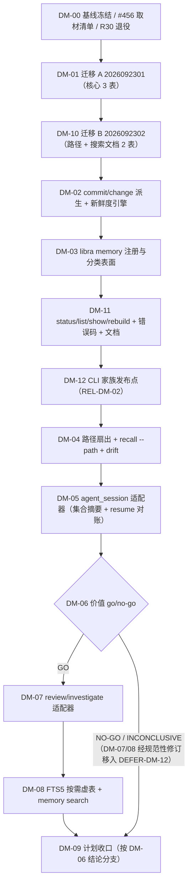

# 研发历程记忆（确定性投影）重设计计划（2026-09-25）

**模板版本：** 依据 [`plan-template.md`](plan-template.md) `v2.8` 编写。模板的 `GC-01..GC-13`、`ER-01..ER-14`、`G-01..G-11` 全部适用；本文只补充本计划特有的领域约束、任务卡与验收口径。

> **本文取代 [`plan-20260819.md`](plan-20260819.md)（M2 / R30）承担 `MEM-01`、`MEM-02` 的交付职责。** plan-20260819 的 R30 修订在 2026-09-22 取得 Codex/Claude 同版双 `VERDICT: PASS`，其 25 张卡全部 `pending`、一行代码未落地（开工日以 `rg -n "plan-20260819" docs/development/plan/plan-status.md` 重取行号，该文件由多方并发编辑，行锚点会漂移）。使用者于 2026-09-23 要求在 `libra code` 拆除后**独立重新设计**、不沿用 R30。本文即该独立设计：它与 R30 共享问题域，但在**模型是否位于关键路径**这一条轴上做了相反的决定，并因此重排了全部接口面。plan-20260819 保留为历史事实，其 M2-\* 卡由本计划 `DM-00` 正式登记退役——**两份计划不得同时拥有 `src/internal/ai/memory/**` 与 `libra memory`**。
>
> **本文只规划任务，不宣称已实现。** 计划级评审取得字面 `VERDICT: PASS` 之前，任何卡不得标 `in-progress`。
>
> **2026-09-24 Agent Capture 依賴鏡像：** [`plan-20260924.md`](plan-20260924.md) 以 `DEP-ACF-DM06` 對稱承接本計劃 `DEP-DM-06`，具名契約為 `CTR-ACF-DM06-v1`。DM-05 的 consumer gate 統一命名為 `memory_agent_session_test::stop_resume_reconciles_deletion`；ACF-02 提供 live terminal 與 explicit CLI resume integration contract tests，ACF-08 重核 import reactivation。此鏡像優先於任何未具名的舊 consumer-contract 描述。

---

## 文档职责

本文承接 [`plan-long.md`](plan-long.md) 的 `MEM-01`、`MEM-02`，交付一条可运行的纵向链路：**让 Agent 能按代码路径召回「这里以前发生过什么」，并带上 `libra log` 不提供的三样东西——结构化 `outcome`、可解析的类型化证据、以及读时计算的 drift；再叠加 review/investigate 的结论文本。**

> **范围边界（R04 实测后收窄，必须先读）：** 「没有变成提交的 Agent 工作**按代码路径**召回」**不在本切片**。实测三条候选事实源全部不成立：`agent_checkpoint.tree_oid` 是 **traces 存储树**的根树（`src/internal/ai/history.rs:2281` 的 `append_checkpoint_commit` doc 明写返回「root tree OID」，内容是 `checkpoint/<id>/metadata.json`、transcript 等），不是用户代码树；checkpoint metadata 不记录变更路径；`ToolCallRecord.paths_written` 虽有字段但**从无生产者**（`src/internal/ai/observed_agents/derived.rs:53` 注释声明其被刻意留空，`:121` 硬编码 `Vec::new()`）。因此 `agent_session` Episode 在本切片**不产生任何 `memory_episode_path` 行**，只以 `parent_commit` 为代码锚，经 `list`/`show`/`search` 可达；该能力登记为 `DEFER-DM-11`。

核心判断：拆除后的 Libra 仓库数据库里，已经 durable 地存在构成一条「研发历程」所需的全部事实——`operation`（actor、终态 status、起止时间）、`change_revision`/`change_identity`（op→commit→change）、`agent_session`/`agent_checkpoint`（`state='stopped'` + `stopped_at` + 单调 `sync_revision`）、review/investigate 的 run manifest（`terminal_state`、`starting_sha`、`findings_oid`）。**一条 Episode 是这些行加上提交图的纯函数。** 因此首个切片不需要模型、不需要 host 上报信封、不需要新 ref、不需要信任边界、也不需要编译作业机器——它需要的是一张迁移、一个派生函数、一个带新鲜度校验的投影，和一个命令。

### 适用范围

- 仓库级研发历程记忆的**确定性投影**：一张 Repository 角色迁移新增 **5 张零权威、可重建**的投影表，外加一张按需创建的 FTS5 虚表。
- 三个 model-free 派生适配器：**commit/change**（`change_revision` + `operation`，提供 path 行）、**agent_session**（会话终态 + `parent_commit` 代码锚，**无 path 行**）、**agent_run**（review + investigate 的 findings 文本）。
- 读时新鲜度校验 + 有界增量追平（对齐既有 `revision_ordinal` 模式），以及显式 `libra memory rebuild`。
- 按代码路径召回（`recall --path`），并在读时对每条 path 计算 **drift**（`current` / `changed` / `path-gone`）。
- 按 BM25 全文召回（`memory search`），FTS5 不可用时**优雅降级**而非阻断。**（`GO` 分支专属：`search`、`LBR-MEMORY-003/004` 与 `memory_search_test` 由条件性的 `DM-08` 交付；`NO-GO`/`INCONCLUSIVE` 分支不含这些产物。）**
- 类型化证据边，带 `link_confidence ∈ {identity, operation, temporal}` 与 `resolution_status ∈ {resolved, unresolved}`；`temporal` 边**永不**被渲染为引证，`unresolved` 边降级标注而非丢弃 Episode。
- 新 Libra-only 顶层命令 `libra memory`，子命令 `status` / `list` / `show` / `rebuild` / `recall` / `search`，`--json` 稳定输出，`LBR-MEMORY-*` 稳定错误码族，EN/zh 文档、**后端站点命令页**、兼容矩阵、测试索引、错误码文档全套机械契约。
- 对 PR #456（pin `bc1be587e4`）的**文件级只读取材**，以及最终关闭该 PR。
- plan-20260819 的 M2-\* 卡退役登记。

### 非目标

- **任何 LLM**：不引入 model client、provider、prompt、token 预算、context assembler，也**不定义模型 trait**。
- **任何新 ref / 新对象图**：不新建 `refs/heads/libra/memory/*`，不写对象存储，不需要 owned-ref 策略卡。
- **任何 host 触发信封**（`TerminalObservationV1`）或 agent bridge 协议变更：bridge 保持 20 方法。
- **任何编译作业 / lease / fence / 隔离区 / 信任门 / 编译器身份注册表 / secret 探针。**
- **任何会话全文、prompt 文本、工具输出原文进入索引**：索引文本仅限**既有命令已对用户呈现过、且经过同一套 sanitizer 归一化**的内容。
- 上下文注入、prompt 渲染、`ContextSelectionReceiptV1`。
- Episode 跨 `clone`/`push`/`cloud` 的可移植性（显式不承诺，`DEFER-DM-02`）。
- 向量/语义召回、consolidate/decay/forgetting、跨仓库共享、MCP 表面、团队同步。
- 绝对检索质量门（Recall@10 / NDCG@10）与 100% line+region 覆盖率门卡。
- 路径改名跟随（改名后报 `drift=path-gone`，这是诚实的答案）。
- **未提交 Agent 工作的路径归因**：现有事实源不记录 Agent 触碰的代码路径（见「范围边界」），本切片不猜测、不用 traces 树冒充代码树（`DEFER-DM-11`）。
- **失败操作的路径归因**：`GAP-DM-03` 证明 `operation` 的 pre/post view 对失败路径恒等，本切片的失败记忆只来自 `agent_session` / `agent_run`（`DEFER-DM-06`）。

### 成功定义

- 在本仓库自身历史上，`libra memory recall --path 
 --json` 能返回按冻结顺序排列的 Episode，且每条带 drift 与类型化证据；`DM-06` 以**确定性选样**对比 `libra log --name-only -- 
`，可证伪地判定它是否提供了 `libra log` 提供不了的信息。
- 终止的 Agent 会话即使**没有产生任何提交**，也能作为 Episode 被 `list`/`show` 找到（`search` 属条件性的 `DM-08`，仅 GO 分支存在），并以 `parent_commit` 为代码锚（**不产生 path 行**，见「范围边界」）；会话被 `resume` 后，对应 Episode 被**对账删除**而不是留成幽灵。
- review/investigate 的终态与**归一化后的** findings 文本可召回，并能沿 `findings_oid` 展开到原文。
- 清空五张投影表后 `libra memory rebuild` 能得到**按 `GC-DM-01` 定义的比较口径**逐行相同的投影；升级姿态为 `forward-only`。
- 全链路离线、无凭据、无网络、确定性：同一仓库状态 + 同一 `rules_version` / `selector_version` ⇒ **已交付的查询子命令**的 `--json` 逐字节相同（两支共同：`list`/`show`/`recall`；`GO` 分支另含 `search`）。`status` 的 `--json` **例外**——它按设计输出 `rebuilt_at` 等运维字段，只要求除时间字段外逐字节相同；该例外与 `GC-DM-01` 排除 `rebuilt_at` 的口径一致。
- 投影陈旧时**fail-closed**：不给答案，而不是给旧答案。
- fmt / clippy / ER-14 全量 nextest 收口门全绿。

---

## 事实基线

核对日 **2026-09-23**，工作树 `/run/media/genedna/data/libra`，`main`，crate `0.23.46`（`Cargo.toml:3`、`install.sh:21`）。所有锚点均在本轮实测。

| 维度 | 现状 | 证据 |
|---|---|---|
| 代码入口 | `src/internal/ai/memory/` **不存在**。与本计划直接相关的现存模块为 `agent_bridge`、`agent_run`、`completion`、`hooks`、`investigate`、`observed_agents`、`review`、`session`，以及顶层单文件 `history.rs`、`traces.rs`、`agent_import.rs`、`event.rs`、`capture_scope.rs` 等；**完整清单以 `src/internal/ai/mod.rs:9-66` 的 `pub mod` 声明为准，本表不复制** | `ls src/internal/ai`；`src/internal/ai/mod.rs:1-6`（模块 doc 说明 Code UI/AgentRuntime SCC 已于 plan-20260920 RC-23 删除）、`:9-66` |
| 数据 / 状态 | 迁移 tip = `2026091901_operation_boundary_claim_columns`；`sql/` 内**无任何 memory 表**；`rg -i 'fts5\|bm25\|USING fts' src/ sql/` 零命中 | `src/internal/db/migration.rs:2329`（`runner.len()==65`）、`:2331`（`max_registered_version()==Some(2026091901)`）、`:324-327`（低于 tip 则跳过） |
| 用户命令 | `src/cli.rs` 无 `memory` 变体；`rg -ni memory src/cli.rs` 零命中 | `src/cli.rs:345`（`enum Commands`）、`:54-79`（`ROOT_AFTER_HELP`） |
| 机器输出 | 无 `libra memory --json` 契约；`docs/commands/memory.md`、`docs/commands/zh-CN/memory.md`、`docs/development/commands/memory.md` 均不存在 | `ls docs/commands` |
| 错误码 | 无 `LBR-MEMORY-*` 族；`StableErrorCode` 现有族含 `LBR-AGENT-001..009` | `src/utils/error.rs:379-387` |
| 文档 | `docs/development/tracing/memory.md` 存在但为 `Status: draft` 设计稿（2392 行，最后更新 2026-08-10），描述 Code 时代双层 Memory 架构，**与本计划的确定性投影模型不一致** | `docs/development/tracing/memory.md:4-6` |
| 测试 | `tests/INDEX.md` 无 memory target；`COMPATIBILITY.md` 无 memory 行 | `rg -ni 'memory' tests/INDEX.md` 零命中；`rg -n '^\| *memory' COMPATIBILITY.md` 零命中 |
| 外部参照 | PR #456 `Anduin9527:codex/memory-m2-core-draft-pr` head `bc1be587e4`，merge-base `2ebd409045b5114707986b66a7a6b42b5a4a4b7e`，该范围 158 路径 `+37,388/-964`，23 ahead，`src/internal/ai/memory/` 34 档 22,551 行（均可离线复现）。**behind 数、`mergeable`、review/CI 计数属实时远端事实**：2026-09-23 本轮取得 `CONFLICTING` / 零 review / 零 CI run，但必须由 `DM-00` 以带 UTC 时间戳的 `gh` JSON 冻结后才作为判据使用 | `git -C "$SRC_CLONE" merge-base …`、`diff --name-only … \| wc -l`（离线可复现）；`gh pr view 456 --json …`、`gh api repos/libra-tools/libra/pulls/456/reviews`（实时，需 `DM-00` 冻结） |

### 可依赖的既有事实面（本计划的地基）

| 事实面 | 证据 | 本计划用途 |
|---|---|---|
| 「可重建侧表 + 读时新鲜度校验」既有范式 | `sql/migrations/2026070301_revision_ordinal.sql:1-7`（"rebuildable side table … Freshness is validated on every read … a stale index never answers"）；`RevisionOrdinalIndex::{meta_with_conn, ensure_fresh_with_conn, rebuild_with_conn}`（`src/internal/revision_ordinal.rs:78,98,158`）；`current_replace_signature()`（`:48`） | 投影表形状、`_meta` 指纹表与 owner API 的直接先例（ADR-DM-02） |
| 「读命令写缓存」既有先例 | `working_dirty` 由 `libra status` 写入；`status` 是 `CommandScope::ReadOnly`（`src/cli.rs:1952`） | `libra memory` 归类为 `ReadOnly` 的先例（ADR-DM-08） |
| `operation` v2（actor / 终态 status / 起止） | `sql/migrations/2026090101_operation_v2.sql`；actor 解析 `src/cli.rs:2167` | Episode 的 actor 与终态来源 |
| `change_identity` / `change_revision`（op→commit→change） | `src/internal/change/store.rs:258`（`revisions_for_repo`）、`:297`（`change_id_for_commit`） | commit/change Episode 的身份与 attempt 聚合 |
| `agent_session` 终态**及其撤销** | 终态由 `libra hooks 
 session-end`（`src/internal/ai/hooks/runtime.rs:750-756,863-864`）、`libra agent import`（`src/internal/ai/agent_import.rs:812-817`）、`libra agent session stop`（`src/command/agent/session.rs:596-605`）写入。**关键事实：`SessionMutationKind::Resume => ("active", None)` 把 `state` 改回 `active` 且 `stopped_at = NULL`，同时 `sync_revision = sync_revision + 1`；时间戳为 `chrono::Utc::now().timestamp()`，仅秒精度** | `agent_session` 是**可撤销**的终态源，因此指纹必须用集合摘要 + `sync_revision`，不能用 `max(stopped_at)` 单调水位（ADR-DM-03、GC-DM-03） |
| `agent_checkpoint` 代码锚（**非路径来源**）+ 已脱敏描述 | 当前 schema 见 `sql/migrations/2026050501_agent_checkpoint_parent_nullable.sql:26-39`（**`parent_commit TEXT` 可为 `NULL`**，用于 unborn HEAD / pre-commit ingest；`tree_oid`、`traces_commit` 为 NOT NULL）；`description` 经 `redact_extracted_string` 后入列（`src/internal/ai/hooks/runtime.rs:2274`）——该 redactor 只做**秘密模式替换**，**不做终端控制字符清理** | Agent 会话 Episode 的 **anchor 与正文**来源；该源**不产生 path 行**（`ADR-DM-04`）；`parent_commit IS NULL` 时如实写 `NULL` |
| review / investigate run manifest 与其 API 的**解析特性** | `ReviewTerminalState::{Success,Error,Cancelled,Timeout,Partial}`（`src/internal/ai/review/store.rs:51-66`）；`finalize_run` 落 `terminal_state` 并把 findings 对象化为 `findings_oid`（`:579-622`）；`pub fn load_manifest`（`:493`）/ `read_findings`（`:505`）/ `list_runs`（`:676`）/ `list_runs_page`（`:715`）；investigate 同构（`investigate/store.rs:65-84,591,601,675-704,753,796`），另有**非终态** `paused`（`:60-62,300-310`）。**关键事实：`list_runs_page` 内部先调用 `list_runs()`，后者 `read_dir` 全部 run 目录、逐个解析 `state.json` 再全量排序，最后才按 cursor 切片——返回量有界，但扫描成本随历史 run 总数无界增长** | **仓库内唯一真实存在的散文语料**；因 `list_runs`/`list_runs_page` 会解析全部 `state.json`，`DM-07` **不使用**它们，改为自建枚举（dirent 排序保确定性、解析有界；dirent 段 O(run 数) 不承诺有界，见 `DEFER-DM-09`） |
| findings 的展示期 sanitizer 已存在且 `pub` | `pub fn render_untrusted_findings(text: &str) -> String`（`src/internal/ai/review/sink.rs:149`），既有测试 `render_untrusted_findings_strips_ansi_sequences_entirely`（`:274`）；调用点全在展示期（`src/command/agent/investigate.rs:634,661,679,705`） | **存储文本仍含 ANSI/控制序列**，因此投影/索引前必须先过同一 sanitizer（ADR-DM-05、GC-DM-02）；无需新写归一化器 |
| `manifest.target_scope` 是自由文本 | `src/internal/ai/review/store.rs:185,396,427`（`target_scope: String`，review 可写 `HEAD~1..HEAD`）；investigate 直接写自然语言 topic | `target_scope` **不是代码路径**，只有解析为受支持 revision 范围时才可派生路径（ADR-DM-04、DM-07） |
| `agent_bridge_operation` 终态 | `status IN ('applied','failed')` + `completed_at` + `result_digest`（`src/internal/ai/agent_bridge/mutations.rs:221-223`；`storage.rs:449-470`） | `source_kind` 词表预留（本切片不实现，`DEFER-DM-04`） |
| SQLite 栈与 FTS5 | `sea-orm 2.0 {sqlx-sqlite}` → `sqlx-sqlite 0.9.0` → `libsqlite3-sys 0.30.1` **bundled**（`Cargo.toml:65-69`；`Cargo.lock:3891-3899`）；`libsqlite3-sys-0.30.1/build.rs:127-129` 无条件传 `-DSQLITE_ENABLE_FTS5`，构建产物 `cargo:rustc-link-lib=static=sqlite3` | FTS5 是**静态编入**的构建不变量，不需要四平台探针工作流（ADR-DM-06） |
| 配置库隔离 fixture 需要 env lane | `tests/db_migration_test.rs` 的 `ConfigDbFixture` 修改 `LIBRA_CONFIG_GLOBAL_DB`/`LIBRA_CONFIG_SYSTEM_DB`，相关用例均标注 `#[serial(env)]` | `DM-01` 的 GC-13 隔离断言**必须** `#[serial(env)]` 并登记 registry（ER 第 6 条） |

### 当前缺口

| ID | 缺口 | 影响 | 证据 | 计划动作 |
|---|---|---|---|---|
| `GAP-DM-01` | 无任何 Memory 实现：无模块、无表、无命令、无测试、无文档页 | `MEM-01`/`MEM-02` 完全未交付 | 见上「事实基线」 | 本计划 `DM-01..DM-08` |
| `GAP-DM-02` | `change_revision.visibility='hidden'` **从无写入者**：`set_visibility`（`src/internal/change/builder.rs:638`）零调用方，`builder.rs:598` 硬编码 `Visible`，全树仅 `store.rs:158,247,288` 三处字符串解析 | 「被放弃的尝试」不能作为 Episode 的事实来源；任何依赖该列的召回语义都会恒为空 | 本轮 `rg -n "set_visibility" src/ tests/` 仅命中定义行 | **本计划不依赖该列**；`DM-02` 以注释 + `rg` 守卫固化禁令；重启条件见 `DEFER-DM-05` |
| `GAP-DM-03` | 失败操作的 `post_view_oid` 恒等于 `pre_view_oid`：创建时 `post_view_oid: pre_view_oid`（`src/internal/operation/middleware.rs:580`），`update_operation_post_view` 只在成功路径调用（`:759`），`persist_failed_operation`（`:1000-1006`）只改 status + 追加 journal | 失败操作**无法**通过 pre→post view diff 得到路径 | 本轮实测上述三处 | **本计划的失败记忆只来自 `agent_session` / `agent_run` 适配器**；已写入「非目标」；重启条件见 `DEFER-DM-06` |
| `GAP-DM-04` | `libra op restore` 会回退 AI 托管 ref：refs facet 捕获 `SELECT … FROM reference ORDER BY id` 无过滤（`src/internal/operation/middleware.rs:943`），恢复侧 `DELETE FROM reference` 后整表重建（`src/internal/operation/restore.rs:1285`） | **既有数据丢失缺陷**：今天每次 `op restore` 都可能丢弃 `traces` 上的 Agent checkpoint | 本轮实测两处 | **本计划范围外**（本计划不写任何 ref）。登记为事实，避免日后被归因到 Memory；重启条件见 `DEFER-DM-02` |
| `GAP-DM-05` | `libra push --mirror` 会把 AI 托管分支当普通分支强推：mirror planner 枚举**全部本地 `kind=Branch` 行**（`Branch::list_branches_result`，`src/command/push.rs:2071`；该查询在 `src/internal/branch.rs:325-332` 只过滤 `kind`/`remote`，**未排除 AI-managed branches**），`normalize_branch_ref`（`:1497-1504`）给裸行名加 `refs/heads/` 前缀并 force | `traces` 会以 `refs/heads/traces` 出现在远端 | 本轮实测三处 | **本计划范围外**；同上登记 |
| `GAP-DM-06` | `docs/development/tracing/memory.md` 仍描述 Code 时代双层 Memory + MCP 表面 | 设计文档与本计划的确定性投影模型不一致，会误导实现者 | `docs/development/tracing/memory.md:4-6,29-49` | `DM-09` 重写其「当前状态」并加指针 |
| `GAP-DM-07` | `plan-status.md` 把 `plan-20260912.md` 标为「B（memory boundary）」，但该计划实际是「Mega2 遠端目錄 TUI 與目錄/標籤操作計劃」（`plan-20260912.md:1`），与 Memory 无关 | 检索 Memory 相关计划时会被误导到 Mega2 Browser | 本轮实测 | **本计划范围外**（与 Memory 行为轴无关，按 `G-01` 不并入任何卡）。仅登记为观察事实，由维护 `plan-status.md` 的一方另行修正 |

---

## 与其它计划的关系

| 计划 / 文档 | 关系 |
|---|---|
| [`plan-20260819.md`](plan-20260819.md)（M2 / R30） | **被本计划取代。** 其 M2-01..M2-16E 由 `DM-00` 登记退役；两份计划不得同时拥有 `src/internal/ai/memory/**` 与 `libra memory`（`DEP-DM-05`） |
| [`plan-20260920.md`](plan-20260920.md)（0.23.x 拆 Code/Publish/Worker，已收口） | 本计划的前提。其 `GC-RC-01` 禁止边（KEEP 表面不得 `use` 已删模块）对本计划全程有效；`ADR-RC-05` 要求新增反向 import 必须先立卡 |
| [`plan-20260924.md`](plan-20260924.md)（Agent Capture 通用協調層，已登记 `plan-status.md`，`ACF-01..09` 全 `pending`） | **上游硬依赖。** 其 `ACF-02`/`ACF-08` 的写集包含 `src/internal/ai/hooks/runtime.rs` 与 `src/internal/ai/agent_import.rs`，会改写 exact writers、lifecycle reducer 与 import cutover——而本计划 `DM-05` 依赖这两处写入的 `agent_session` 终态**及其撤销（resume）**语义。写集不相交，但语义所有权在上游；本侧登记 `DEP-DM-06`（**阻塞**），上游以 `DEP-ACF-DM06` / `CTR-ACF-DM06-v1` 对称镜像 |
| [`plan-long.md`](plan-long.md) | `MEM-01`/`MEM-02` 的交付方由 plan-20260819 改为本计划；收口卡同步其状态账 |
| [`plan-template.md`](plan-template.md) `v2.8` | 规范来源 |
| [`docs/development/tracing/memory.md`](../tracing/memory.md) | Code 时代设计稿；收口卡改写为历史 + 指针 |
| PR #456 | 只读取材来源（`DEP-DM-03`），由 `DM-09` 关闭（AC 按分支取值） |

---

## 评审结论与修订记录

| 维度 | 结论 |
|---|---|
| 合理性 | 成立。Episode 被定义为既有 durable 事实的纯函数，每个事实源的终态标记都已实测存在生产者；`GAP-DM-02`/`GAP-DM-03` 两条不成立的事实来源已被排除在依赖之外并写入「非目标」 |
| 可行性 | 成立。无网络、无凭据、无外部服务；最大不确定性是「派生结果是否比 `libra log` 更有用」，由 `DM-06` 的确定性 go/no-go 卡以可证伪方式处理，且否决分支由同一张 `DM-09` 的 B 组 AC 承接 |
| 任务卡粒度 | 13 卡，全部单轴、仅 `S`/`M`；**无 `EX-*` 豁免**——`DM-01`/`DM-03` 的机械细节移入规范性块，AC 各自收敛为 8 条单一谓词 |
| 依赖与顺序 | DAG 无环，含 `DM-07 → DM-08` 硬边与 `DM-06 →(NO-GO) DM-09` 分支边；跨计划写集冲突（`src/cli.rs`、`migration.rs` tip、plan-20260924 的 hooks/import 语义、版本面文件占用）全部在「依赖登记表」显式登记 |
| 完整性 | 覆盖 schema / 派生 / 召回 / 命令 / 文档（含后端站点页）/ 错误码 / 测试索引 / 兼容矩阵 / #456 收口 / 前计划退役 / NO-GO 降级 |
| 安全性 | 索引文本被 `ADR-DM-05` 限制为「既有命令已呈现过、且经同一 sanitizer 归一化」的内容；ANSI/OSC canary 测试是 `DM-07` 的判据；无凭据、无 secret、无 host 输入 |
| 功能正确性 | 新鲜度指纹**按源分类**：`commit/change` 用首父链 tip + `(op_id,status,end_ts)` 集合摘要；`agent_session` 是**可撤销**源，用 session 四元组 **+ 其 checkpoint 集合**的摘要 + 删除对账；`agent_run` 是文件系统源，用 `(run_id, terminal_state, findings_oid, findings_resolvable)` 四元组集合摘要 + 自建「dirent 名排序 + 解析有界」枚举 |
| 接口兼容 | 新增 Libra-only 顶层命令，`intentionally-different` 级；不改任何 Git 兼容表面 |
| 数据流与控制流 | 单向：既有表 → 派生 → 投影 → 读。投影零权威；`rebuild` 可完全重造 |
| 性能与容量 | 提交侧受 `memory.horizon`、run 侧受 `memory.horizon_runs` 双重约束并上报截断；增量只处理 keyset/集合差；`recall` 的 drift 解析按结果条数封顶（GC-10） |
| 可靠性与容错 | 陈旧 fail-closed（`LBR-MEMORY-001`）；FTS5 不可用时 `search` 降级而其余子命令不受影响；迁移为 `forward-only`，`down` 只作受控测试/运维工具 |
| 可维护性 | 无模型、无协议、无作业机器；新增约 12 个文件量级的模块 + 1 个命令适配器；复用既有 `render_untrusted_findings`、`collect_tree_leaves`，`agent_run` 侧因既有 API 会全量解析 manifest 改自建枚举 |

### 修订历史

| 日期 | 修订 | 说明 |
|---|---|---|
| 2026-09-23 | R01 初稿 | 在 `libra code` 拆除后独立重设计；取代 plan-20260819 R30 的 M2-\* 交付职责。核心分歧：模型不在关键路径（`ADR-DM-01`）、不新建权威 ref（`ADR-DM-02`）、无触发器（`ADR-DM-03`） |
| 2026-09-23 | R02 修订（依 Codex R01：`P0=0 / P1=21 / P2=5`，全部关闭） | **架构级更正：**（a）`agent_session` 可 `resume`（`session.rs:596-605` 置 `stopped_at=NULL` 并 `sync_revision+1`，时间戳仅秒精度），`ADR-DM-03`/`GC-DM-03` 由「终态单调水位」改写为「**按源分类；可撤销源用集合摘要 + 删除对账**」；（b）`manifest.target_scope` 是自由文本（investigate 写自然语言 topic），只有解析为受支持 revision 范围才派生路径（`ADR-DM-04`）；（c）findings 存储文本仍含 ANSI/控制序列（`render_untrusted_findings` 只在展示期调用），投影/索引前必须先归一化（`ADR-DM-05`）。**schema 更正：** 补第 5 张 `memory_episode_search_doc`；`memory_episode_path` 补 `ended_at`（否则 `(code_path, ended_at DESC)` 索引无法创建）；`memory_episode_evidence` 补 `resolution_status`。**流程更正：** 迁移 `Rollback mode` 由 `revert` 改为 `forward-only`（新增 `ADR-DM-13`）；`DM-03` 补 `rebuild` 子命令与**后端站点命令页**（ER-06a 不允许以「无对应页」记 N/A）；新增条件性降级分支以消除生命周期死路；补 `DM-07 → DM-08` 硬边；`DEP-DM-06` 由非阻塞改为阻塞；`EX-*` 补 `Review round`、具名审批人与逐门命令，分子按独立谓词重算；`DM-00` 去掉与 Memory 无关的 `plan-20260912` 类别修正（移入 `GAP-DM-07` 观察，`G-01`）；`GC-DM-01` 给出「逐行相同」的可执行定义并排除 `rebuilt_at`；`DM-06` 冻结选样算法与等价规则并增加 `INCONCLUSIVE` 分支；`Full-suite trigger` 按 ER-13 重新登记（`T-4` 仅用于真正改共享基建的卡）；补「干净版本面基线」发布前置 |

| 2026-09-23 | R03 修订（依 Codex R02：`P0=0 / P1=18 / P2=3`，全部关闭） | **事实更正（三条均本轮实测）：**（a）`ChangeStore::revisions_for_repo` 把 `limit` 钳制为 `clamp(1, 200)`（`store.rs:273`），承载不了 `memory.horizon=5000` → `DM-02` 改为自建 keyset 分页并加 >200 回归测试；（b）`list_runs_page` 内部调用 `list_runs()` 做全目录扫描，**返回有界但扫描无界** → `GC-DM-06`、`ADR-DM-03`、`DM-07` 全部改为诚实口径，并以 N=2000 性能回归测试固化上界、`DEFER-DM-09` 承接持久索引；（c）`agent_checkpoint.parent_commit` 当前可为 `NULL`（`2026050501` 迁移）→ `DM-05` 定义空树基线并加 unborn-repo 测试。**正确性更正：** run 指纹加入 `findings_resolvable`（只摘要 OID 无法检出对象删除/恢复）；`ADR-DM-05`/`GC-DM-02` 的归一化扩展到**全部三类文本来源**（提交正文、checkpoint description、findings），各配一条控制字符 canary；`GC-DM-03` 冻结对账域（区分「已撤销」与「跌出 horizon」）；FTS5 字面量转义规则冻结为 `"` 双写。**流程更正：** `DM-09` 与原 `DM-10` 合并为**唯一收口卡**，AC 按 `DM-06` 结论分 A/B 两组，未选中分支的 `DM-07`/`DM-08` 经规范性修订移入 `DEFER-DM-12`——两支都以「全部卡 `done`」终结，消除以 `blocked` 收口的死路；`DM-08` 改 `forward-only`（持久虚表+shadow 表）；`DM-04` 改 `T-1`（提升共享 helper 可见性）；`DEP-DM-04` 进入每张 C 组卡的 `Dependencies`；`DM-03` 的 `prod-files` 按 `G-04`「不统计随附同步集」重算为 5；`DM-06` 增加可复算脚本 `scripts/memory-value-gate.sh` 与复算一致性判据；`DM-08` 的 FTS 失败注入机制冻结为 `LIBRA_TEST=1` + `LIBRA_TEST_MEMORY_FTS_UNAVAILABLE=1`；`DM-01` 的兼容判定改为「截断 registry 的模拟 runner」并把真实旧二进制 gate 记入 `DEFER-DM-10`；`DEP-DM-06` 的 (b) 方案补 owner / 交付物 / 截止门与自动回落 (a) |

| 2026-09-23 | R04 修订（依 Codex R03：`P0=0 / P1=9 / P2=3`，全部关闭；含一次**范围收窄**） | **范围收窄（使用者 2026-09-23 决策）：** 实测确认「未提交 Agent 工作按代码路径召回」**在现有事实上不可实现**——`agent_checkpoint.tree_oid` 是 traces 存储树的根树（`history.rs:2281`）、checkpoint metadata 无变更路径、`ToolCallRecord.paths_written` 无生产者（`derived.rs:53,121`）。按使用者选择的「缩小范围」，`agent_session` 源改为**只写 `anchor_commit`、不产生任何 path 行**，该能力移入 `DEFER-DM-11`；`ADR-DM-04`、`DM-05`、「文档职责」「成功定义」「非目标」与 `DM-06` 的判定轴同批改写。**正确性更正：** `commit/change` 指纹改为含 `(op_id, status, end_ts)` **集合摘要**（`operation` 原地终态化，`store.rs:489,735`，`max(end_ts)` 会漏同毫秒/低于 max 的迟到终态）；`agent_run` 改为**自建硬有界目录枚举**并以注入计数器断言数值预算（`list_runs`/`list_runs_page` 会全量扫描，`review/store.rs:676,715`）；FTS 虚表**首次创建时必须同事务 `'rebuild'` 回填**（external-content 不会为既有行自动建 posting，已实测）。**流程更正：** `NO-GO` 分支不再用「墓碑 `done`」（模板的 `done` 以 `Acceptance=complete` 为前提），改为规范性修订把 `DM-07`/`DM-08` 移入 `DEFER-DM-12`，完成判据只要求「全部**非延后**卡完成」；`DM-09` 依赖改为 `DM-06` + `DM-08(GO)` 条件边并三处统一；`DM-06` 增加分层选样避免样本域排除差异化路径、复算改为整文件 byte diff 并强制 `HEAD` pin 非空；`DM-01` `prod-files` 2→3（`migration.rs` 是注册落点）；发布 run ID 改为按 tag+head SHA 唯一查询 |

| 2026-09-23 | R05 修订（依 Codex R04：`P0=0 / P1=13 / P2=2`，全部关闭） | **两条设计级更正（均本轮实测）：**（a）`revision_ordinal` 是**每个 `change_id` 内**的计数而非全仓单调序（`change/store.rs:96-107`；本仓库 34 条 revision 全为 0），因此 horizon 口径改为「分支 tip 的**首父链**前 N 个提交」，与 `libra log` 同序；（b）run 目录名是 UUIDv4 且 `read_dir` 顺序不稳定，「读前 N 项即停」无法同时满足确定性——改为**dirent 名全排序（确定性）+ `state.json` 解析上限（有界性）**两段式，并写明选取集合是 `run_id` 序前缀而非「最近 N 个」。**新增冻结规则：** change 多 revision 的聚合（当前 revision 选择、title/anchor/路径取值、起止时间与 `outcome` 聚合）；session anchor 聚合与「零 checkpoint 仍产出 Episode」；session 指纹**加入 checkpoint 集合摘要**（checkpoint 追加不递增 `sync_revision`，`hooks/runtime.rs:2187-2211`）；路径 diff **按相同 subtree OID 剪枝**并给对象读取数值预算（`tree_plumbing.rs:308-333` 会递归展开整棵树）；`code_path` 的终端安全（无损入库、入 `paths_text` 与人读前归一化、四面 canary）。**`DM-06` 去偏：** 选样只用 `libra log` 侧事实、时间基准取 `HEAD` 提交时间、把结构性必有的 `operation` 证据边移出阳性条件。**模板合规：** 撤销 `EX-DM-01`/`EX-DM-02` 两张 waiver——把 `DM-01` 的建表细节移入「Schema 规范」块、`DM-03` 的机械门移入「注册契约」块后，两卡 AC 各收敛为 8 条单一谓词（且 v2.8 的门族 waiver 白名单本就不含 `migration` 卡）；`landing`/`scope` 按 G-04 重算（`DM-01` 5→2、`DM-08` 5→4、`DM-09` S→M）；`plan-status.md` 逐卡同步升为计划级默认并进入每张卡的写集与末条 AC；清除全部「墓碑」措辞 |

| 2026-09-23 | R06 修订（依 Codex R05：`P0=0 / P1=8 / P2=2`，全部关闭；含一次**拆卡**） | **拆卡（使用者 2026-09-23 决策，模板合规路线）：** 模板 v2.8 的 G-03 门族 waiver 白名单只覆盖 `implementation` 卡，`migration` 卡不适用，因此撤销 waiver 并拆卡：`DM-01`（迁移 A `2026092301`，核心 3 表）/ `DM-10`（迁移 B `2026092302`，路径 + 搜索文档 2 表）；`DM-03`（注册与分类表面）/ `DM-11`（只读子命令 + 错误码 + 五份文档）。12 卡，每卡 `AC ≤ 8`、`VER ≤ 8`，**全计划无 `EX-*`**。**正确性更正：** 路径的人读/FTS 输出改用既有 C-style `quote_pathname`（`src/command/status.rs:5869`，`pub`）而非 `render_untrusted_findings`（后者刻意保留 `\n`/`\t`，会让恶意文件名制造额外输出行），并移除 `code_path` 的反斜杠 CHECK（反斜杠是 Unix Git 路径的合法字节）；`agent_run` 枚举**撤销「目录枚举硬有界」承诺**，只承诺 manifest 解析有界、dirent 段诚实标注为 O(run 数) 并归入 `DEFER-DM-09`；tree diff 给出可复算公式 `tree_objects_read ≤ 2 × (D_max + L_changed)` 与确切 fixture 期望。**`DM-06` 定稿：** 分层选样去重并定义补齐顺序与「唯一路径 <5」行为；阳性轴收敛为 `outcome ∉ {succeeded}` 与 `drift ∈ {changed, path-gone}` 两条（`review_run` 边在本卡必为空、`operation` 边是结构性必有，均移出）；冻结 `GO` 优先于 `INCONCLUSIVE` 的消解顺序；补 `plan-status.md` 同步 AC 与写集。**新增规范性块：** 「Schema 规范」（按归属卡分行）与「逐 `source_kind` 的 Episode 字段映射」（含 `outcome='unknown'` 的唯一用法与 golden row 测试）。**分支适用性：** 「成功定义」「兼容与文档收口」「测试矩阵」明确标注哪些条目仅 `GO` 分支适用，使降级分支能合法通过完成门 |

| 2026-09-23 | R07 修订（依 Codex R06：`P0=0 / P1=11 / P2=3`） | **按 `G-09` 拆分协议重新编号：** 原 `DM-01B`/`DM-03B` 改为在计划末尾追加的新编号 `DM-10`/`DM-11`，原卡写明「拆出」、新卡写明「自 … 拆出」，并同步实施顺序、依赖登记表、发布分组、追溯表、测试矩阵、里程碑与本行。**按 `G-08` 组建 CLI 家族 `REL-DM-02`：** 单独发布 `DM-03` 会让用户看到一个可见但无可用子命令、无文档页的公开命令，这正是 `G-08`「必须同时上线」的情形——`DM-03`/`DM-11` 改为 `family child`（不 bump、不发版），新增 `DM-12` 作为 `Task type = release` 的唯一发布点；GO 分支发布周期由 10 降为 9。**正确性更正：**（a）投影域与对账域统一为同一个 horizon 窗口——出窗行**一律删除**而非保留，否则只扫窗口的 `rebuild` 永远无法复现增量状态、`GC-DM-01` 的逐行相同判据不成立；新增「增量 == 同 horizon rebuild」等价性测试；（b）tree diff 上界公式改为 `tree_objects_read ≤ 2 × (1 + D_max × L_changed)`（原式 `2 × (D_max + L_changed)` 在多条变更路径下不成立），fixture 期望同步为 ≤ 38 并补「变更 0 叶 ⇒ ≤ 2」；（c）`DM-05`/`DM-07` 的 `Full-suite trigger` 由 `none` 改为 `T-5` 并写明理由。**归档方式变更：** 评审 findings 改为直接写进「Codex review log」章节，`docs/development/plan/plan-20260926.review/` 目录删除；R06 的逐条正文因未及转写而丢失，已在 §R06 诚实登记，并固定「先转写、后清理」的顺序 |

| 2026-09-25 | 改名（`plan-20260923.md` → `plan-20260925.md`） | 按使用者要求把计划编号改到 `2026-09-25`。同批更新：标题日期；本文件内全部自引用与派生产物名（`plan-20260925-456-salvage.md`、`plan-20260925-value-gate.md`）；`plan-status.md` 的「计划一览」行与「未启动计划」小节；`plan-20260924.md` 中 `DEP-ACF-DM06` 双侧镜像的全部引用。**正文事实与卡片内容不变**：「事实基线」的核对日仍为 2026-09-23（锚点实测日），R01–R07 的评审日期亦为历史事实，均不倒改；开工前按 ER-02 重新刷新锚点 |

| 2026-09-24 | 改名（`plan-20260925.md` → `plan-20260926.md`） | 合并上游 `origin/main` 时发现上游已以 `plan-20260925.md` 登记并收口 Session Capture 计划（SCAP-01/02，`v0.23.55`），与本计划同名（`AA` 冲突）。为保留两份计划，上游文件保持原路径，本计划改到下一个两侧均未占用的编号 `2026-09-26`（由 plan-20260921 的发布执行者在合并提交内完成）。同批更新：本文件内全部自引用与派生产物名（`plan-20260926-456-salvage.md`、`plan-20260926-value-gate.md`）；`plan-status.md` 的本计划行；`plan-20260924.md` 中 `DEP-ACF-DM06` 双侧镜像的全部引用。**正文事实、卡片内容与评审状态不变**（仍未取得字面 `VERDICT: PASS`，禁止开工）。 |

---

## 已决议设计决策

### ADR-DM-01：模型不在关键路径

- **Status：** Accepted
- **Context：** 0.23.x 拆除了全部 provider / client / prompt；仓库内今天没有任何 LLM 客户端（`src/internal/ai/completion/mod.rs:36` 的 `HttpError` 变体无人构造；`CompletionModel` 的实现者只有 retry/throttle 装饰器与测试 fake）。
- **Decision：** Episode 由规则确定性派生。读写路径都不调用模型，**也不定义模型 trait**。未来任何叙述性文本只能作为以 `producer` 区分的**追加**修订进入。
- **Alternatives considered：** R30 的 host 注入 `EpisodeCompilerModel` trait —— 被拒，因为它在没有任何 in-repo 生产者的前提下先引入了不可信内容边界，从而连带要求信任门、隔离区、编译器身份注册表、secret 探针与约 1700 行 schema 硬化，全部是净成本。
- **Consequences：** Episode 结构丰富、叙述单薄；全部测试 hermetic、离线、无凭据。
- **Revisit when：** 出现具体的 host 承诺产出叙述，且存在 at-rest 脱敏保证；或 `DM-06` 判定 `NO-GO`（此时由 `DM-09` 的 B 组 AC 强制重开本 ADR）。

### ADR-DM-02：Memory 是可重建投影，不是新权威

- **Status：** Accepted
- **Decision：** 不新建 ref、不新建对象图。权威 = `operation` / `change_revision` / `agent_session` / `agent_checkpoint` / run manifest + 提交图。投影自声明可重建，并在每次读取时校验新鲜度。
- **Alternatives considered：**（a）R30 的 `refs/heads/libra/memory/repo`——被拒：Libra 本地没有 `refs/*` 命名空间，ref 就是 `reference` 表的一行（`src/internal/branch.rs:1-19`），因此新增一行会被 `libra branch`/`show-ref`/`for-each-ref` 列出、被 `push --mirror` 强推（`GAP-DM-05`）、被 `cloud` 连同对象缺失一起导出、并可被 `update-ref` 改写——这正是 R30 必须付出 17 个生产文件的 owned-ref 策略卡的原因，而它随后又把该 ref 的唯一好处（传输）关掉了。（b）复用既有 `traces` ref——被拒：见 `GAP-DM-04`，`op restore` 今天就会回退它。
- **Consequences：** Memory **不跟随 clone/push/cloud**。这是被接受的损失，且是**自洽的**——它的全部事实源同样是仓库本地的，Memory 不应当比它派生自的事实更可移植。
- **Revisit when：** `GAP-DM-04` 修复且存在真实的跨机器需求（`DEFER-DM-02`）。

### ADR-DM-03：无触发器；读时惰性追平，指纹按「源是否可撤销」分别定义

- **Status：** Accepted（R02 改写）
- **Context：** 实测不存在可用的进程内终态事件：`AgentRunStatus::{Completed,Failed}` **零生产者**；`automation` 的 VCS 事件只传事件名、不带 commit oid（`src/internal/ai/automation/runtime.rs:111`）且默认无规则即 no-op。同时实测发现**并非所有终态都是单调的**：`agent_session` 可以 `resume`（`src/command/agent/session.rs:596-605`），`stopped_at` 会被置回 `NULL`，且时间戳只有秒精度。
- **Decision：** 不引入触发器。读取时增量追平，受 horizon 封顶。指纹按源分类：
  - **`commit/change`（提交图追加，但 `operation` 会原地终态化）：** `分支 tip 摘要 + current_replace_signature() + RULES_VERSION + SCHEMA_VERSION` **再加 horizon 窗口内相关 `operation` 行的 `(op_id, status, end_ts)` 集合摘要**。**不得只用 `max(end_ts)`**：`operation` 先以 `Running` 插入、之后原地 `UPDATE status/end_ts`（`src/internal/operation/store.rs:489,735`），同毫秒结束、时钟回拨或较早行迟到终态化但不超过现有最大值时 `max` 不变，而 Episode 的 `outcome`/`ended_at` 已变，会违反「陈旧 fail-closed」。
  - **可撤销源 —— `agent_session`：** 对全部候选行的 `(session_id, state, stopped_at, sync_revision)` 四元组**外加该 session 的 `agent_checkpoint` 行 `(checkpoint_id, parent_commit, created_at)` 的规范化集合摘要**做**集合摘要**——checkpoint 可在独立写入中追加且**不**递增 session 的 `sync_revision`（`src/internal/ai/hooks/runtime.rs:2187-2211`），只摘要 session 四元组会让「先看到 stop、后落盘 checkpoint」永久保留空/旧 anchor；追平时不仅新增，还必须**对账删除**（不再满足终态谓词的 `session_id` 对应的 Episode 及其级联行必须被删）。`sync_revision` 单调自增，因此同秒两次终态化、`stop→resume`、`stop→resume→stop` 都可被检出。
  - **文件系统源 —— `agent_run`：** 对**自建枚举**（dirent 名全排序后解析前 `memory.horizon_runs` 个，超出置 `horizon_truncated`；确定性来自显式排序，**有界性仅限解析次数**，dirent 段为 O(run 数)）得到的 **`(run_id, terminal_state, findings_oid, findings_resolvable)` 四元组**做集合摘要；**不使用目录 mtime**（`write_manifest` 是就地 `fs::write`，mtime 不可靠），也**不使用 `list_runs`/`list_runs_page`**（二者先 `read_dir` 全部目录并解析全部 `state.json` 后才切片，扫描量 O(历史 run 总数)，`review/store.rs:676,715`）。`findings_resolvable` 是对 `findings_oid` 当前**是否可在对象库解析**的布尔判定——只放 OID 字符串不够，因为对象被删除或恢复时 manifest 里的 OID 并不变。
- **Alternatives considered：**（a）host 上报 `TerminalObservationV1` + bridge 20→22 方法——被拒：永久 host 耦合 + 协议版本维护。（b）对全部源统一用 `max(终态列)` 单调水位——**被 R02 否决**：对可撤销源会漏掉同秒终态化并留下幽灵 Episode。
- **Consequences：** Episode 的存在依赖有人运行 `libra memory`；horizon 截断必须上报；可撤销源与文件系统源的指纹是 O(候选数) 的摘要而非 O(1) 比较，因此 horizon 是正确性与性能的共同前提。

### ADR-DM-04：三个终态事实适配器，各自的路径来源必须被验证过

- **Status：** Accepted（R02 增补）
- **Decision：** `commit`、`agent_session`、`agent_run` 三个适配器，各自键控在**已实测存在生产者**的终态标记上；`bridge_operation` 只在 `source_kind` CHECK 词表中预留、本切片不实现。**路径来源逐源规定（R04 收窄）：** `commit` = 提交树与首父树的差集；`agent_session` = **无**——现有事实源不记录 Agent 触碰的代码路径（`agent_checkpoint.tree_oid` 是 traces 存储树而非代码树，`history.rs:2281`；`ToolCallRecord.paths_written` 无生产者，`derived.rs:53,121`），该源只写 `anchor_commit = parent_commit`，**不产生任何 `memory_episode_path` 行**；`agent_run` = **仅当** `manifest.target_scope` 能解析为受支持的 revision 范围时，由实际 tree diff 派生，解析失败（自然语言 topic、空串）同样**不产生 path 行**。
- **Alternatives considered：**（a）统一归一化摄取信封——被拒：统一性只为不存在的生产者服务。（b）把 `target_scope` 原样当作路径——**被 R02 否决**：`target_scope: String` 是自由文本（`src/internal/ai/review/store.rs:185`），investigate 直接写 topic，会制造伪路径并污染按路径召回。（c）把 `agent_checkpoint.tree_oid` 与 `parent_commit` 做 tree diff 当作 Agent 的代码改动——**被 R04 否决**：`tree_oid` 是 traces 存储树的根树（`history.rs:2281`），diff 结果是 `checkpoint/*`、`transcript/*` 等 traces 路径，全部是伪路径；unborn HEAD 时更会把整棵 traces 树当成代码变更。

### ADR-DM-05：只索引「既有命令已呈现过、且经同一 sanitizer 归一化」的文本

- **Status：** Accepted（R02 改写）
- **Decision：** 可索引文本 = 提交 subject/body + `agent_checkpoint.description` + review/investigate findings。**全部三类来源**在**进入 `memory_episode.title`/`body` 与 `memory_episode_search_doc` 之前**都必须先过与展示期相同的 `render_untrusted_findings`（`src/internal/ai/review/sink.rs:149`，已是 `pub`，无需新写）——包括提交 subject/body（提交消息同样可含控制序列）与 `agent_checkpoint.description`（其既有 `redact_extracted_string` 只做秘密模式替换，**不做终端控制字符清理**，R02 P1-13）。人读输出继续 sanitize；`--json` 依赖 JSON 自身的结构化转义。**不含**会话全文、prompt、工具输出原文。
- **Alternatives considered：**（a）移植 #456 `source.rs`（2136 行）的会话摄取 + 脱敏——被拒。（b）直接索引存储态 findings——**被 R02 否决**：实测 `render_untrusted_findings` 只在展示期调用（`src/command/agent/investigate.rs:634,661,679,705`），存储文本仍保留 ANSI/控制序列，直接索引会同时破坏「零新增披露面」主张并把终端注入引入 `libra memory` 的人读输出。
- **Consequences：** 归一化后本索引是**零新增披露面**：每一个被索引的字节都已可经 `libra log` / `libra agent checkpoint` / `libra review` 以**相同形态**看到。这一条同时删除了脱敏卡、secret 探针卡，以及 sensitivity/visibility 两列。**判据分布：** 三类来源各有一条控制字符 canary —— commit 在 `DM-02`、checkpoint description 在 `DM-05`、findings 在 `DM-07`。
- **Revisit when：** 出现 transcript 的 at-rest 脱敏保证（`DEFER-DM-07`）；或 `DM-06` 判定 `NO-GO`（由 `DM-09` 的 B 组 AC 强制重开）。

### ADR-DM-06：FTS5 内容表由迁移建立，虚表按需 top-up；不加 CI 探针工作流

- **Status：** Accepted（R02 澄清）
- **Context：** `libsqlite3-sys-0.30.1/build.rs:127-129` 在 bundled 构建中**无条件**传 `-DSQLITE_ENABLE_FTS5`，且构建产物静态链接 `sqlite3`。FTS5 是构建不变量，不是平台变量。
- **Decision：** 迁移（`DM-01`）建立**普通表** `memory_episode_search_doc`（显式 `rowid INTEGER PRIMARY KEY` + `title` / `body` / `paths_text` + FK 到 `memory_episode`），它是第 5 张投影表，也是 FTS5 的 external-content 与 rowid 来源。FTS5 **虚表**在首次使用时 `CREATE VIRTUAL TABLE IF NOT EXISTS memory_episode_fts USING fts5(title, body, paths_text, content='memory_episode_search_doc', content_rowid='rowid', tokenize='unicode61 remove_diacritics 2')`；能力缺失只让 `search` 返回 `LBR-MEMORY-004`，其余子命令照常。按 GC-13 声明为 Repository 角色的幂等 top-up，允许清单恰好一个对象。清理顺序为**先 drop 虚表（连同 shadow tables）再 drop 内容表**。
- **Alternatives considered：**（a）R30 的四平台 FTS5 能力探针工作流——被拒：它测的是工具链而非 Libra。（b）在迁移里建虚表——被拒：把一个「不可能但非零」的风险转成 brick 掉仓库数据库。
- **Consequences：** `recall --path` 与 FTS 无关，因此降级是优雅的；降级测试必须用**确定性能力失败注入**，不能靠「drop 虚表」（下一次 `IF NOT EXISTS` 会重建，测不到失败分支）。

### ADR-DM-07：确定性 Episode 身份 + 规范内容摘要

- **Status：** Accepted
- **Decision：** `episode_id = UUIDv5(MEMORY_EPISODE_NAMESPACE_V1, "{repo_id}\x1f{source_kind}\x1f{source_key}")`；内容漂移由规范序列化上的 `content_digest` 检出。
- **Alternatives considered：** 首次投影时分配随机 UUID——被拒：重建后不稳定，会破坏 `memory show <id>`。
- **Precedent：** 冻结命名空间 UUIDv5 的既有用法见 `src/internal/ai/hooks/lifecycle.rs:103-117`；派生身份见 `src/internal/change/identity.rs`。
- **这是本计划唯一的单向门。**

### ADR-DM-08：`libra memory` 是新的 Libra-only 顶层命令，`CommandScope::ReadOnly`

- **Status：** Accepted
- **Decision：** 顶层 `memory`，`COMPATIBILITY.md` 记 `intentionally-different`，`command_scope` 归 `ReadOnly`（加入 `src/cli.rs:1952` 起的 ReadOnly 块），`classify_command("memory") → ReadOnly`，**不**加入 `command_has_existing_operation_boundary`。
- **Alternatives considered：**（a）`libra agent memory` 子命令——被拒：Memory 也读 `operation`/`change_revision`，它们不是 agent 作用域。（b）`libra log --memory`——被拒：把 Libra-only 概念污染进 Git 兼容表面（GC-03）。
- **风险与回退（显式）：** 这是评审最可能挑战的一条——一个写 5 张表的命令归 `ReadOnly`。先例是 `libra status` 写 `working_dirty` 且为 `ReadOnly`（`src/cli.rs:1952`）。`DM-03` 必须以断言证明 `libra memory` 的任何子命令**不写 `operation` 行**。若评审否决，回退取值为 `CommandScope::Repository` + `classify_command → LibraStateMutation`，代价是每次 `memory recall` 写一行 `operation`；**该回退必须在 `DM-03` 开工前定案**，不得留到评审中途。

### ADR-DM-09：仅 Repository 角色，单张迁移，GC-13 作用域

- **Status：** Accepted
- **Decision：** 全部落在 Repository 角色；**只新增一张迁移** `2026092301`（5 张表一次建齐）；不写 `GlobalConfig`/`SystemConfig`，不推进其版本回执。GC-13 隔离断言以临时 `LIBRA_CONFIG_GLOBAL_DB`/`LIBRA_CONFIG_SYSTEM_DB` 进行，因此该测试**必须** `#[serial(env)]` 并登记 registry。
- **Alternatives considered：**（a）独立派生数据库文件——被拒：投影要 join Repository 表（GC-02）。（b）拆成多张迁移——被拒：每多一张迁移就多一次对 `migration.rs:2329/:2331`、`sql/migrations/README.md`、`tests/db_migration_test.rs` 这三处跨计划高争用文件的窗口（`DEP-DM-02`）。

### ADR-DM-10：陈旧默认 fail-closed

- **Status：** Accepted
- **Decision：** 陈旧投影永不作答。`LBR-MEMORY-001`，除非显式 `--allow-stale`，后者在 `--json` 中置 `"stale": true` 并在人读输出打横幅。
- **Alternatives considered：** 静默 best-effort——被拒（GC-07）。一个会静默用陈旧索引作答的记忆系统比一个拒绝作答的更糟。

### ADR-DM-11：证据是类型化边，带三档 `link_confidence` 与二态 `resolution_status`

- **Status：** Accepted（R02 增补 `resolution_status`）
- **Decision：** 每条证据边记 `kind ∈ {commit, checkpoint, review_run, operation}`、`link_confidence ∈ {identity, operation, temporal}` 与 `resolution_status ∈ {resolved, unresolved}`：
  - `identity` —— `agent_bridge_link(source_type='commit')` 之类的显式关联边；
  - `operation` —— 同一 `op_id`；
  - `temporal` —— `agent_checkpoint.parent_commit ≈ 当时的 HEAD` 加 `working_dir` 时间窗，**是相关性不是身份**。
  渲染规则：`temporal` 边在人读与 `--json` 中都必须带 `"confidence":"temporal"`，**不得**出现在任何被标注为「引证 / citation」的字段里。`resolution_status='unresolved'` 的边保留并标注，Episode 不被丢弃；`memory status` 以 `SELECT count(*) … WHERE resolution_status='unresolved'` 上报比例。
- **Alternatives considered：**（a）无标签的 `evidence_json` 袋子——被拒：会把身份边与时间窗相关性拍平成同一结构。（b）证据不可解析时把 Episode 逐出默认召回——被拒：最可能被 GC 掉的对象恰恰是被放弃的尝试，这会静默删掉最有价值的内容。

### ADR-DM-12：不设绝对检索质量门；改用冻结 golden fixture 的顺序断言

- **Status：** Accepted
- **Decision：** 排序由「对提交进仓库的 fixture 仓库跑 N 个查询、断言精确期望顺序」的确定性断言验证，外加 `selector_version` 冻结测试。
- **Alternatives considered：** R30 的 `Recall@10 ≥ 0.80 / NDCG@10 ≥ 0.70` 绝对门 + benchmark 文章卡 + 100% 覆盖率门卡——被拒：不存在标注语料；由写排序器的同一个人编造的合成语料上算出的绝对 IR 数字不可证伪。

### ADR-DM-13：迁移是 `forward-only`；`down` 只作受控测试/运维工具

- **Status：** Accepted（R02 新增）
- **Context：** 实测本机 PATH 上的 `libra` 因 `repository database schema version 2026091901 is newer than this Libra binary supports (latest supported: 2026090803)` 而无法打开本仓库（`LBR-IO-001`）。这正是「发布后再 revert 代码」不能撤销用户库中 migration receipt 的现场证明。
- **Decision：** `DM-01` 的 `Rollback mode` 为 **`forward-only`**。`_down.sql` 仍然提供并被测试，但只作为受控测试夹具与运维工具，**不作为已发布版本的 rollback 路径**。回滚一律以新 patch 前滚。
- **Alternatives considered：** 标 `revert`——**被 R02 否决**：代码 revert 不会移除已写入用户库的 `schema_versions` 行，旧二进制仍会以 future-schema 拒绝打开数据库。
- **Consequences：** `DM-01` 必须补「旧二进制读新库 / 新二进制读旧库」的兼容判定矩阵；`DM-09` B 组的降级也只能以文档表达，不能回滚 schema。

---

## 全局工程约束

模板 `GC-01..GC-13` 全部适用，另增：

- **GC-DM-01 零权威与可重建（含可执行的比较口径）：** `memory_*` 投影表不持有任何权威。**「逐行相同」的口径固定为：** 清空 `memory_episode`、`memory_episode_path`、`memory_episode_evidence`、`memory_episode_search_doc`、`memory_projection_state` **五张表**后 `rebuild`，对前四张表按其主键升序全列比较；`memory_projection_state` 只比较 `fingerprint`、`rules_version`、`schema_version`、`horizon_truncated`、`cursor_json` 五列，**`rebuilt_at` 是运维列，显式排除在比较之外**。任何代码路径不得把投影当作事实源写回。
- **GC-DM-02 零新增披露与统一归一化（含路径）：** 进入 `memory_episode.title` / `body` / `memory_episode_search_doc` 的每一个字节，必须已经可以通过某个既有命令**以相同的归一化形态**看到。**所有**文本来源（提交 subject/body、`agent_checkpoint.description`、review/investigate findings）在入库前都必须过同一个 `render_untrusted_findings`（`ADR-DM-05`），每类来源各有一条 ANSI/OSC/控制字符 canary 测试。**代码路径另用一套规则（不复用 `render_untrusted_findings`——它刻意保留 `\n`/`\t`，对正文合理、对路径会造成额外输出行）：** `code_path` **以无损原字节入库**（供精确匹配与机器消费）；进入**任何人读输出**与 `paths_text`（FTS 文档）时使用仓库既有的 **C-style 路径 quoting** `quote_pathname` / `quote_pathname_bytes`（`src/command/status.rs:5869,5892`，均为 `pub`），转义 `\n`、`\t`、ESC、反斜杠与引号。`--json` 依赖 JSON 转义。ESC / OSC / 换行 / 反斜杠 文件名各有一条存储 / JSON / FTS / 人读四面 canary。新增任何文本或路径来源都必须先修订本计划并立卡。
- **GC-DM-03 指纹按源分类，可撤销源必须对账，对账域必须冻结：** 追加型源可用单调水位；**可撤销源（`agent_session`）必须用集合摘要且追平时执行删除对账**；文件系统源（`agent_run`）必须用集合摘要且摘要须含 `findings_oid` 与 `findings_resolvable`，禁止用目录 mtime。任何源都不得只用插入序或 `start_ts`。**投影域与对账域冻结为同一个 horizon 窗口（消除与 `GC-DM-01` 可重建性的矛盾）：** 投影的**定义域就是当前 horizon 窗口**——`rebuild` 与增量追平都必须收敛到「窗口内且满足终态谓词」这一个集合。因此 `source_key` 被删除有且只有两种情形：**（a）撤销**——仍在窗口内但不再满足终态谓词（例如 session `resume`）；**（b）出窗**——因新事实推进使其跌出 horizon。两者都删，区别只在 `memory status` 的计数分类（`revoked` / `aged_out`）。**不得保留出窗行**，否则 `rebuild`（只扫窗口）永远无法复现增量状态，`GC-DM-01` 的逐行相同判据不成立。(a)/(b) 各有一条测试，另有一条「增量追平结果 == 同一 horizon 下 rebuild 结果」的等价性测试。
- **GC-DM-04 证据诚实：** `link_confidence='temporal'` 的边不得出现在引证位；`resolution_status='unresolved'` 的边降级标注、Episode 保留，并由 `memory status` 上报比例（`ADR-DM-11`）。
- **GC-DM-05 确定性读取：** 默认 reader 不使用访问次数、wall-clock 漂移、随机数参与排序；`selector_version` 与 tie-break 全部冻结，任何排序变化必须 bump `selector_version` 并更新 golden fixture。
- **GC-DM-06 双重硬有界：** 提交侧受 `memory.horizon`（默认 5000）约束，`DM-02` 自建 keyset 分页（不能用被钳制到 200 的 `revisions_for_repo`）；run 侧**只承诺 manifest 解析有界**：`DM-07` 自建枚举（**不得**使用会全量解析的 `list_runs`/`list_runs_page`），dirent 名全排序保证确定性但该段是 O(run 数)（本计划显式不承诺其有界，见 `DEFER-DM-09`），**`state.json` 解析次数不超过 `memory.horizon_runs`**，超出置 `horizon_truncated`。两者的截断都写进 `memory_projection_state.horizon_truncated` 并由 `memory status` 上报，且各有一条以注入计数器断言的数值预算测试。`recall` 的 drift 解析次数按返回条数封顶（GC-10）。
- **GC-DM-07 无模型、无凭据：** `rg -n "api_key|API_KEY|CompletionModel|providers::" src/internal/ai/memory src/command/memory.rs` 必须零命中（注释除外）。任何测试都不得需要网络或凭据。

---

## 执行检查必备需求（强制）

模板 `ER-01..ER-14` 全部适用。计划特有开工门：

1. **ER-01 加强：** 每卡开工前必须 `cargo run -- status --short --branch` 复核，**按 GC-12 只 `libra add` 本卡写集路径**，严禁 `commit -a`。
2. **干净版本面基线（发布前置，与 ER-01 协同）：** 每张 `independent` 发版卡必须修改 `Cargo.toml` / `Cargo.lock` / `install.sh` / `install.ps1`（ER-08 版本面集合）。因此**进入任一发布窗口前**，这些文件必须不含任何第三方未提交改动：由使用者先提交、转移或清理；确认干净基线后，版本面文件才进入该卡的 `Release write set`。若开工日发现这些文件被他人占用，该卡保持 `blocked`，**不得**在其上叠加 bump。这条与第 1 条不冲突：第 1 条禁止的是**擅自把他人改动纳入本卡提交**，本条要求的是**先取得干净基线再进入发布窗口**。
3. **本地 `libra` 二进制不可用于本仓库：** PATH 上的 `libra` 报 `LBR-IO-001`（数据库 schema `2026091901` 高于该二进制支持的 `2026090803`）。执行期一律用 `cargo run -- <command>`，或先 `libra upgrade` 到 ≥ 0.23.46。该事实在 `DEP-DM-04` 登记。
4. **ER-14：** 全量证据一律为 `source .env.test && source .env.live-test && cargo nextest run --all --no-fail-fast --retries 2`；`cargo test --all` 仅供诊断，不构成任何通过证据。干净工作树先 `cp .env.test.example .env.test`；`.env.live-test` 由 operator 提供（缺失时 L2/L3 按 gate helper 记 skipped，但 `source` 本身失败即门失败）。
5. **ER-06a（本计划不允许以「无对应页」记 N/A）：** `libra memory` 是**新增**用户可见命令，因此后端站点必须**新建** `../libra-backend/apps/tanstack-app/content/docs/commands/memory.en.md`（该目录按 `<cmd>.en.md` 组织），由 `DM-03` 创建、`DM-04`/`DM-05`/`DM-07`/`DM-08` 同步、`DM-09` 复核；写入前必须核对该仓库的 VCS 类型并确认在 `cf` 分支，并把该路径写进对应卡的 `Implementation write set`。只有**确实不改变任何用户可见表面**的卡（`DM-00`、`DM-01`、`DM-02`、`DM-06`）才可记 `N/A` + 理由（`DM-05` **不在**该清单内——它改变公开查询结果，必须同卡更新文档）。
6. **新增测试 target 的五步（强制）：** 新 target → `tests/INDEX.md` 行 → 若用了 `ChangeDirGuard`/env 改动则标注键控 lane（`#[serial(cwd)]` / `#[serial(env)]`）→ 在 `tests/SERIAL_REGISTRY.tsv` 增行 → `sh tests/NEXTEST_GROUPS.sh` 重生成 `.config/nextest.toml`（无 diff）→ 以 `cargo test --test compat_serial_registry` 为门。
   **计划级默认与已知例外：** 本计划新增的 target 一律以 `tempfile::tempdir()` 隔离、不使用 `ChangeDirGuard`，因此默认**不需要**键控 lane；**已知例外（必须登记）**：`DM-01` 的 GC-13 配置库隔离断言会设置 `LIBRA_CONFIG_GLOBAL_DB`/`LIBRA_CONFIG_SYSTEM_DB`（既有 `ConfigDbFixture` 即如此，且相关用例均 `#[serial(env)]`），该用例**必须** `#[serial(env)]` 并补 registry 行 + 重生成 `.config/nextest.toml`。
7. **迁移五处（强制，每张迁移卡各做一遍）：** ① `sql/migrations/<version>_<name>.sql` + `_down.sql`；② `src/internal/db/migration.rs` 的 `repository_migrations()` 末尾 `include_str!` 条目；③ `migration.rs:2329`（`runner.len()`：`DM-01` 65→66、`DM-10` 66→67）与 `:2331`（`max_registered_version()`：`DM-01` → `Some(2026092301)`、`DM-10` → `Some(2026092302)`）；④ `sql/migrations/README.md` 的 Current registry 表；⑤ `tests/db_migration_test.rs`。
8. **禁止复活已删表面：** `rg -n "context_budget|providers::|ai::client::|ai::prompt|operation_wrapper|mcp::" src/internal/ai/memory src/command/memory.rs` 必须零命中。

---

## 实施顺序

**关键路径说明：** `DM-06` 是一道**可以停止本计划**的审计门。它排在 `DM-05` 之后而不是 `DM-04` 之后，因为本计划的差异化能力是「没有变成提交的 Agent 工作」，而那由 `DM-05` 交付（其 Episode 虽不产生 path 行，但会贡献 `outcome` 与证据轴）。`DM-06` **不判定 review/investigate 的价值**（该能力在其时点尚未实现，由 `DM-09` 在收口时追加复核）。`DM-07 → DM-08` 是硬边：两卡写集在 `src/internal/ai/memory/{mod,projection}.rs` 相交。**`DM-09` 是两条分支共同的唯一收口卡**：`GO` 时它在 `DM-08` 之后收口完整能力，`NO-GO`/`INCONCLUSIVE` 时 `DM-07`/`DM-08` 经规范性修订移入 `DEFER-DM-12`、`DM-09` 直接在 `DM-06` 之后执行降级收口。这样两条分支都以「全部卡为 `done`」终结，不出现以 `blocked` 收口的生命周期死路（R02 P1-6）。

### 依赖登记表

| ID | direction | 类型 | 对象 | Owner | 产物与可用性判据 | 证据 | 超时与失败策略 |
|---|---|---|---|---|---|---|---|
| `DEP-DM-01` | incoming | 跨计划写集互斥 | `src/cli.rs` 命令注册区 | `DM-03` | `src/cli.rs` 的 `enum Commands` / `command_scope` / `ROOT_AFTER_HELP` 在同一时刻只能有一张卡在改。核对日已知同样要改该文件的计划：plan-20260918（OI 系列）、plan-20260904（CX 系列）、plan-20260916（CAP-07）、`issues/` 下执行中的计划 | `plan-status.md` 的「计划一览」状态列；开工日重核 | 冲突时 `DM-03` 保持 `blocked`，不并发改 `src/cli.rs`；不得以「只加一个变体」为由跳过互斥 |
| `DEP-DM-02` | incoming | 跨计划写集互斥 | 迁移 tip 与其三处守卫 | `DM-01` | `src/internal/db/migration.rs:2329,2331`、`sql/migrations/README.md` registry 表、`tests/db_migration_test.rs` 在同一时刻只能有一张卡在改；本计划**预留两个版本号 `2026092301`（`DM-01`）与 `2026092302`（`DM-10`）**，开工日若 tip 已高于它们则整体顺延到 `> tip` 的连续当日序号，并同批更新本表、`DM-01`/`DM-10` 与 ER 第 7 条的全部引用 | `rg -n "max_registered_version\(\), Some\(" src/internal/db/migration.rs` | 版本号冲突时先改计划再开工（ER-03），不得在代码里静默改号 |
| `DEP-DM-03` | incoming | 外部只读来源 | PR #456 取材 clone（`SRC_CLONE`，预期 `/run/media/genedna/data/libra-pr456`，pin `bc1be587e4`） | `DM-00` / `DM-09` | 所有 `git` 命令**只**在 `$SRC_CLONE` 内执行；目标 Libra checkout 一律用 `cargo run -- <cmd>` 与 `rg --files` | `git -C "$SRC_CLONE" rev-parse --verify bc1be587e4^{commit}`；`git -C "$SRC_CLONE" merge-base 2ebd409045b5114707986b66a7a6b42b5a4a4b7e bc1be587e4` | clone 不可用时 `DM-00` 保持 `blocked`；可降级为 `gh pr diff 456` 取材，但必须在 `DM-00` 记录降级事实与其证据差异 |
| `DEP-DM-04` | incoming | 外部执行环境 | 可用的 Libra CLI + env 文件 + 干净版本面 | 全部 C 组卡 | PATH 上的 `libra` 因 schema 版本落后不可用于本仓库（实测 `LBR-IO-001`）；执行期用 `cargo run -- <command>`，或 `libra upgrade` 到 ≥ 0.23.46。`.env.test` 由 `cp .env.test.example .env.test` 生成，`.env.live-test` 由 operator 提供。版本面四文件（`Cargo.toml`/`Cargo.lock`/`install.sh`/`install.ps1`）必须无第三方未提交改动（ER 第 2 条） | `cargo run -- status --short --branch` 成功且版本面文件不在改动清单中；`test -f .env.test && test -f .env.live-test` | 任一缺失时相关卡保持 `blocked`；不得改用 `cargo test --all` 或跳过 `source` 门 |
| `DEP-DM-05` | outgoing | 跨计划退役 | plan-20260819 M2-01..M2-16E | `DM-00` | plan-20260819 头部加退役横幅；`plan-status.md` 该行状态改为「已取代」并指向本计划。**在 R30 的实现门被关闭之前，本计划任何卡不得写 `src/internal/ai/memory/**` 或 `src/command/memory.rs`** | `rg -n "plan-20260926" docs/development/plan/plan-20260819.md docs/development/plan/plan-status.md` | 使用者若决定保留 R30，本计划整体 `blocked` 并作为备选方案归档 |
| `DEP-DM-06` | incoming（上游鏡像 `DEP-ACF-DM06`） | 跨计划语义所有权 | plan-20260924 的 Agent Capture 协调层（`ACF-02` / `ACF-08` 写集含 `src/internal/ai/hooks/runtime.rs`、`src/internal/ai/agent_import.rs`） | `DM-05` | **阻塞。** `DM-05` 依赖 `agent_session` 的终態與撤銷語義，而上游會改寫 exact writers、lifecycle reducer 與 import cutover。解除條件二選一：**（a）** plan-20260924 `ACF-08` 達 `done/complete`，且 DM-05 開工日按 ER-02 重核 `CTR-ACF-DM06-v1` 的 terminal、explicit CLI resume、live reactivation、import reactivation 四個 predicate；**（b）** plan-20260924 `ACF-02` 交付具名版本化契約 `CTR-ACF-DM06-v1`、live provider test 與 explicit CLI resume integration contract test，本計劃以 `memory_agent_session_test::stop_resume_reconciles_deletion` 作 consumer gate。**(b) 的可執行要件（缺一不可）：** owner = plan-20260924 plan owner；交付物 = 上述契約 + 兩個 provider/CLI tests + consumer gate；截止門 = `DM-04` 達 `done/complete` 之日。**該日仍缺任一交付時 (b) 自動作廢並回落 (a)**，不得在兩種策略間懸置；即使走 (b)，ACF-08 仍做最終相容性重核 | plan-20260924 `DEP-ACF-DM06` / `CTR-ACF-DM06-v1` 與 ACF-02/08 狀態；`rg -n "sync_revision\|stopped_at" src/internal/ai/hooks/runtime.rs src/internal/ai/agent_import.rs src/internal/ai/coverage_gate.rs src/command/agent/session.rs` | 現況維持 `Lifecycle=pending` 且不得進入 `in-progress`；排期時若 (a)/(b) 仍未滿足才轉 `blocked`。`DM-01..DM-04` 不受影響可繼續 |

### 发布分组与并发窗口

| ID | 形态 | 成员 | 唯一发布点 | 窗口与失败恢复 | 理由 |
|---|---|---|---|---|---|
| `REL-DM-01` | serialized-window（逐卡独立发布） | **独立发版：** `DM-01`、`DM-10`、`DM-02`、`DM-04`、`DM-05`、`DM-09`，以及 `GO` 分支下的 `DM-07`、`DM-08`（`NO-GO` 分支下这两张经规范性修订移入 `DEFER-DM-12`、不发版）；**no-release（C/D 继承 `DM-09`）：** `DM-00`、`DM-06` | 无（每卡自为发布点；`DM-09` 为最终聚合收口） | 每张成员卡在 feature branch 上完成 `patch + 1` + 版本面集合同步（以 `compat_version_surface_sync` 为权威，当前三处 + `Cargo.lock`）+ fmt/clippy/本卡测试门 + release 构建安装 + `libra commit -s` → push → `gh pr create` → 等 `base.yml` 七个 job 与 CodeQL 在同一 head SHA 全绿 → `gh pr merge --squash` → 以 merge SHA `gh release create v<version> --target <merge-sha>`。失败按逆 DAG 前滚修复 | 所有卡共享 `src/internal/ai/memory/**` 与 `tests/INDEX.md`，实现阶段必须串行；`base.yml` 只响应 `pull_request`，禁止以 main 直推替代 D 组证据 |

| `REL-DM-02` | `G-08` 家族（`libra memory` 公开表面不可切成可独立发布的切片） | **子卡（不 bump、不发版）：** `DM-03`（1/3 注册与分类）、`DM-11`（2/3 子命令 + 错误码 + 文档）；**发布点：** `DM-12`（3/3，`Task type = release`） | `DM-12` | 两张子卡各自 review、各自通过适用 ER-04 A/B 组门、各自本地提交但**不推送不发版**（家族「不推送窗口」）；`DM-12` 统一 bump、构建安装、跑聚合守卫与全量门，并完成 PR → base.yml+CodeQL 全绿 → squash → tag → `release.yml` 的完整 C/D 流程。窗口内任一子卡回退即整族回退 | 单独发布 `DM-03` 会让用户看到一个**可见但没有任何可用子命令、也没有文档页**的公开命令；`G-08` 正是为「必须同时上线」的变更提供的唯一合法出路 |

**并发声明：** 全串行。本计划 13 张卡的 `Implementation write set` 在 `src/internal/ai/memory/mod.rs`、`tests/INDEX.md`、`docs/commands/memory.md` 上必然相交，不开启实现并发。

**发布者：** 本计划的主执行代理是唯一发布者；每次提交/push 前必须等待使用者 review 与明确批准。reviewer/subagent 不执行发布。

**发布成本对照：** GO 分支 9 个发布周期（`DM-01`、`DM-10`、`DM-02`、`DM-12`（CLI 家族唯一发布点，覆盖 `DM-03`+`DM-11`）、`DM-04`、`DM-05`、`DM-07`、`DM-08`、`DM-09`）；NO-GO 分支 7 个（去掉 `DM-07`/`DM-08`）。对比 plan-20260819 R30 的 25 张卡 / 约 25 个周期。对比 plan-20260819 R30 的 25 张卡 / 约 25 个周期。

---

## Phase 划分

### Phase 0：基线与退役

- **目标：** 冻结事实基线（含带时间戳的 #456 远端证据）、产出文件级取材清单、正式退役 plan-20260819 的 M2-\*。
- **进入条件：** `DEP-DM-03`、`DEP-DM-05` 可用。
- **退出条件：** 取材清单覆盖 #456 全部 34 个 `memory/` 文件 + 2 张迁移；plan-20260819 与 `plan-status.md` 已登记取代关系。
- **卡：** `DM-00`。

### Phase 1：投影底座

- **目标：** 5 张可重建投影表 + commit/change 派生 + 读时新鲜度引擎 + 公开命令注册（含 `rebuild`）。
- **进入条件：** Phase 0 退出；`DEP-DM-01`、`DEP-DM-02`、`DEP-DM-04` 满足。
- **退出条件：** 按 `GC-DM-01` 口径的重建幂等成立；陈旧时 fail-closed；`libra memory status|list|show|rebuild` 的 `--json` 契约冻结；三道 EXAMPLES 守卫、兼容矩阵与后端站点页全绿。
- **卡：** `DM-01`、`DM-10`、`DM-02`、`DM-03`、`DM-11`、`DM-12`。

### Phase 2：召回与差异化能力

- **目标：** 按路径召回 + drift（commit 源）+ Agent 会话适配器（anchor + resume 对账，无 path 行），并以确定性审计确认价值。
- **进入条件：** Phase 1 退出；`DM-05` 另需 `DEP-DM-06` 解除。
- **退出条件：** 零提交会话可被 `list`/`show` 找到且不产生 path 行；`stop→resume` 的幽灵 Episode 被对账删除；`DM-06` 给出 `GO` / `NO-GO` / `INCONCLUSIVE` 结论。
- **卡：** `DM-04`、`DM-05`、`DM-06`。

### Phase 3：文本召回与收口（仅 `GO` 分支）

- **目标：** review/investigate 语料归一化入索引、BM25 召回、#456 关闭与计划收口。
- **进入条件：** `DM-06` 结论为 `GO`。
- **退出条件：** ER-14 全量收口门全绿；PR #456 已带取材回执关闭；文档与状态账同步。
- **卡：** `DM-07`、`DM-08`、`DM-09`（A 组 AC）。

### Phase 3'：降级收口（仅 `NO-GO` / `INCONCLUSIVE` 分支）

- **目标：** 给已发布的 `DM-01..DM-05` 一个明确归宿：降级为实验性表面并文档化，同时重开被否决的 ADR。
- **进入条件：** `DM-06` 结论为 `NO-GO` 或 `INCONCLUSIVE`；`DM-07`/`DM-08` 经规范性修订移入 `DEFER-DM-12`。
- **退出条件：** 公开表面状态明确；#456 已关闭；`ADR-DM-01`/`ADR-DM-05` 已重开并记录。
- **卡：** `DM-09`（B 组 AC）。

---

## 任务卡字段默认值与例外

- **Task type 默认：** `implementation`。
- **Release boundary 默认：** `independent`；`audit` 卡为 `no-release`。
- **Rollback mode 默认：** `revert`（迁移卡例外，见 `ADR-DM-13`）。
- **Migration and rollback 默认：** `N/A`。
- **Security and privacy 默认：** 继承 `GC-07`、`GC-11` 与 `GC-DM-02`、`GC-DM-07`。
- **Performance budget 默认：** 继承 `GC-10` 与 `GC-DM-06`。
- **Version increment 默认：** 会发版卡 `patch`；`no-release` 卡 `N/A`。
- **Release write set 默认：** `Inherited`（= ER-08 版本面集合，以 `compat_version_surface_sync` 为权威，当前三处 + `Cargo.lock` + release artifact）。
- **D 组依赖默认：** 所有 `independent` 卡继承 `release.yml` 五 job / artifact / CDN / Homebrew 证据要求。
- **`plan-status.md` 逐卡同步默认（模板强制）：** 模板要求「完成/推进一张卡时必须在同一变更中同步 `plan-status.md`」。因此**每张卡**的 `Implementation write set` 默认含 `docs/development/plan/plan-status.md`，并以最后一条 AC 承接该同步；本计划全串行，写集冲突由 `REL-DM-01` 的串行窗口消解。

**规则 waiver（`EX-*`，需具名审批）：** **无。** R05 把 `DM-01` 的建表细节移入「Schema 规范」块、`DM-03` 的机械门移入「注册契约」块，两卡的 `Acceptance criteria` 各自收敛为 8 条**单一可独立失败**的谓词，因此不再需要 `G-03` 门族豁免（原 `EX-DM-01`/`EX-DM-02` 撤销；模板 v2.8 的门族 waiver 白名单亦只允许 `implementation` 卡，`DM-01` 为 `migration`，本就不适用）。

### 任务卡粒度审计表

| 任务 | type | axis | recovery | complete | self-contained | AC | VER | landing / prod-files | scope | deps | writeset | release | split-from | exception |
|---|---|---|---|---|---|---|---|---|---|---|---|---|---|---|
| DM-00 | audit | 基线冻结 + #456 取材清单 + R30 退役 | revert docs | yes | yes | 6/20 | 4/20 | 3/0 | S | DEP-DM-03,DEP-DM-05 | no-overlap | no-release | N/A | N/A |
| DM-01 | migration | 核心 Episode 投影 schema（3 表） | forward-only | yes | yes | 8/8 | 7/8 | 2/3 | M | DM-00,DEP-DM-02,DEP-DM-04 | serialized-at-DM-00 | independent | N/A | N/A |
| DM-10 | migration | 路径与搜索文档 schema（2 表） | forward-only | yes | yes | 8/8 | 7/8 | 2/3 | M | DM-01,DEP-DM-02,DEP-DM-04 | serialized-at-DM-01 | independent | DM-01 | N/A |
| DM-02 | implementation | commit/change 派生 + 新鲜度引擎 | revert | yes | yes | 8/8 | 8/8 | 2/6 | M | DM-10,DEP-DM-04 | serialized-at-DM-10 | independent | N/A | N/A |
| DM-03 | implementation | 公开命令注册与分类表面 | revert | yes | yes | 8/8 | 6/8 | 3/4 | M | DM-02,DEP-DM-01,DEP-DM-04 | serialized-at-DM-02 | family child of REL-DM-02 | N/A | N/A |
| DM-11 | implementation | 只读子命令与其错误码/文档面 | revert | yes | yes | 8/8 | 7/8 | 4/2 | M | DM-03,DEP-DM-04 | serialized-at-DM-03 | family child of REL-DM-02 | DM-03 | N/A |
| DM-12 | release | CLI 家族唯一发布点 | immutable-release | yes | yes | 8/12 | 4/12 | 1/0 | S | DM-03,DM-11,DEP-DM-04 | serialized-at-DM-11 | family release point of REL-DM-02 | DM-03 | N/A |
| DM-04 | implementation | 路径召回 + 读时 drift + 冻结排序 | revert | yes | yes | 8/8 | 6/8 | 4/5 | M | DM-12,DEP-DM-04 | serialized-at-DM-12 | independent | N/A | N/A |
| DM-05 | implementation | agent_session 适配（锚点 + 撤销对账，无 path 行） | revert | yes | yes | 8/8 | 8/8 | 3/4 | M | DM-04,DEP-DM-04,DEP-DM-06 | serialized-at-DM-04 | independent | N/A | N/A |
| DM-06 | audit | 价值 go/no-go | revert docs | yes | yes | 8/20 | 4/20 | 3/0 | S | DM-05 | no-overlap | no-release | N/A | N/A |
| DM-07 | implementation | agent_run 适配（归一化 + 集合摘要对账） | revert | yes | yes | 8/8 | 8/8 | 3/5 | M | DM-06,DEP-DM-04 | serialized-at-DM-06 | independent | N/A | N/A |
| DM-08 | implementation | FTS5 按需虚表 + BM25 召回 | forward-only | yes | yes | 8/8 | 8/8 | 4/6 | M | DM-07,DEP-DM-04 | serialized-at-DM-07 | independent | N/A | N/A |
| DM-09 | release | 计划收口（按 DM-06 结论分支） | immutable-release | yes | yes | 8/12 | 4/12 | 4/0 | M | DM-06,DM-08(GO),DEP-DM-03,DEP-DM-04 | serialized-at-DM-08 | independent | N/A | N/A |

**Verification 新增标记：** `DM-01..DM-05`、`DM-07`、`DM-08` 的 `Verification` 中所有具名测试 target/函数均为 `(new)`（由同卡创建或注册并同步 `tests/INDEX.md`）；`compat_matrix_alignment`、`compat_help_examples_banner`、`compat_command_docs_examples_section`、`compat_error_codes_doc_sync`、`compat_serial_registry`、`compat_version_surface_sync`、`cli::tests::root_after_help_lists_every_visible_command`、`internal::db::migration::tests::builtin_runner_registers_current_builtin_migrations` 均为**既有**测试。

**AC 计数口径：** 全部卡的 `AC` 分子 = checkbox 数，且每个 checkbox 写成**单一可独立失败的谓词**；`DM-01`/`DM-03` 的机械细节写在「Schema 规范」/「注册契约」规范性块内，块本身不计入 AC。

**Card-boundary 机械检查：** `rg -U '\S\n### Task DM-'` 必须零命中（`Granularity` 行与下一卡标题之间有空行）。

---

### Schema 规范（规范性正文，非验收条目）

`DM-01` 与 `DM-10` 的建表 AC 各自引用本表中属于自己的行，每行一个谓词。

| 表 | 归属卡 | 列与约束（冻结） |
|---|---|---|
| `memory_episode` | DM-01 | `episode_id` PK；`repo_id`；`source_kind` CHECK IN `('commit','agent_session','agent_run','bridge_operation')`（词表一次冻结）；`source_key`；`outcome` CHECK IN `('succeeded','failed','aborted','partial','unknown')`；`actor` 可空；`started_at`；`ended_at`；`anchor_commit` 可空；`change_id` 可空；`title`；`body`；`content_digest`；`producer` NOT NULL DEFAULT `'derived-v1'`；`rules_version`；`UNIQUE(repo_id, source_kind, source_key)` |
| `memory_episode_evidence` | DM-01 | `episode_id` FK CASCADE；`ordinal`；`kind` CHECK IN `('commit','checkpoint','review_run','operation')`；`ref_id`；`link_confidence` CHECK IN `('identity','operation','temporal')`；`resolution_status` CHECK IN `('resolved','unresolved')` NOT NULL DEFAULT `'resolved'`；PK `(episode_id, ordinal)` |
| `memory_projection_state` | DM-01 | `(repo_id, source_kind)` PK；`cursor_json`；`fingerprint`；`rules_version`；`schema_version`；`horizon_truncated`；`rebuilt_at` |
| `memory_episode_path` | DM-10 | `episode_id` FK CASCADE；`code_path` CHECK **只**禁止前导 `/`（**不禁止反斜杠**——它在 Unix Git 路径中是合法字节，禁止它会让合法历史无法投影）；`change_kind` CHECK IN `('added','modified','deleted','renamed')`；`blob_oid_at_end` 可空；`ended_at` NOT NULL（投影维护的去规范化列，索引依赖它；两表同为可重建投影，不构成双真相）；PK `(episode_id, code_path)`；索引 `(code_path, ended_at DESC)` |
| `memory_episode_search_doc` | DM-10 | **普通表**；`rowid INTEGER PRIMARY KEY`；`episode_id` FK CASCADE 且 `UNIQUE`；`title`；`body`；`paths_text`（`DM-08` FTS5 external-content 的内容表与 `content_rowid` 来源） |

两张迁移的 SQL 顶部注释都须声明这些表**零权威、可完全重建**并指向 `GC-DM-01`（对齐 `sql/migrations/2026070301_revision_ordinal.sql:1-7` 的写法）。

### 逐 `source_kind` 的 Episode 字段映射（规范性正文，非验收条目）

`DM-02` / `DM-05` / `DM-07` 各自按本表填列，确保 Episode 是事实的纯函数、`content_digest` 与 `--json` 逐字节确定。

| 字段 | `commit` | `agent_session` | `agent_run` |
|---|---|---|---|
| `source_key` | `change_id` | `session_id` | `run_id` |
| `title` | 当前 revision 的提交 subject | `"{agent_kind} session"` | `"{review\|investigate} run: {agents 逗号连接}"` |
| `body` | 当前 revision 的提交 body + trailers | checkpoint 数量/scope + 选中 checkpoint 的 `description` | 归一化后的 findings 正文；`findings_oid` 不可解析时为空串 |
| `actor` | 当前 revision 的 `operation.actor` | `NULL`（`agent_session` 无 actor 列） | `NULL`（run manifest 无 actor 字段） |
| `started_at` | 该 change 全部 revision 的 `operation.start_ts` 最小值 | `agent_session.started_at` | manifest `created_at` |
| `ended_at` | 同上取最大值 | `agent_session.stopped_at` | manifest `updated_at` |
| `anchor_commit` | 当前 revision 的 `commit_oid` | 选中 checkpoint 的 `parent_commit`（可 `NULL`） | manifest `starting_sha` |
| `change_id` | 该 change 的 `change_id` | `NULL` | `NULL` |
| `outcome` | 当前 revision 的 `operation.status` 映射；历史 revision 存在非 `success` 时置 `partial` | `agent_session.state='stopped'` ⇒ `succeeded`；`'quarantined'` ⇒ `aborted`；其余终态谓词不成立故不产出 Episode | `ReviewTerminalState` / `InvestigateTerminalState` 的全映射表（代码内逐项列出并有穷尽性单测） |
| `producer` | `'derived-v1'` | `'derived-v1'` | `'derived-v1'` |
| path 行 | 剪枝 tree diff 的结果 | **无**（`ADR-DM-04`） | 仅当 `target_scope` 解析为受支持 revision 范围时由 tree diff 得到，否则**无** |

**`outcome='unknown'` 的唯一用法：** 事实源存在但其状态列取值不在上述映射表中（例如未来新增的 `operation.status` 变体）。此时必须写 `unknown` 而非猜测，并由 `memory status` 计数上报；三个适配器各有一条「未知状态映射为 unknown 而非 panic/猜测」的测试。每个 `source_kind` 另有一条 golden row 测试固定全列取值。

## 任务卡

### Task DM-00：基线冻结、#456 取材清单与 plan-20260819 退役

**Task type:** `audit`

**Lifecycle / Acceptance:** `pending` / 空

**Description:** 冻结本计划的外部事实基线并产出 PR #456 在 pin `bc1be587e4` 上的**文件级取材清单**，同时正式登记 plan-20260819 M2-\* 的退役。本卡的单一行为轴是「把本计划所依赖的外部事实与前计划归属固定下来」；恢复动作是 revert 本卡产出的三份文档改动。

**Out of scope:** 任何生产代码改动（由 `DM-01` 起承接）；关闭 PR #456（由 `DM-09` 承接，取材未完成前 #456 仍是来源事实）；修复 `GAP-DM-04`/`GAP-DM-05`（永久非目标，见 `DEFER-DM-02`）；修正 `plan-status.md` 对 `plan-20260912` 的类别误标（与 Memory 行为轴无关，按 `G-01` 不并入本卡，已登记为 `GAP-DM-07` 观察）。

**Current evidence:**

| 事实 | 证据 |
|---|---|
| #456 的可离线复现部分：merge-base 与 158 路径 | `git -C "$SRC_CLONE" merge-base 2ebd409045b5114707986b66a7a6b42b5a4a4b7e bc1be587e4`；`git -C "$SRC_CLONE" diff --name-only … \| wc -l` |
| #456 的实时部分（behind 数、mergeable、review/CI 计数）需冻结 | 本计划「事实基线」外部参照行已注明须由本卡冻结 |
| #456 的迁移号低于当前 tip，会被静默跳过 | `src/internal/db/migration.rs:324-327`；tip `2026091901`（`:2331`） |
| plan-20260819 R30 双 PASS 但零实现，25 卡全 `pending` | `rg -n "plan-20260819" docs/development/plan/plan-status.md`（该文件多方并发编辑，开工日重取行号） |

**Acceptance criteria:**

- [ ] 新增 `docs/development/plan/plan-20260926-456-salvage.md`，对 `git -C "$SRC_CLONE" ls-tree -r bc1be587e4 --name-only -- src/internal/ai/memory 'sql/migrations/20260907*'` 的**完整**清单逐文件标注 `port` / `adapt` / `drop` / `already-main` + 承接卡 + 一行理由，不得只列前缀子集。
- [ ] 该文档冻结 #456 的实时远端事实：保存带 UTC 时间戳的 `gh pr view 456 --json number,headRefOid,mergeable,mergeStateStatus,state` 输出与 `gh api repos/libra-tools/libra/pulls/456/reviews` 的计数；`gh` 不可用时记录降级事实与所用替代证据。
- [ ] 该文档显式记录 #456 三张迁移 `2026090701/02/03` **低于当前 tip 会被静默跳过**，因此本计划重编为单张 `2026092301`（引 `migration.rs:324-327`）。
- [ ] 该文档显式记录 `MemoryAnchorConfidence` 来自已删 `context_budget`，移植时在 `memory/episode.rs` 就地重建为 `MemoryConfidence`，**不得**与任何 trust 语义合并。
- [ ] `docs/development/plan/plan-20260819.md` 头部加退役横幅，注明由本计划取代、M2-01..M2-16E 全部退役、R30 评审日志保留为历史事实。
- [ ] `docs/development/plan/plan-status.md` 的 plan-20260819 行状态改为「已取代」并指向本计划；本计划行（成稿时已登记）的状态列复核为当前值。

**Verification:**

- [ ] `test "$(git -C "$SRC_CLONE" rev-parse --verify bc1be587e4^{commit})" = "bc1be587e462572ed7d19be32124a9f13548e1f2"`
- [ ] `test "$(rg -c '\| *(port|adapt|drop|already-main) *\|' docs/development/plan/plan-20260926-456-salvage.md)" -eq "$(git -C "$SRC_CLONE" ls-tree -r bc1be587e4 --name-only -- src/internal/ai/memory 'sql/migrations/20260907*' | wc -l)"`
- [ ] `rg -n "plan-20260926" docs/development/plan/plan-20260819.md docs/development/plan/plan-status.md`
- [ ] `cargo run -- status --short --branch` 显示只有本卡写集被修改

**Full-suite trigger:** `N/A`（no-release audit 卡，不执行 C 组全量门）

**Dependencies:** `DEP-DM-03`（#456 只读 clone）、`DEP-DM-05`（R30 退役）。

**Deliverables:** `docs/development/plan/plan-20260926-456-salvage.md`；plan-20260819 退役横幅；`plan-status.md` 行更新。

**Implementation write set:** `docs/development/plan/plan-20260926-456-salvage.md`、`docs/development/plan/plan-20260819.md`、`docs/development/plan/plan-status.md`、本计划。

**Release write set:** `N/A`

**Files likely touched:** 上述路径。

**Docs and compatibility impact:** 计划级文档，无用户可见行为变化；`docs/commands/**`、`COMPATIBILITY.md` 与后端站点文档 `N/A`（理由：本卡不改任何命令表面，符合 ER 第 5 条的 N/A 条件）。

**Rollback mode:** `revert`

**Migration and rollback:** N/A

**Security and privacy:** 取材清单不得含 #456 分支中的任何凭据或示例 secret（ER-11）。

**Performance budget:** N/A

**Estimated scope:** `S`

**Version increment:** `N/A`

**Release boundary:** `no-release`

**C/D coverage from:** `DM-09`（唯一收口卡，AC 按 `DM-06` 结论分支取值）

**Granularity:** `type=audit; axis=基线冻结 + #456 取材清单 + R30 退役; recovery=revert 本卡三份文档改动; complete=yes; self-contained=yes; AC=6/20; VER=4/20; landing=3; prod-files=0; scope=S; deps=DEP-DM-03,DEP-DM-05; writeset=no-overlap; release=no-release; split-from=N/A; exception=N/A`

### Task DM-01：核心 Episode 投影 schema（迁移 A，3 表）

**Task type:** `migration`

**Lifecycle / Acceptance:** `pending` / 空

**Description:** 迁移 `2026092301_memory_core`，建立 `DM-02` 派生所需的 3 张**零权威、可重建**投影表，并按 `ADR-DM-13` 以 `forward-only` 姿态交付。路径/搜索两张表由 `DM-10` 承接（按 `G-03` 拆卡，本计划无 `EX-*` 豁免）。

**Out of scope:** `memory_episode_path` / `memory_episode_search_doc`（**拆出 `DM-10`**）；FTS5 虚表（`DM-08`）；任何派生逻辑（`DM-02`）。

**Current evidence:**

| 事实 | 证据 |
|---|---|
| 迁移 tip 为 `2026091901`，注册严格单调 | `src/internal/db/migration.rs:2331`；`register` 的 `NonMonotonicRegistration`（`:184-221`） |
| 低于 tip 的迁移会被静默跳过 | `src/internal/db/migration.rs:324-327` |
| 「可重建侧表 + `_meta` 指纹」既有范式 | `sql/migrations/2026070301_revision_ordinal.sql:1-7,17-23` |
| 计数守卫需同批 bump | `src/internal/db/migration.rs:2329`（`runner.len(), 65`）、`:2331` |
| 配置库隔离 fixture 改 env，须 `#[serial(env)]` | `tests/db_migration_test.rs` 的 `ConfigDbFixture` 与相关 `#[serial(env)]` 用例 |

**Acceptance criteria:**

- [ ] `memory_episode` 的列、类型、可空性、CHECK 词表与 `UNIQUE` 约束逐项等于「Schema 规范」块的对应行。
- [ ] `memory_episode_evidence` 的列、CHECK 词表（`kind` / `link_confidence` / `resolution_status`）、PK 与 FK CASCADE 逐项等于「Schema 规范」块的对应行。
- [ ] `memory_projection_state` 的列与 PK 逐项等于「Schema 规范」块的对应行；SQL 顶部注释声明这些表零权威、可完全重建并指向 `GC-DM-01`。
- [ ] `sql/migrations/2026092301_memory_core_down.sql` 按 FK 反序 `DROP TABLE IF EXISTS` 这 3 张表。
- [ ] 迁移在同一库上第二次运行是 no-op，不报错、不改变 `schema_versions`。
- [ ] `src/internal/db/migration.rs` 的 `repository_migrations()` 末尾新增该条目，且 `:2329` 的 `runner.len()` 由 `65` 改为 `66`、`:2331` 的 `max_registered_version()` 改为 `Some(2026092301)`（同一提交内的一处原子编辑，由下方单条守卫测试覆盖）。
- [ ] `sql/migrations/README.md` 的 Current registry 表新增该迁移的一行。
- [ ] GC-13：该迁移只注册到 Repository 角色，以临时 `LIBRA_CONFIG_GLOBAL_DB`/`LIBRA_CONFIG_SYSTEM_DB` 断言配置库版本回执**未变**（该用例 `#[serial(env)]` 并补 `tests/SERIAL_REGISTRY.tsv` 行 + `sh tests/NEXTEST_GROUPS.sh` 无 diff）；并同卡同步 `docs/development/plan/plan-status.md` 本计划行的本卡状态。

**Verification:**

- [ ] `source .env.test && cargo test --test db_migration_test memory_core_creates_three_tables` `(new)`
- [ ] `source .env.test && cargo test --test db_migration_test memory_core_check_vocabularies` `(new)`
- [ ] `source .env.test && cargo test --test db_migration_test memory_core_second_run_is_noop` `(new)`
- [ ] `source .env.test && cargo test --test db_migration_test memory_core_down_drops_all` `(new)`
- [ ] `source .env.test && cargo test --test db_migration_test memory_core_is_repository_role_only` `(new)`
- [ ] `source .env.test && cargo test --lib internal::db::migration::tests::builtin_runner_registers_current_builtin_migrations`
- [ ] `source .env.test && cargo test --test compat_serial_registry`

**Full-suite trigger:** `T-1`（触碰 `sql/**` 与共享迁移注册表）

**Dependencies:** `DM-00`、`DEP-DM-02`（迁移 tip 互斥与版本号预留）、`DEP-DM-04`（执行环境与干净版本面）。

**Deliverables:** `N/A`

**Implementation write set:** `sql/migrations/2026092301_memory_core.sql`、`sql/migrations/2026092301_memory_core_down.sql`、`sql/migrations/README.md`、`src/internal/db/migration.rs`、`tests/db_migration_test.rs`、`tests/SERIAL_REGISTRY.tsv`、`.config/nextest.toml`、`docs/development/plan/plan-status.md`。

**Release write set:** `Inherited`

**Files likely touched:** 上述路径。

**Docs and compatibility impact:** 无用户可见命令变化；`docs/commands/**`、`COMPATIBILITY.md`、后端站点文档均 `N/A`（本卡只加内部投影表，符合 ER 第 5 条 N/A 条件）。

**Rollback mode:** `forward-only`（`ADR-DM-13`）

**Migration and rollback:** up = 建 3 表；`_down.sql` 提供并被测试，但只作受控测试/运维工具。数据不变量：这些表任何时刻都可由 `libra memory rebuild` 重造（`GC-DM-01` 口径）。用户影响：升级后旧版本二进制不能再打开该仓库数据库（前滚兼容判定由 `DM-10` 承接）。

**Security and privacy:** 表中不含 secret；`body`/`title` 的内容边界由 `GC-DM-02` 约束，本卡只定义列。

**Performance budget:** 本卡不引入运行时热路径。

**Estimated scope:** `M`

**Version increment:** `patch`

**Release boundary:** `independent`

**C/D coverage from:** `self`

**Granularity:** `type=migration; axis=核心 Episode 投影 schema（3 表）; recovery=前滚一张补丁迁移; complete=yes; self-contained=yes; AC=8/8; VER=7/8; landing=2; prod-files=3; scope=M; deps=DM-00,DEP-DM-02,DEP-DM-04; writeset=serialized-at-DM-00; release=independent; split-from=N/A; exception=N/A`

### Task DM-10：路径与搜索文档 schema（迁移 B，2 表）

**Task type:** `migration`

**Lifecycle / Acceptance:** `pending` / 空

**Description:**（**自 `DM-01` 拆出**，`G-09`）迁移 `2026092302_memory_path_search`，建立 `DM-04`（路径召回）与 `DM-08`（FTS5 内容表）所需的 2 张投影表，并承接 `ADR-DM-13` 的前滚兼容判定。

**Out of scope:** 核心 3 表（`DM-01`）；FTS5 **虚表**（`DM-08`，按 `ADR-DM-06` 不在迁移里建）。

**Current evidence:**

| 事实 | 证据 |
|---|---|
| 核心 3 表已由 `DM-01` 建立，FK 目标存在 | `sql/migrations/2026092301_memory_core.sql` |
| 迁移注册严格单调，tip 在 `DM-01` 后为 `2026092301` | `src/internal/db/migration.rs:184-221,2331` |
| 旧二进制无法打开新 schema（`revert` 不可用作回滚） | 本机实测 `libra status` → `LBR-IO-001`「schema version 2026091901 is newer than this Libra binary supports (latest supported: 2026090803)」 |

**Acceptance criteria:**

- [ ] `memory_episode_path` 的列（含去规范化的 `ended_at NOT NULL`）、CHECK、PK 与 FK CASCADE 逐项等于「Schema 规范」块的对应行。
- [ ] 索引 `(code_path, ended_at DESC)` 存在且可被 `DM-04` 的路径查询命中（`EXPLAIN QUERY PLAN` 断言走索引而非全表扫描）。
- [ ] `memory_episode_search_doc` 的列（`rowid INTEGER PRIMARY KEY`、`episode_id` FK CASCADE 且 `UNIQUE`、`title`/`body`/`paths_text`）逐项等于「Schema 规范」块的对应行。
- [ ] `sql/migrations/2026092302_memory_path_search_down.sql` 按 FK 反序 `DROP TABLE IF EXISTS` 这 2 张表，并在文件顶部留注释锚点说明 `DM-08` 将在其之前前置 `DROP TABLE IF EXISTS memory_episode_fts`。
- [ ] 迁移在同一库上第二次运行是 no-op，不报错、不改变 `schema_versions`。
- [ ] `src/internal/db/migration.rs` 的 `repository_migrations()` 末尾新增该条目，且 `:2329` 的 `runner.len()` 由 `66` 改为 `67`、`:2331` 的 `max_registered_version()` 改为 `Some(2026092302)`；`sql/migrations/README.md` 的 Current registry 表新增该迁移的一行。
- [ ] 前滚兼容判定（**执行模型冻结：不使用真实旧二进制**）：以一个**截断到 `2026091901` 的 `MigrationRunner` 实例**（模拟旧二进制 registry）对已应用 `2026092302` 的库断言 future-schema fail-closed；反向断言完整 runner 对旧库可 `run_pending` 到新 tip。真实旧二进制的端到端 gate 记入 `DEFER-DM-10`。
- [ ] GC-13：该迁移只注册到 Repository 角色（`#[serial(env)]` 隔离断言 + registry 行 + `sh tests/NEXTEST_GROUPS.sh` 无 diff）；卡内写明 `_down.sql` 只作受控测试/运维工具、**不是**已发布版本的回滚路径（`ADR-DM-13`）；并同卡同步 `docs/development/plan/plan-status.md` 本计划行的本卡状态。

**Verification:**

- [ ] `source .env.test && cargo test --test db_migration_test memory_path_search_creates_two_tables` `(new)`
- [ ] `source .env.test && cargo test --test db_migration_test memory_path_index_is_used_by_recall_query` `(new)`
- [ ] `source .env.test && cargo test --test db_migration_test memory_path_search_second_run_is_noop` `(new)`
- [ ] `source .env.test && cargo test --test db_migration_test memory_path_search_down_drops_all` `(new)`
- [ ] `source .env.test && cargo test --test db_migration_test memory_path_search_simulated_old_runner_rejects_future_schema` `(new)`
- [ ] `source .env.test && cargo test --test db_migration_test memory_path_search_is_repository_role_only` `(new)`
- [ ] `source .env.test && cargo test --lib internal::db::migration::tests::builtin_runner_registers_current_builtin_migrations` 且 `cargo test --test compat_serial_registry`

**Full-suite trigger:** `T-1`（触碰 `sql/**` 与共享迁移注册表）

**Dependencies:** `DM-01`（核心 3 表是 FK 目标）、`DEP-DM-02`、`DEP-DM-04`。

**Deliverables:** `N/A`

**Implementation write set:** `sql/migrations/2026092302_memory_path_search.sql`、`sql/migrations/2026092302_memory_path_search_down.sql`、`sql/migrations/README.md`、`src/internal/db/migration.rs`、`tests/db_migration_test.rs`、`tests/SERIAL_REGISTRY.tsv`、`.config/nextest.toml`、`docs/development/plan/plan-status.md`。

**Release write set:** `Inherited`

**Files likely touched:** 上述路径。

**Docs and compatibility impact:** 无用户可见命令变化；`docs/commands/**`、`COMPATIBILITY.md`、后端站点文档均 `N/A`（符合 ER 第 5 条）。

**Rollback mode:** `forward-only`（`ADR-DM-13`）

**Migration and rollback:** up = 建 2 表；`_down.sql` 同上只作受控工具。用户影响：升级后旧二进制不能再打开该仓库数据库，须一并升级；该影响由本卡的前滚兼容判定固化。

**Security and privacy:** 表中不含 secret；`code_path` 的终端安全由 `GC-DM-02` 与 `DM-04` 承接，本卡只定义列。

**Performance budget:** 索引 `(code_path, ended_at DESC)` 服务 `DM-04`；本卡不引入运行时热路径。

**Estimated scope:** `M`

**Version increment:** `patch`

**Release boundary:** `independent`

**C/D coverage from:** `self`

**Granularity:** `type=migration; axis=路径与搜索文档 schema（2 表）; recovery=前滚一张补丁迁移; complete=yes; self-contained=yes; AC=8/8; VER=7/8; landing=2; prod-files=3; scope=M; deps=DM-01,DEP-DM-02,DEP-DM-04; writeset=serialized-at-DM-01; release=independent; split-from=DM-01; exception=N/A`

### Task DM-02：commit/change Episode 派生与读时新鲜度引擎

**Task type:** `implementation`

**Lifecycle / Acceptance:** `pending` / 空

**Description:** 实现 `src/internal/ai/memory/`：Episode 领域类型与确定性身份、commit/change 适配器（`change_revision` + `operation` join）、以及对齐 `RevisionOrdinalIndex` 的读时新鲜度引擎，受 `memory.horizon` 封顶。本卡不暴露任何用户命令。

**Out of scope:** CLI 注册与子命令（`DM-03`）；路径扇出与 drift（`DM-04`）；`agent_session` / `agent_run` 适配器（`DM-05`/`DM-07`）；FTS（`DM-08`）。

**Current evidence:**

| 事实 | 证据 |
|---|---|
| 新鲜度引擎的既有范式与 owner API | `src/internal/revision_ordinal.rs:78`（`meta_with_conn`）、`:98`（`ensure_fresh_with_conn`）、`:158`（`rebuild_with_conn`）、`:48`（`current_replace_signature`） |
| change/commit 读取 API、其**上限**与 `revision_ordinal` 的**真实语义** | `src/internal/change/store.rs:258`（`revisions_for_repo`）、`:297`（`change_id_for_commit`）。**两条关键事实：**（a）`revisions_for_repo` 把 `limit` 钳制为 `limit.clamp(1, 200)`（`store.rs:273`），承载不了 `memory.horizon`；（b）`revision_ordinal` 是**每个 `change_id` 内**的计数、**不是全仓单调序**（`store.rs:96-107`；本仓库实测 34 条 revision 全为 `0`），不能用作 horizon 排序键 |
| `operation` 的 actor 与终态 | `sql/migrations/2026090101_operation_v2.sql`；actor 解析 `src/cli.rs:2167` |
| `visibility='hidden'` 无写入者，不得依赖 | `src/internal/change/builder.rs:598,638`——`GAP-DM-02` |
| 失败操作的 pre/post view 恒等，不得用作路径来源 | `src/internal/operation/middleware.rs:580,759,1000-1006`——`GAP-DM-03` |

**Acceptance criteria:**

- [ ] 新增 `src/internal/ai/memory/{mod.rs,episode.rs,derive_commit.rs,projection.rs,error.rs}`；`src/internal/ai/mod.rs` 只导出 `#[doc(hidden)] pub mod memory`。
- [ ] `episode.rs` 定义 `episode_id = UUIDv5(MEMORY_EPISODE_NAMESPACE_V1, "{repo_id}\x1f{source_kind}\x1f{source_key}")`（冻结命名空间常量 + 稳定性契约 doc 注释，对齐 `src/internal/ai/hooks/lifecycle.rs:103-117`）与规范序列化上的 `content_digest`，两者各有 golden 向量单测。
- [ ] `derive_commit.rs` 以 `change_id` 为 Episode 单位聚合其 `change_revision` 行。**聚合规则冻结（多 revision / amend / rebase 必须有唯一答案）：** 「当前 revision」= 落在 horizon 首父链上、链位置最靠近 tip 的那条；同位置时 `commit_oid` 字典序升序 tie-break。`title`/`body`/`anchor_commit`/路径 diff/`blob_oid_at_end` **全部取自当前 revision**；`started_at` = 该 change 全部 revision 关联 `operation.start_ts` 的最小值，`ended_at` = 最大值；`outcome` 取当前 revision 的 `operation.status` 映射，若该 change 的历史 revision 中存在非 `success` 状态则额外置 `outcome='partial'`。历史 revision 只以 `kind='commit'` 证据边表达，不生成 path 行。有一条「同一 change 被 amend 两次以上」的 fixture 测试。
- [ ] `derive_commit.rs` **不读取 `visibility` 列**（`GAP-DM-02`）且**不使用 pre→post view diff**（`GAP-DM-03`），两条禁令各有一条注释写明理由与证据行，并由 `rg` 守卫证明零命中。
- [ ] `projection.rs` 提供 `ensure_fresh` / `rebuild` / `meta`；`commit` 源的指纹 = 分支 tip 摘要 + `current_replace_signature()` + `RULES_VERSION` + `SCHEMA_VERSION` + **horizon 窗口内 `operation` 行的 `(op_id, status, end_ts)` 集合摘要**（`GC-DM-03`；`operation` 原地终态化，`store.rs:489,735`，故不得只用 `max(end_ts)`）。
- [ ] **horizon 口径冻结为「分支 tip 的首父链前 N 个提交」**（与 `libra log` 同一顺序），N = `memory.horizon`（默认 5000）；由该提交集合反查 `change_revision` 得到候选 change。**两条禁令：** 不得用 `ChangeStore::revisions_for_repo`（`limit` 被钳制为 `clamp(1,200)`，`src/internal/change/store.rs:273`）；**不得用 `revision_ordinal` 作为 horizon 的排序键**——它是**每个 `change_id` 内**的计数而非全仓单调序（`src/internal/change/store.rs:96-107`；本仓库实测 34 条 revision 的 `revision_ordinal` 全为 0），按它排序会优先取高修订次数的 change、其余按 OID 字典序随机截断。截断写入 `horizon_truncated`；有一条「多个 change 的 `revision_ordinal` 同为 0 且创建时间交错」的回归测试。
- [ ] 重建幂等按 `GC-DM-01` 的**可执行口径**断言：清空五张表后 `rebuild`，前四张表按主键升序全列相同，`memory_projection_state` 比较除 `rebuilt_at` 外的五列。
- [ ] 证据边按 `ADR-DM-11` 写入 `memory_episode_evidence`：commit 边 `link_confidence='identity'`，同 `op_id` 边 `'operation'`，本卡产出的边 `resolution_status='resolved'`；提交 subject/body 在写入 `title`/`body` 前过 `render_untrusted_findings`（`GC-DM-02`），并有一条控制字符 canary；并同卡同步 `docs/development/plan/plan-status.md` 本计划行的本卡状态。

**Verification:**

- [ ] `source .env.test && cargo test --lib internal::ai::memory::episode` `(new)`
- [ ] `source .env.test && cargo test --lib internal::ai::memory::derive_commit` `(new)` 且 `cargo test --test memory_projection_test multi_revision_change_aggregation_is_frozen` `(new)`
- [ ] `source .env.test && cargo test --test memory_projection_test rebuild_matches_gc_dm_01_comparison` `(new)`
- [ ] `source .env.test && cargo test --test memory_projection_test freshness_detects_same_ms_and_below_max_terminalization` `(new)`
- [ ] `source .env.test && cargo test --test memory_projection_test horizon_truncation_is_reported` `(new)`
- [ ] `source .env.test && cargo test --test memory_projection_test horizon_follows_first_parent_not_revision_ordinal` `(new)`
- [ ] `source .env.test && cargo test --lib internal::ai::memory::derive_commit::tests::commit_text_control_char_canary` `(new)`
- [ ] `if rg -n "context_budget|providers::|ai::client::|ai::prompt|operation_wrapper|CompletionModel|visibility" src/internal/ai/memory; then echo "FAIL: forbidden pattern"; exit 1; else rc=$?; if [ "$rc" -ne 1 ]; then echo "ERROR: rg exit $rc"; exit "$rc"; fi; echo OK; fi`（同时覆盖 `compat_serial_registry` 之外的零命中守卫；serial 门由 `DM-01` 已建的 registry 承担，本卡不新增 lane）

**Full-suite trigger:** `T-5`（本卡主动要求一次全量：首次建立 `src/internal/ai/memory/` 模块并新增首个 target，需要一次全量基线）

**Dependencies:** `DM-10`（全部 5 张投影表就绪）、`DEP-DM-04`（执行环境与干净版本面）。

**Deliverables:** `N/A`

**Implementation write set:** `src/internal/ai/memory/{mod.rs,episode.rs,derive_commit.rs,projection.rs,error.rs}`、`src/internal/ai/mod.rs`、`tests/memory_projection_test.rs`、`tests/INDEX.md`、`docs/development/plan/plan-status.md`。

**Release write set:** `Inherited`

**Files likely touched:** 上述路径。

**Docs and compatibility impact:** 无用户可见命令变化，`docs/commands/**`、`COMPATIBILITY.md` 与后端站点文档 `N/A`（符合 ER 第 5 条）；`tests/INDEX.md` 新增 `memory_projection_test` 行（wave 2）。

**Rollback mode:** `revert`

**Migration and rollback:** N/A

**Security and privacy:** 索引文本限于提交 subject/body（`GC-DM-02`）；无凭据、无网络。

**Performance budget:** 增量追平只扫 keyset 窗口；全重建受 `memory.horizon` 封顶；禁止对每个 Episode 做 N+1 查询（GC-10）。

**Estimated scope:** `M`

**Version increment:** `patch`

**Release boundary:** `independent`

**C/D coverage from:** `self`

**Granularity:** `type=implementation; axis=commit/change 派生 + 新鲜度引擎; recovery=revert 整个 memory 模块; complete=yes; self-contained=yes; AC=8/8; VER=8/8; landing=2; prod-files=6; scope=M; deps=DM-10,DEP-DM-04; writeset=serialized-at-DM-10; release=independent; split-from=N/A; exception=N/A`

### Task DM-03：注册 `libra memory` 公开命令表面

**Task type:** `implementation`

**Lifecycle / Acceptance:** `pending` / 空

**Description:** 把 `libra memory` 接入 CLI 的**注册与分类**表面：clap 变体与 dispatch、编译强制的 `command_scope`、命令普查、根帮助命令组、兼容矩阵。子命令行为、错误码与文档由 `DM-11` 承接（按 `G-03` 拆卡，本计划无 `EX-*` 豁免）。

**Out of scope:** 任何子命令的行为与 `--json` 信封（**拆出 `DM-11`**）；`LBR-MEMORY-*` 错误码与五份文档页（**拆出 `DM-11`**）；家族发布点（**拆出 `DM-12`**）；`recall`（`DM-04`）、`search`（`DM-08`）。

**Current evidence:**

| 事实 | 证据 |
|---|---|
| `command_scope` 编译强制、无 wildcard | `src/cli.rs:1729-1736` |
| `command_preflight` 有 wildcard 默认，无需新增 arm | `src/cli.rs:1720-1725` |
| EXAMPLES 守卫需手工加名 | `tests/compat/help_examples_banner.rs:53`（`VISIBLE_COMMANDS` 硬编码数组） |
| 根帮助命令组为子串匹配 | `src/cli.rs:4122-4148`；`src/cli.rs:64`（AI And Automation 行） |
| 兼容矩阵双向集合相等 | `tests/compat/matrix_alignment.rs:12-23` |
| 命令普查未登记即 `Unknown` | `src/internal/operation/middleware.rs:92-114` |
| 读命令写缓存的既有先例 | `libra status` 写 `working_dirty`，`status` 为 `ReadOnly`（`src/cli.rs:1952`） |

**Acceptance criteria:**

- [ ] `src/command/memory.rs` 新建、`src/command/mod.rs` 加 `pub mod memory;`，并定义 `pub const MEMORY_EXAMPLES: &str` + `#[command(after_help = MEMORY_EXAMPLES)]`。
- [ ] `src/cli.rs` 新增 `Commands::Memory(command::memory::MemoryArgs)` 变体与对应 dispatch arm。
- [ ] `command_scope` 把 `Commands::Memory(_)` 归入 `ReadOnly` 块（编译强制、无 wildcard）。
- [ ] `src/internal/operation/middleware.rs` 的 `classify_command` 新增 `"memory"` 为 `ReadOnly`，且**不**加入 `command_has_existing_operation_boundary`。
- [ ] 断言任一 `libra memory` 子命令执行后 `operation` 表**无新增行**（`ADR-DM-08` 的回退判据；若不成立则按该 ADR 的回退取值改 `Repository` + `LibraStateMutation` 并同批修订本计划）。
- [ ] `src/cli.rs:64` 的 `AI And Automation` 行追加 `memory`，且 `tests/compat/help_examples_banner.rs` 的 `VISIBLE_COMMANDS` 追加 `"memory"`。
- [ ] `COMPATIBILITY.md` 的「Top-level commands」区新增 `| memory | intentionally-different | … |` 行，且**不**加入 `tests/compat/subface_labels.rs` 的 `GRADED_COMMANDS`。
- [ ] 同卡同步 `docs/development/plan/plan-status.md` 本计划行的本卡状态。

**Verification:**

- [ ] `source .env.test && cargo test --test compat_matrix_alignment compatibility_matrix_matches_cli_commands -- --exact`
- [ ] `source .env.test && cargo test --test compat_help_examples_banner`
- [ ] `source .env.test && cargo test --lib cli::tests::root_after_help_lists_every_visible_command`
- [ ] `source .env.test && cargo test --test command_test memory_test::memory_writes_no_operation_row` `(new)`
- [ ] `source .env.test && cargo test --test operation_command_coverage representative_command_census_has_no_unclassified_mutation`
- [ ] `source .env.test && cargo test --test compat_serial_registry`

**Full-suite trigger:** `T-1`（`src/cli.rs` 命令注册）

**Dependencies:** `DM-02`（派生与新鲜度引擎）、`DEP-DM-01`（`src/cli.rs` 跨计划写集互斥）、`DEP-DM-04`。

**Deliverables:** `N/A`

**Implementation write set:** `src/command/memory.rs`、`src/command/mod.rs`、`src/cli.rs`、`src/internal/operation/middleware.rs`、`COMPATIBILITY.md`、`tests/compat/help_examples_banner.rs`、`tests/command/memory_test.rs`、`tests/command/mod.rs`、`tests/INDEX.md`、`docs/development/plan/plan-status.md`。

**Release write set:** `Inherited`

**Files likely touched:** 上述路径。

**Docs and compatibility impact:** `COMPATIBILITY.md` 同卡新增 memory 行；用户/开发/后端站点文档由 `DM-11` 同卡建立（本卡尚无可用子命令，按 ER 第 5 条记 `N/A` + 该理由）。

**Rollback mode:** `revert`

**Migration and rollback:** N/A

**Security and privacy:** 命令不接受任何凭据。

**Performance budget:** 本卡只加注册点，不引入热路径。

**Estimated scope:** `M`

**Version increment:** `N/A`（`family child`，不 bump）

**Release boundary:** `family child of REL-DM-02`（1/3）

**C/D coverage from:** `DM-12`

**Granularity:** `type=implementation; axis=公开命令注册与分类表面; recovery=revert 注册点与命令适配器骨架; complete=yes; self-contained=yes; AC=8/8; VER=6/8; landing=3; prod-files=4; scope=M; deps=DM-02,DEP-DM-01,DEP-DM-04; writeset=serialized-at-DM-02; release=family child of REL-DM-02; split-from=N/A; exception=N/A`

### Task DM-11：只读子命令、错误码与文档面

**Task type:** `implementation`

**Lifecycle / Acceptance:** `pending` / 空

**Description:**（**自 `DM-03` 拆出**，`G-09`；`REL-DM-02` 家族子卡 2/3）交付 `status` / `list` / `show` / `rebuild` 四个只读子命令、冻结的 `--json` 信封与 fail-closed 语义，并建立 `LBR-MEMORY-001/002` 与五份文档页。**本卡不发版**，与 `DM-03` 一并由 `DM-12` 统一发布，避免用户看到一个只注册、无可用子命令的公开命令。

**Out of scope:** CLI 注册与分类（`DM-03`）；`recall`（`DM-04`）、`search`（`DM-08`）及其错误码。

**Current evidence:**

| 事实 | 证据 |
|---|---|
| `Commands::Memory` 与分类已由 `DM-03` 落地 | `src/cli.rs`、`src/internal/operation/middleware.rs` |
| `StableErrorCode` 的既有族与登记方式 | `src/utils/error.rs:379-387` |
| 命令文档页的精确标题门 | `tests/compat/command_docs_examples_section.rs`（要求恰好一行 `## Examples`） |
| 开发文档存在性与两份 README 四向集合 | `tests/compat/matrix_alignment.rs` |
| 后端站点按 `<cmd>.en.md` 组织命令页 | `../libra-backend/apps/tanstack-app/content/docs/commands/`（开工日 `ls` 复核并确认在 `cf` 分支） |

**Acceptance criteria:**

- [ ] `status` 与 `list` 可用，且 `--json` 信封冻结为 `{schema_version, stale, selector_version, rules_version, …}` 并有 schema 断言。
- [ ] `show` 与 `rebuild` 可用；`rebuild` 执行 `GC-DM-01` 口径的全量重建。
- [ ] 陈旧 fail-closed：无 `--allow-stale` 返回 `LBR-MEMORY-001`；有 `--allow-stale` 时 `--json` 置 `"stale": true` 且人读输出带横幅。
- [ ] `LBR-MEMORY-001`（陈旧未授权）与 `LBR-MEMORY-002`（Episode 不存在）在 `src/utils/error.rs` 新增变体并同步 `as_str` / `category` / `description`，同批登记 `docs/error-codes.md`。
- [ ] `docs/commands/memory.md`（含恰好一行 `## Examples`）与 `docs/commands/zh-CN/memory.md` 新建。
- [ ] `docs/development/commands/memory.md`（六段式）与 `docs/commands/README.md`、`docs/development/commands/README.md` 的 `## 公开命令` 行新建。
- [ ] 后端站点新建 `../libra-backend/apps/tanstack-app/content/docs/commands/memory.en.md`（ER 第 5 条；写入前核对该仓库 VCS 类型并确认在 `cf` 分支，证据入卡）。
- [ ] 同卡同步 `docs/development/plan/plan-status.md` 本计划行的本卡状态。

**Verification:**

- [ ] `source .env.test && cargo test --test command_test memory_test` `(new)`
- [ ] `source .env.test && cargo test --test command_test memory_test::stale_projection_fails_closed` `(new)`
- [ ] `source .env.test && cargo test --test command_test memory_test::json_envelope_schema_is_frozen` `(new)`
- [ ] `source .env.test && cargo test --test compat_error_codes_doc_sync`
- [ ] `source .env.test && cargo test --test compat_command_docs_examples_section`
- [ ] `source .env.test && cargo test --test compat_matrix_alignment`
- [ ] `test -f ../libra-backend/apps/tanstack-app/content/docs/commands/memory.en.md`

**Full-suite trigger:** `T-1`（新增稳定错误码与 `docs/error-codes.md`）

**Dependencies:** `DM-03`（注册表面）、`DEP-DM-04`。

**Deliverables:** `N/A`

**Implementation write set:** `src/command/memory.rs`、`src/utils/error.rs`、`docs/error-codes.md`、`docs/commands/{memory.md,README.md}`、`docs/commands/zh-CN/memory.md`、`docs/development/commands/{memory.md,README.md}`、`../libra-backend/apps/tanstack-app/content/docs/commands/memory.en.md`、`tests/command/memory_test.rs`、`tests/INDEX.md`、`docs/development/plan/plan-status.md`。

**Release write set:** `Inherited`

**Files likely touched:** 上述路径。

**Docs and compatibility impact:** EN/zh 用户文档、开发文档、两份 README 与**后端站点 `memory.en.md`** 全部同卡新建（ER 第 5 条禁止以「无对应页」记 N/A）。

**Rollback mode:** `revert`

**Migration and rollback:** N/A

**Security and privacy:** `--json` 不输出本机绝对路径（ER-11）。

**Performance budget:** `status` 只读 `memory_projection_state`；`list`/`show` 走主键索引，禁止全表扫描（GC-10）。

**Estimated scope:** `M`

**Version increment:** `N/A`（`family child`，不 bump）

**Release boundary:** `family child of REL-DM-02`（2/3）

**C/D coverage from:** `DM-12`

**Granularity:** `type=implementation; axis=只读子命令与其错误码/文档面; recovery=revert 子命令与文档; complete=yes; self-contained=yes; AC=8/8; VER=7/8; landing=4; prod-files=2; scope=M; deps=DM-03,DEP-DM-04; writeset=serialized-at-DM-03; release=family child of REL-DM-02; split-from=DM-03; exception=N/A`

### Task DM-12：`libra memory` 公开表面家族发布点（自 `DM-03` 拆出）

**Task type:** `release`

**Lifecycle / Acceptance:** `pending` / 空

**Description:** `REL-DM-02` 家族的**唯一发布点**。`DM-03`（注册与分类）与 `DM-11`（子命令 + 错误码 + 文档）各自 review、各自通过适用 ER-04 门、各自本地提交但**不发版**；本卡不引入任何新行为，只做版本 bump、构建安装、聚合守卫与发布证据，使 `libra memory` **一次性以「可见且可用且有文档」的完整形态对用户出现**（`G-08`）。

**Out of scope:** 任何新行为、新子命令、新文档内容（全部由 `DM-03`/`DM-11` 承接）；`recall`（`DM-04`）、`search`（`DM-08`）。

**Current evidence:**

| 事实 | 证据 |
|---|---|
| `G-08` 要求家族发布点的 `Task type` 必须是 `release` | `plan-template.md` 的 `G-08` 条目 |
| 单独发布 `DM-03` 会让用户看到一个没有可用子命令、没有文档页的公开命令 | `DM-03` 的 `Out of scope` 与 `DM-11` 的交付物清单 |
| 家族子卡不 bump、由发布点统一 bump | `plan-template.md` `G-08`；本计划 `REL-DM-02` |

**Acceptance criteria:**

- [ ] `DM-03` 与 `DM-11` 均已 `Lifecycle=done` 且本地提交完成（各自 A/B 组门通过），本卡不含任何两卡之外的行为改动。
- [ ] 聚合守卫全绿：`compat_matrix_alignment`、`compat_help_examples_banner`、`root_after_help_lists_every_visible_command`、`compat_command_docs_examples_section`、`compat_error_codes_doc_sync` 在同一棵树上一次性通过。
- [ ] 端到端可用性证据：`cargo run -- memory --help` 渲染 EXAMPLES，且 `status` / `list` / `show` / `rebuild` 四个子命令各自可执行并产出冻结的 `--json` 信封。
- [ ] 按 ER-08 执行 `patch + 1` 与版本面集合同步（以 `compat_version_surface_sync` 为权威），并刷新 `Cargo.lock`（工具链刷新，不手改）。
- [ ] release 构建与安装验证通过（`cargo build --release` + 安装脚本路径），产物可执行。
- [ ] 按 `REL-DM-01` 的窗口流程推送 feature branch、`gh pr create`、等 `base.yml` 七 job 与 CodeQL 在同一 head SHA 全绿后 `gh pr merge --squash`。
- [ ] 以 merge commit SHA `gh release create v<version> --target <merge-sha>` 触发 `release.yml`，五 job 全绿并取得 artifact / CDN / Homebrew 证据。
- [ ] 同卡同步 `docs/development/plan/plan-status.md`：回填 `DM-03`/`DM-11`/`DM-12` 三行状态与本次发布版本号。

**Verification:**

- [ ] `source .env.test && source .env.live-test && cargo nextest run --all --no-fail-fast --retries 2`
- [ ] `cargo +nightly fmt --all --check` 且 `cargo clippy --all-targets --all-features -- -D warnings`
- [ ] `source .env.test && cargo test --test compat_version_surface_sync`
- [ ] `RID=$(gh run list --workflow release.yml --branch "v${VERSION}" --json databaseId,headSha --jq "[.[] | select(.headSha==\"${MERGE_SHA}\")] | if length==1 then .[0].databaseId else error(\"expected exactly one release run\") end"); gh run view "$RID" --json workflowName,headSha,status,conclusion,jobs,url`

**Full-suite trigger:** `T-2`（release / 聚合卡，按定义跑全量）

**Dependencies:** `DM-03`、`DM-11`、`DEP-DM-04`。

**Deliverables:** 发布证据（PR / base.yml + CodeQL run、merge SHA、release run、artifact / CDN / Homebrew）。

**Implementation write set:** `docs/development/plan/plan-status.md`、本计划（本卡不改任何生产代码）。

**Release write set:** `Inherited`（= ER-08 版本面集合 + `Cargo.lock` + release artifact）

**Files likely touched:** 上述路径 + 版本面集合。

**Docs and compatibility impact:** 本卡不新增文档内容；`DM-03`/`DM-11` 已建立的全部文档页在本卡做一次性一致性复核并记录证据（ER 第 5 条）。

**Rollback mode:** `immutable-release`

**Migration and rollback:** N/A

**Security and privacy:** 发布证据不得含凭据（ER-11）。

**Performance budget:** N/A

**Estimated scope:** `S`

**Version increment:** `patch`

**Release boundary:** `family release point of REL-DM-02`（3/3）

**C/D coverage from:** `self`（并为 `DM-03`、`DM-11` 两张 `family child` 提供 C/D 覆盖）

**Granularity:** `type=release; axis=CLI 家族唯一发布点; recovery=前滚新 patch; complete=yes; self-contained=yes; AC=8/12; VER=4/12; landing=1; prod-files=0; scope=S; deps=DM-03,DM-11,DEP-DM-04; writeset=serialized-at-DM-11; release=family release point of REL-DM-02; split-from=DM-03; exception=N/A`

### Task DM-04：路径扇出、`recall --path` 与读时 drift

**Task type:** `implementation`

**Lifecycle / Acceptance:** `pending` / 空

**Description:** 把 Episode 扇出到它触碰的代码路径，记录每条路径在 Episode 结束时的 `blob_oid_at_end`，并交付 `libra memory recall --path 
`：按冻结顺序返回 Episode，且**在读时**对每条路径解析 HEAD 树算出 `drift ∈ {current, changed, path-gone}`。

**Out of scope:** 全文检索（`DM-08`）；非 commit 来源的路径（`DM-05`/`DM-07` 各自提供）；路径改名跟随（永久非目标，改名报 `path-gone`）。

**Current evidence:**

| 事实 | 证据 |
|---|---|
| 树叶枚举 helper 存在但为私有 | `src/internal/tree_plumbing.rs:309`（`fn collect_tree_leaves`，无 `pub`） |
| 路径表与索引已由 `DM-01` 建好（含 `ended_at`） | `sql/migrations/2026092301_memory_projection.sql` |

**Acceptance criteria:**

- [ ] `src/internal/ai/memory/paths.rs` 新增：由提交树与首父树的差集得到 `(code_path, change_kind, blob_oid_at_end)`，连同 Episode 的 `ended_at` 一起写入 `memory_episode_path`。
- [ ] 路径 diff 必须**按相同 subtree OID 剪枝**：父子两棵树自根同步下降，子树 OID 相等即整枝跳过；**禁止**对父树与子树各自 `collect_tree_leaves` 后做全量 flatten 差集（`src/internal/tree_plumbing.rs:308-333` 会递归展开整棵树，对 5000 个提交是 `O(horizon × tree-size)`，违反 GC-10）。`collect_tree_leaves` 提升为 `pub(crate)` 仅供剪枝到叶层后复用（GC-02）。投影建立阶段的**对象读取次数有可复算的数值上界**：对单个提交，`tree_objects_read ≤ 2 × (1 + D_max × L_changed)`——父树与子树各下降一次（系数 2），每条变更路径最多经过 `D_max` 个内部树节点，共 `L_changed` 条路径，另加两棵根树（`+1` 对应每侧的根）。相同 subtree OID 整枝跳过，故未变更子树不计；路径共享前缀时实际值更小，本式是**上界**而非精确值。fixture 冻结为：深度 6、总叶 5000、单提交变更 3 个叶，期望 `tree_objects_read ≤ 2 × (1 + 6 × 3) = 38`，测试以注入计数器断言该上界，并另断言「变更 0 叶时 ≤ 2」（只读两棵根树即整枝返回）。
- [ ] `libra memory recall --path 
 [--limit N] [--outcome ...] [--json]` 的排序由**冻结的 `selector_version=1`** 决定：路径特异性（精确匹配 > 最近祖先目录）→ `ended_at DESC` → `outcome` 权重 → `episode_id ASC`。
- [ ] 路径的终端安全（`GC-DM-02`）：`code_path` 以无损原字节入库；写入 `paths_text` 与任何人读输出前经既有 `quote_pathname`（`src/command/status.rs:5869`，`pub`），转义 `\n`/`\t`/ESC/反斜杠/引号；有 ESC / OSC / 换行 / 反斜杠 文件名的存储、`--json`、FTS、人读四面 canary。
- [ ] 每条返回路径带 `drift`：`blob_oid_at_end` 与 HEAD 树中该路径的 blob oid 相同 → `current`；不同 → `changed`；HEAD 树中不存在 → `path-gone`；drift 在**读时**计算、不落库，且解析次数按返回条数封顶（`--limit` 默认 20），不得对全表解析（`GC-DM-06`）。
- [ ] 证据渲染遵守 `GC-DM-04`：`link_confidence='temporal'` 的边在人读与 `--json` 中都带 `"confidence":"temporal"`，且不出现在任何 citation 字段。
- [ ] Golden fixture 顺序断言：对提交进 `tests/fixtures/memory/` 的 fixture 仓库跑 N 个查询，断言**精确期望顺序**；另有 `selector_version` 冻结测试（`ADR-DM-12`）。
- [ ] `docs/commands/memory.md`、`docs/commands/zh-CN/memory.md` 与后端 `memory.en.md` 同卡新增 `recall` 小节与示例；并同卡同步 `docs/development/plan/plan-status.md` 本计划行的本卡状态。

**Verification:**

- [ ] `source .env.test && cargo test --lib internal::ai::memory::paths` `(new)`
- [ ] `source .env.test && cargo test --test memory_recall_test recall_by_path_frozen_order` `(new)`
- [ ] `source .env.test && cargo test --test memory_recall_test drift_states_are_exact` `(new)`
- [ ] `source .env.test && cargo test --test memory_recall_test drift_resolution_is_bounded_by_limit` `(new)` 且 `cargo test --test memory_recall_test pruned_tree_diff_object_read_budget` `(new)`
- [ ] `source .env.test && cargo test --test memory_recall_test temporal_edges_are_never_citations` `(new)`
- [ ] `source .env.test && cargo test --test compat_command_docs_examples_section`

**Full-suite trigger:** `T-1`（本卡把 `src/internal/tree_plumbing.rs:309` 的 `collect_tree_leaves` 提升为 `pub(crate)`，属共享 helper 的可见性与调用面变更）

**Dependencies:** `DM-12`（CLI 家族发布点；`libra memory` 的注册与子命令已一次性上线）、`DEP-DM-04`（执行环境与干净版本面）。

**Deliverables:** `N/A`

**Implementation write set:** `src/internal/ai/memory/{paths.rs,query.rs}`、`src/internal/tree_plumbing.rs`、`src/command/memory.rs`、`tests/memory_recall_test.rs`、`tests/fixtures/memory/**`、`tests/INDEX.md`、`docs/commands/memory.md`、`docs/commands/zh-CN/memory.md`、`../libra-backend/apps/tanstack-app/content/docs/commands/memory.en.md`、`docs/development/plan/plan-status.md`。

**Release write set:** `Inherited`

**Files likely touched:** 上述路径。

**Docs and compatibility impact:** `recall` 是新增用户可见子命令，EN/zh 与后端站点页同卡更新（ER 第 5 条）。

**Rollback mode:** `revert`

**Migration and rollback:** N/A（`blob_oid_at_end`、`ended_at` 列已由 `DM-01` 建好）

**Security and privacy:** 只输出路径与已在 `GC-DM-02` 范围内的文本。

**Performance budget:** 投影建立阶段的路径 diff 按相同 subtree OID 剪枝，单提交的对象读取满足 `tree_objects_read ≤ 2 × (1 + D_max × L_changed)`，由 `pruned_tree_diff_object_read_budget` 在「深度 6 / 总叶 5000 / 变更 3 叶 ⇒ ≤ 38；变更 0 叶 ⇒ ≤ 2」的 fixture 上以注入计数器断言（禁止 `O(horizon × tree-size)` 的全量 flatten）；读取阶段 drift 解析 ≤ `--limit` × 每条路径一次树查找；排序走 `(code_path, ended_at DESC)` 索引。

**Estimated scope:** `M`

**Version increment:** `patch`

**Release boundary:** `independent`

**C/D coverage from:** `self`

**Granularity:** `type=implementation; axis=路径召回 + 读时 drift + 冻结排序; recovery=revert 路径扇出与 recall 子命令; complete=yes; self-contained=yes; AC=8/8; VER=6/8; landing=4; prod-files=5; scope=M; deps=DM-12,DEP-DM-04; writeset=serialized-at-DM-12; release=independent; split-from=N/A; exception=N/A`

### Task DM-05：`agent_session` 终态适配器（含 resume 对账）

**Task type:** `implementation`

**Lifecycle / Acceptance:** `pending` / 空

**Description:** 让终止的 Agent 会话成为 Episode（以 `parent_commit` 为代码锚、**不产生 path 行**，见「范围边界」与 `ADR-DM-04`），并正确处理该终态**可被撤销**的事实：会话 `resume` 后其 Episode 必须被对账删除。

**Out of scope:** review/investigate（`DM-07`）；`agent_bridge_operation`（`DEFER-DM-04`）；会话全文入索引（永久非目标，`ADR-DM-05`）。

**Current evidence:**

| 事实 | 证据 |
|---|---|
| `agent_session` 终态有三个真实生产者 | `src/internal/ai/hooks/runtime.rs:750-756,863-864`；`src/internal/ai/agent_import.rs:812-817`；`src/command/agent/session.rs:596-605` |
| **终态可撤销**：`Resume` 置 `state='active'`、`stopped_at=NULL`、`sync_revision+1`；时间戳仅秒精度 | `src/command/agent/session.rs:596-605`（`SessionMutationKind::Resume => ("active", None)`；`sync_revision = sync_revision + 1`；`chrono::Utc::now().timestamp()`） |
| `tree_oid` **不是**代码树，不可用于路径派生 | `src/internal/ai/history.rs:2281`（`append_checkpoint_commit` 返回的是 traces 提交的 root tree OID）；`src/internal/ai/observed_agents/derived.rs:53,121`（`paths_written` 刻意留空、无生产者） |
| `description` 入列前已脱敏 | `src/internal/ai/hooks/runtime.rs:2274`（`redact_extracted_string`） |
| `agent_session` 无 actor 列 | `sql/migrations/2026050303_agent_capture.sql:11-34`（只有 `working_dir`） |

**Acceptance criteria:**

- [ ] `src/internal/ai/memory/derive_agent_session.rs` 新增：终态谓词 `state='stopped' AND stopped_at IS NOT NULL`，`source_key = session_id`。
- [ ] 指纹为 `(session_id, state, stopped_at, sync_revision)` **外加该 session 全部 `agent_checkpoint` 的 `(checkpoint_id, parent_commit, created_at)`** 的集合摘要，**不使用 `max(stopped_at)` 单调水位**（`GC-DM-03`）；理由：checkpoint 追加不递增 session 的 `sync_revision`（`hooks/runtime.rs:2187-2211`）。受 `memory.horizon` 约束并上报截断；有一条「session 已终态后再追加 checkpoint」的回归测试。
- [ ] **对账删除**：追平时不再满足终态谓词的 `session_id`，其 Episode 及级联的 path / evidence / search_doc 行必须被删除，不得留下幽灵 Episode。
- [ ] **不产生任何 `memory_episode_path` 行**（`ADR-DM-04` R04 收窄）。**anchor 聚合规则冻结：** `anchor_commit` 取该 session 中 `created_at` 最大、同值时 `checkpoint_id` 字典序升序的那条 checkpoint 的 `parent_commit`；该值可为 `NULL`（`sql/migrations/2026050501_agent_checkpoint_parent_nullable.sql:26-39`）则如实写 `NULL`；**零 checkpoint 的 session 仍产出 Episode**，`anchor_commit=NULL`、`body` 只含会话级字段。`description` 取同一条 checkpoint 的值。代码中必须有注释写明**禁止**把 `tree_oid` 与 `parent_commit` 做 diff 当作代码变更（`tree_oid` 是 traces 存储树，`history.rs:2281`），并以一条断言证明本源写入的 path 行数恒为 0。
- [ ] `title` = `"{agent_kind} session"`；`body` = checkpoint 数量/scope 与 `description` 的结构化渲染；`description` 虽已过 `redact_extracted_string`（秘密模式替换），仍必须再过 `render_untrusted_findings` 做终端控制字符归一化（`GC-DM-02`），并有一条控制字符 canary；不含任何 transcript 或工具输出。
- [ ] 证据边：`checkpoint` 边 `link_confidence='temporal'`（`parent_commit ≈ 当时的 HEAD`，是相关性不是身份，须在代码注释中写明）；若能经 `agent_bridge_link(source_type='commit')` 关联则升级为 `'identity'`。
- [ ] `actor` 为 `NULL`（`agent_session` 无 actor 列），`--json` 中如实输出 `null` 而非编造。
- [ ] 一条端到端测试证明：一个终止的会话在**零提交**的前提下可被 `libra memory list` / `show` 找到；**并在同卡**更新 `docs/commands/memory.md`、`docs/commands/zh-CN/memory.md` 与后端 `memory.en.md`，写明「`list`/`show` 的来源现已包含 `agent_session`；`search` 属条件性的 `DM-08`，GO 分支落地后同样覆盖」、`--json` 中 `source_kind='agent_session'` / `actor: null` 的语义，以及**该来源不参与 `recall --path`** 的明确边界（ER 第 5 条——本卡改变公开查询结果，不得把文档推迟到 `DM-07`）；并同卡同步 `docs/development/plan/plan-status.md` 本计划行的本卡状态。

**Verification:**

- [ ] `source .env.test && cargo test --lib internal::ai::memory::derive_agent_session` `(new)`
- [ ] `source .env.test && cargo test --test memory_agent_session_test zero_commit_session_is_listable_and_emits_no_path_rows` `(new)`
- [ ] `source .env.test && cargo test --test memory_agent_session_test same_second_double_terminalization_is_captured` `(new)`
- [ ] `source .env.test && cargo test --test memory_agent_session_test stop_resume_reconciles_deletion` `(new)`
- [ ] `source .env.test && cargo test --test memory_agent_session_test checkpoint_appended_after_terminal_is_captured` `(new)`
- [ ] `source .env.test && cargo test --test memory_agent_session_test checkpoint_edges_are_temporal` `(new)`
- [ ] `source .env.test && cargo test --test memory_agent_session_test null_parent_commit_is_recorded_as_null` `(new)`
- [ ] `source .env.test && cargo test --lib internal::ai::memory::derive_agent_session::tests::description_control_char_canary` `(new)` 且 `cargo test --test compat_command_docs_examples_section`

**Full-suite trigger:** `T-5`（本卡主动要求全量：新增 `--test` target 并改共享测试索引 `tests/INDEX.md`，且本卡改动 `src/internal/ai/memory/{mod,projection}.rs` 这两个被计划内多张卡共用的文件）

**Dependencies:** `DM-04`（路径扇出与召回）、`DEP-DM-04`（执行环境与干净版本面）、`DEP-DM-06`（**阻塞**：plan-20260924 拥有 `hooks/runtime.rs` / `agent_import.rs` 的终态与 resume 语义；解除条件见依赖登记表）。

**Deliverables:** `N/A`

**Implementation write set:** `src/internal/ai/memory/derive_agent_session.rs`、`src/internal/ai/memory/{mod.rs,projection.rs}`、`tests/memory_agent_session_test.rs`、`tests/INDEX.md`、`docs/commands/memory.md`、`docs/commands/zh-CN/memory.md`、`../libra-backend/apps/tanstack-app/content/docs/commands/memory.en.md`、`COMPATIBILITY.md`、`docs/development/plan/plan-status.md`。

**Release write set:** `Inherited`

**Files likely touched:** 上述路径。

**Docs and compatibility impact:** 本卡**改变公开查询结果与 `--json` 内容**（新增 `source_kind='agent_session'` 的 Episode），因此按 ER 第 5 条在同卡更新 `docs/commands/memory.md`、`docs/commands/zh-CN/memory.md` 与 `../libra-backend/apps/tanstack-app/content/docs/commands/memory.en.md`；`COMPATIBILITY.md` 的 memory 行 Notes 同步来源集合。

**Rollback mode:** `revert`

**Migration and rollback:** N/A（`source_kind` 词表已在 `DM-01` 冻结）

**Security and privacy:** `description` 在入 `agent_checkpoint` 时已脱敏；本卡不新增任何未脱敏文本来源（`GC-DM-02`）。

**Performance budget:** 集合摘要受 `memory.horizon` 封顶；本卡**不做任何树 diff**（无 path 行），每个会话只做常数次行读取。

**Estimated scope:** `M`

**Version increment:** `patch`

**Release boundary:** `independent`

**C/D coverage from:** `self`

**Granularity:** `type=implementation; axis=agent_session 终态适配（锚点 + 撤销对账，无 path 行）; recovery=revert 该适配器与其投影行; complete=yes; self-contained=yes; AC=8/8; VER=8/8; landing=3; prod-files=4; scope=M; deps=DM-04,DEP-DM-04,DEP-DM-06; writeset=serialized-at-DM-04; release=independent; split-from=N/A; exception=N/A`

### Task DM-06：价值 go/no-go 审计（可停止本计划）

**Task type:** `audit`

**Lifecycle / Acceptance:** `pending` / 空

**Description:** 以**确定性选样**在本仓库自身历史上对比 `libra memory recall --path` 与 `libra log --name-only -- <path>`，可证伪地回答「这个功能是否提供了 `libra log` 提供不了的东西」。**「停止本计划」是本卡被明确允许的结论之一。**

**Out of scope:** 任何生产代码改动；任何排序调参（须 bump `selector_version` 并走独立卡）；**review/investigate 的价值判定**（该能力在本卡时点尚未实现，由 `DM-09` 在收口时追加复核）。

**Current evidence:**

| 事实 | 证据 |
|---|---|
| `DM-02..DM-05` 已交付 commit + agent_session 两类 Episode 与路径召回 | 各卡 `Acceptance` |
| 差异化能力集中在「未提交的 Agent 工作」 | `DM-05` 的 `zero_commit_session_is_listable_and_emits_no_path_rows` |

**Acceptance criteria:**

- [ ] **选样算法冻结、与被测结果独立、可机器复算（不得人工挑选）：** 本卡交付 `scripts/memory-value-gate.sh`。选样**只使用 `libra log` 侧事实**，不读任何 Memory 字段（避免 outcome leakage）：在 `memory.horizon` 首父链窗口内统计每条路径的（i）提交次数、（ii）最后一次变更距 `HEAD` **提交时间**的天数（基准是 HEAD 的提交时间，不是运行时钟）。**去重分层，按序取满 5 条且互不重复：** 第 1 层「提交次数最高」取 2；第 2 层「提交次数 ≥2 且最后变更 ≤30 天、且不在已选集合中」取 2；第 3 层「提交次数恰为 1 且不在已选集合中」取 1；**每层内按次数降序、路径字典序升序**；某层不足时依次从下一层、再从第 1 层的后续候选补齐，并在报告中逐条标注补齐来源。窗口内**唯一路径总数 <5** 时全取并在报告标注，不视为失败。脚本以 `HEAD` pin 为唯一入参，工作树 `HEAD` 与 pin 不一致即以非零码拒绝。
- [ ] **条目等价规则冻结（R06 定稿；本门只裁决 commit/drift 轴）：** 一条 Memory 条目判为「`libra log` 不可覆盖」当且仅当满足**实质信息**之一：（a）`outcome ∉ {succeeded}`；（b）`drift ∈ {changed, path-gone}`。**`kind='operation'` 的证据边不计入**（`DM-02` 对每条 commit 都写该边，是结构性必有字段；本仓库实测 37/37 条 `change_revision` 均可关联 `status=success` 的 operation）；**`review_run` 证据边亦不计入本门**——`DM-07` 尚未执行，该来源在本卡必然为空，把它写进阳性条件会让门恒不成立。review/investigate 的价值由 `DM-09` A 组在其落地后追加复核。规则只读 `--json`，可机器判定。
- [ ] 对 5 条路径各记录：Memory 条目数、其中 log 不可覆盖的条数、drift 分布（`current`/`changed`/`path-gone` 各多少条）；**已脱敏**摘要归档到 `docs/development/plan/plan-20260926-value-gate.md`，每条路径恰好一行表格行。
- [ ] 结论取值为 `GO` / `NO-GO` / `INCONCLUSIVE` 三者之一，判据冻结为：**5 条路径中至少 3 条存在「log 不可覆盖」条目 → `GO`**；**0 条存在 → `NO-GO`**；**1–2 条存在 → `INCONCLUSIVE`**。
- [ ] 同卡同步 `docs/development/plan/plan-status.md`：记录 `DM-06` 的结论、受影响卡的状态变化，以及（`NO-GO`/`INCONCLUSIVE` 时）`DM-07`/`DM-08` 移入 `DEFER-DM-12` 的分支决定。
- [ ] **冲突消解（优先级冻结）：** 先判阳性——若 ≥3 条路径存在「log 不可覆盖」条目则 `GO`（**该判定优先于下一条的 INCONCLUSIVE 强制**）。仅当阳性不成立时才进入可测性判定：若窗口内**既不存在** `outcome ∉ {succeeded}` 的 Episode、**也不存在**任何 `drift ∈ {changed, path-gone}` 的返回路径——即两条阳性轴均无样本可测——结论强制为 `INCONCLUSIVE`，**不得判 `NO-GO`**；两轴有样本而阳性路径数为 0 时才判 `NO-GO`，1–2 条判 `INCONCLUSIVE`。
- [ ] 报告**可复算**：在报告头记录的同一 `HEAD` oid 上重新运行 `scripts/memory-value-gate.sh`，其输出与归档报告的样本集合、每条路径的计数、drift 分布与结论**逐字段一致**；差异即判本卡失败。
- [ ] `NO-GO` 或 `INCONCLUSIVE` 时：同批在本计划「修订历史」新增一行，通过规范性修订把 `DM-07`/`DM-08` 移入 `DEFER-DM-12`（不得留作 `blocked`，也不得标成未验收的 `done`），由 `DM-09` 执行 B 组 AC，并重开 `ADR-DM-01`（是否需要叙述层）与 `ADR-DM-05`（索引文本边界）；**不得**以「继续做完再看」绕过。

**Verification:**

- [ ] `test -f docs/development/plan/plan-20260926-value-gate.md`
- [ ] `rg -n "^结论：(GO|NO-GO|INCONCLUSIVE)$" docs/development/plan/plan-20260926-value-gate.md`
- [ ] `test "$(rg -c '^\| `[^`]+` \|' docs/development/plan/plan-20260926-value-gate.md)" -eq 5`
- [ ] `G=docs/development/plan/plan-20260926-value-gate.md; test "$(rg -Nc '^HEAD: ([0-9a-f]{40}|[0-9a-f]{64})$' "$G")" -eq 1 && HEAD_PIN=$(rg -N -o '^HEAD: ([0-9a-f]{40}|[0-9a-f]{64})$' "$G" | cut -d' ' -f2) && T=$(mktemp) && trap 'rm -f "$T"' EXIT && sh scripts/memory-value-gate.sh "$HEAD_PIN" > "$T" && diff "$T" "$G"`（**对脚本的完整规范输出做整文件 byte diff**，含 `HEAD:` 行、分层样本集合、每条计数、drift 分布与 `结论：` 行；`HEAD_PIN` 为空或非完整 OID 即判失败，脚本对缺失 pin 必须以非零码拒绝）

**Full-suite trigger:** `N/A`（no-release audit 卡）

**Dependencies:** `DM-05`。

**Deliverables:** `scripts/memory-value-gate.sh`（选样与复算脚本）；`docs/development/plan/plan-20260926-value-gate.md`；必要时本计划「修订历史」新增行与卡状态变更。

**Implementation write set:** `scripts/memory-value-gate.sh`、`docs/development/plan/plan-20260926-value-gate.md`、`docs/development/plan/plan-status.md`、本计划。

**Release write set:** `N/A`

**Files likely touched:** 上述路径。

**Docs and compatibility impact:** 计划级文档，无用户可见变化；`docs/commands/**`、`COMPATIBILITY.md` 与后端站点文档 `N/A`（符合 ER 第 5 条）。

**Rollback mode:** `revert`

**Migration and rollback:** N/A

**Security and privacy:** 归档的输出必须脱敏（ER-11）。

**Performance budget:** N/A

**Estimated scope:** `S`

**Version increment:** `N/A`

**Release boundary:** `no-release`

**C/D coverage from:** `DM-09`（唯一收口卡）

**Granularity:** `type=audit; axis=价值 go/no-go; recovery=revert docs 与卡状态; complete=yes; self-contained=yes; AC=8/20; VER=4/20; landing=3; prod-files=0; scope=S; deps=DM-05; writeset=no-overlap; release=no-release; split-from=N/A; exception=N/A`

### Task DM-07：review / investigate run 适配器

**Task type:** `implementation`

**Lifecycle / Acceptance:** `pending` / 空

**Description:** 让终止的 `libra review` / `libra investigate` run 成为 Episode，并把它们**经同一 sanitizer 归一化后**的 findings 文本纳入召回——这是仓库内唯一真实存在的散文语料。

**Out of scope:** 改动 review/investigate 的写入路径（本卡只读）；BM25 索引（`DM-08`）。

**Current evidence:**

| 事实 | 证据 |
|---|---|
| run 终态是枚举且有确定性聚合 | `src/internal/ai/review/store.rs:51-66`、`:101-136`；`investigate/store.rs:65-84` |
| `finalize_run` 落终态并对象化 findings | `src/internal/ai/review/store.rs:579-622`；`investigate/store.rs:675-704` |
| 有界分页枚举 API 已存在 | `pub fn list_runs_page`（`src/internal/ai/review/store.rs:715`；`investigate/store.rs:796`） |
| **`target_scope` 是自由文本，不是路径** | `src/internal/ai/review/store.rs:185,396,427`；investigate 直接写自然语言 topic |
| **存储态 findings 未 sanitize**，sanitizer 已 `pub` | `pub fn render_untrusted_findings`（`src/internal/ai/review/sink.rs:149`）只在展示期被调用（`src/command/agent/investigate.rs:634,661,679,705`） |
| run 目录不是 SQLite，需自有新鲜度信号 | `src/internal/ai/review/store.rs:1-14` |

**Acceptance criteria:**

- [ ] `src/internal/ai/memory/derive_agent_run.rs` 新增：终态谓词为 manifest 的 `terminal_state` 存在；`source_key = run_id`；`outcome` 由 `ReviewTerminalState` / `InvestigateTerminalState` **全映射**到 `memory_episode.outcome` 词表，映射表在代码中逐项列出并有穷尽性单测。
- [ ] investigate 的**非终态** `paused`（带 `pending_turn`，`investigate/store.rs:60-62,300-310`）不得被当作终态，有一条负向测试。
- [ ] 正文归一化（`ADR-DM-05`）：findings 文本在写入 `memory_episode.body` 与 `memory_episode_search_doc` **之前**必须先过既有的 `render_untrusted_findings`（`sink.rs:149`，不得新写平行实现）；有 ANSI（`\x1b[`）、OSC（`\x1b]`）与控制字符 canary 测试证明归一化后的存储内容不含这些序列。
- [ ] 路径来源（`ADR-DM-04`）：**仅当** `manifest.target_scope` 能解析为受支持的 revision 范围时，由实际 tree diff 派生路径；解析失败（自然语言 topic、空串）**不产生任何 path 行**；对「revision 范围」与「自然语言 topic」各有一条测试。
- [ ] 新鲜度信号为经 `list_runs_page` 枚举得到的 **`(run_id, terminal_state, findings_oid, findings_resolvable)` 四元组**集合摘要，**不使用目录 mtime**（`GC-DM-03`）。`findings_resolvable` 必须是对该 OID **当前是否可在对象库解析**的实测布尔值——只摘要 OID 字符串不够，因为对象被删除或恢复时 manifest 中的 OID 不变。**枚举语义冻结（诚实口径）：** 本卡**不使用** `list_runs`/`list_runs_page`（二者会解析全部 `state.json` 再切片，`review/store.rs:676,715`），改为自建枚举，分两段：**① dirent 枚举**——`read_dir` 取全部目录项名并按 `run_id` 字典序升序排序；`fs::read_dir` 顺序不稳定且 run_id 是 UUIDv4，必须显式排序才能确定。**本计划明确*不*承诺这一段有界**：其时间与内存随历史 run 总数线性增长。**② 解析有界**——按排序结果解析前 `memory.horizon_runs`（默认 2000）个 `state.json`，超出不解析并置 `horizon_truncated=1`。因此**唯一的有界承诺是 manifest 解析次数**；选取集合是 `run_id` 序的确定前缀（**不是「最近 N 个」**，该语义差异写进 `memory status` 与用户文档）。把 dirent 段也降为增量窗口需要 writer 维护的持久有序索引或时间分片目录，登记 `DEFER-DM-09`。
- [ ] `findings_oid` 不可解析时按 `GC-DM-04` **降级并标注**：Episode 保留、`body` 为空、对应证据边 `resolution_status='unresolved'`；因 `findings_resolvable` 在指纹内，**同一 manifest 下删除对象 → 降级为 `unresolved`，恢复对象 → 转回 `resolved`** 的完整往返必须由一条测试覆盖。
- [ ] `memory status` 以 `resolution_status='unresolved'` 计数上报不可解析比例。
- [ ] `docs/commands/memory.md`、zh-CN 与后端 `memory.en.md` 补 run 来源与归一化说明；并同卡同步 `docs/development/plan/plan-status.md` 本计划行的本卡状态。

**Verification:**

- [ ] `source .env.test && cargo test --lib internal::ai::memory::derive_agent_run` `(new)`
- [ ] `source .env.test && cargo test --test memory_agent_run_test terminal_state_mapping_is_total` `(new)`
- [ ] `source .env.test && cargo test --test memory_agent_run_test paused_investigate_is_not_terminal` `(new)`
- [ ] `source .env.test && cargo test --test memory_agent_run_test ansi_osc_control_canary_is_normalized` `(new)`
- [ ] `source .env.test && cargo test --test memory_agent_run_test natural_language_scope_yields_no_paths` `(new)`
- [ ] `source .env.test && cargo test --test memory_agent_run_test unresolvable_findings_oid_downgrades_then_recovers` `(new)`
- [ ] `source .env.test && cargo test --test memory_agent_run_test enumeration_is_deterministic_and_parse_bounded` `(new)`
- [ ] `source .env.test && cargo test --test memory_projection_test rebuild_matches_gc_dm_01_comparison`

**Full-suite trigger:** `T-5`（本卡主动要求全量：新增 `--test` target 并改共享测试索引 `tests/INDEX.md`，且本卡改动 `src/internal/ai/memory/{mod,projection}.rs` 这两个被计划内多张卡共用的文件）

**Dependencies:** `DM-06`（结论为 `GO`）、`DEP-DM-04`（执行环境与干净版本面）。

**Deliverables:** `N/A`

**Implementation write set:** `src/internal/ai/memory/derive_agent_run.rs`、`src/internal/ai/memory/{mod.rs,projection.rs}`、`tests/memory_agent_run_test.rs`、`tests/INDEX.md`、`docs/commands/memory.md`、`docs/commands/zh-CN/memory.md`、`../libra-backend/apps/tanstack-app/content/docs/commands/memory.en.md`、`docs/development/plan/plan-status.md`。

**Release write set:** `Inherited`

**Files likely touched:** 上述路径。

**Docs and compatibility impact:** EN/zh 与后端站点页同卡更新（ER 第 5 条）。

**Rollback mode:** `revert`

**Migration and rollback:** N/A

**Security and privacy:** findings 在进入投影/索引前经既有 `render_untrusted_findings` 归一化（`ADR-DM-05`），ANSI/OSC canary 测试为本卡判据。

**Performance budget:** 每次 `ensure_fresh` 读取全部 dirent **名**（O(run 数)，不打开文件）并排序，随后**解析次数硬上限 = `memory.horizon_runs`（默认 2000）**，由 `enumeration_is_deterministic_and_parse_bounded` 以注入计数器断言。正文按 `findings_oid` 懒读。把 dirent 枚举也降为增量窗口需要 writer 维护的持久有序索引，登记 `DEFER-DM-09`。

**Estimated scope:** `M`

**Version increment:** `patch`

**Release boundary:** `independent`

**C/D coverage from:** `self`

**Granularity:** `type=implementation; axis=agent_run 终态适配（归一化 + 集合摘要对账）; recovery=revert 该适配器与其投影行; complete=yes; self-contained=yes; AC=8/8; VER=8/8; landing=3; prod-files=5; scope=M; deps=DM-06,DEP-DM-04; writeset=serialized-at-DM-06; release=independent; split-from=N/A; exception=N/A`

### Task DM-08：FTS5 按需虚表与 `libra memory search`

**Task type:** `implementation`

**Lifecycle / Acceptance:** `pending` / 空

**Description:** 交付 BM25 全文召回：在 `DM-01` 建好的 `memory_episode_search_doc` 之上按需创建 FTS5 外部内容虚表，`libra memory search` 以冻结权重排序；FTS5 不可用时只让 `search` 降级，其余子命令不受影响。

**Out of scope:** 在迁移里建虚表（`ADR-DM-06` 明确否决）；任何 CI 能力探针工作流（同上）；排序调参（须 bump `selector_version`）。

**Current evidence:**

| 事实 | 证据 |
|---|---|
| FTS5 是静态编入的构建不变量 | `libsqlite3-sys-0.30.1/build.rs:127-129`；构建产物 `cargo:rustc-link-lib=static=sqlite3` |
| 树内今天零 FTS 使用 | `rg -i 'fts5\|bm25\|USING fts' src/ sql/` 零命中 |
| 内容表由 `DM-01` 建好（含稳定 rowid） | `sql/migrations/2026092301_memory_projection.sql` 的 `memory_episode_search_doc` |
| 外部内容 FTS5 的删除必须回填旧值 | #456 `src/internal/ai/memory/fts_sql.rs:742`（`VALUES('delete', rowid, …)`） |
| 查询归一化上限可直接取材 | #456 `fts_sql.rs:431+`（4 KiB / 每词 256 B / 32 词） |

**Acceptance criteria:**

- [ ] `src/internal/ai/memory/fts.rs` 新增：首次使用时 `CREATE VIRTUAL TABLE IF NOT EXISTS memory_episode_fts USING fts5(title, body, paths_text, content='memory_episode_search_doc', content_rowid='rowid', tokenize='unicode61 remove_diacritics 2')`；按 GC-13 声明为 Repository 角色幂等 top-up，允许清单恰好一个对象。**若本次调用实际创建了虚表（而非已存在），必须在同一事务内立即执行 `INSERT INTO memory_episode_fts(memory_episode_fts) VALUES('rebuild')` 回填既有内容行**——external-content FTS5 不会为已存在的内容自动建 posting，否则升级后第一次 `search` 会静默返回空结果。
- [ ] 投影写入与 FTS posting 在**同一事务**内更新；删除 posting 时按外部内容协议回填旧值。
- [ ] `libra memory search <query> [--json]` 以 `bm25(memory_episode_fts, 8.0, 4.0, 2.0)` 排序，tie-break `ended_at DESC, episode_id ASC`；**权重由 `selector_version` 冻结，永不接受调用方传入**。
- [ ] 查询归一化：输入上限 4 KiB、单词 256 B、最多 32 词；每个词作为 FTS5 phrase 字面量包裹在双引号内，**词内的 `"` 按 FTS5 规则双写为 `""`**（不是删除、不是拒绝），使 `*`、`-`、`NEAR`、`^`、`:` 等一律失去运算符语义；超限返回 `LBR-MEMORY-003`。有对抗测试覆盖 `"`、`*`、`NEAR`、`-`、`^`、`:` 与 Unicode 空白。
- [ ] 降级路径以**确定性能力失败注入**验证，机制冻结为：`fts.rs` 在 top-up 与查询入口各读一次 `memory_fts_forced_unavailable()`，该函数**仅当 `LIBRA_TEST=1` 且 `LIBRA_TEST_MEMORY_FTS_UNAVAILABLE=1` 同时成立时**返回 `true`（`LIBRA_TEST` 是仓库既有的测试哨兵，见 `CLAUDE.md`「Tests」节）。这使得 CLI 集成测试可经 `Command::env` 从子进程触发，不依赖 `#[cfg(test)]`。**不得**以「drop 虚表」模拟——下一次 `IF NOT EXISTS` 会重建，测不到失败分支。正反两条测试：注入时 `search` 返回 `LBR-MEMORY-004` 且 `status`/`list`/`show`/`recall`/`rebuild` 全部正常；未注入（或只设其一）时 `search` 正常工作。
- [ ] `libra memory rebuild` 同时执行 FTS `'rebuild'`，`libra memory status` 执行 `'integrity-check'` 并上报结果；GC-13 角色隔离：该虚表 top-up 只作用于 Repository 角色数据库；以临时 `LIBRA_CONFIG_GLOBAL_DB`/`LIBRA_CONFIG_SYSTEM_DB` 断言 global/system 库的 `sqlite_master` 中**不出现** `memory_episode_fts` 及其 shadow 表，且其版本回执未变；该用例 `#[serial(env)]` 并补 `tests/SERIAL_REGISTRY.tsv` 行 + `sh tests/NEXTEST_GROUPS.sh` 无 diff。
- [ ] 清理顺序：把 `DROP TABLE IF EXISTS memory_episode_fts` 前置到 `sql/migrations/2026092301_memory_projection_down.sql` 的内容表之前，并断言 `down` 后 `sqlite_master` 中无 `memory_episode_fts` 及其 shadow 表（`*_data`/`*_idx`/`*_content`/`*_docsize`/`*_config`）残留。
- [ ] `LBR-MEMORY-003`/`004` 在 `src/utils/error.rs` 与 `docs/error-codes.md` 同批登记；`docs/commands/memory.md`、zh-CN 与后端 `memory.en.md` 补 `search` 小节；一条断言测试证明当前构建的 SQLite **具备** FTS5（替代 R30 的四平台探针工作流）；并同卡同步 `docs/development/plan/plan-status.md` 本计划行的本卡状态。

**Verification:**

- [ ] `source .env.test && cargo test --lib internal::ai::memory::fts` `(new)`
- [ ] `source .env.test && cargo test --test memory_search_test bm25_order_is_frozen` `(new)`
- [ ] `source .env.test && cargo test --test memory_search_test fts5_is_available_in_this_build` `(new)` 且 `cargo test --test memory_search_test first_create_backfills_existing_rows` `(new)`
- [ ] `source .env.test && cargo test --test memory_search_test injected_capability_failure_degrades_search_only` `(new)`
- [ ] `source .env.test && cargo test --test memory_search_test query_literal_escaping_is_adversarial_safe` `(new)` 且 `cargo test --test memory_search_test fts_top_up_is_repository_role_only` `(new)`
- [ ] `source .env.test && cargo test --test db_migration_test memory_projection_down_leaves_no_fts_shadow_tables` `(new)`
- [ ] `source .env.test && cargo test --test compat_error_codes_doc_sync`
- [ ] `source .env.test && cargo test --test compat_command_docs_examples_section` 且 `cargo test --test compat_serial_registry`

**Full-suite trigger:** `T-1`（新增稳定错误码与 `docs/error-codes.md`，并改动 `sql/migrations/**` 的 down 文件）

**Dependencies:** `DM-07`（写集在 `src/internal/ai/memory/{mod,projection}.rs` 相交，必须串行）、`DEP-DM-04`（执行环境与干净版本面）。

**Deliverables:** `N/A`

**Implementation write set:** `src/internal/ai/memory/{fts.rs,mod.rs,projection.rs}`、`src/command/memory.rs`、`src/utils/error.rs`、`docs/error-codes.md`、`sql/migrations/2026092301_memory_projection_down.sql`、`tests/memory_search_test.rs`、`tests/db_migration_test.rs`、`tests/INDEX.md`、`tests/SERIAL_REGISTRY.tsv`、`.config/nextest.toml`、`docs/development/plan/plan-status.md`、`docs/commands/memory.md`、`docs/commands/zh-CN/memory.md`、`../libra-backend/apps/tanstack-app/content/docs/commands/memory.en.md`。

**Release write set:** `Inherited`

**Files likely touched:** 上述路径。

**Docs and compatibility impact:** `search` 是新增用户可见子命令，EN/zh 与后端站点页同卡更新（ER 第 5 条）。

**Rollback mode:** `forward-only`（本卡虽不新增迁移版本号，但会在用户库中创建**持久的** FTS5 虚表与 shadow 表；代码 revert 不会移除它们，因此不构成可恢复原状态的回滚。清理只能由 `_down.sql` 的受控路径或后续补偿迁移完成——与 `ADR-DM-13` 同一姿态）

**Migration and rollback:** 不新增迁移版本号。`_down.sql` 增补 FTS 虚表 drop（前置于内容表），并以 `sqlite_master` 断言无虚表与 shadow 表残留。**前滚姿态：** 若需移除该虚表，以新的补偿迁移前滚，不以代码 revert 充当回滚。

**Security and privacy:** 索引文本受 `GC-DM-02` 约束（归一化后的 findings 由 `DM-07` 保证）；查询串不落日志。

**Performance budget:** BM25 排序走 FTS5 内建 rank；结果按 `--limit` 封顶。

**Estimated scope:** `M`

**Version increment:** `patch`

**Release boundary:** `independent`

**C/D coverage from:** `self`

**Granularity:** `type=implementation; axis=FTS5 按需虚表 + BM25 召回; recovery=前滚补偿迁移移除虚表 + revert fts 模块与 search 子命令; complete=yes; self-contained=yes; AC=8/8; VER=8/8; landing=4; prod-files=6; scope=M; deps=DM-07,DEP-DM-04; writeset=serialized-at-DM-07; release=independent; split-from=N/A; exception=N/A`

### Task DM-09：计划收口（按 `DM-06` 结论分支）

**Task type:** `release`

**Lifecycle / Acceptance:** `pending` / 空

**Description:** 本计划的**唯一收口卡**。单一行为轴是「把本计划推进到一个可审计的终态」；其验收内容按 `DM-06` 的结论分两支：`GO` 分支收口完整能力，`NO-GO`/`INCONCLUSIVE` 分支把已发布表面降级为实验性并重开被否决的 ADR。两支共用同一套全量门、#456 关闭与状态账同步，恢复动作单一（前滚新 patch）。

**Out of scope:** 任何新功能；修复 `GAP-DM-04`/`GAP-DM-05`/`GAP-DM-07`（`DEFER-DM-02` 与他人维护）；回滚已发布 schema（`ADR-DM-13` 明确不可行）。

**分支生命周期（冻结）：** `DM-06` 结论决定 `DM-07`/`DM-08` 的归属。二者**既不得以 `blocked` 参与收口，也不得在未实现、未验收的情况下被标成 `done`**——模板的 `done` 以 `Acceptance=complete` 为前提。因此 `NO-GO` 分支采用模板认可的**延后**路径：把两张卡移入 `DEFER-*`，而完成判据只要求「全部**非延后**卡完成」：

| `DM-06` 结论 | `DM-07` / `DM-08` | 本卡执行的 AC 组 |
|---|---|---|
| `GO` | 正常执行至 `done/complete` | A 组（GO） + 公共组 |
| `NO-GO` / `INCONCLUSIVE` | **通过一次规范性计划修订正式移入 `DEFER-DM-12`**（连同其 AC/Verification 一并移入延后项，并在「修订历史」记录理由与 `value-gate.md` 链接），此后它们**不再是本计划的任务卡** | B 组（降级） + 公共组 |

**Current evidence:**

| 事实 | 证据 |
|---|---|
| `DM-00` 已产出逐文件取材清单与冻结的 #456 远端证据 | `docs/development/plan/plan-20260926-456-salvage.md` |
| `tracing/memory.md` 仍为 Code 时代设计稿 | `docs/development/tracing/memory.md:4-6`——`GAP-DM-06` |
| `DM-06` 的结论与其可复算报告 | `docs/development/plan/plan-20260926-value-gate.md`；`scripts/memory-value-gate.sh` |
| 已发布 schema 不可回滚 | `ADR-DM-13`；`DM-01` 的前滚兼容判定 |
| 模板的 `done` 以 `Acceptance=complete` 为前提，未实现的卡只能走延后 | `plan-template.md` 的 `Lifecycle / Acceptance` 定义与「完成判据」口径 |

**Acceptance criteria:**

- [ ] **【公共】** ER-13 全量收口门：`source .env.test && source .env.live-test && cargo nextest run --all --no-fail-fast --retries 2` 全绿；其暴露的每一个 Bug 前滚修复后**重跑至绿**；被判定为既存失败的必须给出基线提交上的复现证据并登记 `FIX-*` / `DEFER-*`。`cargo +nightly fmt --all --check` 与 `cargo clippy --all-targets --all-features -- -D warnings` 全绿。
- [ ] **【公共】** PR #456 以取材回执关闭：评论引用 `plan-20260926-456-salvage.md`、本计划链接，写明「superseded, not abandoned」、实际取材的文件数与本计划所走的分支；**不复用、不改写、不删除其分支**。
- [ ] **【公共】** `docs/development/tracing/memory.md` 的 `Status` 与「当前状态」段改写为：Code 时代双层设计已随 0.23.x 拆除失效，现行实现为本计划的确定性投影模型，并加指针（`GAP-DM-06` 关闭）。
- [ ] **【公共】** `plan-status.md` 本计划行逐卡回填（降级分支须把 `DM-07`/`DM-08` 记为 `deferred`，并注明 `DEFER-DM-12` 与理由）；`plan-long.md` 的 `MEM-01`/`MEM-02` 同步；`DEFER-DM-01..12` 全部登记完整（含重启条件）。
- [ ] **【公共】** 最终聚合发布：`patch + 1` + 版本面集合同步 + `gh release create v<version> --target <merge-sha>`，`release.yml` 五 job 全绿。
- [ ] **【A 组 / GO】** 复核 `DM-06` 未覆盖的 review/investigate 价值面：在 `value-gate.md` 追加一节，记录 `source_kind='agent_run'` 的 Episode 是否带来 `libra log` 不可覆盖的条目；`plan-status.md` 状态写「已收口」。
- [ ] **【B 组 / NO-GO】** 在 `docs/commands/memory.md`、`docs/commands/zh-CN/memory.md` 与后端 `memory.en.md` 顶部加**实验性表面**声明（该命令的召回价值未通过 `DM-06` 判据、输出不应被自动化依赖、链接 `value-gate.md`），`COMPATIBILITY.md` 的 memory 行 Notes 同步；投影表**不删除、不回滚**（`ADR-DM-13`），降级以文档而非 schema 变更表达；`plan-status.md` 状态写「已收口（降级）」。
- [ ] **【B 组 / NO-GO】** 把 `ADR-DM-01`（模型是否需在关键路径）与 `ADR-DM-05`（索引文本边界）的 `Status` 改为 `Reopened` 并写入新的 `Revisit when`；在「修订历史」登记把 `DM-07`/`DM-08` 移入 `DEFER-DM-12` 的规范性修订与理由。

**Verification:**

- [ ] `source .env.test && source .env.live-test && cargo nextest run --all --no-fail-fast --retries 2`
- [ ] `gh pr view 456 --repo libra-tools/libra --json state,comments` 中 `state` 为 `CLOSED` 且评论含取材回执与分支标注
- [ ] `rg -n "plan-20260926" docs/development/tracing/memory.md docs/development/plan/plan-status.md docs/development/plan/plan-long.md`；B 组另需 `rg -n "实验性" docs/commands/memory.md docs/commands/zh-CN/memory.md COMPATIBILITY.md`
- [ ] `RID=$(gh run list --workflow release.yml --branch "v${VERSION}" --json databaseId,headSha --jq "[.[] | select(.headSha==\"${MERGE_SHA}\")] | if length==1 then .[0].databaseId else error(\"expected exactly one release run\") end"); gh run view "$RID" --json workflowName,headSha,status,conclusion,jobs,url`（唯一命中且五 job 均 `success`）

**Full-suite trigger:** `T-2`（release / 聚合卡，按定义跑全量）

**Dependencies:** `DM-06`（结论）、**`DM-08`（仅 `GO` 分支；`NO-GO` 分支下该卡已移入 `DEFER-DM-12`，此边随之失效）**、`DEP-DM-03`（取材清单核验）、`DEP-DM-04`（执行环境与干净版本面）。DAG、本字段与粒度审计表 `deps` 三处统一写作 `DM-08(GO)` 以表达该条件前置。

**Deliverables:** PR #456 关闭回执；`plan-status.md` / `plan-long.md` / `tracing/memory.md` 更新；分支相应的 `value-gate.md` 追加节或实验性声明。

**Implementation write set:** `docs/development/tracing/memory.md`、`docs/development/plan/plan-status.md`、`docs/development/plan/plan-long.md`、`docs/development/plan/plan-20260926-value-gate.md`、本计划；**B 组另含** `docs/commands/memory.md`、`docs/commands/zh-CN/memory.md`、`../libra-backend/apps/tanstack-app/content/docs/commands/memory.en.md`、`COMPATIBILITY.md`。

**Release write set:** `Inherited`

**Files likely touched:** 上述路径。

**Docs and compatibility impact:** 收口性文档同步；`COMPATIBILITY.md` 的 memory 行在 `DM-03` 已建，A 组只复核、B 组补实验性 Notes；后端站点页在 `DM-03`/`DM-04`/`DM-05`/`DM-07`/`DM-08` 已建，本卡做最终一致性复核并记录证据（ER 第 5 条）。

**Rollback mode:** `immutable-release`

**Migration and rollback:** N/A（不回滚已发布 schema，理由见 `ADR-DM-13`）

**Security and privacy:** 关闭回执不得含 #456 分支中的任何凭据或 secret（ER-11）。

**Performance budget:** N/A

**Estimated scope:** `M`（4 个行为落点：计划文档、tracing 文档、状态账、命令文档；`prod-files=0`）

**Version increment:** `patch`

**Release boundary:** `independent`

**C/D coverage from:** `self`（同时为 `DM-00`、`DM-06` 两张 `no-release` 卡提供 C/D 覆盖）

**Granularity:** `type=release; axis=计划收口（按 DM-06 结论分支）; recovery=前滚新 patch; complete=yes; self-contained=yes; AC=8/12; VER=4/12; landing=4; prod-files=0; scope=M; deps=DM-06,DM-08(GO),DEP-DM-03,DEP-DM-04; writeset=serialized-at-DM-08; release=independent; split-from=N/A; exception=N/A`

---

## 测试矩阵

| 层 | 目标 | 代表用例 | 卡 |
|---|---|---|---|
| 单元 | 身份、规范摘要、终态映射穷尽性、查询归一化、drift 判定 | `internal::ai::memory::episode`、`::derive_commit`、`::derive_agent_session`、`::derive_agent_run`、`::paths`、`::fts` | DM-02,04,05,07,08 |
| 集成 | 重建幂等（`GC-DM-01` 口径）、迟到终态（含同毫秒/低于 max）、resume 对账、终态后追加 checkpoint、horizon 截断、零提交会话可 list 且无 path 行、FTS 降级与首建回填 | `memory_projection_test`、`memory_recall_test`、`memory_agent_session_test`、`memory_agent_run_test`、`memory_search_test` | DM-02,04,05,07,08 |
| 命令 | `libra memory status/list/show/rebuild/recall/search` 的人读与 `--json`；不写 `operation` 行 | `command_test memory_test` | DM-03,04,08 |
| 兼容 | 命令集合相等、EXAMPLES 三门、错误码同步、serial registry、版本面 | `compat_matrix_alignment`、`compat_help_examples_banner`、`cli::tests::root_after_help_lists_every_visible_command`、`compat_command_docs_examples_section`、`compat_error_codes_doc_sync`、`compat_serial_registry`、`compat_version_surface_sync` | DM-03,08,09 |
| 迁移 | 5 表符合「Schema 规范」块、二次 no-op、down（含 FTS 虚表与 shadow 清理）、Repository 角色隔离、tip 守卫、模拟旧 runner 的 future-schema fail-closed | `db_migration_test memory_projection*`、`internal::db::migration::tests::builtin_runner_registers_current_builtin_migrations` | DM-01,08 |
| 安全 | 禁止已删表面/`visibility` import、禁止模型/凭据符号、`temporal` 边不作引证、ANSI/OSC canary | `rg` 零命中守卫、`memory_recall_test temporal_edges_are_never_citations`、`memory_agent_run_test ansi_osc_control_canary_is_normalized` | DM-02,04,07 |
| 性能 | horizon / horizon_runs 截断上报、drift 解析次数封顶 | `memory_projection_test horizon_truncation_is_reported`、`memory_recall_test drift_resolution_is_bounded_by_limit` | DM-02,04,07 |
| live-gated | 无。本计划全部用例为 L1 确定性，不需要网络或凭据 | — | — |

---

## 追溯表

| 需求 / 缺口 | 卡 | 落点 | 验证 |
|---|---|---|---|
| `MEM-01` 研发历程记忆 | DM-01..DM-05,DM-07 | `src/internal/ai/memory/**`、`sql/migrations/2026092301_*` | `memory_projection_test`、`memory_agent_session_test` |
| `MEM-02` 按需召回 | DM-04,DM-08 | `memory/{paths,query,fts}.rs`、`src/command/memory.rs` | `memory_recall_test`、`memory_search_test` |
| `GAP-DM-01` 无任何实现 | DM-01..DM-08 | 同上 | 全部 |
| `GAP-DM-02` `visibility` 无写入者 | DM-02 | `derive_commit.rs` 的禁令注释 + `rg` 守卫 + `DEFER-DM-05` | `memory_projection_test` + `rg` 零命中守卫 |
| `GAP-DM-03` 失败 op 无 view diff | DM-02,DM-05 | 已写入「非目标」；失败记忆改由 agent 适配器承担 + `DEFER-DM-06` | `memory_agent_session_test` |
| `GAP-DM-04`/`05` ref 泄漏与回退 | — | 范围外，`DEFER-DM-02` 登记（各需独立一卡修复） | — |
| `GAP-DM-06` tracing 文档失真 | DM-09 | `docs/development/tracing/memory.md` | `rg -n "plan-20260926"` |
| `GAP-DM-07` plan-status 类别误标 | — | 范围外观察（`G-01`），由该文件维护方修正 | — |
| PR #456 收口 | DM-00,DM-09 | `plan-20260926-456-salvage.md`、`gh pr close 456` | `gh pr view 456 --json state` |
| plan-20260819 退役 | DM-00 | 退役横幅 + `plan-status.md` | `rg -n "plan-20260926"` |
| 价值可证伪 | DM-06 | `value-gate.md` | `rg -n "^结论："` |
| NO-GO 分支有归宿 | DM-06,DM-09（B 组） | `DEFER-DM-12` 规范性延后 + 实验性声明 + 收口发布 | `rg -n "实验性"` |

---

## 里程碑验收与回滚

| ID | 里程碑 | 验收 | 回滚 |
|---|---|---|---|
| `M-DM-1` | 投影底座可用 | `DM-01..DM-03` 全 `complete`；`GC-DM-01` 口径的重建幂等成立；`libra memory status/list/show/rebuild --json` 契约冻结 | 代码 revert；**schema 前滚**（`ADR-DM-13`），不回滚已发布迁移 |
| `M-DM-2` | 差异化能力证实 | `DM-04..DM-06` 全 `complete`，且 `DM-06` 结论为 `GO` | `NO-GO`/`INCONCLUSIVE` 时 `DM-07`/`DM-08` 移入 `DEFER-DM-12`，转 `DM-09` B 组降级收口 |
| `M-DM-3` | 计划收口 | 两支共同判据：**全部「非延后」卡均为 `done/complete`**（GO 分支十张卡全部 `complete`；降级分支 `DM-07`/`DM-08` 经规范性修订移入 `DEFER-DM-12`（不再计入任务卡集合）、其余十一张 `complete`）；ER-14 全量绿；#456 已关闭 | 发布失败以前滚 patch 修复，不改写远端提交 |

### 故障恢复矩阵

| 故障 | 表现 | 恢复 |
|---|---|---|
| 投影与事实源不一致 | `ensure_fresh` 指纹不匹配 | 自动追平/全重建；`GC-DM-01` 禁止反向写回 |
| 投影损坏 / 表被手工删 | 读取时表缺失 | `libra memory rebuild` 重造；无数据损失 |
| 迟到终态化（含同毫秒 / 低于已有 max） | `operation` 行原地更新 `status`/`end_ts` | 指纹含 `(op_id, status, end_ts)` **集合摘要**而非 `max`，下次 `ensure_fresh` 必定捕获（`GC-DM-03`） |
| **会话 resume（终态被撤销）** | 已存在的 Episode 对应的会话回到 `active` | 集合摘要检出 `(state, stopped_at, sync_revision)` 变化 → 对账删除该 Episode（`GC-DM-03`、`DM-05`） |
| 同秒两次终态化 | `stopped_at` 相同 | `sync_revision` 单调自增，集合摘要检出 |
| FTS5 虚表缺失或损坏 | `search` 报错 | `LBR-MEMORY-004`；其余子命令正常；`rebuild` 重建 posting |
| `findings_oid` 不可解析 | Episode 正文取不到 | `resolution_status='unresolved'` 降级标注、保留 Episode（`GC-DM-04`）；`findings_oid` 在指纹内，对象恢复后可重新解析并转回 `resolved` |
| horizon / horizon_runs 截断 | 老历史未入索引 | `horizon_truncated` 上报；提高配置后 `rebuild` |
| 迁移版本号被其它计划抢占 | `NonMonotonicRegistration` | 按 `DEP-DM-02` 先改计划再开工 |
| 旧二进制打开新库 | `LBR-IO-001` future schema | 前滚升级二进制（`ADR-DM-13`），不回滚 schema |
| 上游改写 `agent_session` 终态语义 | `DM-05` 的谓词或 `sync_revision` 假设失效 | `DEP-DM-06` 阻塞门 + 消费者合同回归测试 |
| `DM-06` 结论为 `NO-GO`/`INCONCLUSIVE` | 召回价值未证实 | `DM-07`/`DM-08` 移入 `DEFER-DM-12`（不留 `blocked`、不标未验收 `done`），`DM-09` 执行 B 组 AC 降级收口并重开 `ADR-DM-01`/`ADR-DM-05` |

---

## 风险登记

| # | 风险 | 等级 | 缓解 |
|---|---|---|---|
| 1 | 派生 Episode 相对 `libra log` 增量不足 | **高** | `DM-06` 是确定性选样、可证伪、可停止计划的 go/no-go 门，且否决分支由同一张 `DM-09` 的 B 组 AC 承接、`DM-07`/`DM-08` 经规范性修订移入 `DEFER-DM-12`，不形成生命周期死路 |
| 2 | 上游 plan-20260924 改写 `agent_session` 终态/恢复语义 | **高** | `DEP-DM-06` 为**阻塞**依赖，解除条件二选一（ACF-08 完成后重核，或建立双向版本化消费者合同 + 回归门） |
| 3 | Memory 不跟随 clone/push/cloud，新克隆只剩提交图 | 中 | 显式非目标并在 `docs/commands/memory.md` 写明；与其事实源同样是仓库本地的，语义自洽（`ADR-DM-02`） |
| 4 | `CommandScope::ReadOnly` 归类被评审否决 | 中 | `ADR-DM-08` 写明先例、断言判据与回退取值，并要求在 `DM-03` 开工前定案 |
| 5 | `src/cli.rs` 与迁移 tip 的跨计划写集争用 | 中 | `DEP-DM-01`/`DEP-DM-02` 显式登记；冲突时卡保持 `blocked` |
| 6 | Agent 会话与提交的关联多为时间窗相关性，可能被误当证据 | 中 | `ADR-DM-11` 三档 `link_confidence` + `GC-DM-04` 渲染禁令 + 专门负向测试 |
| 7 | 外部内容 FTS5 的删除若漏回填旧值会静默损坏索引 | 中 | 同事务更新 + `'integrity-check'` 接入 `memory status` + `DM-08` 专门断言 + down 后 shadow 表断言 |
| 8 | findings 含 ANSI/控制序列，直接索引会引入终端注入 | 中 | `ADR-DM-05` 要求投影前经既有 `render_untrusted_findings` 归一化；`DM-07` 的 ANSI/OSC canary 为判据 |
| 9 | 叙述质量单薄（结构丰富、文字贫乏） | 中 | 接受。findings 与提交正文是真实语料；叙述层留在 `DEFER-DM-01`，`producer` 列已预留为追加式接缝 |
| 10 | 版本面文件被第三方占用导致发布窗口无法进入 | 中 | ER 第 2 条把「干净版本面基线」列为发布前置，未满足时卡 `blocked`，不叠加 bump |
| 11 | 取材自 #456 的代码带入未被发现的已删表面依赖 | 低 | `GC-DM-07` 的 `rg` 零命中守卫是每张实现卡的 `Verification` 条目 |

---

## 性能与容量摘要

- **首建 / 全重建：** 提交侧受 `memory.horizon`（默认 5000）封顶；run 目录侧受 `memory.horizon_runs`（默认 2000，经 `list_runs_page` 分页枚举）封顶；两者截断均写入 `memory_projection_state.horizon_truncated` 并由 `memory status` 上报。
- **增量追平：** 追加型源只处理 keyset 窗口；可撤销源与文件系统源计算受 horizon 封顶的集合摘要并做集合差；禁止全表扫描与逐 Episode 的 N+1 查询（GC-10）。
- **`recall --path`：** 走 `(code_path, ended_at DESC)` 索引；drift 解析次数 ≤ `--limit`（默认 20），每条一次树查找。
- **`search`：** BM25 由 FTS5 内建 rank 计算；结果按 `--limit` 封顶；查询串归一化上限 4 KiB / 32 词。
- **存储：** 五张投影表为纯缓存，可随时重建；无对象存储写入，因此不增加 GC 根与打包体积。

---

## 兼容与文档收口

> **分支适用性（R06）：** 下列条目中标注「仅 `GO` 分支」的，在 `NO-GO`/`INCONCLUSIVE` 分支下随 `DM-08` 一并移入 `DEFER-DM-12`，**不计入该分支的完成判据**；其余条目两支共同适用。

- [ ] `COMPATIBILITY.md` 新增 `| memory | intentionally-different | ... |` 行（`DM-03`），且不进入 `tests/compat/subface_labels.rs` 的 `GRADED_COMMANDS`。
- [ ] `docs/commands/memory.md`（含恰好一行 `## Examples`）与 `docs/commands/zh-CN/memory.md`（`DM-03` 新建，`DM-04`/`DM-05`/`DM-07`/`DM-08` 增补子命令与来源小节）。
- [ ] `docs/commands/README.md` 与 `docs/development/commands/README.md` 的 `## 公开命令` 行（`DM-03`）。
- [ ] `docs/development/commands/memory.md` 六段式开发文档（`DM-03`）。
- [ ] **后端站点** `../libra-backend/apps/tanstack-app/content/docs/commands/memory.en.md` 新建（`DM-03`）并由 `DM-04`/`DM-05`/`DM-07`/`DM-08` 同步、`DM-09` 复核；写入前核对 VCS 类型并确认在 `cf` 分支（ER 第 5 条，本计划不允许以「无对应页」记 N/A）。
- [ ] `docs/error-codes.md` 的 `LBR-MEMORY-001/002`（`DM-11`，两支共同）；`LBR-MEMORY-003/004`（`DM-08`，**仅 `GO` 分支**）。
- [ ] `tests/INDEX.md` 的新 target 行（两支共同：`memory_projection_test`、`memory_recall_test`、`memory_agent_session_test`、`tests/command/memory_test.rs`；**仅 `GO` 分支**另含 `memory_agent_run_test`、`memory_search_test`）（`DM-02`、`DM-03`、`DM-04`、`DM-05`、`DM-07`、`DM-08`）。
- [ ] `src/cli.rs` `ROOT_AFTER_HELP` 的 `AI And Automation` 行含 `memory`（`DM-03`）。

---

## Codex review log

| Round | Scope | 评审者 | 结论 | findings 归档位置 |
|---|---|---|---|---|
| R01 | 本计划初稿（2026-09-23） | Codex | `FAIL`（`P0=0` / `P1=21` / `P2=5`） | 本节 §R01 |
| R02 | R01 修订后的完整计划 | Codex | `FAIL`（`P0=0` / `P1=18` / `P2=3`） | 本节 §R02 |
| R03 | R02 修订后的完整计划 | Codex | `FAIL`（`P0=0` / `P1=9` / `P2=3`） | 本节 §R03 |
| R04 | R03 修订后的完整计划 | Codex | `FAIL`（`P0=0` / `P1=13` / `P2=2`） | 本节 §R04 |
| R05 | R04 修订后的完整计划 | Codex | `FAIL`（`P0=0` / `P1=8` / `P2=2`） | 本节 §R05 |
| R06 | R05 修订后的完整计划 | Codex | `FAIL`（`P0=0` / `P1=11` / `P2=3`） | 本节 §R06 |
| R07 | R06 修订后的完整计划 | Codex | `FAIL`（`P0=0` / `P1=12` / `P2=4`） | 本节 §R07 |

**评审协议：** 计划级评审以只读模式对本文件 + `plan-template.md` + 当前仓库事实进行；输出按 `P0`/`P1`/`P2` 分组，每条含位置 / 问题 / 为何重要 / 最小修复；最后一行恰为 `VERDICT: PASS` 或 `VERDICT: FAIL`，`PASS` 要求 `P0=0` 且 `P1=0`。

**归档方式（2026-09-23 起）：** 评审 findings **直接记录在本节**，不再另建 `*.review/` 目录、不再保留原始日志文件——原始日志体量大（单轮 5k–12k 行，多为工具回显），且其结论已被逐条转写到本节并驱动了「修订历史」的对应行。每轮只归档：轮次、Scope、逐条 finding 的**标题 + 位置 + 处置**、以及该轮的双向可追溯（finding → 修订历史行 → 计划正文）。**Round 栏的轮次号必须等于 Scope 栏所写修订版轮次 + 1；新增 review log 行时同步执行本检查。**

### R01（`P0=0 / P1=21 / P2=5`）

R01 的 21 条 P1 与 5 条 P2 已全部在 R02 修订中关闭，对应「修订历史」2026-09-23 R02 行。按主题归并：

| # | Finding | 处置 |
|---|---|---|
| 1 | `memory_episode_path` 无 `ended_at` 却建 `(code_path, ended_at DESC)` 索引，迁移会失败 | 补 `ended_at NOT NULL` 去规范化列 |
| 2 | ADR 称迁移建 `memory_episode_search_doc`，但建表清单不含它，FTS 无内容表 | 补为第 5 张表 |
| 3 | `agent_session.stopped_at` 不是终态单调列（`session.rs:596-605` 的 `Resume` 置 `NULL` 并 `sync_revision+1`，时间戳仅秒精度） | `ADR-DM-03`/`GC-DM-03` 改写为「按源分类；可撤销源用集合摘要 + 删除对账」 |
| 4 | run manifest 新鲜度只摘要 `(run_id, terminal_state)`，不含 `findings_oid` | 指纹扩为含 `findings_oid` |
| 5 | 每次 `ensure_fresh` 读取全部 manifest，无 horizon/分页 | 引入 `memory.horizon_runs` |
| 6 | 计划反复承诺 `libra memory rebuild`，但无任何卡注册该子命令 | 加入 `DM-03` 子命令集合 |
| 7 | 「逐行相同」无可执行定义；`rebuilt_at` 每次重建都会变；清空清单漏搜索内容表 | `GC-DM-01` 给出可执行口径并排除 `rebuilt_at` |
| 8 | 证据边要求标 `unresolved` 并统计比例，但表无该列 | 补 `resolution_status` 列 |
| 9 | `manifest.target_scope` 不是代码路径（investigate 写自然语言 topic） | `ADR-DM-04` 限定只在可解析为 revision 范围时派生路径 |
| 10 | 直接索引存储态 findings 会带入 ANSI/控制序列（`render_untrusted_findings` 只在展示期调用） | `ADR-DM-05` 要求投影/索引前归一化 |
| 11 | 「drop 虚表模拟 FTS5 不可用」不会进入失败分支；down 不清理 shadow tables | 改确定性能力失败注入 + down 前置 drop 虚表 |
| 12 | 独立发布的迁移标 `revert` 不成立（代码 revert 不撤销用户库 migration receipt） | 新增 `ADR-DM-13`，改 `forward-only` |
| 13 | `NO-GO` 分支是生命周期死路 | 新增条件性降级分支 |
| 14 | 价值门选样可被操纵、「完全覆盖」无定义 | 冻结选样算法与等价规则，增加 `INCONCLUSIVE` |
| 15 | DAG 缺 `DM-07 → DM-08` 边而两卡写集重叠 | 补硬边 |
| 16 | `DEP-DM-06` 标为非阻塞不成立 | 改为阻塞并给二选一解除条件 |
| 17 | ER-06a：新增公开命令不允许以「无对应页」记 N/A | 要求新建后端站点 `commands/memory.en.md` |
| 18 | `EX-*` waiver 缺 `Review round`/具名审批人/逐门命令；AC 按 checkbox 而非独立谓词计数 | 当轮补齐（后于 R06 整体撤销，见 §R05 #5） |
| 19 | GC-13 断言要设 `LIBRA_CONFIG_*`，与「不需要 serial lane」矛盾 | 登记 `#[serial(env)]` 例外 |
| 20 | ER-01 禁止触碰用户已改动的 `Cargo.toml`，与每张发版卡必须改它们矛盾 | 增加「干净版本面基线」发布前置 |
| 21 | `DM-00` 多轴（取材 + 旧计划退役 + 无关的 plan-20260912 类别修正） | 无关项移入 `GAP-DM-07` 观察 |

P2：`src/internal/ai/` 模块清单不完整（改以 `ai/mod.rs` 为权威）；`plan-status.md` 行锚点漂移（改为开工日重取）；`GAP-DM-05` 根因描述不准（改为 `Branch::list_branches_result` 过滤不足）；`Full-suite trigger` 的 `T-4` 用法与 ER-13 定义不符（重新登记）；#456 实时事实缺同轮冻结证据（交由 `DM-00` 冻结）。

### R02（`P0=0 / P1=18 / P2=3`）

已全部在 R03 修订中关闭，对应「修订历史」R03 行。关键条目：

| # | Finding | 处置 |
|---|---|---|
| 1 | 对象丢失/恢复不改变 run 指纹（只含 `findings_oid` 字符串） | 指纹加 `findings_resolvable` 实测布尔 |
| 2 | `list_runs_page` 内部调 `list_runs()` 全量扫描，「有界分页」不成立 | 改自建枚举（R06 最终定为「解析有界、dirent 段诚实标注无界」） |
| 3 | `DM-05` 基于过时 checkpoint schema，未处理 `parent_commit` 可为 `NULL` | 按 `2026050501` 迁移修正 |
| 4 | `EX-*` 未具名审批、判据规范含 `…` 占位、AC/VER 分子压缩 | 当轮补齐（后整体撤销） |
| 5 | `DM-03` 自报 `prod-files=13` 超过 M 卡上限 12 | 按 `G-04`「不统计随附同步集」重算为 5 |
| 6 | 条件分支生命周期无法合法收口 | 合并为唯一收口卡 + 分支 AC |
| 7 | `DM-05` 改变公开 recall/list 行为却把文档记为 N/A | 文档同卡更新 |
| 8 | FTS5 失败注入无可实现的测试契约 | 冻结 `LIBRA_TEST=1` + `LIBRA_TEST_MEMORY_FTS_UNAVAILABLE=1` |
| 9 | `DM-08` 标 `revert` 与持久 schema top-up 冲突 | 改 `forward-only` |
| 10 | 二进制兼容矩阵只有名称、无执行模型 | 冻结为「截断 registry 的模拟 runner」，真实旧二进制记 `DEFER-DM-10` |
| 11 | `DM-04` 修改共享 helper 却登记 `Full-suite trigger: none` | 改 `T-1` |
| 12 | `DEP-DM-04` 未进入各 C 组卡 `Dependencies` 与 DAG | 逐卡补入 |
| 13 | 「零新增披露面」未覆盖 commit/checkpoint 等来源 | `GC-DM-02` 扩到全部三类文本来源，各配 canary |
| 14 | horizon 5000 与 `revisions_for_repo` 的 `clamp(1,200)` 冲突 | 自建分页（R06 最终改为首父链口径） |
| 15 | 价值门验证不能证明抽样未被操纵 | 交付 `scripts/memory-value-gate.sh` + 复算一致性判据 |
| 16 | `plan-status.md` 与卡数不一致 | 同批同步 |
| 17 | `DM-08` schema top-up 缺 GC-13 角色隔离测试 | 补隔离断言 |
| 18 | FTS5 字面量规则未定义双引号转义 | 冻结为 `"` 双写 + 对抗测试 |

P2：`--json` byte-identical 与 `rebuilt_at` 边界（分命令澄清）；有界 horizon 下删除对账域未冻结（`GC-DM-03` 冻结 ownership window）；`DEP-DM-06` 的 B 方案无 owner/截止门（补 owner、交付物、截止门与自动回落 A）。

### R03（`P0=0 / P1=9 / P2=3`）

已全部在 R04 修订中关闭，对应「修订历史」R04 行。其中 **#1 是一次范围收窄而非代码修复**：

| # | Finding | 处置 |
|---|---|---|
| 1 | **`DM-05` 把 traces 存储树误当用户代码树** | 经实测确认三条候选事实源全不成立（见 `DEFER-DM-11`），使用者 2026-09-23 决定**缩小范围**：`agent_session` 源不产生 path 行 |
| 2 | run 扫描仍是生产路径上的无界工作 | 改自建枚举并给数值预算 |
| 3 | `G-09` 墓碑不能把未执行的条件卡标成 `done` | 改为规范性修订移入 `DEFER-DM-12` |
| 4 | run 指纹不含可解析状态 | 加 `findings_resolvable` |
| 5 | 样本域系统性排除核心差异化路径 | 引入分层选样（R06 再次定稿） |
| 6 | 复算命令只比较表格行 | 改整文件 byte diff + 强制 `HEAD` pin |
| 7 | 首次创建 FTS 虚表不会索引既有内容行 | 要求同事务 `'rebuild'` 回填（已实测验证） |
| 8 | commit/change 指纹可能漏掉终态变化 | 改 `(op_id, status, end_ts)` 集合摘要 |
| 9 | `DM-09` 三处依赖不一致 | 三处统一（R06 再次修正为 `DM-08(GO)` 条件边） |

P2：模块清单口径、`plan-status` 锚点、`GAP-DM-05` 根因、`T-4` 误用、#456 证据冻结——均已关闭。

### R04（`P0=0 / P1=13 / P2=2`）

已全部在 R05/R06 修订中关闭。关键条目：路径无控制字符安全契约（改用 `quote_pathname`）；`agent_run` 枚举确定性与有界性不可兼得（最终撤销 dirent 有界承诺）；session 指纹未覆盖 checkpoint（`hooks/runtime.rs:2187-2211`，指纹加 checkpoint 集合摘要）；**`revision_ordinal` 是每 change 内计数而非全仓单调序**（`change/store.rs:96-107`，horizon 改首父链口径）；change 多 revision 聚合语义缺失（冻结聚合规则）；价值门 outcome leakage；范围收窄留下不可满足契约；`NO-GO` 生命周期两套互斥规则；`DM-09` 依赖三处不一致；G-03/waiver 系统性不合规；G-04 `landing`/`scope` 自报不合格；commit path 派生缺 I/O 上界（给剪枝规则与公式）；未按模板逐卡同步 `plan-status.md`（升为计划级默认）。P2：汇总文字漂移；复算命令临时文件与 OID 校验不严谨。

### R05（`P0=0 / P1=8 / P2=2`）

已全部在 R06 修订中关闭，对应「修订历史」R06 行：

| # | Finding | 处置 |
|---|---|---|
| 1 | 路径安全仍允许换行注入，且与无损存储自相矛盾（反斜杠 CHECK） | 人读/FTS 改用既有 C-style `quote_pathname`（`status.rs:5869`），移除反斜杠 CHECK |
| 2 | `agent_run` 仍不是硬有界目录枚举，AC 内部自相否定 | **撤销 dirent 有界承诺**，只承诺 manifest 解析有界并五处一致 |
| 3 | 价值门结论规则互相冲突、仍引用已移除的 session 路径能力 | 阳性轴收敛为 `outcome`/`drift` 两条，冻结 `GO` 优先于 `INCONCLUSIVE` |
| 4 | `NO-GO` 分支无法满足成功定义/兼容收口/完成门 | 三处标注分支适用性 |
| 5 | **G-03 仍被系统性规避，撤销 waiver 后反而无合法开工路径** | 使用者 2026-09-23 决定**拆卡**：`DM-01`/`DM-10`、`DM-03`/`DM-11`，全计划零 `EX-*` |
| 6 | tree diff 的「数值预算」没有数值 | 给出 `tree_objects_read ≤ 2 × (D_max + L_changed)` 与确切 fixture 期望 |
| 7 | `DM-06` 未承接逐卡 `plan-status.md` 同步 | 补 AC 与写集 |
| 8 | 两个适配器未冻结完整 Episode 字段映射 | 新增「逐 `source_kind` 的 Episode 字段映射」规范性块 |

P2：汇总段仍指向旧 run 枚举方案；`DM-04` 把 ER-13 全量门重复计入 Verification——均已关闭。

### R06（`P0=0 / P1=11 / P2=3`）

**归档说明（诚实记录）：** 本轮的逐条**正文**在改用「findings 直接写进本文件」的归档方式时未及转写，原始日志已随 `*.review/` 目录删除，因此下表只保留**标题与处置状态**；缺失的细节由 R07 复审重新核对并在 §R07 补全。**自 R07 起，归档顺序固定为「先把 findings 逐条转写进本节，再清理任何临时产物」**，不得反序。

下表为本轮 11 条 P1 的标题与处置：

| # | Finding | 状态 |
|---|---|---|
| 1 | R06 的两迁移拆分没有传播到规范与执行路径 | 已修（R07）：全文按 `DM-01`/`DM-10` 两张迁移重写引用 |
| 2 | G-03 仍被 checkbox 与「规范性正文」系统性规避 | 已修（R07）：按 `G-09` 拆卡并把每条 AC 改写为单一谓词 |
| 3 | `DM-03` 独立发布一个可见但没有可用子命令和文档的公开命令 | 已修（R07）：改用 `G-08` 家族 `REL-DM-02`，`DM-03`/`DM-11` 为子卡不发版，新增 `DM-12` 为 `Task type=release` 的唯一发布点 |
| 4 | `DM-07` 的权威 AC 对枚举 API 仍自相否定 | 已修（R07）：AC 统一为「不使用 `list_runs`/`list_runs_page`，自建枚举」 |
| 5 | tree diff 的新数值公式不成立 | 已修（R07）：改为 `≤ 2 × (1 + D_max × L_changed)` 并补「变更 0 叶 ⇒ ≤ 2」 |
| 6 | `DM-06` 仍不能给出唯一、全域一致的结论 | 已修（R07）：去重分层 + `GO` 优先于 `INCONCLUSIVE` 的消解顺序 |
| 7 | `NO-GO` 分支仍留有无法满足的完成要求 | 已修（R07）：成功定义/兼容收口/测试矩阵/完成判据标注分支适用性 |
| 8 | 逐 `source_kind` 映射仍未覆盖现实终态边界 | 已修（R07）：映射表补全 `agent_session.state` 与 run 终态全集及 `unknown` 用法 |
| 9 | horizon 的「跌出后保留」与可重建、容量上限互相冲突 | 已修（R07）：投影域 == 对账域 == horizon 窗口，出窗行一律删除，另加「增量 == rebuild」等价性测试 |
| 10 | `DM-05`/`DM-07` 的 `Full-suite trigger` 客观命中 `T-1` 却写 `none` | 已修（R07）：改为 `T-5` 并写明理由 |
| 11 | R06 拆卡编号不符合不可豁免的 `G-09` | 已修（R07） |

R06 的 3 条 P2 同样只保留结论：汇总段仍指向旧 run 枚举方案、`DM-04` 重复计入 ER-13 全量门、以及一处编号/引用漂移——均在 R07 修订中一并处理。

### R07（`P0=0 / P1=12 / P2=4`）

**本轮 findings 尚未关闭，是 R08 的修订输入。** 按本节政策逐条记录「标题 + 位置 + 处置」：

| # | Finding | 位置（`plan-20260926.md`） | 处置 |
|---|---|---|---|
| P1-1 | 两迁移拆分仍未传播到规范和执行文件（`ADR-DM-06` 仍称搜索内容表由 `DM-01` 建立；`ADR-DM-09` 仍冻结「单张迁移建五表」；`DM-04`/`DM-08` 仍引用不存在的 `2026092301_memory_projection*.sql`；`DM-00` 仍称重编为单张迁移） | `:204,223-227,479,971,1009,1247,1257,1269,1289` | 待修：统一为 `DM-01=2026092301_memory_core`（3 表）/ `DM-10=2026092302_memory_path_search`（2 表），并同步 `ADR-DM-06/09/13` 与 `DM-00` |
| P1-2 | `G-03` 仍被 checkbox 和长句规避；机械复算后 `DM-02`=9 门、`DM-05`=9 门、`DM-08`=11 门，均超 8 | `:413,545-552,689-696,975-982,1047-1054,1189-1196,1263-1270` | 待修：按独立 pass/fail 谓词与独立命令重算并拆卡 |
| P1-3 | CLI 家族发布形成生命周期死锁：`DM-12` 要求两子卡先 `done`，但模板规定 `family child` 须先继承 `DM-12` 的 C/D 才能 `complete`→`done`；两子卡 `Release write set` 应为 `N/A` 而非 `Inherited`（`G-10`） | `:791,807-812,864,880-884,908,926` | 待修：`DM-12` 前置改为两子卡 `locally-accepted` + review PASS + 本地提交；`Release write set` 改 `N/A` |
| P1-4 | `DM-07` 枚举契约仍自相矛盾：卡内已改自建枚举，但性能摘要仍写「经 `list_runs_page` 分页枚举」并称 run 侧被 horizon 封顶 | `:1182-1193,1229,1475` | 待修：性能摘要改为「dirent 枚举与排序 O(run 总数)，仅 manifest 解析受 `horizon_runs` 限制」 |
| P1-5 | `source_kind` 终态映射未闭合：映射表写 `quarantined → aborted`，`DM-05` 谓词只收 `stopped`（schema 实含 `quarantined`，`sql/migrations/2026050303_agent_capture.sql:24`）；review/investigate 各五种终态与 `operation` 五种状态未逐值冻结 | `:437-451,1047-1053,1189` | 待修：规范性表逐值列全，统一 `DM-05` 谓词，为每个现存值与未知值加具名测试 |
| P1-6 | horizon 规则缺可执行窗口定义与验收：session 源未定义窗口成员/排序键；`GC-DM-03` 要求的 `revoked`/`aged_out`/「增量==rebuild」三类测试无具名门；`memory_projection_state` 无两个计数列而 `DM-11` 又规定 `status` 只读该表 | `:267,427,695,1048-1065` | 待修：逐 source 冻结窗口成员与 tie-break，决定计数是持久列还是即时计算，补三个具名测试 |
| P1-7 | `DM-06` 价值门完全看不到 agent-session 价值：门只调用 `recall --path`，而 `DM-05` 明确不产生 path 行，这些 Episode 永不进入被测结果 | `:310,1113-1124` | 待修：增加独立、确定性的 agent-session `list`/`show` 价值轴及其与 `log` 的不可覆盖判据，并冻结与 commit/drift 轴的合并顺序 |
| P1-8 | `NO-GO`/`INCONCLUSIVE` 分支仍无法满足公共完成契约：成功定义仍无条件要求 findings 可召回；测试矩阵仍无条件要求 `derive_agent_run`/FTS；兼容收口中 `DM-07` 文档同步未标 GO-only | `:52,1398-1404,1485-1493,1656-1662` | 待修：逐项标 GO-only，并为降级分支列出完整且独立可验的公共集合 |
| P1-9 | `G-09` 七处同步不完整：测试矩阵仍把五表迁移只归 `DM-01`/`DM-08`；命令测试归 `DM-03` 而非 `DM-11`；追溯表缺 `DM-10/11/12` 且只列 `2026092301_*`；里程碑仍写 `DM-01..DM-03` 并把 GO 分支误报为十卡 | `:1398-1403,1413-1415,1432-1434,1487-1493` | 待修：按实际归属同步测试矩阵/追溯表/里程碑/风险表/兼容收口，GO=13、降级=11 |
| P1-10 | `DM-06` 的 `audit` 类型违反 no-code 约束：`audit` 卡必须 no-code/no-config，但它新增可执行脚本 `scripts/memory-value-gate.sh` | `:1101,1118,1138-1140`；`plan-template.md:261,470-471` | 待修：脚本移入既有 `implementation` 卡，或把 `DM-06` 重分类为 `implementation` 并重跑 `G-03`/`G-04`/`G-07`/ER-13 审计 |
| P1-11 | 「Schema 规范」未冻结 SQL 类型，且无法证明路径字节无损：`code_path` 承诺 Unix 原始字节无损却未冻结为 `BLOB` 或等价编码，`--json` 对非 UTF-8 字节也无契约 | `:423-429,266,616-618,978` | 待修：逐列冻结 SQL 类型；明确 `code_path` 的存储/查询参数/JSON 表示；加非 UTF-8 文件名的存储/查询/JSON/rebuild 测试 |
| P1-12 | 后端站点文档没有跨仓库提交与发布闭环：多卡把 `../libra-backend/.../memory.en.md` 放入写集，但 C 组只定义本仓库的 add/commit/PR/release | `:283,329,843,862,999,1073,1215,1289` | 待修：登记具名跨仓库 `DEP-*` 与 owner，定义 backend `cf` 分支的暂存/提交/推送/验证/失败恢复，并把证据纳入相关发布点 |
| P2-1 | Review log 仍不满足自身可追溯政策：R04 为合并段落、R06 缺位置与正文、R01–R03 多数行无位置 | `:1511,1588-1590,1611-1629` | 待修：可恢复轮次补 `file:line`/章节；不可恢复者逐条标「位置不可恢复」 |
| P2-2 | 「全计划零 `EX-*`」的字面机械检查不成立——文件仍含历史文字 `EX-DM-01`/`EX-DM-02` | `:148,391` | 待修：把门改述为「零**活动** waiver」，或历史描述去掉 `EX-*` ID |
| P2-3 | `G-04` 计数与写集不可复算：`DM-04` 写集 4 个生产文件却报 5、`DM-05` 3 报 4、`DM-07` 3 报 5；`landing` 未说明如何从行为落点得出 | `:999-1023,1073-1097,1215-1239` | 待修：逐文件逐落点重算并同步 `Granularity` 与审计表 |
| P2-4 | 一处事实锚点不足以单独证明所述状态转换：`operation/store.rs:489` 是 `start_ts` 赋值，`Running` 构造实际在 `operation/middleware.rs:482,586`，插入在 `store.rs:493-503` | `:180,693` | 待修：锚点改为 middleware 构造行 + store 插入范围 + `store.rs:735-758` 更新范围 |

**本轮明确核实通过的项：** 未发现仍指向已删除 `*.review/` 目录的悬空链接（只有解释性文字）；`store.rs:735` 对「原地终态更新」的锚点准确；其余重点事实锚点均可复现。

**趋势记录（诚实口径）：** `P0` 全程为 0；`P1` 计数为 21 → 18 → 9 → 13 → 8 → 11 → 12，**七轮未收敛**。每轮修订都把计划推向更贴合仓库事实，但也因此暴露下一层矛盾。该趋势本身是本计划的风险登记项 #1 的实证材料。

---

## 非目标与延后项

| ID | 延后项 | 重启条件 |
|---|---|---|
| `DEFER-DM-01` | 叙述层（人工 / host 撰写的 `memory note`，作为 `producer != 'derived-v1'` 的追加修订）。**设计约束已记录：** 它是本系统中唯一非可重建、非可推导的内容，因此需要真正的持久化归宿；可行做法是像 `review/store.rs:579-622` 对象化 findings 那样把正文对象化，并经 `write_tree_indexed_tracked` / `enqueue_agent_blob_object_index_update` 进入 `object_index`（`libra cloud` 的对象同步由 `object_index` 驱动，`src/command/cloud.rs:1001-1005`），否则备份会得到悬空引用 | `DM-06` 结论为 `GO` 且出现真实的「经验教训」书写需求 |
| `DEFER-DM-02` | 可移植 / ref 承载的 Memory。**前置修复：** `GAP-DM-04`（`op restore` 回退 AI 托管 ref）与 `GAP-DM-05`（`push --mirror` 强推 AI 托管分支）必须先**各自立卡**修复（**两张卡，不是一张**——它们是两条独立行为轴，合并会违反 `G-01`）。**设计约束已记录：** 任何 ref 承载布局必须两级分片，因为 `HistoryManager::create_append_commit`（`src/internal/ai/history.rs:1922-1958`）每次追加都会重写整个 `<object_type>` 子树，扁平布局是每次写 O(N)、累计 O(N²) | 上述两个缺陷修复后，且出现跨机器需求 |
| `DEFER-DM-03` | 上下文注入 / prompt 渲染 / token 预算 / `ContextSelectionReceiptV1` | 存在具体的注入消费者且 `--json` 已不足以满足 |
| `DEFER-DM-04` | `agent_bridge_operation` 适配器（`source_kind` 词表已预留，无需迁移） | bridge 使用量足以证明其价值 |
| `DEFER-DM-05` | 依赖 `change_revision.visibility='hidden'` 的「被放弃的尝试」记忆 | `set_visibility`（`src/internal/change/builder.rs:638`）出现真实写入者 |
| `DEFER-DM-06` | 失败操作的路径归因 | `post_view_oid` 在失败路径的语义被澄清或修复（`GAP-DM-03`），或改用 journal `JournalPhase::Mutation` 条目作为路径来源 |
| `DEFER-DM-07` | 会话全文 / 工具输出原文进入索引 | 存在 transcript 的 at-rest 脱敏保证 |
| `DEFER-DM-08` | 向量 / 语义召回、consolidate / decay、跨仓库共享、MCP 表面、团队同步 | 独立计划 |
| `DEFER-DM-09` | run 目录的**持久 keyset 索引**。**事实：** `list_runs_page`（`src/internal/ai/review/store.rs:715`）内部调用 `list_runs()`，后者 `read_dir` 全部 run 目录并解析每个 `state.json` 后才切片，因此扫描成本是 O(历史 run 总数)，`memory.horizon_runs` 只能限制纳入量。本计划不改 review/investigate store，改以 `DM-07` 的 `scan_cost_regression_2000_runs` 固化上界 | `DM-07` 的 `enumeration_is_deterministic_and_parse_bounded` 越过解析预算，或 O(run 数) 的 dirent 段成为实际瓶颈 |
| `DEFER-DM-11` | **未提交 Agent 工作的代码路径归因**（即「Agent 改了但没提交的文件也能按路径召回」）。**R04 实测三条候选事实源全部不成立：** `agent_checkpoint.tree_oid` 是 traces 存储树的根树（`src/internal/ai/history.rs:2281`），不是用户代码树；checkpoint metadata 只有 `working_dir`/`description`/`tool_use_id`，不含变更路径；`ToolCallRecord.paths_written` 有字段但**从无生产者**（`src/internal/ai/observed_agents/derived.rs:53` 注释声明刻意留空、`:121` 硬编码 `Vec::new()`）。因此本切片的 `agent_session` Episode 不产生任何 path 行 | 捕获侧开始持久化 Agent 触碰的代码路径（例如 plan-20260924 的协调层填充 `paths_written`，或 checkpoint 写入器新增路径列）；届时新增一张适配卡，**不得**用 traces 树冒充代码树 |
| `DEFER-DM-12` | **条件性延后位（仅在 `DM-06` 判 `NO-GO`/`INCONCLUSIVE` 时启用）：** `DM-07`（agent_run 适配）与 `DM-08`（FTS5 + search）连同其 AC/Verification 一并移入本条，此后不再计入本计划的任务卡集合；`DM-09` 走 B 组降级收口 | `DEFER-DM-11` 或其它来源使召回价值成立后，另立计划重启这两张卡 |
| `DEFER-DM-10` | **真实旧二进制**读新库的端到端 gate。本计划的 `DM-01` 只以「截断 registry 的模拟 runner」验证 future-schema fail-closed（执行模型见该卡），不下载或固定任何历史二进制 | 出现可复现、可 hash 固定的历史二进制分发渠道，或出现真实的降级支持承诺 |

---

## 完成判据

- [ ] **两支共同：全部「非延后」任务卡均为 `Lifecycle=done` / `Acceptance=complete`**，`DM-00`/`DM-06` 按 `C/D coverage from` 继承收口。GO 分支：十三张卡全部 `complete`。降级分支：`DM-07`/`DM-08` 已通过规范性修订移入 `DEFER-DM-12`（不再计入任务卡集合），其余十一张 `complete`。**任何分支都不得以 `blocked` 卡或未验收的 `done` 卡收口计划。**
- [ ] `cargo +nightly fmt --all --check` 无差异。
- [ ] `cargo clippy --all-targets --all-features -- -D warnings` 无告警。
- [ ] ER-14 全量收口门 `source .env.test && source .env.live-test && cargo nextest run --all --no-fail-fast --retries 2` 全绿，其暴露的全部 Bug 已前滚修复并重跑至绿。
- [ ] 按 `GC-DM-01` 的可执行口径：清空五张表后 `libra memory rebuild` 得到逐行相同的投影。
- [ ] 一个终止且**零提交**的 Agent 会话可被 `libra memory list` / `show` 找到且**不产生任何 path 行**；`stop→resume` 后该 Episode 被对账删除。
- [ ] `DM-06` 的结论已归档且可复算，对应分支已执行到底（`GO` → `DM-09` A 组；`NO-GO`/`INCONCLUSIVE` → `DM-07`/`DM-08` 移入 `DEFER-DM-12` + `DM-09` B 组）。
- [ ] 「兼容与文档收口」八项全部勾选（含后端站点 `memory.en.md`）。
- [ ] PR #456 已带取材回执关闭；plan-20260819 已登记取代；`plan-status.md` / `plan-long.md` 已同步。
- [ ] `DEFER-DM-01..12` 全部登记完整（含重启条件）。
- [ ] 计划级评审取得字面 `VERDICT: PASS`（`P0=0` 且 `P1=0`），该轮 findings 已按「Codex review log」的归档方式记入本文件。
